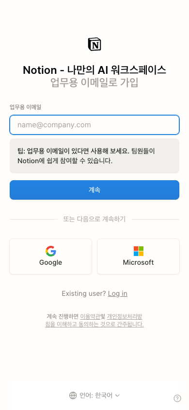
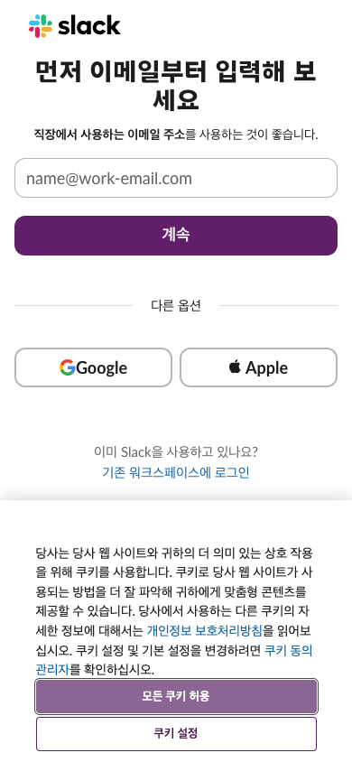
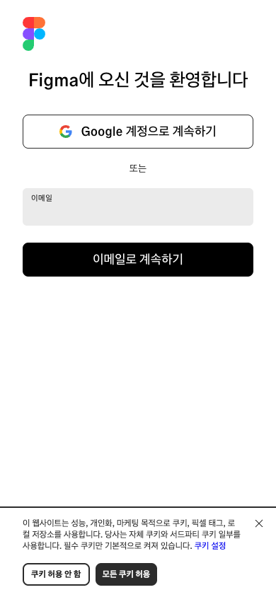
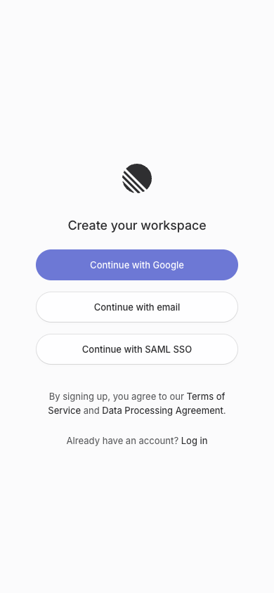
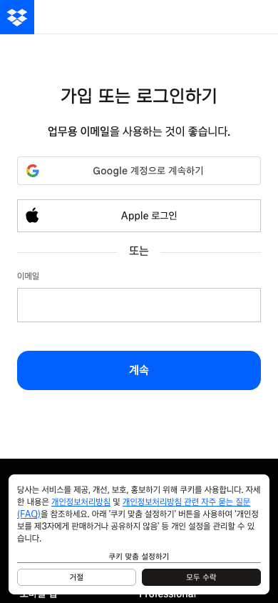
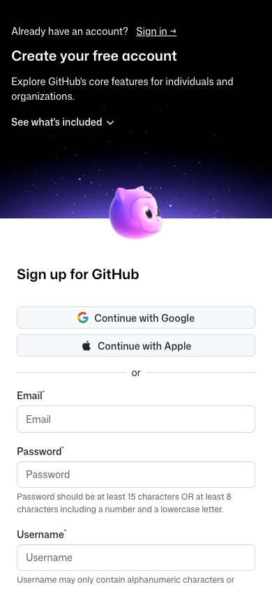
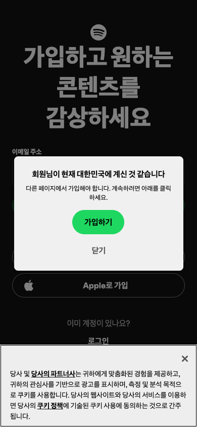

# Design Research: Email-First Mobile App Signup

## TL;DR

이메일 중심 회원가입은 첫 화면에서 "이메일 하나만 입력하면 다음 단계로 갈 수 있다"는 감각을 줘야 합니다. 모바일에서는 magic link만 단독으로 쓰기보다 이메일 코드 입력을 기본으로 두고, magic link는 보조 수단으로 제공하는 쪽이 더 견고합니다. 이름, 비밀번호, 프로필, 약관 상세 선택은 이메일 검증 이후로 미루는 구성이 가장 안전합니다.

Lazyweb MCP note: 현재 세션에서 `lazyweb_health`/`lazyweb_search` 도구가 노출되지 않았고 browse helper도 `NO_BROWSE`였습니다. 따라서 이 리포트의 시각 자료는 Lazyweb DB가 아니라 Playwright로 직접 캡처한 모바일 웹 사례입니다.

## Recommendations / Next Steps

1. **첫 화면은 이메일 1필드 + 명확한 CTA로 시작**

   Notion, Slack, Figma, Dropbox 모두 모바일 폭에서 이메일 필드를 매우 일찍 보여줍니다. 제품이 "이메일 위주"라면 Google/Apple은 보조 선택지로 두되, 이메일 입력과 CTA가 주인공이어야 합니다. 필드는 항상 보이는 label, 예시 placeholder, helper text를 포함합니다.

   ```text
   ┌─────────────────────────────┐
   │  Brand                      │
   │                             │
   │  이메일로 시작하세요        │
   │  계정 생성과 로그인을       │
   │  한 번에 처리합니다         │
   │                             │
   │  이메일                     │
   │  ┌───────────────────────┐  │
   │  │ name@example.com       │  │
   │  └───────────────────────┘  │
   │  [ 계속 ]                  │
   │                             │
   │  ───── 다른 방법 ─────      │
   │  [ Apple ] [ Google ]       │
   │  이미 계정이 있나요? 로그인 │
   └─────────────────────────────┘
   ```

2. **검증 단계는 "코드 입력"을 기본, magic link를 보조로 설계**

   MDN은 이메일 OTP에서 링크 방식이 편하지만 같은 기기/브라우저 요구와 피싱 위험이 있고, 코드 방식은 더 느리지만 다른 기기에서도 유연하다고 설명합니다. 모바일 앱에서는 이메일 앱의 in-app browser, 링크 프리뷰, 다른 기기 열림이 자주 문제라서 "6자리 코드 입력 + 메일 안의 링크"를 같이 보내는 방식이 안전합니다.

   ```text
   ┌─────────────────────────────┐
   │  이메일을 확인하세요        │
   │  research@example.com으로    │
   │  6자리 코드를 보냈습니다    │
   │                             │
   │  ┌──┐ ┌──┐ ┌──┐ ┌──┐ ┌──┐ ┌──┐ │
   │  │  │ │  │ │  │ │  │ │  │ │  │ │
   │  └──┘ └──┘ └──┘ └──┘ └──┘ └──┘ │
   │                             │
   │  [ 확인 ]                  │
   │  00:43 후 다시 보내기       │
   │  이메일 변경                │
   │                             │
   │  메일의 로그인 링크로도     │
   │  계속할 수 있습니다         │
   └─────────────────────────────┘
   ```

3. **이메일 검증 전에는 계정 세부 정보를 묻지 않기**

   GitHub처럼 이메일, 비밀번호, 사용자명을 한 화면에서 받는 구조는 보안/개발자 계정 맥락에는 맞지만 모바일 앱의 첫 가입에는 무겁습니다. Baymard의 account-selection 연구도 강제 계정 생성처럼 보이는 흐름이 이탈을 만든다고 지적합니다. 회원가입 이후 필요한 이름, 닉네임, 마케팅 동의, 프로필은 성공 화면 다음에 progressive disclosure로 받는 것이 좋습니다.

   ```text
   ┌─────────────────────────────┐
   │  가입 완료                  │
   │                             │
   │  이제 시작할 수 있어요      │
   │                             │
   │  표시 이름                  │
   │  ┌───────────────────────┐  │
   │  │                        │  │
   │  └───────────────────────┘  │
   │                             │
   │  [ 완료 ]                  │
   │  나중에 하기                │
   └─────────────────────────────┘
   ```

4. **에러는 기술 상태가 아니라 사용자의 다음 행동으로 표현**

   Slack은 "유효한 이메일 도메인이 아닙니다"처럼 비즈니스 규칙을 직접 말합니다. 반대로 "403", "invalid token", "request failed" 같은 표현은 앱 내부 사정을 노출하고 사용자를 멈추게 합니다. 각 상태는 `invalid email`, `unsupported domain`, `already used`, `expired`, `rate limited`, `email delayed`로 나누고, 반드시 다음 버튼을 제공합니다.

5. **보안 규칙은 UI 문구와 함께 정해야 함**

   AppMaster의 magic link 체크리스트는 짧은 만료 시간, one-time use, 재전송 제한, 만료/사용됨 상태의 명확한 처리를 강조합니다. 이메일 위주 회원가입에서도 "새 요청이 기존 링크를 무효화하는가", "코드 만료는 몇 분인가", "재전송 cooldown은 몇 초인가"가 UI의 신뢰감을 결정합니다.

## Key Examples


*Notion - 업무용 이메일을 첫 필드로 두고, 팀 협업 맥락을 helper text로 보강합니다. Google/Microsoft는 아래 보조 옵션입니다. [Web capture]*


*Slack - "먼저 이메일부터 입력"이라는 직접적인 문구와 work email placeholder가 잘 맞습니다. Google/Apple은 같은 화면의 보조 옵션입니다. [Web capture]*


*Figma - Google 다음에 이메일 필드와 강한 CTA를 배치합니다. 쿠키 배너는 웹 캡처 artifact지만, 앱에서는 이런 하단 방해물을 가입 CTA 근처에 두지 않는 것이 좋습니다. [Web capture]*


*Linear - workspace 생성 맥락에서 Google, email, SAML SSO를 같은 계층의 pill button으로 제시합니다. B2B 앱이면 SSO를 조기에 노출할 가치가 있습니다. [Web capture]*


*Dropbox - Google/Apple 이후 이메일을 받는 구조입니다. "업무용 이메일 권장" 문구가 가입 목적을 분명히 합니다. [Web capture]*


*GitHub - 이메일, 비밀번호, 사용자명을 한 번에 요구합니다. 보안과 개발자 identity가 중요한 제품에는 타당하지만 일반 모바일 앱 첫 진입에는 무겁습니다. [Web capture]*


*Spotify - 지역 확인 모달과 쿠키 배너가 입력 흐름 위를 덮습니다. 가입 화면에서 정책/지역/쿠키 레이어가 동시에 뜨면 주요 CTA가 흐려집니다. [Web capture]*

## Patterns

- **Email-first does not mean email-only.** 좋은 화면은 이메일을 주 경로로 두되 Apple/Google/SSO를 보조로 제공합니다.
- **Benefit copy is short.** Notion과 Slack은 "업무용 이메일" 맥락을 짧게 말하고 바로 입력으로 보냅니다.
- **Visible labels beat placeholder-only forms.** Material Design은 text field가 label, state, assistive text로 입력 상태를 명확히 해야 한다고 설명합니다.
- **The login link remains visible.** 이미 계정이 있는 사용자가 회원가입 폼을 역주행하지 않도록 "Log in"을 같은 화면 하단에 둡니다.
- **B2B products expose domain logic early.** Slack/Dropbox/Notion은 work email을 권장하거나 요구합니다.
- **Security state is part of UX.** 만료, 재전송, 이미 사용된 링크, 다른 기기에서 열린 링크는 별도 화면/문구로 설계되어야 합니다.

## Anti-Patterns

- **Magic link only.** 모바일에서는 이메일 앱 내부 브라우저, 링크 프리뷰, 다른 기기 열림 때문에 실패 복구가 어렵습니다.
- **Too many required fields before verification.** 첫 화면에 password, username, profile까지 넣으면 가입이 "작업"처럼 느껴집니다.
- **Policy layers over the primary CTA.** 쿠키, 지역 확인, 마케팅 동의가 가입 버튼과 겹치면 사용자의 첫 행동이 불분명해집니다.
- **Raw technical error states.** `403`, `invalid token`, `try again later`만 보여주면 사용자는 어떤 행동을 해야 하는지 모릅니다.
- **Hidden resend rules.** 재전송 cooldown과 만료 시간을 감추면 사용자는 버튼을 반복 탭하거나 앱을 이탈합니다.

## Unique Angles

- **Work-email framing:** Notion과 Slack은 단순히 "email"이 아니라 "work email"을 말합니다. B2B/관리자 앱이라면 개인 이메일보다 조직 이메일이 왜 좋은지 한 줄로 설명하는 것이 좋습니다.
- **SAML SSO early reveal:** Linear는 SAML SSO를 초기 선택지로 노출합니다. 엔터프라이즈 사용자는 이메일 입력 후 실패하는 것보다 SSO 가능성을 먼저 보는 편이 낫습니다.
- **Email as account discovery:** 이메일 입력 하나로 신규/기존 사용자를 자동 분기할 수 있습니다. 신규면 verification, 기존이면 login code 또는 workspace 선택으로 보냅니다.
- **Link + code hybrid:** 이메일에는 magic link와 6자리 코드를 함께 넣고, 앱에는 코드 입력을 기본으로 두면 같은 기기/다른 기기 모두 커버됩니다.

## Findings

이메일 위주 가입 화면에서 중요한 것은 인증 방식 자체보다 "첫 행동의 확실함"입니다. 사용자는 이메일을 입력하면 무엇이 일어나는지 알아야 하고, 메일이 늦거나 링크가 다른 브라우저에서 열려도 다시 돌아올 수 있어야 합니다.

권장 플로우는 `Email entry -> Check email code -> Success -> Optional profile completion`입니다. 첫 화면에서는 계정 생성과 로그인을 구분하지 말고, 이메일 제출 후 서버가 사용자를 분기합니다. 이렇게 하면 "회원가입인가 로그인인가"를 사용자가 판단하지 않아도 됩니다.

보안 관점에서는 이메일 OTP/magic link 모두 이메일 계정 접근권을 신뢰합니다. 따라서 계정 위험도가 높은 제품은 passkey, TOTP, device confirmation 같은 추가 인증을 검토해야 합니다. 하지만 일반적인 모바일 앱 첫 가입에서는 이메일 코드 + 짧은 만료 + 재전송 제어 + 명확한 실패 복구가 가장 균형 잡힌 기본값입니다.

## Sources

- [MDN: One-time passwords (OTP)](https://developer.mozilla.org/en-US/docs/Web/Security/Authentication/OTP) - 이메일 OTP의 link/code tradeoff, 만료, phishing/usability 고려사항.
- [Material Design: Text fields](https://m1.material.io/components/text-fields.html) - label, state, helper text, autocomplete 등 text field 기본 원칙.
- [Baymard: Account Selection Design Examples](https://baymard.com/checkout-usability/benchmark/step-type/account?unauthorized=2409-office-depot-step-2) - account selection/guest checkout 노출과 가입 강제 인식 이슈.
- [AppMaster: Passwordless login with magic links](https://appmaster.io/blog/passwordless-magic-links-ux-security-checklist) - magic link 만료, one-time use, resend, stale link 처리.
- [LogRocket: How to use magic links for better UX](https://blog.logrocket.com/ux-design/how-to-use-magic-links/) - magic link UX writing, responsive behavior, 만료 시간.
- [Apple HIG: Sign in with Apple](https://developer.apple.com/design/human-interface-guidelines/sign-in-with-apple) - iOS 앱에서 계정 생성/로그인 옵션을 제시할 때의 platform expectation.
- Captured examples: [Figma signup](https://www.figma.com/signup), [Notion signup](https://www.notion.so/signup), [Linear signup](https://linear.app/signup), [GitHub signup](https://github.com/signup), [Dropbox register](https://www.dropbox.com/register), [Slack get started](https://slack.com/get-started), [Spotify signup](https://www.spotify.com/us/signup).
