# Design Research: 예약 화면

## TL;DR

운동/클래스 예약 화면은 "탐색 화면"과 "예약 확정 화면"을 분리하는 편이 가장 안정적입니다. 첫 화면에서는 수업 카드, 날짜 스트립, 잔여석/마감/대기 상태를 한눈에 보여주고, 상세에서는 날짜-시간 선택과 취소 정책, 수업권 차감, 캘린더 추가까지 확정 전후 정보를 명확히 고정해야 합니다.

하이파이브와 F45는 빠른 수업 예약과 대기 알림이 강하고, 네이버예약은 업종별 예약 유형과 결제/알림/관리까지 연결하는 범용성이 강합니다. 우리 화면은 하이파이브식 "쉽고 빠른 수업 예약"을 기본 골격으로 두고, 네이버예약식 "업종별 예약 타입"과 Resy/Spring Health식 "확정 전 정책 고지"를 섞는 방향이 좋습니다.

## Recommendations / Next Steps

1. **첫 화면은 수업 피드 + 날짜 스트립으로 시작** - 사용자는 예약 전에 "오늘 갈 수 있는 수업"을 먼저 봅니다. F45, 하이파이브, Peloton, Babbel 모두 날짜/요일 선택과 클래스 리스트를 결합합니다.

```
+--------------------------------+
| 센터명 / 지점 변경        알림 |
| 남은 수업권 8회  만료 D-23     |
+--------------------------------+
| 5/7 오늘 | 5/8 금 | 5/9 토 ... |
+--------------------------------+
| [전체] [근력] [유산소] [강사] |
+--------------------------------+
| 08:10  하체 집중  4/10석       |
| 강사 김OO  50분        [예약] |
| 09:10  하체 집중  마감         |
| 빈자리 알림 가능       [대기] |
+--------------------------------+
```

2. **시간 선택은 일반 TimePicker가 아니라 예약 슬롯 카드로 처리** - 예약 시간은 연속 시간이 아니라 운영자가 만든 재고입니다. 그래서 네이버예약/하이파이브/FitOn처럼 가능한 시간, 마감, 대기, 잔여석을 슬롯 단위로 보여줘야 합니다.

```
+--------------------------------+
| 2026.05.07 목                  |
| [오전] [오후] [저녁]           |
+--------------------------------+
| 08:10 - 09:00  4석 남음        |
| 09:10 - 10:00  마감 / 대기 2명 |
| 10:10 - 11:00  예약 가능       |
+--------------------------------+
| 선택: 10:10, 코치 홍OO         |
| 수업권 1회 차감 예정           |
|                    [예약하기] |
+--------------------------------+
```

3. **확정 직전에는 결제/취소/노쇼/수업권 차감 정책을 한 장에 요약** - Resy와 Spring Health는 확정 전에 정책을 따로 띄우고, FitOn은 확정 후 캘린더 추가와 복귀 액션을 제공합니다. 피트니스 예약에서도 지각, 노쇼, 취소 가능 시간을 명시해야 불신이 줄어듭니다.

```
+--------------------------------+
| 예약 확인                      |
| F45 Two Fold / 45분            |
| 5월 7일 목 10:10               |
| 지점: 강남 2호점               |
+--------------------------------+
| 취소 가능: 시작 3시간 전까지   |
| 차감: 예약 확정 시 수업권 1회  |
| 노쇼: 수업권 복구 불가         |
+--------------------------------+
| [캘린더 추가] [예약 확정]      |
+--------------------------------+
```

4. **마감 상태는 끝이 아니라 대기/알림 액션으로 전환** - 하이파이브의 "예약 대기", Resy의 "Priority Notify", F45의 waitlist는 인기 수업에서 필수입니다. 마감 카드는 숨기지 말고 "왜 못 하는지"와 "다음 액션"을 같이 보여주는 편이 좋습니다.

```
+--------------------------------+
| 19:30  Upper Body              |
| 정원 12/12  대기 3명           |
| 취소 발생 시 자동 알림          |
|                        [대기] |
+--------------------------------+
```

## Key Examples

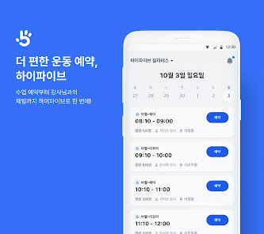
*하이파이브 - 날짜별 수업 리스트와 각 수업의 예약 버튼을 전면에 둔 빠른 예약 흐름 [Web]*

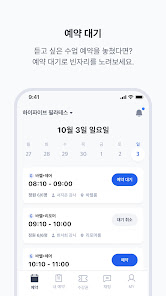
*하이파이브 - 마감된 수업을 단순 비활성화하지 않고 대기/빈자리 알림 액션으로 전환 [Web]*

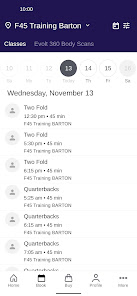
*F45 - 지점, 날짜, 수업명, 시간, 강사를 한 리스트에서 스캔하게 만드는 모바일 스케줄 [Web]*

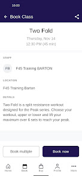
*F45 - 수업 상세에서 운동명, 시간, 지점, 설명을 확인한 뒤 예약으로 이어지는 구조 [Web]*


*네이버예약 - 플레이스 상세에서 예약 버튼과 예약 탭을 자연스럽게 노출하는 진입점 [Web]*

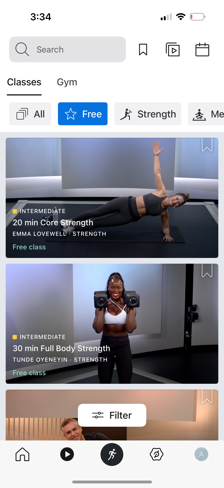
*Peloton - 검색, 탭, 카테고리 칩, 클래스 카드로 수업 탐색을 빠르게 만드는 피드형 구조 [Lazyweb]*

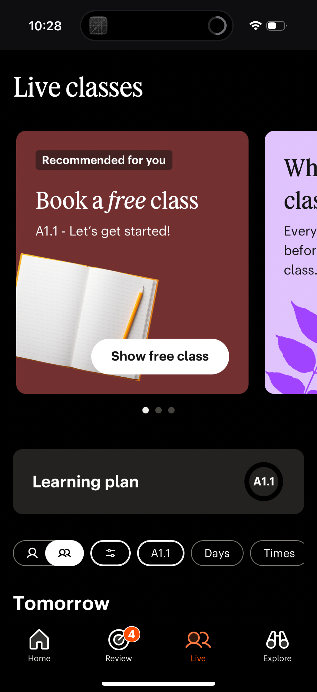
*Babbel - 날짜/시간 필터, 난이도, 강사, 정원 상태, 예약 CTA를 한 카드 안에 묶음 [Lazyweb]*

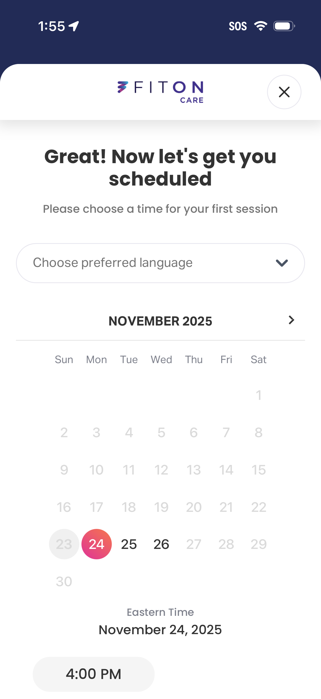
*FitOn - 월간 달력과 가능한 시간 슬롯을 같은 화면에서 선택하게 하는 예약 패턴 [Lazyweb]*

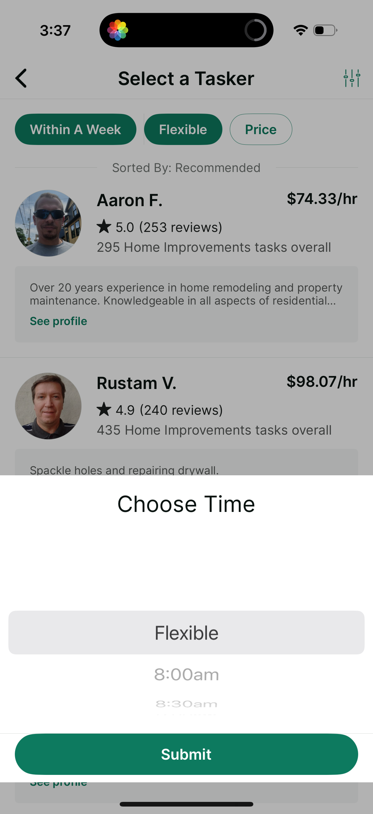
*Taskrabbit - 제공자 목록 위에 availability/price 필터와 시간 선택 바텀시트를 결합 [Lazyweb]*

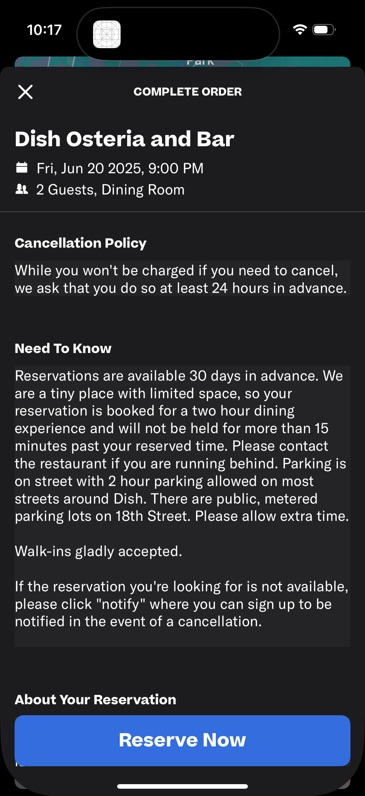
*Resy - 날짜, 시간, 인원, 공간, 취소 정책을 확정 직전에 보여주고 Reserve Now로 마무리 [Lazyweb]*

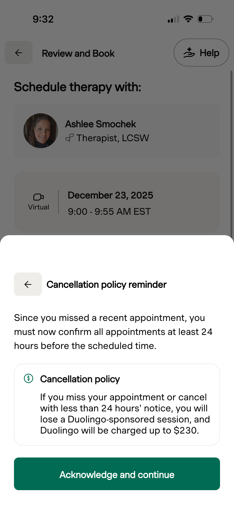
*Spring Health - 예약 확정 전 취소 정책을 바텀시트로 다시 확인시켜 리스크를 명확히 고지 [Lazyweb]*

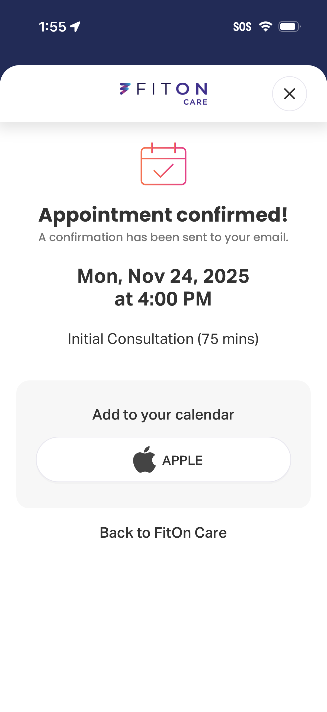
*FitOn - 예약 완료 후 이메일 확인, 캘린더 추가, 대시보드 복귀 액션을 제공 [Lazyweb]*

## Patterns

- **날짜는 캘린더보다 먼저 요일 스트립을 노출**: 수업 예약은 보통 1-14일 안의 근미래 선택이 많으므로, 상단 요일 스트립으로 빠르게 넘기고 상세 선택에서 월간 캘린더를 보조로 쓰는 구조가 좋습니다.
- **수업 카드는 정보 밀도가 높아야 함**: 시간, 수업명, 강사, 지점, 난이도/카테고리, 잔여석, 예약 상태가 카드 안에서 함께 보여야 사용자가 뒤로 갔다 오는 일이 줄어듭니다.
- **예약 가능/마감/대기 상태를 같은 컴포넌트에서 표현**: 숨김보다 상태 노출이 낫습니다. 마감 카드도 대기 알림과 다음 가능한 시간 추천으로 전환할 수 있습니다.
- **확정 CTA는 화면 하단 고정**: 날짜나 슬롯을 선택하면 하단 summary bar에 선택 내용을 요약하고 CTA를 활성화합니다.
- **예약 후 화면은 관리 화면의 시작점**: 캘린더 추가, 알림 설정, 변경, 취소, 문의, 수업권 상태를 바로 제공해야 합니다.

## Anti-Patterns

- **연속형 시간 피커만 제공**: 08:00, 08:05처럼 자유 입력하는 시간 선택은 클래스 예약 재고와 맞지 않습니다.
- **마감 수업 숨기기**: 인기 시간대가 왜 안 보이는지 알 수 없어 신뢰가 떨어집니다. 마감/대기/오픈 예정 상태를 보여줘야 합니다.
- **정책을 예약 후에만 고지**: 노쇼/취소/환불 규정은 확정 전 요약이 필요합니다.
- **수업권 잔여 횟수와 만료일을 숨김**: 운동센터 예약에서는 결제보다 "내 이용권 상태"가 더 직접적인 예약 가능 조건입니다.
- **검색과 필터를 깊은 메뉴에 감춤**: 지점, 강사, 카테고리, 시간대 필터는 수업 리스트 상단에서 즉시 바꿀 수 있어야 합니다.

## Unique Angles

- **하이파이브의 회원 전용 앱 감각**: 수업권 잔여 횟수, 예약 대기, 수업 알림을 한 앱에서 처리한다는 메시지가 강합니다. 피트니스/필라테스 업장에는 결제보다 "내가 다닐 수 있는 다음 수업"이 더 중요합니다.
- **F45의 클래스 상세 진입**: 리스트에서 바로 예약하되, 상세에서는 수업명/운동 설명/지점 정보를 정리해 초보자가 선택의 의미를 이해하게 합니다.
- **네이버예약의 업종별 유형**: 일반형, 뷰티형, 병의원형, 회차형, 시작-종료시간 선택형처럼 예약 모델을 다르게 둡니다. 우리도 클래스형, 상담형, 공간/기구 대여형을 같은 예약 UI 안에서 변형 가능하게 설계해야 합니다.
- **Resy/Spring Health의 정책 고지 방식**: 확정 전 바텀시트는 예약을 느리게 만들지만, 취소 비용/노쇼처럼 민감한 규칙이 있는 서비스에서는 오히려 신뢰를 만듭니다.

## Findings

### 1. 예약 화면의 핵심은 "예약 가능한 것만 빠르게 찾기"입니다

하이파이브와 F45는 사용자가 특정 수업을 이미 알고 들어온다고 가정합니다. 그래서 첫 화면부터 날짜별 수업 리스트를 보여주고, 상세한 마케팅 설명보다 예약 가능한 시간과 버튼을 앞세웁니다. 이 패턴은 매주 반복 이용하는 회원에게 특히 맞습니다.

### 2. 네이버예약식 범용성은 정보 구조에 참고할 가치가 있습니다

네이버 스마트플레이스는 업종별로 다른 예약 유형을 제공한다고 설명합니다. 피트니스에서도 일반 수업 예약, PT 상담, 체험 수업, 바디스캔, 공간/기구 예약은 서로 다른 시간 모델을 갖습니다. UI는 하나의 예약 모듈로 보이되 내부 데이터는 `serviceType`, `capacity`, `duration`, `bookingWindow`, `cancelPolicy`를 분리해야 합니다.

### 3. 수업형 예약은 "정원"과 "대기"가 일반 예약보다 중요합니다

클래스 예약에서는 빈자리 알림, 대기 등록, 마감 임박, 취소 가능 시간, 노쇼 정책이 conversion만큼 중요합니다. 하이파이브/F45/ClassPass 계열은 이 부분을 제품 가치로 강조합니다.

### 4. 확정 후에는 캘린더와 알림이 신뢰를 완성합니다

FitOn의 완료 화면처럼 예약 완료 후 이메일 발송, 캘린더 추가, 대시보드 복귀를 제공하면 사용자는 예약 상태를 더 확실히 인지합니다. 운동 예약은 "까먹지 않는 것"이 UX의 일부입니다.

## Design Direction

- **Mobile-first**: 회원용 예약 화면은 모바일 우선. 데스크톱은 관리/운영 화면에 더 적합합니다.
- **Dark HeroUI 적용 시**: 페이지 전체는 `ScreenSurface` 안에서 "오늘의 예약 가능 수업"을 섹션화하고, 카드 내부는 과도한 장식보다 상태 배지와 CTA 대비를 우선합니다.
- **권장 컴포넌트**: `DateStrip`, `ClassSessionCard`, `SlotPickerSheet`, `BookingPolicySheet`, `BookingConfirmationPanel`, `PassBalanceBadge`, `WaitlistButton`.
- **추천 상태값**: `AVAILABLE`, `FEW_LEFT`, `FULL`, `WAITLIST_OPEN`, `BOOKING_CLOSED`, `RESERVED`, `CANCELED`.

## Sources

- [Mindbody x F45 on Google Play](https://play.google.com/store/apps/details?hl=en-US&id=com.fitnessmobileapps.f45training) - F45 앱이 수업 스케줄, 클래스/예약, 프로필 관리를 제공함.
- [F45 Training App](https://f45training.com/get-the-app/) - 클래스 예약, waitlist, 스케줄 확인, 바디스캔 예약을 공식 기능으로 소개.
- [하이파이브 Google Play](https://play.google.com/store/apps/details?hl=en_US&id=kr.sleek.boost.reserve) - 운동센터용 수업 예약, 빈자리 알림, 수업 알림, 수업권/출석 기록.
- [하이파이브 공식 소개](https://hifivecenter.cafe24.com/) - 회원 전용 앱, 수업 예약/예약 대기, 노쇼 알림, 강사 관리 앱.
- [네이버 스마트플레이스 예약](https://smartplace.naver.com/introduction/solution-market/booking) - 업종별 6개 예약 유형, 실시간 예약/결제/관리, 플레이스 예약 버튼.
- [네이버웍스 자원 예약 가이드](https://help.worksmobile.com/ko/use-guides/resource-reserve/mobile-app/use-reservation/) - 예약일/예약시간 선택, 예약 가능 시간 전환, 예약 수정/취소 관리.
- [Baymard Date Picker Examples](https://baymard.com/ecommerce-design-examples/date-picker?unauthorized=19352-booking-com) - date picker가 availability를 충분히 보여주지 않으면 사용자의 검증 부담과 이탈이 커진다는 UX 리서치.
- [ClassPass reservation help](https://help.classpass.com/hc/en-us/articles/204335689-How-do-I-make-a-reservation) - 예약 창이 닫히면 예약이 불가능하다는 예약 window 개념 참고.

