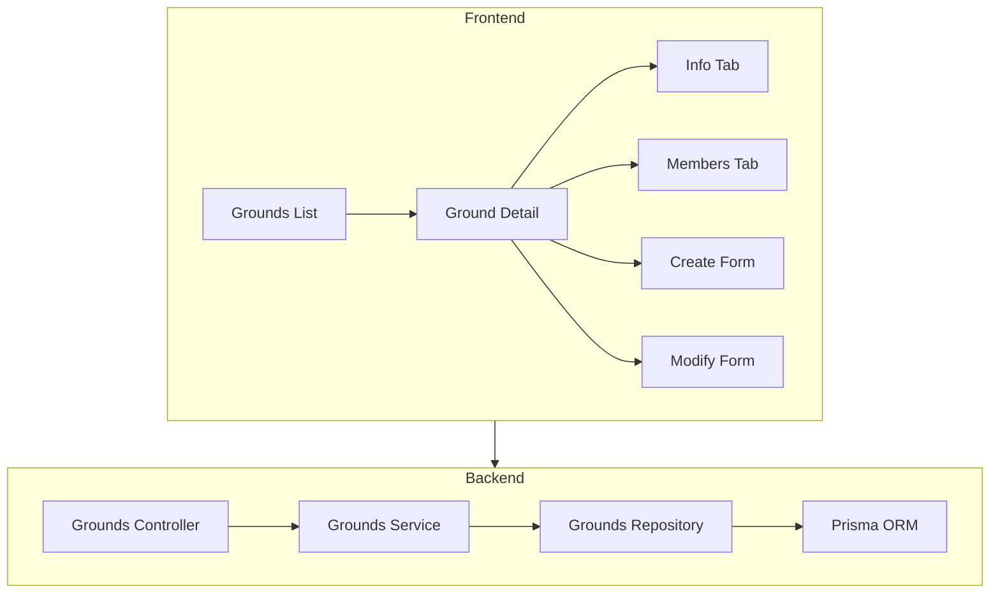
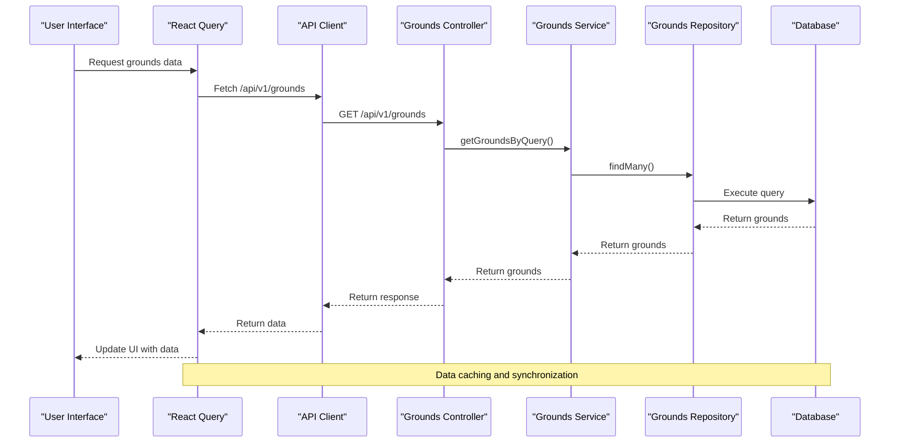
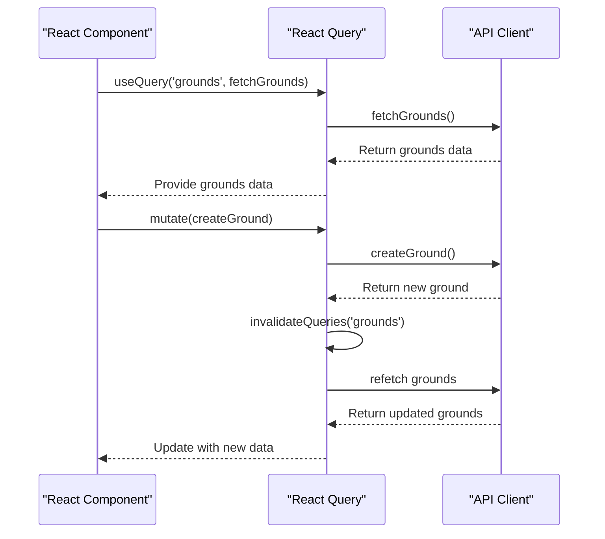
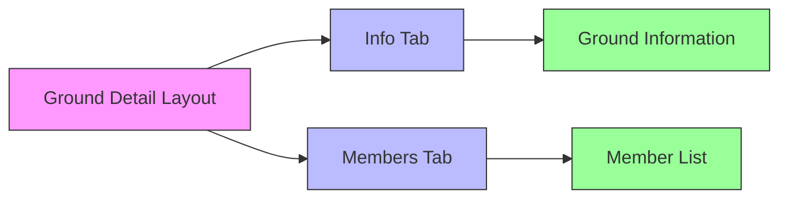
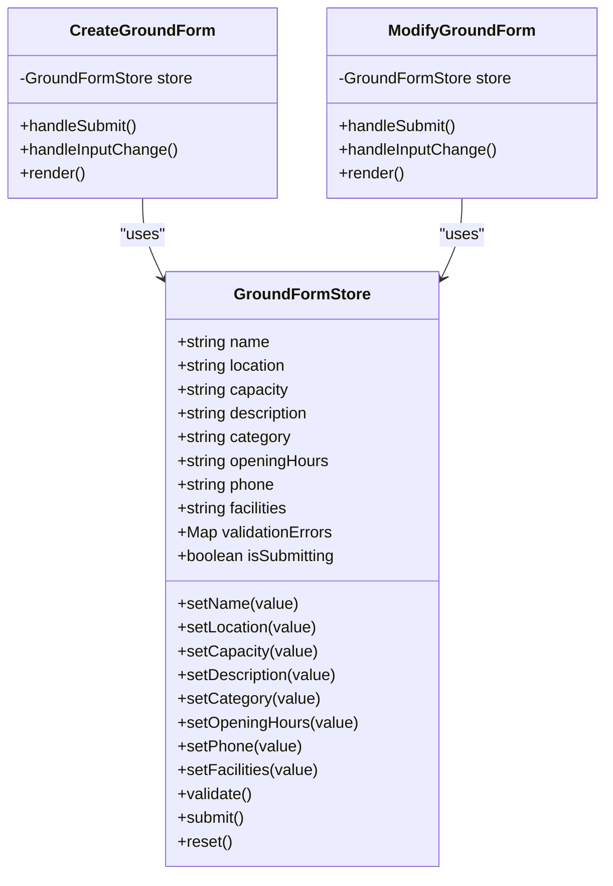
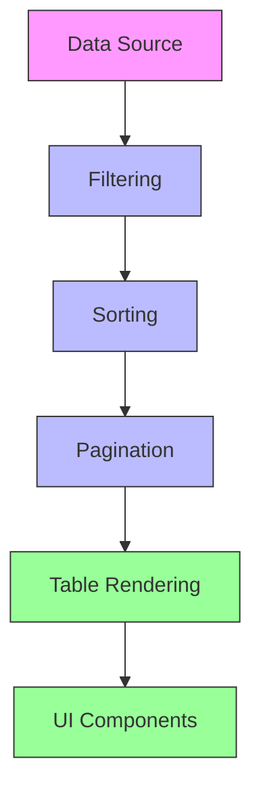
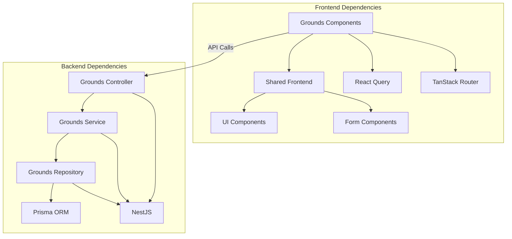

# Grounds Management

<cite>
**Referenced Files in This Document**   
- [grounds.tsx](file://apps/admin/src/routes/admin/dashboard/space-service/grounds.tsx)
- [$groundId.tsx](file://apps/admin/src/routes/admin/dashboard/space-service/grounds/$groundId.tsx)
- [detail.tsx](file://apps/admin/src/routes/admin/dashboard/space-service/grounds/$groundId/detail.tsx)
- [info.tsx](file://apps/admin/src/routes/admin/dashboard/space-service/grounds/$groundId/detail/info.tsx)
- [members.tsx](file://apps/admin/src/routes/admin/dashboard/space-service/grounds/$groundId/detail/members.tsx)
- [create.tsx](file://apps/admin/src/routes/admin/dashboard/space-service/grounds/$groundId/create.tsx)
- [modify.tsx](file://apps/admin/src/routes/admin/dashboard/space-service/grounds/$groundId/modify.tsx)
- [grounds.controller.ts](file://apps/server/src/shared/controller/resources/grounds.controller.ts)
- [grounds.service.ts](file://apps/server/src/shared/service/resources/grounds.service.ts)
- [grounds.repository.ts](file://apps/server/src/shared/repository/grounds.repository.ts)
- [getGroundsByQuery200AllOf.ts](file://packages/api/src/model/getGroundsByQuery200AllOf.ts)
- [apis.ts](file://packages/api/src/apis.ts)
- [groundDto.ts](file://packages/api/src/model/groundDto.ts)
</cite>

## Table of Contents
1. [Introduction](#introduction)
2. [Project Structure](#project-structure)
3. [Core Components](#core-components)
4. [Architecture Overview](#architecture-overview)
5. [Detailed Component Analysis](#detailed-component-analysis)
6. [Dependency Analysis](#dependency-analysis)
7. [Performance Considerations](#performance-considerations)
8. [Troubleshooting Guide](#troubleshooting-guide)
9. [Conclusion](#conclusion)

## Introduction
This document provides comprehensive documentation for the grounds management feature within the space-service module. The system enables administrators to manage sports grounds through a complete CRUD interface with advanced data handling capabilities. The implementation leverages React Query for efficient data fetching and caching, MobX for state management, and a well-structured nested routing system for optimal user experience. The feature supports comprehensive ground information management, member listing, creation, and modification workflows with proper validation and error handling.

## Project Structure
The grounds management feature follows a well-organized directory structure that separates concerns and enables maintainability. The frontend implementation resides in the admin application routes, while the backend services and repositories provide the necessary API endpoints and data access layers.



**Diagram sources**
- [grounds.tsx](file://apps/admin/src/routes/admin/dashboard/space-service/grounds.tsx)
- [grounds.controller.ts](file://apps/server/src/shared/controller/resources/grounds.controller.ts)

**Section sources**
- [grounds.tsx](file://apps/admin/src/routes/admin/dashboard/space-service/grounds.tsx)
- [grounds.controller.ts](file://apps/server/src/shared/controller/resources/grounds.controller.ts)

## Core Components
The grounds management system consists of several core components that work together to provide a seamless user experience. These include the grounds list interface, ground detail page with tabbed navigation, creation and modification forms, and the underlying data service layer. The implementation uses React Query for data fetching and caching, ensuring optimal performance and data consistency across the application.

**Section sources**
- [grounds.tsx](file://apps/admin/src/routes/admin/dashboard/space-service/grounds.tsx)
- [detail.tsx](file://apps/admin/src/routes/admin/dashboard/space-service/grounds/$groundId/detail.tsx)
- [create.tsx](file://apps/admin/src/routes/admin/dashboard/space-service/grounds/$groundId/create.tsx)
- [modify.tsx](file://apps/admin/src/routes/admin/dashboard/space-service/grounds/$groundId/modify.tsx)

## Architecture Overview
The grounds management feature follows a clean architectural pattern with clear separation of concerns between the frontend and backend components. The frontend uses a nested routing structure to organize the different views and actions related to grounds management, while the backend implements a standard controller-service-repository pattern for handling business logic and data access.



**Diagram sources**
- [grounds.tsx](file://apps/admin/src/routes/admin/dashboard/space-service/grounds.tsx)
- [grounds.controller.ts](file://apps/server/src/shared/controller/resources/grounds.controller.ts)
- [apis.ts](file://packages/api/src/apis.ts)

## Detailed Component Analysis

### Grounds List Interface
The grounds list interface provides a tabular view of all available grounds with basic information such as name, location, and capacity. The component uses React Query to fetch data from the backend API and automatically handles loading states and error conditions. The table implementation leverages shared UI components for consistent styling and behavior across the application.

**Section sources**
- [grounds.tsx](file://apps/admin/src/routes/admin/dashboard/space-service/grounds.tsx)

### Nested Routing Structure
The grounds management feature implements a nested routing structure that enables hierarchical organization of related views and actions. The routing hierarchy follows a logical pattern where the base route displays the grounds list, and nested routes handle specific ground operations such as viewing details, creating new grounds, and modifying existing ones.

```mermaid
flowchart TD
A[/admin/dashboard/space-service/grounds] --> B[$groundId]
B --> C[detail]
C --> D[info]
C --> E[members]
B --> F[create]
B --> G[modify]
style A fill:#f9f,stroke:#333
style B fill:#bbf,stroke:#333
style C fill:#bbf,stroke:#333
style D fill:#9f9,stroke:#333
style E fill:#9f9,stroke:#333
style F fill:#9f9,stroke:#333
style G fill:#9f9,stroke:#333
click A "apps/admin/src/routes/admin/dashboard/space-service/grounds.tsx" "Grounds List"
click B "apps/admin/src/routes/admin/dashboard/space-service/grounds/$groundId.tsx" "Ground Detail"
click C "apps/admin/src/routes/admin/dashboard/space-service/grounds/$groundId/detail.tsx" "Detail Layout"
click D "apps/admin/src/routes/admin/dashboard/space-service/grounds/$groundId/detail/info.tsx" "Info Tab"
click E "apps/admin/src/routes/admin/dashboard/space-service/grounds/$groundId/detail/members.tsx" "Members Tab"
click F "apps/admin/src/routes/admin/dashboard/space-service/grounds/$groundId/create.tsx" "Create Form"
click G "apps/admin/src/routes/admin/dashboard/space-service/grounds/$groundId/modify.tsx" "Modify Form"
```

**Diagram sources**
- [grounds.tsx](file://apps/admin/src/routes/admin/dashboard/space-service/grounds.tsx)
- [$groundId.tsx](file://apps/admin/src/routes/admin/dashboard/space-service/grounds/$groundId.tsx)
- [detail.tsx](file://apps/admin/src/routes/admin/dashboard/space-service/grounds/$groundId/detail.tsx)

**Section sources**
- [grounds.tsx](file://apps/admin/src/routes/admin/dashboard/space-service/grounds.tsx)
- [$groundId.tsx](file://apps/admin/src/routes/admin/dashboard/space-service/grounds/$groundId.tsx)
- [detail.tsx](file://apps/admin/src/routes/admin/dashboard/space-service/grounds/$groundId/detail.tsx)

### React Query Integration
The grounds management feature leverages React Query for efficient data fetching, caching, and synchronization between the frontend and backend. The implementation uses query hooks to retrieve grounds data and mutation hooks to perform create, update, and delete operations. Query invalidation strategies ensure that cached data is refreshed after mutations, maintaining data consistency across the application.



**Diagram sources**
- [apis.ts](file://packages/api/src/apis.ts)
- [grounds.tsx](file://apps/admin/src/routes/admin/dashboard/space-service/grounds.tsx)

**Section sources**
- [apis.ts](file://packages/api/src/apis.ts)
- [grounds.tsx](file://apps/admin/src/routes/admin/dashboard/space-service/grounds.tsx)

### Ground Detail Page
The ground detail page implements tabbed navigation between information and members sections using shared-frontend components. This design pattern provides a clean and intuitive user interface for accessing different aspects of a ground's data. The tabbed interface is implemented using standard navigation elements that maintain URL state, enabling direct linking to specific tabs.

#### Tabbed Navigation Implementation


**Diagram sources**
- [detail.tsx](file://apps/admin/src/routes/admin/dashboard/space-service/grounds/$groundId/detail.tsx)
- [info.tsx](file://apps/admin/src/routes/admin/dashboard/space-service/grounds/$groundId/detail/info.tsx)
- [members.tsx](file://apps/admin/src/routes/admin/dashboard/space-service/grounds/$groundId/detail/members.tsx)

**Section sources**
- [detail.tsx](file://apps/admin/src/routes/admin/dashboard/space-service/grounds/$groundId/detail.tsx)
- [info.tsx](file://apps/admin/src/routes/admin/dashboard/space-service/grounds/$groundId/detail/info.tsx)
- [members.tsx](file://apps/admin/src/routes/admin/dashboard/space-service/grounds/$groundId/detail/members.tsx)

### Form Architecture
The form architecture for ground creation and modification follows a consistent pattern using controlled components and state management. The forms integrate with MobX stores for state management, providing a centralized location for form data and validation state. Validation rules are implemented at both the UI and API levels to ensure data integrity.

#### State Management with MobX


**Diagram sources**
- [create.tsx](file://apps/admin/src/routes/admin/dashboard/space-service/grounds/$groundId/create.tsx)
- [modify.tsx](file://apps/admin/src/routes/admin/dashboard/space-service/grounds/$groundId/modify.tsx)

**Section sources**
- [create.tsx](file://apps/admin/src/routes/admin/dashboard/space-service/grounds/$groundId/create.tsx)
- [modify.tsx](file://apps/admin/src/routes/admin/dashboard/space-service/grounds/$groundId/modify.tsx)

### Data Display Patterns
The grounds management feature implements consistent data display patterns for ground information and member lists. These patterns include search, filtering, and pagination capabilities to handle large datasets efficiently. The table components use shared-frontend UI components to ensure visual consistency across the application.

#### Data Display Components


**Diagram sources**
- [grounds.tsx](file://apps/admin/src/routes/admin/dashboard/space-service/grounds.tsx)
- [members.tsx](file://apps/admin/src/routes/admin/dashboard/space-service/grounds/$groundId/detail/members.tsx)

**Section sources**
- [grounds.tsx](file://apps/admin/src/routes/admin/dashboard/space-service/grounds.tsx)
- [members.tsx](file://apps/admin/src/routes/admin/dashboard/space-service/grounds/$groundId/detail/members.tsx)

## Dependency Analysis
The grounds management feature has a well-defined dependency structure that separates concerns between frontend and backend components. The frontend depends on shared-frontend components for UI elements and React Query for data management, while the backend follows a standard controller-service-repository pattern.



**Diagram sources**
- [grounds.tsx](file://apps/admin/src/routes/admin/dashboard/space-service/grounds.tsx)
- [grounds.controller.ts](file://apps/server/src/shared/controller/resources/grounds.controller.ts)
- [shared-frontend](file://packages/shared-frontend)

**Section sources**
- [grounds.tsx](file://apps/admin/src/routes/admin/dashboard/space-service/grounds.tsx)
- [grounds.controller.ts](file://apps/server/src/shared/controller/resources/grounds.controller.ts)

## Performance Considerations
The grounds management feature implements several performance optimizations to ensure a responsive user experience. React Query's caching mechanism reduces unnecessary API calls by storing fetched data and serving it from cache when possible. The pagination implementation limits the amount of data transferred between the server and client, improving load times for large datasets. The nested routing structure enables code splitting, allowing the application to load only the necessary components for the current view.

## Troubleshooting Guide
When encountering issues with the grounds management feature, consider the following common problems and solutions:

1. **Data not loading**: Check network requests in the browser developer tools to verify API calls are being made and returning expected data. Ensure React Query is properly configured and the query keys are correct.

2. **Form submission failures**: Verify that all required fields are filled and validation rules are satisfied. Check the browser console for any JavaScript errors that might prevent form submission.

3. **Routing issues**: Ensure the route parameters are correctly defined and accessible in the components. Verify that the TanStack Router is properly configured with the correct route hierarchy.

4. **State management problems**: Check that MobX stores are properly initialized and updated. Ensure that state changes are being observed by the components that depend on them.

**Section sources**
- [create.tsx](file://apps/admin/src/routes/admin/dashboard/space-service/grounds/$groundId/create.tsx)
- [modify.tsx](file://apps/admin/src/routes/admin/dashboard/space-service/grounds/$groundId/modify.tsx)
- [grounds.controller.ts](file://apps/server/src/shared/controller/resources/grounds.controller.ts)

## Conclusion
The grounds management feature provides a comprehensive solution for managing sports grounds within the space-service module. The implementation follows modern web development best practices with a clean architectural pattern, efficient data management, and a user-friendly interface. The use of React Query for data fetching and caching ensures optimal performance and data consistency, while the nested routing structure provides a logical organization of related views and actions. The integration with shared-frontend components promotes consistency and reusability across the application. Overall, the feature delivers a robust and maintainable solution for grounds management with support for all necessary CRUD operations and data display capabilities.