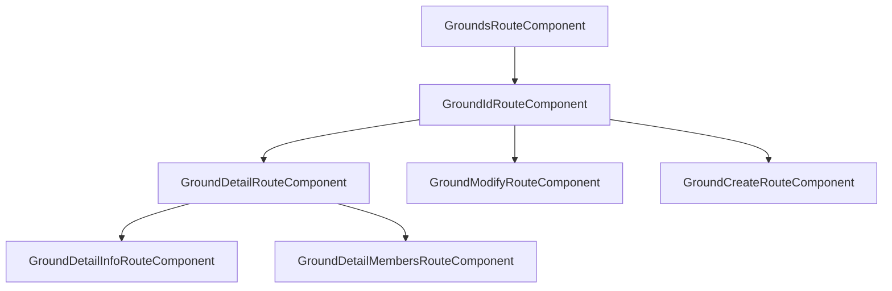
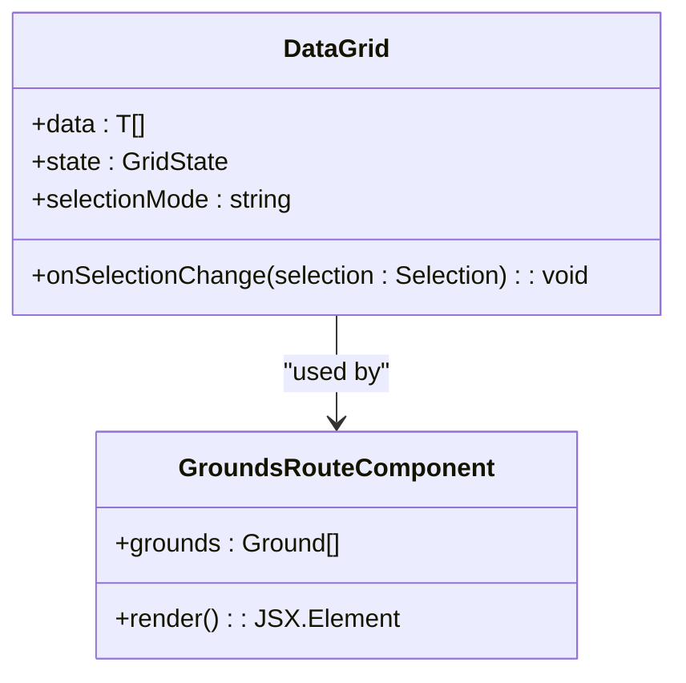
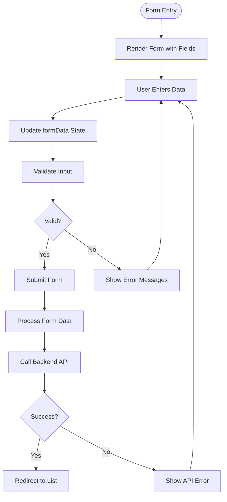

# Grounds Management

<cite>
**Referenced Files in This Document**   
- [grounds.tsx](file://apps/admin/src/routes/admin/dashboard/space-service/grounds.tsx)
- [$groundId.tsx](file://apps/admin/src/routes/admin/dashboard/space-service/grounds/$groundId.tsx)
- [$groundId/detail.tsx](file://apps/admin/src/routes/admin/dashboard/space-service/grounds/$groundId/detail.tsx)
- [$groundId/detail/info.tsx](file://apps/admin/src/routes/admin/dashboard/space-service/grounds/$groundId/detail/info.tsx)
- [$groundId/detail/members.tsx](file://apps/admin/src/routes/admin/dashboard/space-service/grounds/$groundId/detail/members.tsx)
- [$groundId/modify.tsx](file://apps/admin/src/routes/admin/dashboard/space-service/grounds/$groundId/modify.tsx)
- [$groundId/create.tsx](file://apps/admin/src/routes/admin/dashboard/space-service/grounds/$groundId/create.tsx)
- [DataGrid/index.tsx](file://packages/ui/src/components/ui/data-display/DataGrid/index.tsx)
- [routeTree.gen.ts](file://apps/admin/src/routeTree.gen.ts)
</cite>

## Table of Contents
1. [Introduction](#introduction)
2. [Component Structure](#component-structure)
3. [Route Hierarchy](#route-hierarchy)
4. [Data Display and Management](#data-display-and-management)
5. [Form Components and Data Manipulation](#form-components-and-data-manipulation)
6. [State Management and UI Integration](#state-management-and-ui-integration)
7. [UI Layout and Navigation](#ui-layout-and-navigation)
8. [Conclusion](#conclusion)

## Introduction

The Grounds Management feature within the admin dashboard provides comprehensive functionality for managing physical grounds or locations within spaces. This document details the implementation of the grounds route under `/admin/dashboard/space-service/grounds`, which enables administrators to view, create, modify, and manage ground entities. The feature leverages shared frontend components for consistent UI patterns and integrates with backend services through standardized API patterns.

**Section sources**
- [grounds.tsx](file://apps/admin/src/routes/admin/dashboard/space-service/grounds.tsx)
- [routeTree.gen.ts](file://apps/admin/src/routeTree.gen.ts)

## Component Structure

The grounds management feature follows a hierarchical component structure organized around React Router file-based routing. The main entry point is the `GroundsRouteComponent` which renders a list of grounds and provides an outlet for nested routes. Each ground entity has its own route parameterized by `$groundId`, enabling detailed operations on specific grounds.

The component hierarchy includes:
- Root grounds list component
- Ground detail layout with tab navigation
- Information display component
- Members management component
- Modification form component
- Creation form component

Each component is implemented as a standalone React component with clear responsibilities and data flow patterns.



**Diagram sources**
- [grounds.tsx](file://apps/admin/src/routes/admin/dashboard/space-service/grounds.tsx)
- [$groundId.tsx](file://apps/admin/src/routes/admin/dashboard/space-service/grounds/$groundId.tsx)
- [$groundId/detail.tsx](file://apps/admin/src/routes/admin/dashboard/space-service/grounds/$groundId/detail.tsx)

**Section sources**
- [grounds.tsx](file://apps/admin/src/routes/admin/dashboard/space-service/grounds.tsx)
- [$groundId.tsx](file://apps/admin/src/routes/admin/dashboard/space-service/grounds/$groundId.tsx)
- [$groundId/detail.tsx](file://apps/admin/src/routes/admin/dashboard/space-service/grounds/$groundId/detail.tsx)

## Route Hierarchy

The grounds management feature implements a nested route structure using TanStack Router's file-based routing system. The route hierarchy enables progressive disclosure of information and actions related to ground entities.

The route structure is organized as follows:
- `/admin/dashboard/space-service/grounds` - List all grounds
- `/admin/dashboard/space-service/grounds/$groundId` - Base route for a specific ground
- `/admin/dashboard/space-service/grounds/$groundId/detail` - Detail view with tabs
- `/admin/dashboard/space-service/grounds/$groundId/detail/info` - Basic information
- `/admin/dashboard/space-service/grounds/$groundId/detail/members` - Member management
- `/admin/dashboard/space-service/grounds/$groundId/modify` - Edit ground properties
- `/admin/dashboard/space-service/grounds/$groundId/create` - Create new ground

This hierarchical approach allows for logical grouping of related functionality while maintaining clean URL structures.

```mermaid
graph TB
A[/admin/dashboard/space-service/grounds] --> B[/admin/dashboard/space-service/grounds/$groundId]
B --> C[/admin/dashboard/space-service/grounds/$groundId/detail]
B --> D[/admin/dashboard/space-service/grounds/$groundId/modify]
B --> E[/admin/dashboard/space-service/grounds/$groundId/create]
C --> F[/admin/dashboard/space-service/grounds/$groundId/detail/info]
C --> G[/admin/dashboard/space-service/grounds/$groundId/detail/members]
```

**Diagram sources**
- [routeTree.gen.ts](file://apps/admin/src/routeTree.gen.ts)
- [grounds.tsx](file://apps/admin/src/routes/admin/dashboard/space-service/grounds.tsx)

**Section sources**
- [routeTree.gen.ts](file://apps/admin/src/routeTree.gen.ts)

## Data Display and Management

The grounds management interface uses the shared-frontend DataGrid component to display ground entities in a tabular format. The DataGrid implementation provides standard features including sorting, selection, and responsive layout.

The main grounds list displays key information about each ground including:
- Name
- Location
- Capacity

The DataGrid component is enhanced with MobX for state management, allowing for reactive updates to selection states and other interactive elements. The implementation wraps the base DataGrid component with an observer pattern to ensure efficient re-renders when state changes occur.



**Diagram sources**
- [grounds.tsx](file://apps/admin/src/routes/admin/dashboard/space-service/grounds.tsx)
- [DataGrid/index.tsx](file://packages/ui/src/components/ui/data-display/DataGrid/index.tsx)

**Section sources**
- [grounds.tsx](file://apps/admin/src/routes/admin/dashboard/space-service/grounds.tsx)
- [DataGrid/index.tsx](file://packages/ui/src/components/ui/data-display/DataGrid/index.tsx)

## Form Components and Data Manipulation

The grounds management feature includes comprehensive form components for creating and modifying ground entities. These forms utilize shared UI components including Input, Select, Textarea, and Button elements to ensure consistency across the application.

The form components manage their state using React's useState hook, maintaining a formData object that tracks all editable fields:
- Name
- Location
- Capacity
- Category
- Opening hours
- Phone
- Facilities
- Description

Each form includes appropriate validation patterns and user feedback mechanisms. The modification form pre-populates existing ground data, while the creation form starts with empty fields. Both forms follow the same structure and validation rules to ensure data consistency.



**Diagram sources**
- [$groundId/modify.tsx](file://apps/admin/src/routes/admin/dashboard/space-service/grounds/$groundId/modify.tsx)
- [$groundId/create.tsx](file://apps/admin/src/routes/admin/dashboard/space-service/grounds/$groundId/create.tsx)

**Section sources**
- [$groundId/modify.tsx](file://apps/admin/src/routes/admin/dashboard/space-service/grounds/$groundId/modify.tsx)
- [$groundId/create.tsx](file://apps/admin/src/routes/admin/dashboard/space-service/grounds/$groundId/create.tsx)

## State Management and UI Integration

The grounds management feature implements a combination of React state and MobX for comprehensive state management. Component-level state is managed using React's useState hook for form data and local component state.

For shared state and more complex reactivity, the feature leverages MobX through the observer and useLocalObservable patterns. This is particularly evident in the DataGrid integration, where selection state is managed reactively and synchronized with parent components.

The integration between UI components follows a clear pattern:
1. Data fetching occurs at the route level
2. Data is passed down to child components via props
3. User interactions update local state
4. State changes trigger re-renders through React and MobX mechanisms
5. Form submissions trigger API calls and state updates

This approach ensures predictable data flow and maintainable code structure.

**Section sources**
- [DataGrid/index.tsx](file://packages/ui/src/components/ui/data-display/DataGrid/index.tsx)
- [$groundId/modify.tsx](file://apps/admin/src/routes/admin/dashboard/space-service/grounds/$groundId/modify.tsx)
- [$groundId/create.tsx](file://apps/admin/src/routes/admin/dashboard/space-service/grounds/$groundId/create.tsx)

## UI Layout and Navigation

The grounds management interface follows a consistent layout pattern within the admin dashboard. The main navigation is provided through the sidebar, with a dedicated link to the grounds management section.

Within the grounds feature, navigation is organized hierarchically:
- The main grounds list serves as the entry point
- Clicking on a ground navigates to its detail page
- Tab navigation allows switching between information and members views
- Dedicated links provide access to modification and creation forms

The UI uses consistent styling and component patterns throughout, leveraging shared components for buttons, inputs, and layout elements. This ensures a cohesive user experience and reduces implementation complexity.

The detail view implements a tabbed interface using simple anchor links that navigate between sub-routes, providing a seamless experience for viewing different aspects of a ground entity.

**Section sources**
- [dashboard.tsx](file://apps/admin/src/routes/admin/dashboard.tsx)
- [$groundId/detail.tsx](file://apps/admin/src/routes/admin/dashboard/space-service/grounds/$groundId/detail.tsx)
- [$groundId/detail/info.tsx](file://apps/admin/src/routes/admin/dashboard/space-service/grounds/$groundId/detail/info.tsx)
- [$groundId/detail/members.tsx](file://apps/admin/src/routes/admin/dashboard/space-service/grounds/$groundId/detail/members.tsx)

## Conclusion

The grounds management feature provides a comprehensive solution for administering physical grounds within the admin dashboard. By leveraging the file-based routing system, shared UI components, and consistent state management patterns, the implementation offers a maintainable and scalable architecture.

Key strengths of the implementation include:
- Clear hierarchical route structure
- Reusable shared components
- Consistent form patterns
- Reactive state management
- Intuitive navigation

The feature demonstrates effective use of modern React patterns and component composition to create a robust administrative interface for managing ground entities.