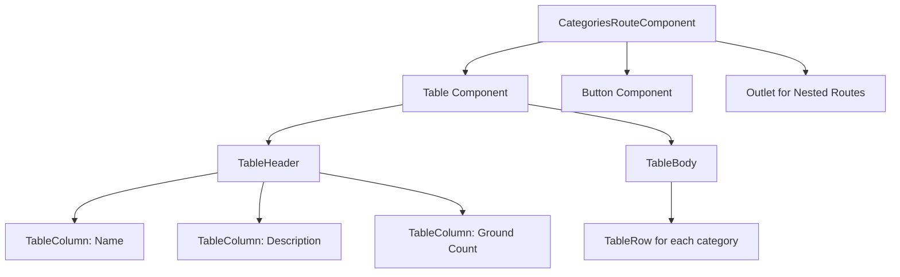
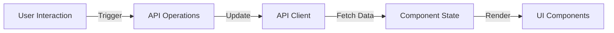
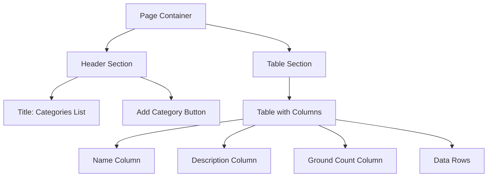
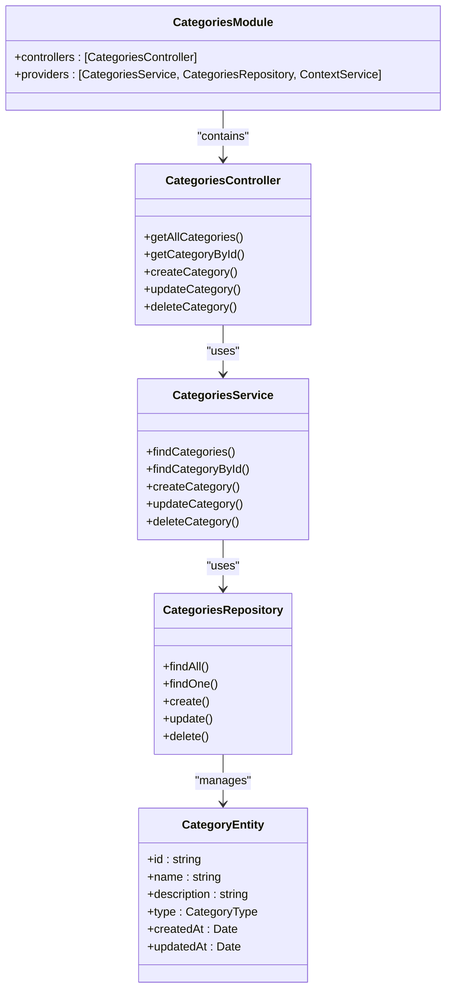
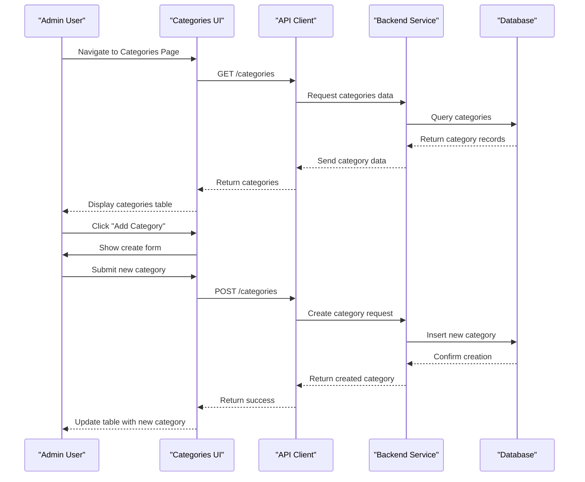
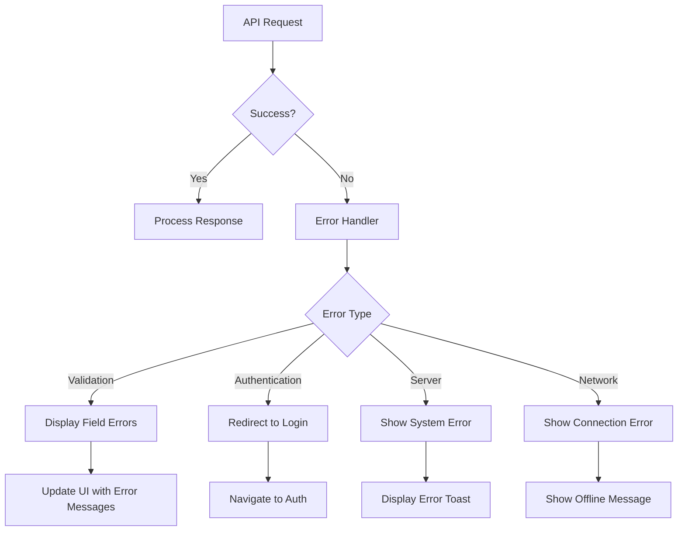

# Space Categories Management

<cite>
**Referenced Files in This Document**   
- [categories.tsx](file://apps/admin/src/routes/admin/dashboard/space-service/categories.tsx)
- [categories.module.ts](file://apps/server/src/module/categories.module.ts)
- [categoryDto.ts](file://packages/api/src/model/categoryDto.ts)
- [categoryTypes.ts](file://packages/api/src/model/categoryTypes.ts)
- [category.dto.ts](file://packages/dto/src/category.dto.ts)
- [category.entity.ts](file://packages/entity/src/category.entity.ts)
- [category-names.enum.ts](file://packages/enum/src/category-names.enum.ts)
- [category-types.enum.ts](file://packages/enum/src/category-types.enum.ts)
</cite>

## Table of Contents
1. [Introduction](#introduction)
2. [Component Structure](#component-structure)
3. [State Management and Data Flow](#state-management-and-data-flow)
4. [UI Layout and Form Elements](#ui-layout-and-form-elements)
5. [API Integration and Data Persistence](#api-integration-and-data-persistence)
6. [CRUD Operations Implementation](#crud-operations-implementation)
7. [Error Handling Mechanisms](#error-handling-mechanisms)
8. [Conclusion](#conclusion)

## Introduction
The Space Categories Management feature within the admin dashboard provides administrators with the ability to manage space categories through CRUD operations. This documentation details the implementation of the categories route under `/admin/dashboard/space-service/categories` that enables comprehensive management of space categories. The feature integrates with shared frontend components and the API client to ensure data persistence and consistent user experience across the application.

**Section sources**
- [categories.tsx](file://apps/admin/src/routes/admin/dashboard/space-service/categories.tsx)

## Component Structure
The space categories management feature is implemented as a React component within the admin dashboard routing structure. The component is defined using the `createFileRoute` function from `@tanstack/react-router`, establishing the route at `/admin/dashboard/space-service/categories`. The component structure follows a modular approach, utilizing UI components from `@heroui/react` for consistent design patterns. The main component renders a table to display existing categories and includes an outlet for nested routes, allowing for modal dialogs or additional views for create and edit operations.

**Diagram sources**
- [categories.tsx](file://apps/admin/src/routes/admin/dashboard/space-service/categories.tsx)

**Section sources**
- [categories.tsx](file://apps/admin/src/routes/admin/dashboard/space-service/categories.tsx)

## State Management and Data Flow
The current implementation demonstrates a simple state management pattern using local component state. The categories data is currently mocked within the component, with an array of category objects containing id, name, description, and groundCount properties. In the production implementation, this data would be fetched from the backend API through the shared API client. The data flow follows a unidirectional pattern where data is retrieved from the API, stored in component state, and then rendered in the UI components. The component uses React's functional component pattern with hooks for potential future state management enhancements.

**Diagram sources**
- [categories.tsx](file://apps/admin/src/routes/admin/dashboard/space-service/categories.tsx)
- [categories.module.ts](file://apps/server/src/module/categories.module.ts)

**Section sources**
- [categories.tsx](file://apps/admin/src/routes/admin/dashboard/space-service/categories.tsx)

## UI Layout and Form Elements
The user interface for the space categories management feature follows a clean, table-based layout for displaying category information. The layout includes a header section with a title and an "Add Category" button, followed by a table that displays category data in columns for Name, Description, and Ground Count. The UI components are imported from the `@heroui/react` library, ensuring consistency with the overall design system. The button component uses the primary color scheme and small size designation, providing visual hierarchy within the interface. The table component supports accessibility features through the `aria-label` attribute.

**Diagram sources**
- [categories.tsx](file://apps/admin/src/routes/admin/dashboard/space-service/categories.tsx)

**Section sources**
- [categories.tsx](file://apps/admin/src/routes/admin/dashboard/space-service/categories.tsx)

## API Integration and Data Persistence
The space categories management feature integrates with the backend through the shared API client system. The server-side implementation is structured as a NestJS module (`CategoriesModule`) that includes a controller, service, and repository pattern for handling category-related operations. The module imports necessary components from the `@shared` package, indicating a modular architecture where common functionality is abstracted into shared packages. The API client would use DTOs (Data Transfer Objects) defined in the shared packages to ensure type safety and consistency between frontend and backend. The category entities are defined in the shared schema package, establishing a single source of truth for data models.

**Diagram sources**
- [categories.module.ts](file://apps/server/src/module/categories.module.ts)
- [category.entity.ts](file://packages/entity/src/category.entity.ts)
- [category.dto.ts](file://packages/dto/src/category.dto.ts)

**Section sources**
- [categories.module.ts](file://apps/server/src/module/categories.module.ts)
- [category.entity.ts](file://packages/entity/src/category.entity.ts)
- [category.dto.ts](file://packages/dto/src/category.dto.ts)

## CRUD Operations Implementation
The CRUD operations for space categories are implemented through a combination of frontend components and backend services. The frontend provides the user interface for viewing and initiating operations, while the backend handles data validation, persistence, and business logic. The create operation is triggered by the "Add Category" button in the UI, which would open a form for entering category details. Read operations are implemented through the table display of existing categories. Update and delete operations would be accessible through row-level actions in the table, though these are not fully implemented in the current mock data version. The operations follow RESTful principles with appropriate HTTP methods for each action.

**Diagram sources**
- [categories.tsx](file://apps/admin/src/routes/admin/dashboard/space-service/categories.tsx)
- [categories.module.ts](file://apps/server/src/module/categories.module.ts)

**Section sources**
- [categories.tsx](file://apps/admin/src/routes/admin/dashboard/space-service/categories.tsx)
- [categories.module.ts](file://apps/server/src/module/categories.module.ts)

## Error Handling Mechanisms
The error handling mechanism for the space categories management feature is designed to provide feedback to users during API operations. While the current implementation uses mock data and does not show explicit error handling code, the architecture suggests that errors would be handled through the API client layer. The shared API client would intercept HTTP responses and translate error codes into user-friendly messages. Validation errors from the backend would be communicated back to the frontend through standardized response formats. The UI would display appropriate error messages in context, such as form validation errors near input fields or toast notifications for system-level errors.

**Diagram sources**
- [categories.tsx](file://apps/admin/src/routes/admin/dashboard/space-service/categories.tsx)

**Section sources**
- [categories.tsx](file://apps/admin/src/routes/admin/dashboard/space-service/categories.tsx)

## Conclusion
The Space Categories Management feature provides a comprehensive interface for administrators to manage space categories within the application. The implementation follows a modular architecture with clear separation between frontend components and backend services. The feature leverages shared components and data models to ensure consistency across the application. While the current implementation shows mock data, the architecture is designed to support full CRUD operations through integration with the backend API. Future enhancements could include additional features such as category hierarchies, bulk operations, and enhanced filtering capabilities.