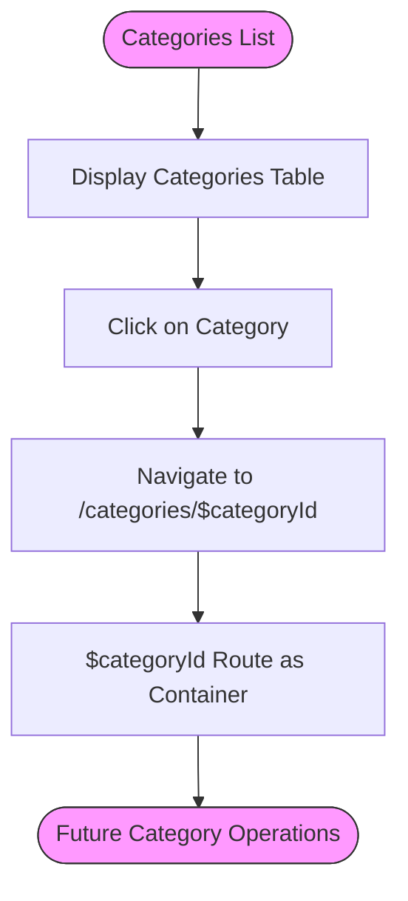
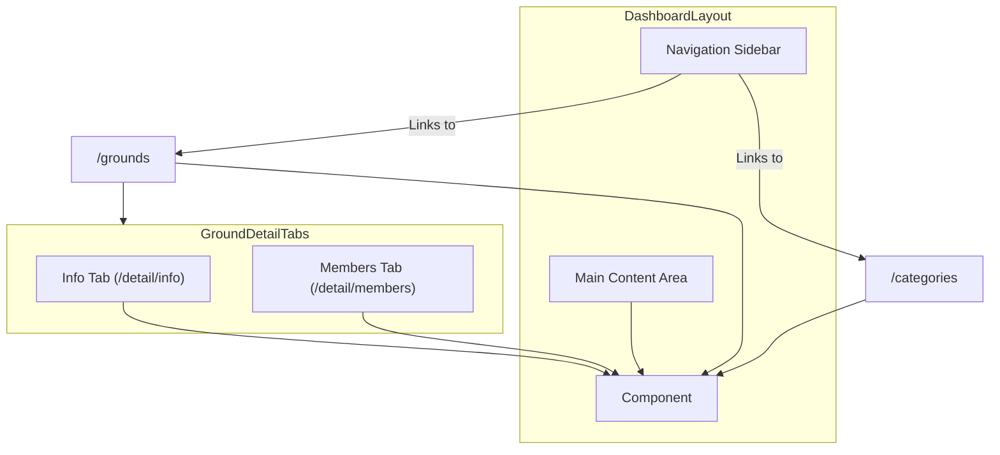
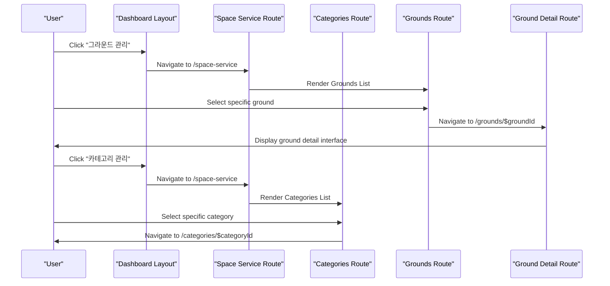
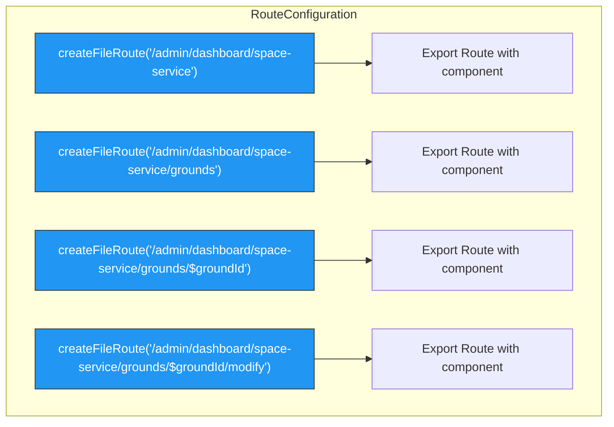

# Space Service Routes

<cite>
**Referenced Files in This Document**   
- [dashboard.tsx](file://apps/admin/src/routes/admin/dashboard.tsx)
- [space-service.tsx](file://apps/admin/src/routes/admin/dashboard/space-service.tsx)
- [categories.tsx](file://apps/admin/src/routes/admin/dashboard/space-service/categories.tsx)
- [grounds.tsx](file://apps/admin/src/routes/admin/dashboard/space-service/grounds.tsx)
- [categories/$categoryId.tsx](file://apps/admin/src/routes/admin/dashboard/space-service/categories/$categoryId.tsx)
- [grounds/$groundId.tsx](file://apps/admin/src/routes/admin/dashboard/space-service/grounds/$groundId.tsx)
- [grounds/$groundId/modify.tsx](file://apps/admin/src/routes/admin/dashboard/space-service/grounds/$groundId/modify.tsx)
- [grounds/$groundId/create.tsx](file://apps/admin/src/routes/admin/dashboard/space-service/grounds/$groundId/create.tsx)
- [grounds/$groundId/detail.tsx](file://apps/admin/src/routes/admin/dashboard/space-service/grounds/$groundId/detail.tsx)
- [grounds/$groundId/detail/info.tsx](file://apps/admin/src/routes/admin/dashboard/space-service/grounds/$groundId/detail/info.tsx)
- [grounds/$groundId/detail/members.tsx](file://apps/admin/src/routes/admin/dashboard/space-service/grounds/$groundId/detail/members.tsx)
- [routeTree.gen.ts](file://apps/admin/src/routeTree.gen.ts)
</cite>

## Table of Contents
1. [Introduction](#introduction)
2. [Parent Route Configuration](#parent-route-configuration)
3. [Space Categories Management](#space-categories-management)
4. [Grounds Management](#grounds-management)
5. [UI Layout and Navigation Patterns](#ui-layout-and-navigation-patterns)
6. [Route Definitions and Component Mappings](#route-definitions-and-component-mappings)
7. [Navigation Between Space Entities](#navigation-between-space-entities)
8. [Route Configuration Examples](#route-configuration-examples)

## Introduction
The space service routing module within the admin dashboard provides a comprehensive system for managing space-related entities, specifically categories and grounds. This documentation details the organization of routes under the `/admin/dashboard/space-service` path, explaining how the routing system facilitates the management of these entities through a well-structured hierarchy of nested routes. The module serves as a container for various space management features, enabling administrators to efficiently organize and maintain space categories and grounds.

**Section sources**
- [dashboard.tsx](file://apps/admin/src/routes/admin/dashboard.tsx#L1-L50)
- [space-service.tsx](file://apps/admin/src/routes/admin/dashboard/space-service.tsx#L1-L14)

## Parent Route Configuration
The parent route configuration for the space service is defined at the `/admin/dashboard/space-service` path and serves as a container for all nested space management features. This route acts as a layout component that provides a consistent structure for its child routes, rendering an "공간 서비스" (Space Service) heading followed by an `<Outlet />` component where child route content is displayed. The parent route establishes the foundation for the space service module, ensuring a cohesive user experience across all space-related management interfaces.

```mermaid
graph TD
A[/admin/dashboard] --> B[/admin/dashboard/space-service]
B --> C[/admin/dashboard/space-service/categories]
B --> D[/admin/dashboard/space-service/grounds]
C --> E[/admin/dashboard/space-service/categories/$categoryId]
D --> F[/admin/dashboard/space-service/grounds/$groundId]
F --> G[/admin/dashboard/space-service/grounds/$groundId/detail]
F --> H[/admin/dashboard/space-service/grounds/$groundId/modify]
F --> I[/admin/dashboard/space-service/grounds/$groundId/create]
G --> J[/admin/dashboard/space-service/grounds/$groundId/detail/info]
G --> K[/admin/dashboard/space-service/grounds/$groundId/detail/members]
```

**Diagram sources**
- [space-service.tsx](file://apps/admin/src/routes/admin/dashboard/space-service.tsx#L1-L14)
- [routeTree.gen.ts](file://apps/admin/src/routeTree.gen.ts#L64-L68)

**Section sources**
- [space-service.tsx](file://apps/admin/src/routes/admin/dashboard/space-service.tsx#L1-L14)
- [routeTree.gen.ts](file://apps/admin/src/routeTree.gen.ts#L64-L68)

## Space Categories Management
The space categories management functionality is organized under the `/admin/dashboard/space-service/categories` route, which displays a list of existing categories with their names, descriptions, and associated ground counts. The route component renders a table-based interface with a "카테고리 추가" (Add Category) button for creating new categories. When a specific category is selected, navigation occurs to the `/admin/dashboard/space-service/categories/$categoryId` route, which serves as a container for category-specific operations. This nested route structure allows for future expansion of category management features while maintaining a clean separation of concerns.



**Diagram sources**
- [categories.tsx](file://apps/admin/src/routes/admin/dashboard/space-service/categories.tsx#L1-L75)
- [categories/$categoryId.tsx](file://apps/admin/src/routes/admin/dashboard/space-service/categories/$categoryId.tsx#L1-L12)

**Section sources**
- [categories.tsx](file://apps/admin/src/routes/admin/dashboard/space-service/categories.tsx#L1-L75)
- [categories/$categoryId.tsx](file://apps/admin/src/routes/admin/dashboard/space-service/categories/$categoryId.tsx#L1-L12)

## Grounds Management
The grounds management system is organized under the `/admin/dashboard/space-service/grounds` route, which displays a list of existing grounds with their names, locations, and capacities. The route provides a table-based interface for viewing ground information and serves as a parent container for ground-specific operations. When a specific ground is selected, navigation occurs to the `/admin/dashboard/space-service/grounds/$groundId` route, which acts as a layout component for ground management features. This route supports various operations including viewing detailed information, modifying ground properties, and creating new grounds through dedicated child routes.

```mermaid
flowchart TD
A[/admin/dashboard/space-service/grounds] --> B[Grounds List Table]
B --> C{Select Ground}
C --> D[/admin/dashboard/space-service/grounds/$groundId]
D --> E[Detail View]
D --> F[Modify Ground]
D --> G[Create Ground]
E --> H[Info Tab]
E --> I[Members Tab]
style A fill:#4CAF50,stroke:#333,color:#fff
style D fill:#4CAF50,stroke:#333,color:#fff
```

**Diagram sources**
- [grounds.tsx](file://apps/admin/src/routes/admin/dashboard/space-service/grounds.tsx#L1-L63)
- [grounds/$groundId.tsx](file://apps/admin/src/routes/admin/dashboard/space-service/grounds/$groundId.tsx#L1-L21)

**Section sources**
- [grounds.tsx](file://apps/admin/src/routes/admin/dashboard/space-service/grounds.tsx#L1-L63)
- [grounds/$groundId.tsx](file://apps/admin/src/routes/admin/dashboard/space-service/grounds/$groundId.tsx#L1-L21)

## UI Layout and Navigation Patterns
The UI layout for the space service module follows a consistent pattern across all routes, featuring a hierarchical navigation structure that enables seamless movement between different management interfaces. The dashboard layout includes a sidebar navigation menu with direct links to key functionality, including "그라운드 관리" (Grounds Management) and "카테고리 관리" (Categories Management). Each parent route renders a heading followed by an `<Outlet />` component, allowing child routes to display their content within the established layout. The grounds detail interface implements a tabbed navigation pattern with "정보" (Info) and "멤버" (Members) tabs, providing organized access to different aspects of ground information.



**Diagram sources**
- [dashboard.tsx](file://apps/admin/src/routes/admin/dashboard.tsx#L1-L50)
- [grounds/$groundId/detail.tsx](file://apps/admin/src/routes/admin/dashboard/space-service/grounds/$groundId/detail.tsx#L1-L24)
- [grounds/$groundId/detail/info.tsx](file://apps/admin/src/routes/admin/dashboard/space-service/grounds/$groundId/detail/info.tsx#L1-L78)
- [grounds/$groundId/detail/members.tsx](file://apps/admin/src/routes/admin/dashboard/space-service/grounds/$groundId/detail/members.tsx#L1-L90)

**Section sources**
- [dashboard.tsx](file://apps/admin/src/routes/admin/dashboard.tsx#L1-L50)
- [grounds/$groundId/detail.tsx](file://apps/admin/src/routes/admin/dashboard/space-service/grounds/$groundId/detail.tsx#L1-L24)

## Route Definitions and Component Mappings
The routing system implements a clear mapping between route definitions and their corresponding UI components, following the TanStack Router framework conventions. Each route is defined using the `createFileRoute` function with a specific path, and the route configuration includes a `component` property that references the React component to render. The parent-child relationship between routes is established through the file structure and the use of `<Outlet />` components, creating a nested layout system. Route parameters such as `$groundId` and `$categoryId` are automatically extracted and made available to components through the `useParams` hook, enabling dynamic content rendering based on the current route context.

```mermaid
classDiagram
class RouteDefinition {
+path : string
+component : ReactComponent
+getParentRoute() : RouteDefinition
}
class SpaceServiceRoute {
+component : SpaceServiceRouteComponent
}
class CategoriesRoute {
+component : CategoriesRouteComponent
}
class GroundsRoute {
+component : GroundsRouteComponent
}
class GroundIdRoute {
+component : GroundIdRouteComponent
+useParams() : { groundId : string }
}
RouteDefinition <|-- SpaceServiceRoute
RouteDefinition <|-- CategoriesRoute
RouteDefinition <|-- GroundsRoute
RouteDefinition <|-- GroundIdRoute
SpaceServiceRoute --> CategoriesRoute : contains
SpaceServiceRoute --> GroundsRoute : contains
GroundsRoute --> GroundIdRoute : contains
```

**Diagram sources**
- [space-service.tsx](file://apps/admin/src/routes/admin/dashboard/space-service.tsx#L1-L14)
- [categories.tsx](file://apps/admin/src/routes/admin/dashboard/space-service/categories.tsx#L1-L75)
- [grounds.tsx](file://apps/admin/src/routes/admin/dashboard/space-service/grounds.tsx#L1-L63)
- [grounds/$groundId.tsx](file://apps/admin/src/routes/admin/dashboard/space-service/grounds/$groundId.tsx#L1-L21)

**Section sources**
- [space-service.tsx](file://apps/admin/src/routes/admin/dashboard/space-service.tsx#L1-L14)
- [routeTree.gen.ts](file://apps/admin/src/routeTree.gen.ts#L64-L68)

## Navigation Between Space Entities
The routing system facilitates seamless navigation between space categories and grounds management interfaces through a well-defined hierarchy of routes. Users can navigate directly between the categories and grounds lists via the sidebar navigation in the dashboard layout. When managing a specific ground, users can access detailed information and related functionality through nested routes under the `/admin/dashboard/space-service/grounds/$groundId` path. The system supports both top-level navigation between major features and contextual navigation within specific entity management interfaces, providing a flexible and intuitive user experience for managing space-related entities.



**Diagram sources**
- [dashboard.tsx](file://apps/admin/src/routes/admin/dashboard.tsx#L1-L50)
- [space-service.tsx](file://apps/admin/src/routes/admin/dashboard/space-service.tsx#L1-L14)
- [grounds.tsx](file://apps/admin/src/routes/admin/dashboard/space-service/grounds.tsx#L1-L63)
- [categories.tsx](file://apps/admin/src/routes/admin/dashboard/space-service/categories.tsx#L1-L75)

**Section sources**
- [dashboard.tsx](file://apps/admin/src/routes/admin/dashboard.tsx#L1-L50)
- [space-service.tsx](file://apps/admin/src/routes/admin/dashboard/space-service.tsx#L1-L14)

## Route Configuration Examples
The space service routing module demonstrates several key patterns in route configuration. The parent route at `/admin/dashboard/space-service` serves as a container for all space management features, while child routes handle specific functionality. Dynamic routes with parameters, such as `/admin/dashboard/space-service/grounds/$groundId`, enable management of specific entities. The route configuration includes dedicated routes for different operations on grounds, including detail views, modification forms, and creation interfaces. Each route definition follows the same pattern of importing `createFileRoute` from "@tanstack/react-router", defining a component, and exporting a `Route` constant with the path and component configuration.



**Diagram sources**
- [space-service.tsx](file://apps/admin/src/routes/admin/dashboard/space-service.tsx#L1-L14)
- [grounds.tsx](file://apps/admin/src/routes/admin/dashboard/space-service/grounds.tsx#L1-L63)
- [grounds/$groundId.tsx](file://apps/admin/src/routes/admin/dashboard/space-service/grounds/$groundId.tsx#L1-L21)
- [grounds/$groundId/modify.tsx](file://apps/admin/src/routes/admin/dashboard/space-service/grounds/$groundId/modify.tsx#L1-L136)

**Section sources**
- [space-service.tsx](file://apps/admin/src/routes/admin/dashboard/space-service.tsx#L1-L14)
- [grounds.tsx](file://apps/admin/src/routes/admin/dashboard/space-service/grounds.tsx#L1-L63)
- [grounds/$groundId.tsx](file://apps/admin/src/routes/admin/dashboard/space-service/grounds/$groundId.tsx#L1-L21)