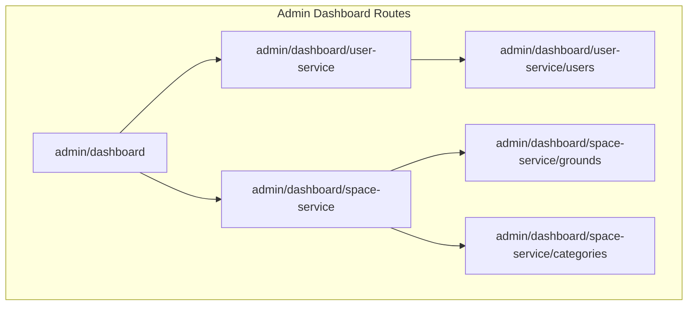
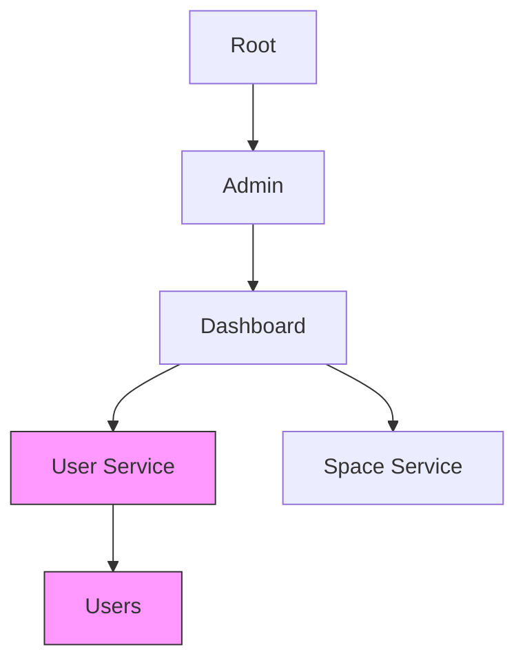
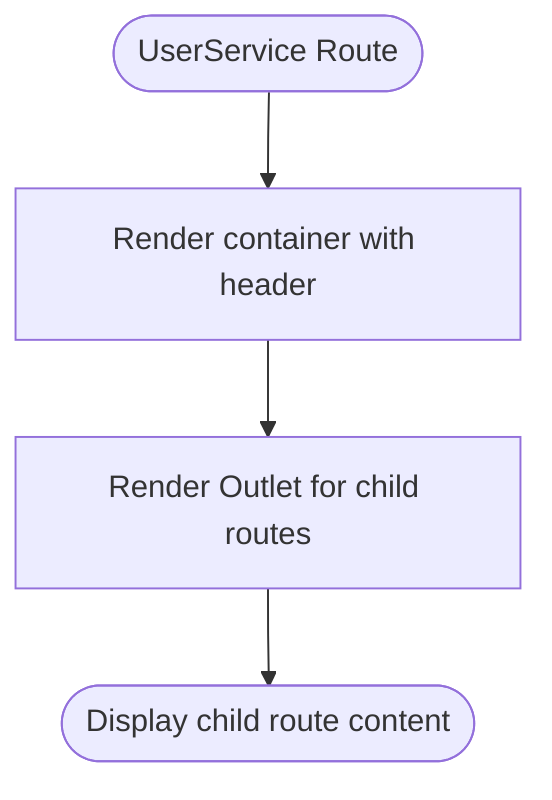
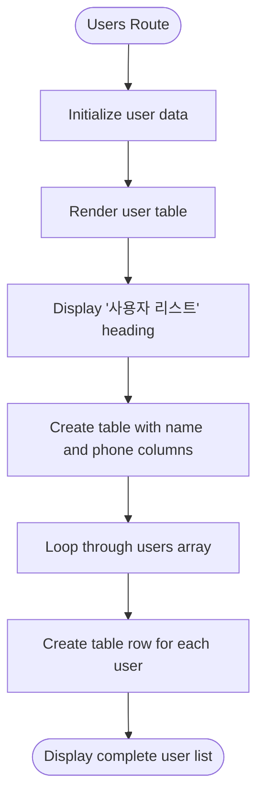
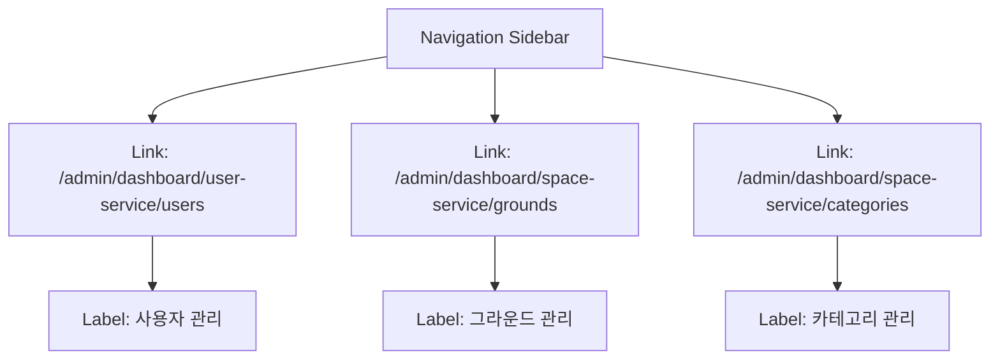
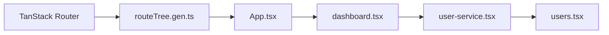

# User Service Routes

<cite>
**Referenced Files in This Document**   
- [dashboard.tsx](file://apps/admin/src/routes/admin/dashboard.tsx)
- [user-service.tsx](file://apps/admin/src/routes/admin/dashboard/user-service.tsx)
- [users.tsx](file://apps/admin/src/routes/admin/dashboard/user-service/users.tsx)
- [routeTree.gen.ts](file://apps/admin/src/routeTree.gen.ts)
- [App.tsx](file://apps/admin/src/App.tsx)
</cite>

## Table of Contents
1. [Introduction](#introduction)
2. [Project Structure](#project-structure)
3. [Core Components](#core-components)
4. [Architecture Overview](#architecture-overview)
5. [Detailed Component Analysis](#detailed-component-analysis)
6. [Dependency Analysis](#dependency-analysis)
7. [Performance Considerations](#performance-considerations)
8. [Troubleshooting Guide](#troubleshooting-guide)
9. [Conclusion](#conclusion)

## Introduction
This document provides detailed documentation for the user service routing module within the admin dashboard. It explains the organization of routes under /admin/dashboard/user-service that manage user-related functionalities, primarily focused on user management. The documentation covers the parent route configuration, UI layout and navigation patterns, integration between route definitions and UI components, and how the routing system handles the user management interface within the dashboard context.

## Project Structure
The user service routing module is organized within the admin application's route structure. The routing follows a hierarchical pattern with parent-child relationships that create a nested navigation system for user management features.

**Diagram sources**
- [routeTree.gen.ts](file://apps/admin/src/routeTree.gen.ts)

**Section sources**
- [routeTree.gen.ts](file://apps/admin/src/routeTree.gen.ts)

## Core Components
The user service routing module consists of three main components: the dashboard layout, the user service container route, and the users list route. These components work together to provide a structured navigation experience for user management functionality.

**Section sources**
- [dashboard.tsx](file://apps/admin/src/routes/admin/dashboard.tsx)
- [user-service.tsx](file://apps/admin/src/routes/admin/dashboard/user-service.tsx)
- [users.tsx](file://apps/admin/src/routes/admin/dashboard/user-service/users.tsx)

## Architecture Overview
The routing architecture follows a nested layout pattern using TanStack Router, where each level of the route hierarchy provides a container for its child routes. The parent route renders an Outlet component where child routes are displayed, creating a consistent layout while allowing for specific content in each section.

**Diagram sources**
- [routeTree.gen.ts](file://apps/admin/src/routeTree.gen.ts)
- [App.tsx](file://apps/admin/src/App.tsx)

## Detailed Component Analysis

### User Service Route Analysis
The user service route serves as a container for all user management functionality within the admin dashboard. It provides a consistent header and layout for all child routes while defining the parent path for user-related features.

**Diagram sources**
- [user-service.tsx](file://apps/admin/src/routes/admin/dashboard/user-service.tsx)

**Section sources**
- [user-service.tsx](file://apps/admin/src/routes/admin/dashboard/user-service.tsx)

### Users Route Analysis
The users route implements the main user management interface, displaying a list of users in a table format. This route is nested under the user service container and represents the primary user management functionality.

**Diagram sources**
- [users.tsx](file://apps/admin/src/routes/admin/dashboard/user-service/users.tsx)

**Section sources**
- [users.tsx](file://apps/admin/src/routes/admin/dashboard/user-service/users.tsx)

### Dashboard Navigation Analysis
The dashboard layout includes a sidebar navigation that provides access to different service modules, including the user service. The navigation structure allows users to move between different administrative functions within the dashboard.

**Diagram sources**
- [dashboard.tsx](file://apps/admin/src/routes/admin/dashboard.tsx)

**Section sources**
- [dashboard.tsx](file://apps/admin/src/routes/admin/dashboard.tsx)

## Dependency Analysis
The user service routing module depends on the TanStack Router library for route management and React for component rendering. The route hierarchy is defined in the routeTree.gen.ts file, which is automatically generated based on the file structure.

**Diagram sources**
- [routeTree.gen.ts](file://apps/admin/src/routeTree.gen.ts)
- [App.tsx](file://apps/admin/src/App.tsx)

**Section sources**
- [routeTree.gen.ts](file://apps/admin/src/routeTree.gen.ts)
- [App.tsx](file://apps/admin/src/App.tsx)

## Performance Considerations
The routing implementation uses code splitting and lazy loading patterns through the file-based routing system. This ensures that only the necessary components are loaded when a user navigates to a specific route, improving initial load times and overall application performance.

## Troubleshooting Guide
When troubleshooting issues with the user service routes, verify the following:
- Route paths in the file structure match the expected URL patterns
- Parent routes properly render the Outlet component for child routes
- Route definitions in routeTree.gen.ts are correctly generated
- Component imports are properly configured

**Section sources**
- [routeTree.gen.ts](file://apps/admin/src/routeTree.gen.ts)
- [App.tsx](file://apps/admin/src/App.tsx)

## Conclusion
The user service routing module provides a well-structured navigation system for user management within the admin dashboard. By using a hierarchical route structure with parent-child relationships, the implementation creates a consistent user experience while allowing for focused functionality in each section. The integration between route definitions and UI components enables a seamless navigation experience for administrators managing user data.