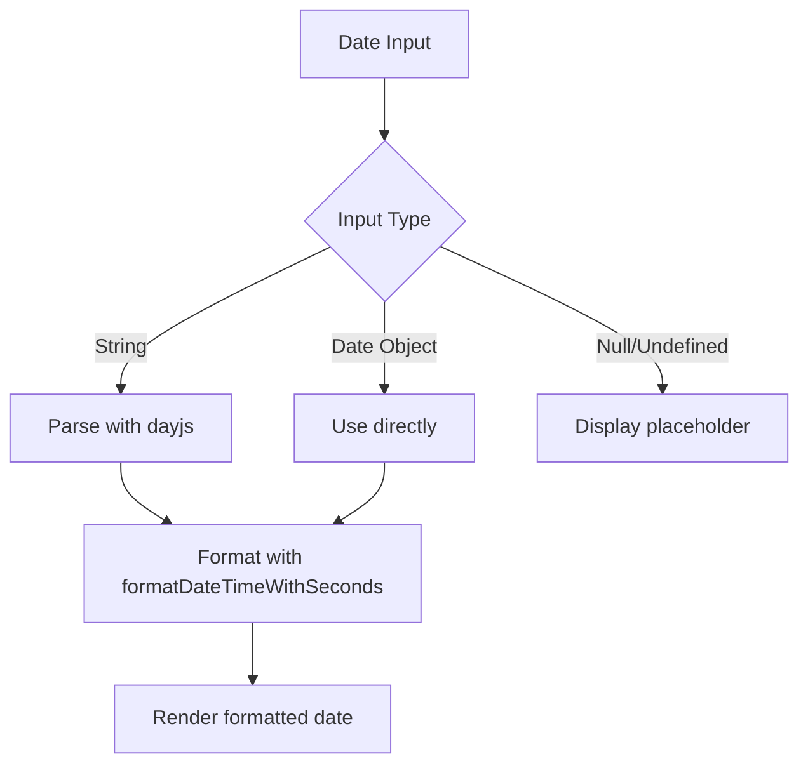
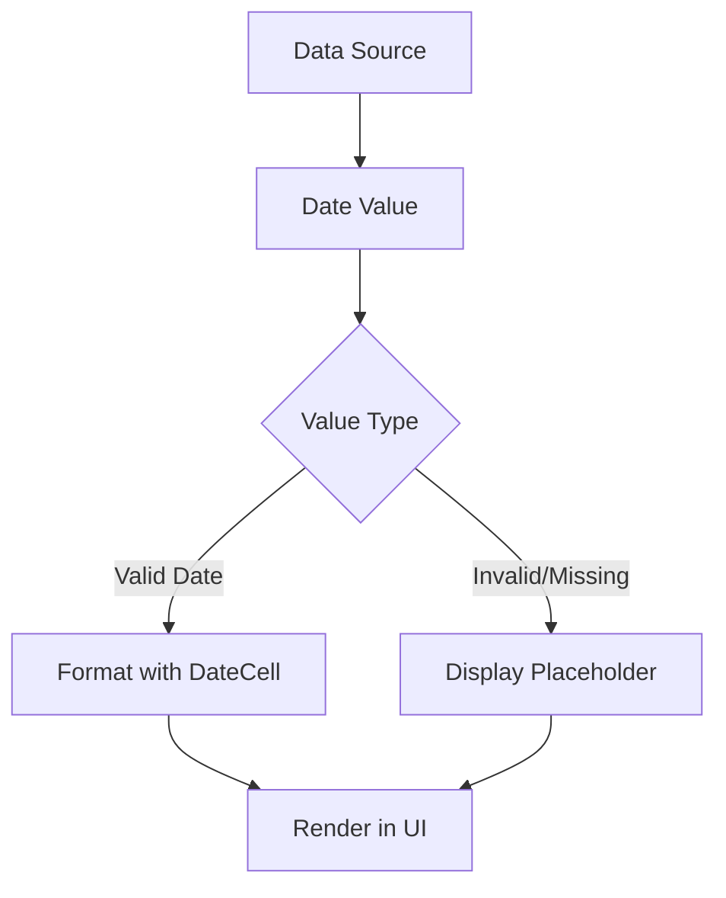

# DateCell

<cite>
**Referenced Files in This Document**   
- [DateCell.tsx](file://packages/ui/src/components/ui/data-display/cells/DateCell/DateCell.tsx)
- [DateCell.stories.tsx](file://packages/ui/src/components/ui/data-display/cells/DateCell/DateCell.stories.tsx)
- [DateTimeCell.tsx](file://packages/ui/src/components/ui/data-display/cells/DateTimeCell/DateTimeCell.tsx)
- [DateTime.ts](file://packages/toolkit/src/DateTime.ts)
- [index.ts](file://packages/ui/src/components/ui/data-display/cells/index.ts)
</cite>

## Table of Contents
1. [Introduction](#introduction)
2. [Core Components](#core-components)
3. [Props Interface](#props-interface)
4. [Date Formatting Options](#date-formatting-options)
5. [Integration with Date Libraries](#integration-with-date-libraries)
6. [Handling Invalid and Null Values](#handling-invalid-and-null-values)
7. [Theming and Styling](#theming-and-styling)
8. [Accessibility Considerations](#accessibility-considerations)
9. [Performance Optimization](#performance-optimization)
10. [Usage Examples](#usage-examples)
11. [Common Issues and Solutions](#common-issues-and-solutions)

## Introduction
The DateCell component is a UI element designed for displaying date values in a consistent and localized format across the application. It is part of the shared UI library and provides a standardized way to render date information in tables, lists, and other data display contexts. The component handles various input types including ISO strings, Date objects, null, and undefined values, ensuring robust behavior in different scenarios.

## Core Components

The DateCell component is implemented as a simple functional React component that formats and displays date values. It relies on external formatting utilities from the toolkit package to handle date parsing and formatting. The component is designed to be lightweight and focused on a single responsibility: displaying date values in a user-friendly format.

**Section sources**
- [DateCell.tsx](file://packages/ui/src/components/ui/data-display/cells/DateCell/DateCell.tsx)
- [DateCell.stories.tsx](file://packages/ui/src/components/ui/data-display/cells/DateCell/DateCell.stories.tsx)

## Props Interface

The DateCell component accepts a single prop that defines the date value to be displayed. The interface is minimal and focused on the core functionality of date display.

```typescript
interface DateCellProps {
	value: string | Date | null | undefined;
}
```

The component accepts various date input types:
- ISO date strings (e.g., "2024-01-15T10:30:00")
- Date objects
- null values
- undefined values

When no valid date value is provided, the component displays a placeholder "-" to indicate missing data.

**Section sources**
- [DateCell.tsx](file://packages/ui/src/components/ui/data-display/cells/DateCell/DateCell.tsx)

## Date Formatting Options

The DateCell component uses the `formatDateTimeWithSeconds` function from the toolkit package to format date values. This function provides a consistent format that includes date and time with seconds. The default format used is "YY.MM.DD HH:mm:ss", which displays the year as two digits for brevity.

The formatting is handled by the dayjs library, which provides robust date parsing and formatting capabilities. The format can be customized by modifying the implementation in the toolkit package, allowing for consistent formatting changes across all components that use the same formatting function.

**Section sources**
- [DateCell.tsx](file://packages/ui/src/components/ui/data-display/cells/DateCell/DateCell.tsx)
- [DateTime.ts](file://packages/toolkit/src/DateTime.ts)

## Integration with Date Libraries

The DateCell component integrates with the dayjs library through the toolkit package's formatting utilities. This abstraction layer allows the component to remain independent of the specific date library implementation while still providing robust date formatting capabilities.

The component receives date values as strings or Date objects and passes them to the formatting function, which handles the parsing and formatting using dayjs. This approach ensures compatibility with various date input formats and provides consistent output regardless of the input type.



**Diagram sources**
- [DateCell.tsx](file://packages/ui/src/components/ui/data-display/cells/DateCell/DateCell.tsx)
- [DateTime.ts](file://packages/toolkit/src/DateTime.ts)

## Handling Invalid and Null Values

The DateCell component includes robust handling for invalid and missing date values. When the value prop is null, undefined, or otherwise falsy, the component renders a placeholder "-" instead of attempting to format the date.

This behavior ensures that the UI remains consistent and user-friendly even when data is missing or incomplete. The component does not throw errors or display unformatted data when invalid inputs are provided, making it safe to use in contexts where data quality cannot be guaranteed.

The implementation uses a simple truthiness check to determine if a value should be displayed or replaced with the placeholder.

**Section sources**
- [DateCell.tsx](file://packages/ui/src/components/ui/data-display/cells/DateCell/DateCell.tsx)

## Theming and Styling

The DateCell component is designed to integrate with the application's theming system through the UI library's theme provider. While the component itself does not include specific styling, it is intended to inherit typography and color styles from the surrounding context.

The component renders dates within a paragraph element, allowing it to respond to text styling from parent components or global styles. This approach ensures consistency with the overall application design while maintaining flexibility for different use cases.

**Section sources**
- [DateCell.tsx](file://packages/ui/src/components/ui/data-display/cells/DateCell/DateCell.tsx)

## Accessibility Considerations

The DateCell component provides basic accessibility support through semantic HTML. By using a paragraph element to display the date, the component ensures that screen readers can properly interpret the content as text.

For enhanced accessibility, consumers of the component can wrap it in appropriate ARIA roles or provide additional context when necessary. The component's simple structure makes it easy to extend with accessibility features without modifying the core implementation.

**Section sources**
- [DateCell.tsx](file://packages/ui/src/components/ui/data-display/cells/DateCell/DateCell.tsx)

## Performance Optimization

The DateCell component is optimized for performance in data-intensive contexts such as tables with many rows. The implementation is minimal and avoids unnecessary computations or re-renders.

When rendering large datasets, the component's simplicity ensures that formatting operations are fast and memory usage is low. The use of a pure functional component without internal state or complex logic contributes to its performance characteristics.

For applications with extremely large datasets, consider implementing virtual scrolling or pagination to further optimize performance, as the DateCell component itself is already optimized for efficient rendering.

**Section sources**
- [DateCell.tsx](file://packages/ui/src/components/ui/data-display/cells/DateCell/DateCell.tsx)

## Usage Examples

The DateCell component can be used in various contexts to display date values consistently. It accepts date strings, Date objects, null, and undefined values, making it flexible for different data sources.

The component is typically used in data tables, lists, and detail views where date information needs to be displayed in a standardized format. It can be imported from the UI library's components package and used like any other React component.



**Diagram sources**
- [DateCell.tsx](file://packages/ui/src/components/ui/data-display/cells/DateCell/DateCell.tsx)
- [DateCell.stories.tsx](file://packages/ui/src/components/ui/data-display/cells/DateCell/DateCell.stories.tsx)

## Common Issues and Solutions

Common issues with the DateCell component typically relate to date formatting and timezone handling. Since the component relies on the toolkit's formatting functions, any issues with date parsing or formatting should be addressed at the toolkit level to ensure consistency across all components.

For timezone-related issues, ensure that date values are properly converted to the desired timezone before being passed to the component. The component itself does not handle timezone conversion, focusing instead on consistent formatting of the provided date value.

When encountering unexpected formatting results, verify that the input date string is in a valid ISO format or that the Date object is properly constructed. The dayjs library used by the formatting functions is generally forgiving with input formats, but adhering to ISO standards ensures reliable parsing.

**Section sources**
- [DateCell.tsx](file://packages/ui/src/components/ui/data-display/cells/DateCell/DateCell.tsx)
- [DateTime.ts](file://packages/toolkit/src/DateTime.ts)