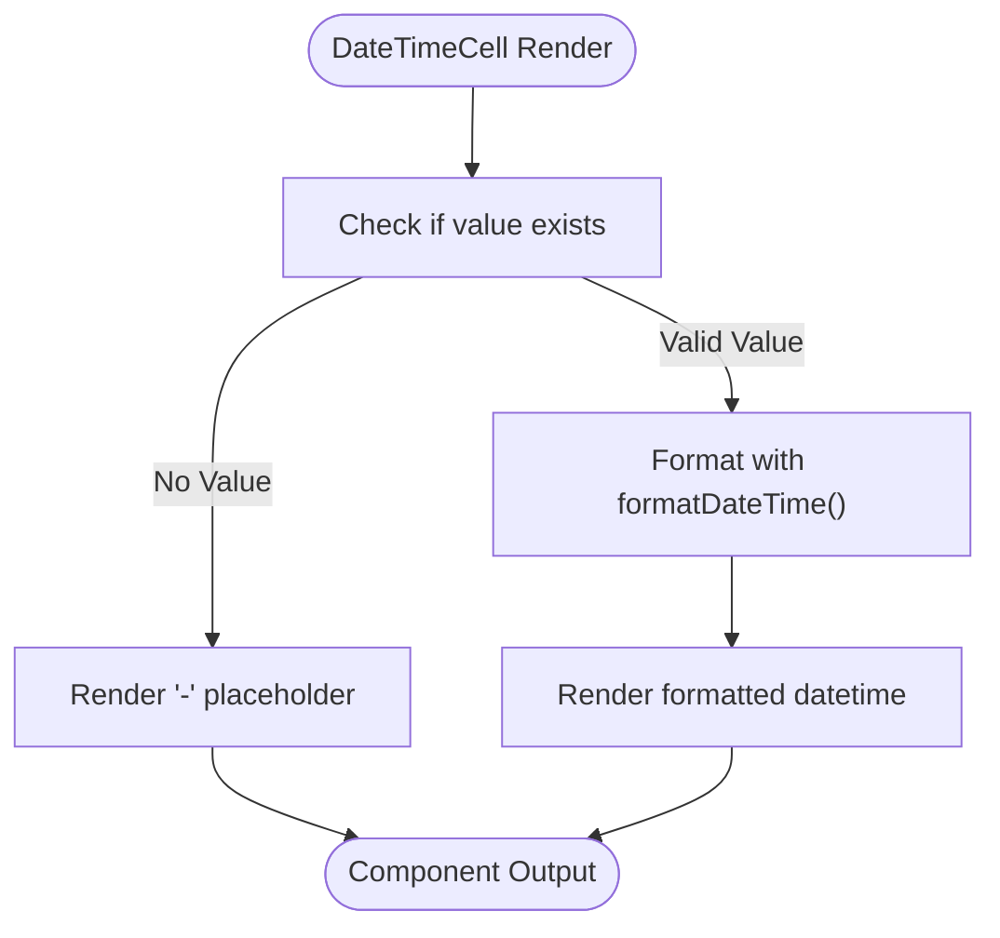
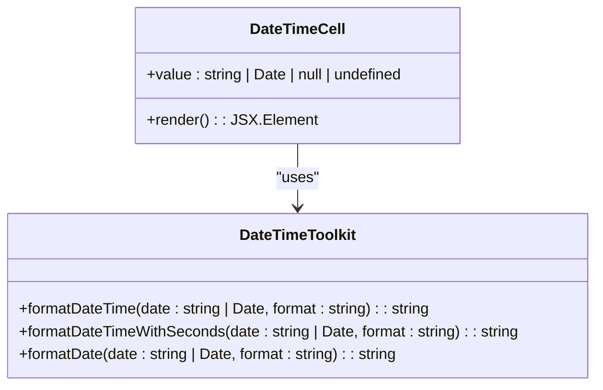
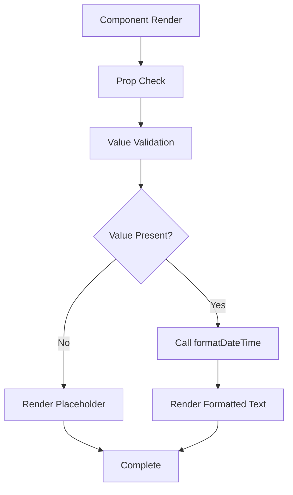

# DateTimeCell

<cite>
**Referenced Files in This Document**   
- [DateTimeCell.tsx](file://packages/ui/src/components/ui/data-display/cells/DateTimeCell/DateTimeCell.tsx)
- [DateTimeCell.stories.tsx](file://packages/ui/src/components/ui/data-display/cells/DateTimeCell/DateTimeCell.stories.tsx)
- [DateTime.ts](file://packages/toolkit/src/DateTime.ts)
</cite>

## Table of Contents
1. [Introduction](#introduction)
2. [Core Components](#core-components)
3. [DateTime Formatting Patterns](#datetime-formatting-patterns)
4. [Props Interface](#props-interface)
5. [Integration with Date/Time Libraries](#integration-with-datetime-libraries)
6. [Edge Case Handling](#edge-case-handling)
7. [Theming Support](#theming-support)
8. [Accessibility Features](#accessibility-features)
9. [Performance Optimization](#performance-optimization)

## Introduction
The DateTimeCell component is a UI element within the shared-frontend library designed to display date and time values in a consistent format across applications. It handles various input types including ISO strings, Date objects, and null/undefined states, providing a standardized way to present datetime information in user interfaces.

**Section sources**
- [DateTimeCell.tsx](file://packages/ui/src/components/ui/data-display/cells/DateTimeCell/DateTimeCell.tsx#L1-L13)

## Core Components

The DateTimeCell component is implemented as a functional React component that accepts a datetime value and formats it for display. The component leverages the `formatDateTime` function from the @cocrepo/toolkit package to ensure consistent formatting across the application ecosystem.

The implementation is minimal and focused, with the core logic consisting of:
- Accepting a datetime value as a prop
- Checking for null or undefined values
- Formatting valid datetime values using the toolkit utility
- Rendering the formatted datetime or a placeholder for invalid values



**Diagram sources**
- [DateTimeCell.tsx](file://packages/ui/src/components/ui/data-display/cells/DateTimeCell/DateTimeCell.tsx#L1-L13)

**Section sources**
- [DateTimeCell.tsx](file://packages/ui/src/components/ui/data-display/cells/DateTimeCell/DateTimeCell.tsx#L1-L13)

## DateTime Formatting Patterns

The DateTimeCell component utilizes the `formatDateTime` function from the @cocrepo/toolkit package, which provides standardized datetime formatting across the application. The default format used is "YYYY.MM.DD HH:mm", which displays the full year, zero-padded month and day, followed by hours and minutes in 24-hour format.

The component supports various datetime input formats:
- ISO 8601 strings (e.g., "2024-01-15T10:30:00Z")
- Standard date strings (e.g., "2024-01-15T10:30:00")
- Date objects created with new Date()

When displaying datetime values, the component follows these formatting rules:
- Years are displayed as four digits
- Months and days are zero-padded to two digits
- Hours are displayed in 24-hour format
- Minutes are always displayed
- Seconds are not included in the default format



**Diagram sources**
- [DateTimeCell.tsx](file://packages/ui/src/components/ui/data-display/cells/DateTimeCell/DateTime.tsx#L1-L13)
- [DateTime.ts](file://packages/toolkit/src/DateTime.ts#L15-L27)

**Section sources**
- [DateTimeCell.tsx](file://packages/ui/src/components/ui/data-display/cells/DateTimeCell/DateTimeCell.tsx#L1-L13)
- [DateTime.ts](file://packages/toolkit/src/DateTime.ts#L15-L27)

## Props Interface

The DateTimeCell component accepts a single prop that defines the datetime value to be displayed. The prop interface is defined as follows:

```typescript
interface DateTimeCellProps {
    value: string | Date | null | undefined;
}
```

The `value` prop can accept multiple types:
- String representations of dates in ISO format or other standard date string formats
- JavaScript Date objects
- null values to represent intentionally missing datetime data
- undefined values to represent uninitialized or unset datetime data

When the component receives a null or undefined value, it displays a placeholder character ("-") instead of attempting to format the value. This provides a consistent user experience when datetime data is not available.

The component does not currently expose additional props for customizing the display format, timezone handling, or relative time display, focusing instead on providing a standardized presentation of datetime values across the application.

**Section sources**
- [DateTimeCell.tsx](file://packages/ui/src/components/ui/data-display/cells/DateTimeCell/DateTimeCell.tsx#L3-L5)

## Integration with Date/Time Libraries

The DateTimeCell component integrates with the @cocrepo/toolkit package, specifically utilizing the `formatDateTime` function from the DateTime utility module. This utility is built on top of the dayjs library, a lightweight alternative to Moment.js that provides comprehensive date manipulation and formatting capabilities.

The integration follows a dependency chain where:
- DateTimeCell imports formatDateTime from @cocrepo/toolkit
- @cocrepo/toolkit implements formatDateTime using dayjs
- dayjs handles the actual parsing and formatting of datetime values

This layered approach allows for consistent datetime formatting across all components that use the toolkit utilities, while keeping the DateTimeCell component itself simple and focused on presentation rather than formatting logic.

The toolkit's DateTime module provides several formatting functions:
- `formatDateTime` for date and time without seconds
- `formatDateTimeWithSeconds` for date and time with seconds
- `formatDate` for date-only formatting
- `formatTime` for time-only formatting

```mermaid
graph TD
A[DateTimeCell Component] --> B[@cocrepo/toolkit]
B --> C[dayjs Library]
C --> D[Native JavaScript Date]
style A fill:#f9f,stroke:#333
style B fill:#bbf,stroke:#333
style C fill:#f96,stroke:#333
style D fill:#9f9,stroke:#333
subgraph "Presentation Layer"
A
end
subgraph "Utility Layer"
B
end
subgraph "Implementation Layer"
C
D
end
```

**Diagram sources**
- [DateTimeCell.tsx](file://packages/ui/src/components/ui/data-display/cells/DateTimeCell/DateTimeCell.tsx#L1)
- [DateTime.ts](file://packages/toolkit/src/DateTime.ts#L1)

**Section sources**
- [DateTimeCell.tsx](file://packages/ui/src/components/ui/data-display/cells/DateTimeCell/DateTimeCell.tsx#L1)
- [DateTime.ts](file://packages/toolkit/src/DateTime.ts#L1-L81)

## Edge Case Handling

The DateTimeCell component implements robust handling of edge cases to ensure reliable behavior in various scenarios. The primary edge cases addressed include null and undefined values, invalid date strings, and timezone considerations.

For null and undefined values, the component displays a consistent placeholder character ("-") rather than attempting to format the value or throwing an error. This provides a clean user experience when datetime data is not available.

The component also handles various datetime string formats through the underlying dayjs library, which can parse:
- ISO 8601 formatted strings
- RFC 2822 formatted dates
- Various other common date string formats

When encountering invalid date strings, the behavior is determined by the dayjs library, which typically returns an invalid date object that may be formatted as an invalid date string.

The component's error handling is minimal by design, relying on the robustness of the dayjs library to handle parsing and formatting edge cases. This approach keeps the component focused on presentation while leveraging well-tested date manipulation utilities.

```mermaid
flowchart TD
A[Input Value] --> B{Value Exists?}
B --> |No| C[Render "-"]
B --> |Yes| D{Valid Date?}
D --> |Yes| E[Format with formatDateTime]
D --> |No| F[Attempt parsing with dayjs]
F --> G{Parse Successful?}
G --> |Yes| H[Format parsed date]
G --> |No| I[Render invalid date format]
E --> J[Render formatted date]
H --> J
I --> J
C --> J
J --> K[Output]
```

**Diagram sources**
- [DateTimeCell.tsx](file://packages/ui/src/components/ui/data-display/cells/DateTimeCell/DateTimeCell.tsx#L8-L10)
- [DateTime.ts](file://packages/toolkit/src/DateTime.ts#L15-L20)

**Section sources**
- [DateTimeCell.tsx](file://packages/ui/src/components/ui/data-display/cells/DateTimeCell/DateTimeCell.tsx#L8-L10)
- [DateTime.ts](file://packages/toolkit/src/DateTime.ts#L15-L20)

## Theming Support

The DateTimeCell component inherits its styling from the application's global theme through the underlying UI framework. As a simple text display component, it does not implement custom theming logic but rather relies on the typography and color settings defined in the application's theme configuration.

The component renders datetime values within a paragraph (`<p>`) element, which means its appearance is controlled by the CSS styles applied to paragraph elements in the context where it is used. This approach ensures consistency with the overall application design and allows for easy customization through CSS overrides or theme modifications.

Theming considerations for the DateTimeCell include:
- Text color for datetime values
- Font family and size
- Line height and spacing
- Text alignment

Since the component displays a placeholder character ("-") for null or undefined values, this character will also inherit the same typography and color styling as the formatted datetime text, ensuring visual consistency across different states.

**Section sources**
- [DateTimeCell.tsx](file://packages/ui/src/components/ui/data-display/cells/DateTimeCell/DateTimeCell.tsx#L9-L12)

## Accessibility Features

The DateTimeCell component provides basic accessibility support through semantic HTML markup. By rendering datetime values within a paragraph element, the component ensures that screen readers can properly interpret and announce the content.

The component's accessibility features include:
- Semantic HTML structure using paragraph elements
- Plain text content that is easily parsed by assistive technologies
- Consistent presentation of placeholder values for null/undefined states

For improved accessibility, consumers of the component can wrap it in more specific semantic elements based on the context, such as:
- `<time>` elements when the datetime has semantic meaning
- Table cells when used in tabular data
- List items when used in lists

The component does not currently implement ARIA attributes or other advanced accessibility features, as its simple text display role is adequately served by standard HTML semantics. However, it is designed to work well within accessible component hierarchies and can be enhanced with additional accessibility features at the consumption level.

**Section sources**
- [DateTimeCell.tsx](file://packages/ui/src/components/ui/data-display/cells/DateTimeCell/DateTimeCell.tsx#L9-L12)

## Performance Optimization

The DateTimeCell component is optimized for performance through its simple implementation and minimal re-renders. As a presentational component with no internal state, it only re-renders when its props change, following React's standard rendering behavior.

Key performance characteristics include:
- Lightweight implementation with minimal dependencies
- No internal state management
- Simple conditional logic for value checking
- Direct rendering of formatted text

The component leverages the optimized dayjs library for date formatting, which is known for its small bundle size and efficient parsing algorithms. This ensures that datetime formatting does not become a performance bottleneck, even when rendering large numbers of datetime values.

For applications with high-performance requirements, such as tables with many datetime cells, the component's simplicity makes it suitable for optimization techniques like:
- Virtualized rendering
- Memoization of parent components
- Batched updates

The component's design follows the principle of doing the minimum necessary work to display datetime values, delegating complex formatting logic to the well-optimized toolkit utilities.



**Diagram sources**
- [DateTimeCell.tsx](file://packages/ui/src/components/ui/data-display/cells/DateTimeCell/DateTimeCell.tsx#L7-L13)

**Section sources**
- [DateTimeCell.tsx](file://packages/ui/src/components/ui/data-display/cells/DateTimeCell/DateTimeCell.tsx#L7-L13)