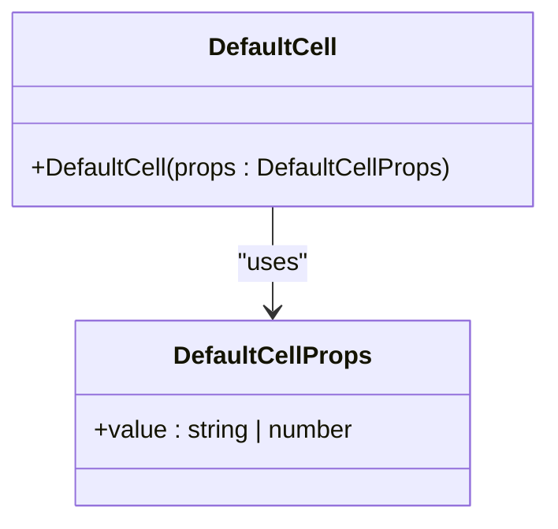
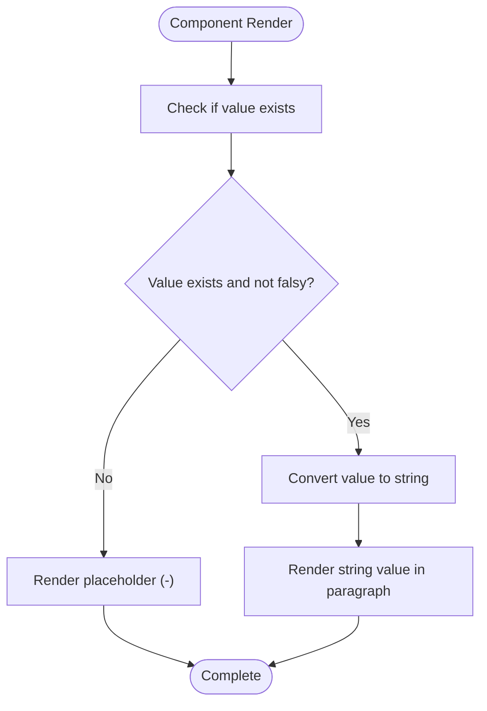
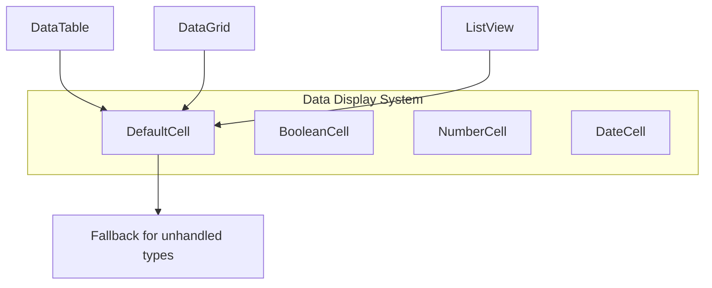
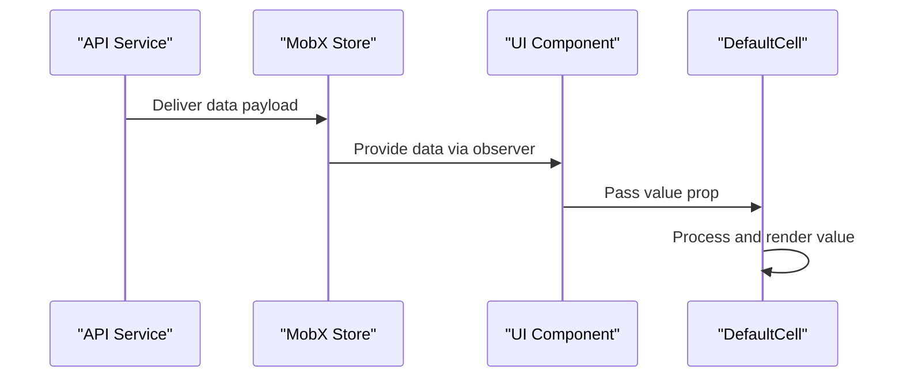
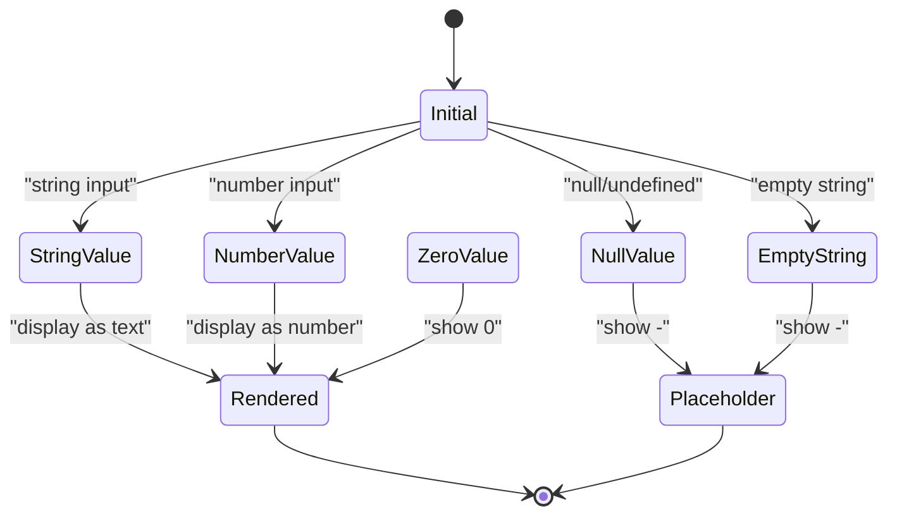

# DefaultCell

<cite>
**Referenced Files in This Document**   
- [DefaultCell.tsx](file://packages/ui/src/components/ui/data-display/cells/DefaultCell/DefaultCell.tsx)
- [DefaultCell.stories.tsx](file://packages/ui/src/components/ui/data-display/cells/DefaultCell/DefaultCell.stories.tsx)
- [components.json](file://components.json)
- [index.ts](file://packages/ui/src/components/ui/data-display/cells/index.ts)
</cite>

## Table of Contents
1. [Introduction](#introduction)
2. [Props Interface](#props-interface)
3. [Rendering Behavior](#rendering-behavior)
4. [Usage Scenarios](#usage-scenarios)
5. [Integration with Data Systems](#integration-with-data-systems)
6. [Data Type Handling](#data-type-handling)
7. [Accessibility and Theming](#accessibility-and-theming)
8. [Performance and Optimization](#performance-and-optimization)
9. [Customization and Styling](#customization-and-styling)
10. [Troubleshooting Guide](#troubleshooting-guide)

## Introduction
The DefaultCell component is a fundamental building block in the UI library designed to display generic data values in table cells and data grids. It serves as the fallback renderer for unhandled data types, providing consistent formatting and null/undefined value handling across the application. The component is part of a larger cell component system that includes specialized renderers for boolean, date, number, and other data types.

**Section sources**
- [DefaultCell.tsx](file://packages/ui/src/components/ui/data-display/cells/DefaultCell/DefaultCell.tsx#L1-L11)
- [DefaultCell.stories.tsx](file://packages/ui/src/components/ui/data-display/cells/DefaultCell/DefaultCell.stories.tsx#L1-L58)

## Props Interface
The DefaultCell component accepts a simple but effective props interface designed for maximum flexibility in data display scenarios.

**Diagram sources**
- [DefaultCell.tsx](file://packages/ui/src/components/ui/data-display/cells/DefaultCell/DefaultCell.tsx#L1-L3)

### Props Definition
The component's props interface includes:

- **value**: (string | number, required) - The primary data value to be displayed in the cell. This can be either a string or number type, covering the most common primitive data types used in data displays.

The component is intentionally minimal in its prop surface area, focusing on the core responsibility of rendering a value with appropriate fallback handling.

**Section sources**
- [DefaultCell.tsx](file://packages/ui/src/components/ui/data-display/cells/DefaultCell/DefaultCell.tsx#L1-L3)
- [components.json](file://components.json#L432-L441)

## Rendering Behavior
The DefaultCell implements a thoughtful rendering strategy that balances data integrity with user experience.

**Diagram sources**
- [DefaultCell.tsx](file://packages/ui/src/components/ui/data-display/cells/DefaultCell/DefaultCell.tsx#L5-L10)

### Fallback Rendering Patterns
The component implements a specific logic for handling empty or falsy values:

- Returns a placeholder "-" when the value is falsy (null, undefined, empty string, etc.)
- Makes an exception for the number 0, which is considered a valid value and will be displayed as "0"
- Converts all valid values to strings using JavaScript's String() function before rendering
- Wraps the rendered content in a paragraph element for consistent typography

This pattern ensures that empty states are clearly communicated to users while preserving meaningful zero values that might represent important data points.

**Section sources**
- [DefaultCell.tsx](file://packages/ui/src/components/ui/data-display/cells/DefaultCell/DefaultCell.tsx#L5-L10)
- [DefaultCell.stories.tsx](file://packages/ui/src/components/ui/data-display/cells/DefaultCell/DefaultCell.stories.tsx#L41-L45)

## Usage Scenarios
The DefaultCell component is designed for multiple common data display scenarios across the application.

### Primary Use Cases
- **Generic Data Display**: Rendering string and number values in table cells when no specialized cell component is needed
- **Fallback Renderer**: Serving as the default cell type in dynamic table configurations where the data type might vary
- **Simple Value Presentation**: Displaying basic text and numeric content without special formatting requirements
- **Placeholder Management**: Consistently handling null, undefined, and empty values across different data views

The component is particularly useful in admin interfaces, data grids, and reporting views where consistent data presentation is critical.

**Diagram sources**
- [index.ts](file://packages/ui/src/components/ui/data-display/cells/index.ts#L4)
- [DefaultCell.tsx](file://packages/ui/src/components/ui/data-display/cells/DefaultCell/DefaultCell.tsx#L1-L11)

**Section sources**
- [DefaultCell.stories.tsx](file://packages/ui/src/components/ui/data-display/cells/DefaultCell/DefaultCell.stories.tsx#L23-L58)

## Integration with Data Systems
The DefaultCell component integrates seamlessly with various data fetching and state management systems in the application.

### Data Flow Integration
The component is designed to work with:
- API response data from the shared-api-client package
- MobX state stores for reactive data binding
- React Query for server state management
- Form systems for displaying submitted values

Its simple props interface makes it compatible with any data source that can provide string or number values, making it a versatile choice for data presentation layers.

**Diagram sources**
- [DefaultCell.tsx](file://packages/ui/src/components/ui/data-display/cells/DefaultCell/DefaultCell.tsx#L5-L10)
- [components.json](file://components.json#L432-L441)

## Data Type Handling
The DefaultCell component handles various data types with specific logic for each scenario.

### Supported Data Types
- **Strings**: Direct rendering of string values, including long text that may wrap
- **Numbers**: Display of numeric values, including zero which is explicitly handled
- **Null/Undefined**: Conversion to placeholder "-" for better UX
- **Empty Strings**: Treated as empty values and rendered as placeholder

The component intentionally limits its type support to string and number primitives, maintaining a clear scope and encouraging the use of specialized cell components for other data types like booleans, dates, and complex objects.

**Diagram sources**
- [DefaultCell.tsx](file://packages/ui/src/components/ui/data-display/cells/DefaultCell/DefaultCell.tsx#L5-L10)

**Section sources**
- [DefaultCell.tsx](file://packages/ui/src/components/ui/data-display/cells/DefaultCell/DefaultCell.tsx#L1-L11)
- [DefaultCell.stories.tsx](file://packages/ui/src/components/ui/data-display/cells/DefaultCell/DefaultCell.stories.tsx#L47-L51)

## Accessibility and Theming
The DefaultCell component follows accessibility best practices and integrates with the application's theming system.

### Accessibility Features
- Uses semantic HTML with paragraph elements for proper document structure
- Inherits text styling from parent components for consistent hierarchy
- Provides clear visual indication of empty states
- Maintains proper contrast ratios through theme integration
- Supports screen readers with plain text content

### Theming Support
The component relies on the application's global styling system:
- Inherits typography styles from the global CSS
- Responds to theme context for color and font settings
- Maintains consistent spacing and padding with other cell components
- Adapts to dark/light mode through the global theme provider

While the component itself doesn't accept explicit theme props, it seamlessly integrates with the overall design system through CSS inheritance and global style rules.

**Section sources**
- [DefaultCell.tsx](file://packages/ui/src/components/ui/data-display/cells/DefaultCell/DefaultCell.tsx#L1-L11)
- [package.json](file://packages/ui/package.json#L46-L47)

## Performance and Optimization
The DefaultCell component is optimized for performance in data-intensive applications.

### Performance Characteristics
- Lightweight implementation with minimal dependencies
- Pure functional component with no internal state
- Efficient rendering logic with simple conditional checks
- Optimal for use in large tables with virtualized scrolling
- Prevents unnecessary re-renders through props stability

The component's simplicity contributes to excellent performance, making it suitable for rendering thousands of cells in data grids without impacting application responsiveness.

### Optimization Recommendations
- Use with React.memo for parent components when possible
- Combine with virtualized table libraries for large datasets
- Avoid unnecessary prop changes in parent components
- Leverage the component's simplicity in performance-critical views

The component's design prioritizes speed and efficiency, aligning with best practices for high-performance data displays.

**Section sources**
- [DefaultCell.tsx](file://packages/ui/src/components/ui/data-display/cells/DefaultCell/DefaultCell.tsx#L5-L10)

## Customization and Styling
While the DefaultCell component has a simple API, it supports various customization options through standard CSS mechanisms.

### Customization Options
- **CSS Classes**: Can be extended with custom classes through parent components
- **Theme Integration**: Adapts to global theme variables and CSS custom properties
- **Container Styling**: Relies on parent containers for layout, spacing, and alignment
- **Typography**: Inherits font styles, sizes, and weights from the design system

The component follows the principle of separation of concerns, focusing on content rendering while leaving layout and visual styling to parent components and CSS rules.

### Common Customization Patterns
- Wrapping in container components that apply specific styling
- Using CSS modules or utility classes to modify appearance
- Integrating with Tailwind CSS for responsive design
- Extending through component composition rather than prop proliferation

This approach maintains the component's simplicity while providing flexibility for design requirements.

**Section sources**
- [DefaultCell.tsx](file://packages/ui/src/components/ui/data-display/cells/DefaultCell/DefaultCell.tsx#L1-L11)

## Troubleshooting Guide
This section addresses common issues and solutions when using the DefaultCell component.

### Common Issues and Solutions
- **Issue**: Value not displaying when it should show "0"
  - **Cause**: The component's falsy check might be incorrectly handling zero values
  - **Solution**: Ensure the value is actually the number 0, not a string "0" or undefined

- **Issue**: Placeholder "-" showing for valid empty string that should be displayed
  - **Cause**: The component treats empty strings as falsy values
  - **Solution**: Pre-process data to convert empty strings to a display value if needed

- **Issue**: Long text causing layout overflow
  - **Cause**: The paragraph element doesn't have text overflow constraints
  - **Solution**: Wrap the component in a container with appropriate CSS for text overflow

- **Issue**: Inconsistent styling across different cell types
  - **Cause**: Different cell components may have slightly different styling
  - **Solution**: Apply consistent container styles or create a wrapper component

The component's simplicity means most issues can be resolved through proper data preparation or container-level styling rather than modifying the component itself.

**Section sources**
- [DefaultCell.tsx](file://packages/ui/src/components/ui/data-display/cells/DefaultCell/DefaultCell.tsx#L5-L10)
- [DefaultCell.stories.tsx](file://packages/ui/src/components/ui/data-display/cells/DefaultCell/DefaultCell.stories.tsx#L53-L57)