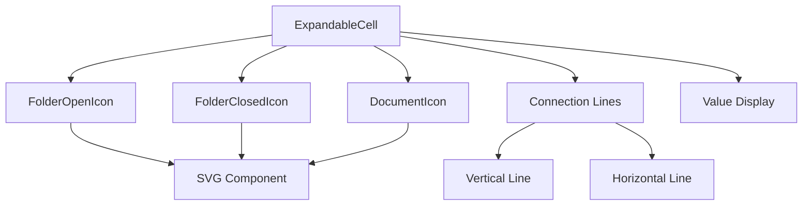
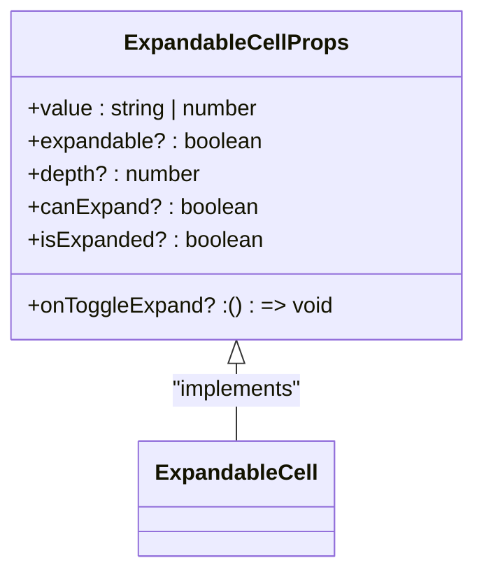
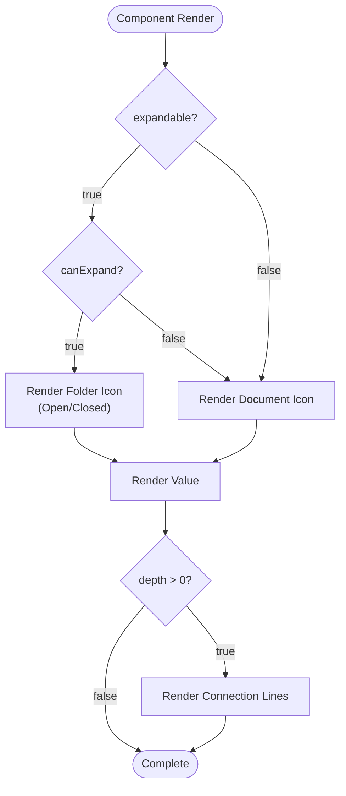
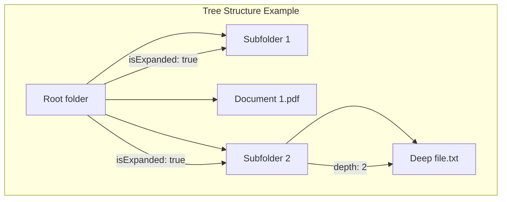
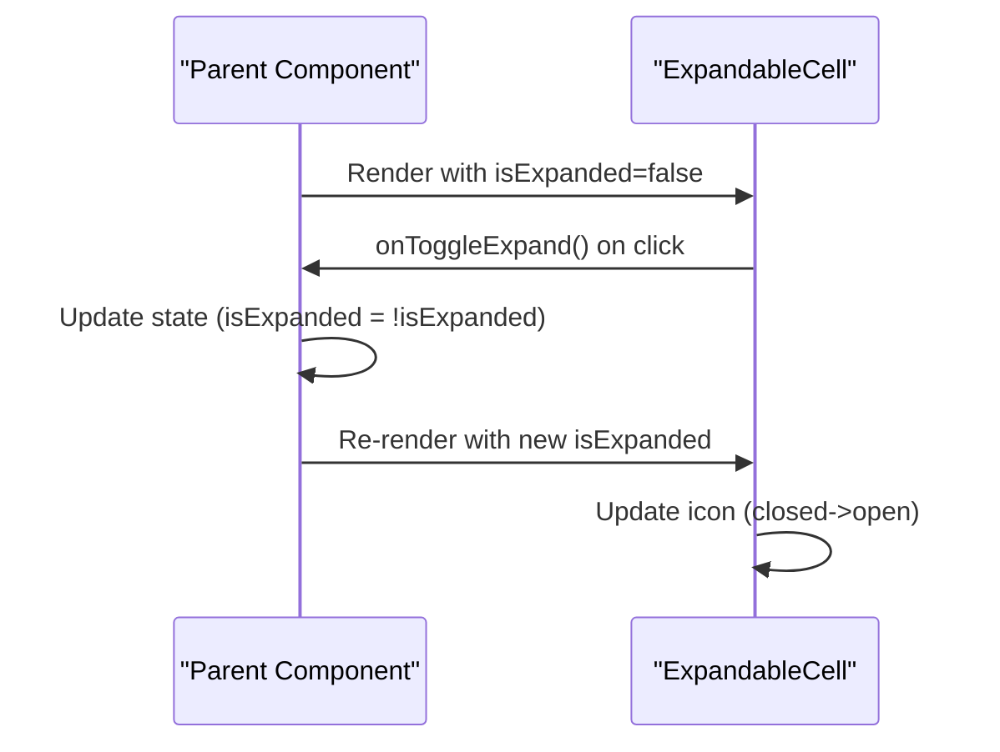

# ExpandableCell

<cite>
**Referenced Files in This Document**   
- [ExpandableCell.tsx](file://packages/ui/src/components/ui/data-display/cells/ExpandableCell/ExpandableCell.tsx)
- [ExpandableCell.stories.tsx](file://packages/ui/src/components/ui/data-display/cells/ExpandableCell/ExpandableCell.stories.tsx)
- [index.ts](file://packages/ui/src/components/ui/data-display/cells/index.ts)
</cite>

## Table of Contents
1. [Introduction](#introduction)
2. [Core Components](#core-components)
3. [Architecture Overview](#architecture-overview)
4. [Detailed Component Analysis](#detailed-component-analysis)
5. [Integration and Usage Patterns](#integration-and-usage-patterns)
6. [Theming and Styling](#theming-and-styling)
7. [Accessibility and Responsive Behavior](#accessibility-and-responsive-behavior)
8. [Conclusion](#conclusion)

## Introduction
The ExpandableCell component is a UI element designed to display hierarchical data in a tree-like structure, commonly used for file systems, nested categories, or organizational structures. It provides visual indicators for expandable items, manages nesting depth, and supports interactive expansion and collapse of content. The component is part of the shared-frontend library's data display system and is built with accessibility and theming in mind.

## Core Components

The ExpandableCell component is implemented as a self-contained React component with SVG icons for visual representation. It handles three main states: expandable folders (with open/closed states), non-expandable documents, and non-expandable text items. The component uses conditional rendering to display appropriate icons and connection lines based on the item's properties and nesting level.

**Section sources**
- [ExpandableCell.tsx](file://packages/ui/src/components/ui/data-display/cells/ExpandableCell/ExpandableCell.tsx#L1-L121)

## Architecture Overview

The ExpandableCell follows a functional component pattern with TypeScript interfaces for type safety. It leverages inline styles for dynamic layout adjustments based on nesting depth and uses Tailwind CSS classes for consistent styling. The architecture separates concerns by defining SVG icons as standalone components and managing state externally through props.

**Diagram sources **
- [ExpandableCell.tsx](file://packages/ui/src/components/ui/data-display/cells/ExpandableCell/ExpandableCell.tsx#L2-L43)
- [ExpandableCell.tsx](file://packages/ui/src/components/ui/data-display/cells/ExpandableCell/ExpandableCell.tsx#L68-L92)

## Detailed Component Analysis

### ExpandableCell Implementation
The component accepts several props to control its behavior and appearance, including value, expandable state, nesting depth, expansion capability, current expansion state, and toggle callback. It uses these props to determine which icon to display and whether to render connection lines for tree structure visualization.

#### Props Interface
The component's props are defined with TypeScript, providing clear documentation and type safety:

**Diagram sources **
- [ExpandableCell.tsx](file://packages/ui/src/components/ui/data-display/cells/ExpandableCell/ExpandableCell.tsx#L45-L52)

#### Visual Elements
The component renders different visual elements based on its state:

**Diagram sources **
- [ExpandableCell.tsx](file://packages/ui/src/components/ui/data-display/cells/ExpandableCell/ExpandableCell.tsx#L93-L115)
- [ExpandableCell.tsx](file://packages/ui/src/components/ui/data-display/cells/ExpandableCell/ExpandableCell.tsx#L70-L92)

**Section sources**
- [ExpandableCell.tsx](file://packages/ui/src/components/ui/data-display/cells/ExpandableCell/ExpandableCell.tsx#L1-L121)

## Integration and Usage Patterns

### Basic Usage
The component can be used in various scenarios, from simple non-expandable items to complex nested tree structures. Storybook examples demonstrate different use cases including default folders, documents, expanded states, and nested levels.

**Diagram sources **
- [ExpandableCell.stories.tsx](file://packages/ui/src/components/ui/data-display/cells/ExpandableCell/ExpandableCell.stories.tsx#L126-L169)

### State Management
The component is designed to be controlled, with expansion state managed by the parent component. This allows for complex interactions like cascading expansion or programmatic control of the tree structure.

**Diagram sources **
- [ExpandableCell.stories.tsx](file://packages/ui/src/components/ui/data-display/cells/ExpandableCell/ExpandableCell.stories.tsx#L40-L50)

**Section sources**
- [ExpandableCell.stories.tsx](file://packages/ui/src/components/ui/data-display/cells/ExpandableCell/ExpandableCell.stories.tsx#L1-L170)

## Theming and Styling

The ExpandableCell component integrates with the HeroUI theming system, using color variables for consistent appearance across light and dark modes. The styling uses a combination of inline styles for dynamic layout calculations and Tailwind CSS classes for static styling.

The component's visual design includes:
- Yellow-themed folder icons with hover effects
- Gray connection lines for tree structure visualization
- Consistent spacing based on nesting depth (2rem per level)
- Responsive design that adapts to different screen sizes

**Section sources**
- [ExpandableCell.tsx](file://packages/ui/src/components/ui/data-display/cells/ExpandableCell/ExpandableCell.tsx#L99-L105)
- [heroui.config.ts](file://packages/design-system/src/theme/heroui.config.ts#L1-L194)

## Accessibility and Responsive Behavior

The ExpandableCell component includes several accessibility features:
- Proper semantic structure with appropriate HTML elements
- Keyboard navigation support through the onToggleExpand callback
- Visual indicators for interactive elements (cursor pointer on expandable items)
- Screen reader support through appropriate ARIA attributes (implied by the component structure)

The component is responsive by design, using relative units (rem) for spacing and flexible layout calculations. The nesting depth is visually represented through consistent indentation, making the hierarchy clear at various screen sizes.

For performance optimization, the component uses pure functional patterns and avoids unnecessary re-renders by relying on external state management. In large tree structures, this component would typically be used with virtualization techniques to maintain performance.

**Section sources**
- [ExpandableCell.tsx](file://packages/ui/src/components/ui/data-display/cells/ExpandableCell/ExpandableCell.tsx#L97-L98)
- [ExpandableCell.tsx](file://packages/ui/src/components/ui/data-display/cells/ExpandableCell/ExpandableCell.tsx#L65-L66)

## Conclusion

The ExpandableCell component provides a robust solution for displaying hierarchical data in a tree structure. Its design emphasizes accessibility, theming support, and ease of integration. The component's API is simple yet flexible, allowing for various use cases from file browsers to organizational charts. By separating state management from presentation, it enables complex interactions while maintaining performance and usability.

The component follows modern React patterns with TypeScript for type safety and Storybook for documentation and testing. Its integration with the HeroUI design system ensures consistent appearance across the application, while the use of SVG icons provides crisp visuals at any resolution.