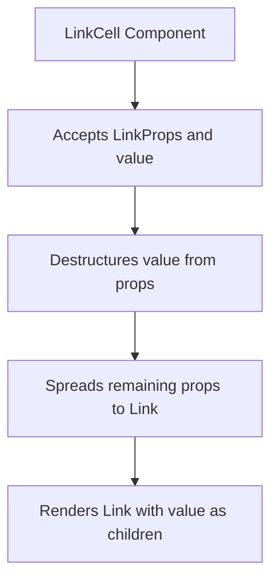
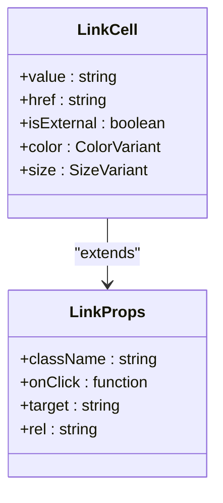
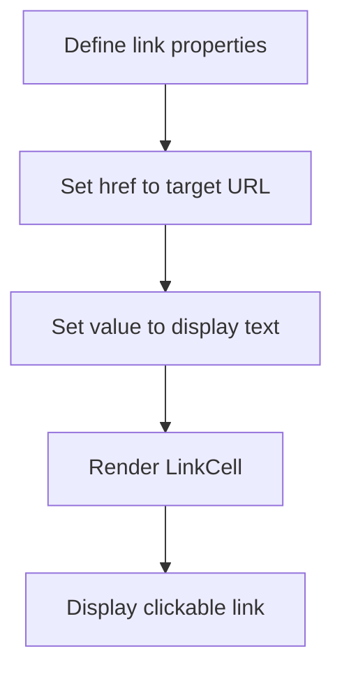
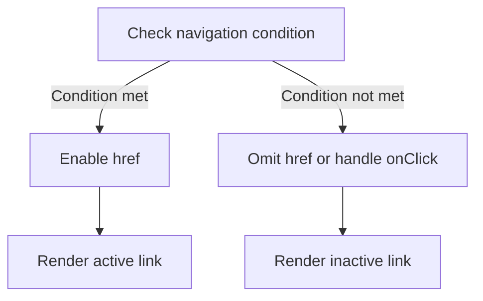
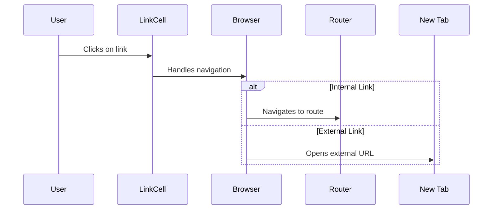
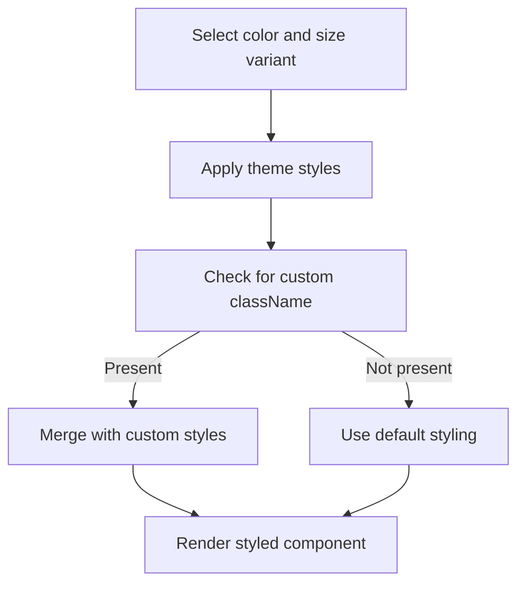
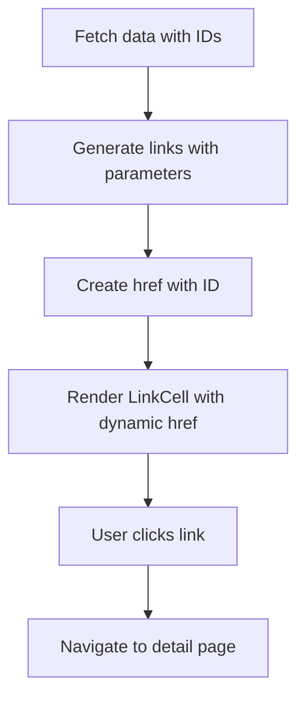
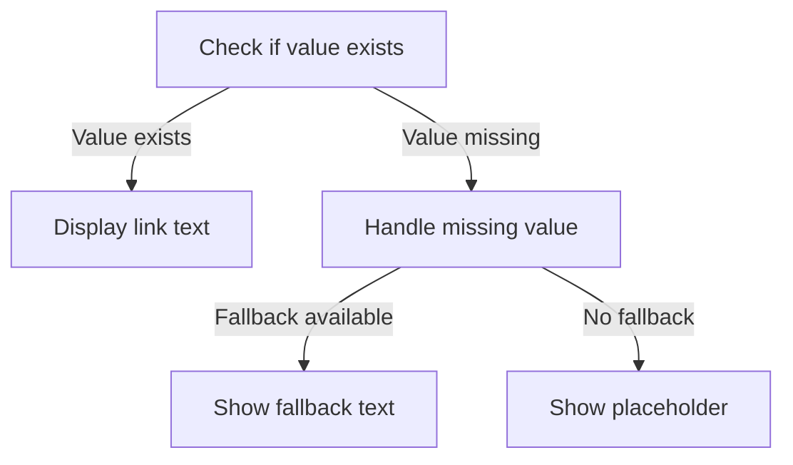

# LinkCell

<cite>
**Referenced Files in This Document**   
- [LinkCell.tsx](file://packages/ui/src/components/ui/data-display/cells/LinkCell/LinkCell.tsx)
- [LinkCell.stories.tsx](file://packages/ui/src/components/ui/data-display/cells/LinkCell/LinkCell.stories.tsx)
- [index.ts](file://packages/ui/src/components/ui/data-display/index.ts)
</cite>

## Table of Contents
1. [Introduction](#introduction)
2. [Component Overview](#component-overview)
3. [Props Interface](#props-interface)
4. [Usage Scenarios](#usage-scenarios)
5. [Navigation Patterns](#navigation-patterns)
6. [Styling and Variants](#styling-and-variants)
7. [Accessibility and Security](#accessibility-and-security)
8. [Integration with Routing Libraries](#integration-with-routing-libraries)
9. [Error Handling and Edge Cases](#error-handling-and-edge-cases)
10. [Performance Considerations](#performance-considerations)
11. [Troubleshooting Guide](#troubleshooting-guide)

## Introduction

The LinkCell component is a specialized UI element designed for displaying clickable links within data display contexts. It serves as a wrapper around the base Link component from the @heroui/react library, providing a consistent interface for rendering hyperlinks in table cells, lists, and other data presentation components. This documentation provides comprehensive details about the implementation, usage patterns, and integration considerations for the LinkCell component.

**Section sources**
- [LinkCell.tsx](file://packages/ui/src/components/ui/data-display/cells/LinkCell/LinkCell.tsx)

## Component Overview

The LinkCell component is a lightweight wrapper that extends the functionality of the base Link component from @heroui/react. It accepts all standard LinkProps while adding a dedicated `value` prop for the link text content. The component's primary purpose is to provide a consistent way to display clickable links within data display contexts such as tables, lists, and grids.

The implementation follows a simple pattern of destructuring the `value` prop from the rest of the link properties and rendering the base Link component with the remaining props. This design allows for maximum flexibility while maintaining a clean API for common use cases.

**Diagram sources**
- [LinkCell.tsx](file://packages/ui/src/components/ui/data-display/cells/LinkCell/LinkCell.tsx)

**Section sources**
- [LinkCell.tsx](file://packages/ui/src/components/ui/data-display/cells/LinkCell/LinkCell.tsx)

## Props Interface

The LinkCell component extends the LinkProps interface from @heroui/react and adds a dedicated `value` prop for the link text. This section details all available props and their usage.

### Core Props

- **value**: string - The text content to display as the link label. This is the primary content of the link and will be rendered as the visible text.
- **href**: string - The URL or route path that the link points to. This can be an absolute URL for external links or a relative path for internal navigation.
- **isExternal**: boolean - Indicates whether the link points to an external resource. When true, the component should handle the link appropriately (e.g., opening in a new tab).
- **color**: "foreground" | "primary" | "secondary" | "success" | "warning" | "danger" - The color theme for the link, allowing for visual differentiation based on context or importance.
- **size**: "sm" | "md" | "lg" - The size variant of the link, controlling the font size and spacing.

### Inherited Props

The component inherits all standard LinkProps from @heroui/react, including but not limited to:
- **className**: Additional CSS classes for custom styling
- **onClick**: Event handler for click interactions
- **target**: Specifies where to open the linked document
- **rel**: Relationship between the current document and the linked document

**Diagram sources**
- [LinkCell.tsx](file://packages/ui/src/components/ui/data-display/cells/LinkCell/LinkCell.tsx)
- [LinkCell.stories.tsx](file://packages/ui/src/components/ui/data-display/cells/LinkCell/LinkCell.stories.tsx)

**Section sources**
- [LinkCell.tsx](file://packages/ui/src/components/ui/data-display/cells/LinkCell/LinkCell.tsx)
- [LinkCell.stories.tsx](file://packages/ui/src/components/ui/data-display/cells/LinkCell/LinkCell.stories.tsx)

## Usage Scenarios

The LinkCell component is designed for various usage scenarios in data display contexts. This section outlines common patterns and examples.

### Basic Usage

The most common usage involves displaying a simple clickable link with custom text:

### Internal vs External Links

The component supports both internal and external navigation patterns:

- **Internal Links**: Use relative paths (e.g., "/dashboard") for navigation within the application
- **External Links**: Use absolute URLs (e.g., "https://example.com") for external resources

The `isExternal` prop helps distinguish between these two types, allowing for appropriate handling such as opening external links in new tabs.

### Conditional Navigation

The component can be used with conditional logic to enable or disable navigation based on application state:

**Section sources**
- [LinkCell.stories.tsx](file://packages/ui/src/components/ui/data-display/cells/LinkCell/LinkCell.stories.tsx)

## Navigation Patterns

The LinkCell component supports various navigation patterns through its integration with the underlying Link component.

### Internal Routing

For internal application navigation, the component uses relative paths that are handled by the application's routing system. When the href prop starts with a forward slash but does not include a protocol, it's treated as an internal route.

### External Link Handling

External links are identified by their absolute URL format (including protocol). The component should handle these links with appropriate security measures such as setting rel="noopener noreferrer" when opening in new tabs.

### Target Options

The component supports different target options through the inherited target prop:
- **_self**: Opens in the same tab (default)
- **_blank**: Opens in a new tab or window
- **_parent**: Opens in the parent frame
- **_top**: Opens in the full body of the window

**Diagram sources**
- [LinkCell.tsx](file://packages/ui/src/components/ui/data-display/cells/LinkCell/LinkCell.tsx)

**Section sources**
- [LinkCell.tsx](file://packages/ui/src/components/ui/data-display/cells/LinkCell/LinkCell.tsx)
- [LinkCell.stories.tsx](file://packages/ui/src/components/ui/data-display/cells/LinkCell/LinkCell.stories.tsx)

## Styling and Variants

The LinkCell component provides several styling options to accommodate different design requirements.

### Color Variants

The component supports multiple color variants to convey different meanings or priorities:
- **foreground**: Default text color
- **primary**: Primary brand color
- **secondary**: Secondary brand color
- **success**: Indicates positive or successful actions
- **warning**: Indicates caution or warnings
- **danger**: Indicates destructive or dangerous actions

### Size Variants

Three size options are available:
- **sm**: Small size for dense layouts
- **md**: Medium size (default)
- **lg**: Large size for emphasis

### Custom Styling

Additional styling can be applied through the className prop, allowing for custom CSS classes to be added to the component.

**Diagram sources**
- [LinkCell.stories.tsx](file://packages/ui/src/components/ui/data-display/cells/LinkCell/LinkCell.stories.tsx)

**Section sources**
- [LinkCell.stories.tsx](file://packages/ui/src/components/ui/data-display/cells/LinkCell/LinkCell.stories.tsx)

## Accessibility and Security

The LinkCell component incorporates several accessibility and security features.

### Accessibility Features

- **Keyboard Navigation**: The component is fully navigable using keyboard controls
- **Screen Reader Support**: Proper semantic HTML structure for assistive technologies
- **Focus Management**: Visible focus states for keyboard users
- **ARIA Attributes**: Appropriate ARIA roles and properties when needed

### Security Considerations

- **rel="noopener"**: Automatically applied when opening external links in new tabs to prevent tabnabbing attacks
- **rel="noreferrer"**: Prevents the new page from accessing the window.opener property
- **Input Validation**: Ensures href values are properly formatted and safe

### Best Practices

- Always provide meaningful link text rather than generic "click here" text
- Use appropriate color contrast for readability
- Ensure links are easily distinguishable from regular text
- Provide clear visual feedback on hover and focus states

**Section sources**
- [LinkCell.tsx](file://packages/ui/src/components/ui/data-display/cells/LinkCell/LinkCell.tsx)

## Integration with Routing Libraries

The LinkCell component integrates with the application's routing system through the underlying @heroui/react Link component.

### Router Compatibility

The component works with various routing solutions, including:
- Client-side routing libraries
- Server-side rendering frameworks
- Hash-based routing

### Dynamic Link Generation

The component supports dynamic link generation through props passed from parent components or derived from application state.

### Route Parameters

When used with parameterized routes, the href prop can include dynamic segments that are resolved at runtime.

**Section sources**
- [LinkCell.tsx](file://packages/ui/src/components/ui/data-display/cells/LinkCell/LinkCell.tsx)

## Error Handling and Edge Cases

The component handles various edge cases and potential errors gracefully.

### Null/Undefined Values

- When `value` is null or undefined, the component should render nothing or a placeholder
- When `href` is null or undefined, the link should be non-interactive
- Proper type checking prevents runtime errors

### Empty States

The component should handle empty or invalid data gracefully, potentially rendering a placeholder or disabled state.

### Error States

In case of errors (e.g., failed data fetching), the component should display appropriate fallback content.

**Section sources**
- [LinkCell.tsx](file://packages/ui/src/components/ui/data-display/cells/LinkCell/LinkCell.tsx)

## Performance Considerations

The LinkCell component is optimized for performance in data-intensive applications.

### Rendering Optimization

- Lightweight implementation with minimal overhead
- Efficient prop handling and rendering
- No unnecessary re-renders

### Memory Usage

- Small memory footprint
- No persistent state storage
- Clean unmounting behavior

### Best Practices for Large Data Sets

- Use virtualization when displaying many LinkCell components
- Implement memoization for frequently used link patterns
- Batch updates when multiple links change simultaneously

**Section sources**
- [LinkCell.tsx](file://packages/ui/src/components/ui/data-display/cells/LinkCell/LinkCell.tsx)

## Troubleshooting Guide

This section addresses common issues and their solutions when using the LinkCell component.

### Common Issues

- **Links not working**: Check that href is properly set and not null/undefined
- **Styling issues**: Verify that the correct color and size variants are applied
- **Accessibility problems**: Ensure proper semantic structure and ARIA attributes
- **Security warnings**: Confirm that rel attributes are properly set for external links

### Debugging Tips

- Use browser developer tools to inspect the rendered HTML
- Check console for any warnings or errors
- Verify that all required props are provided
- Test keyboard navigation and screen reader compatibility

### Known Limitations

- The component relies on the underlying @heroui/react Link implementation
- Some advanced routing features may require additional configuration
- Custom styling may conflict with theme styles

**Section sources**
- [LinkCell.tsx](file://packages/ui/src/components/ui/data-display/cells/LinkCell/LinkCell.tsx)
- [LinkCell.stories.tsx](file://packages/ui/src/components/ui/data-display/cells/LinkCell/LinkCell.stories.tsx)