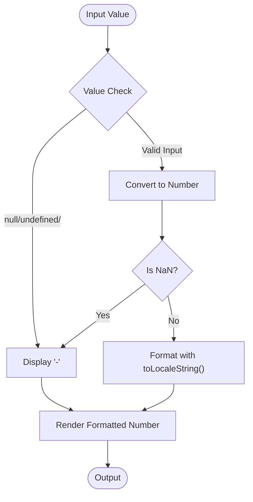
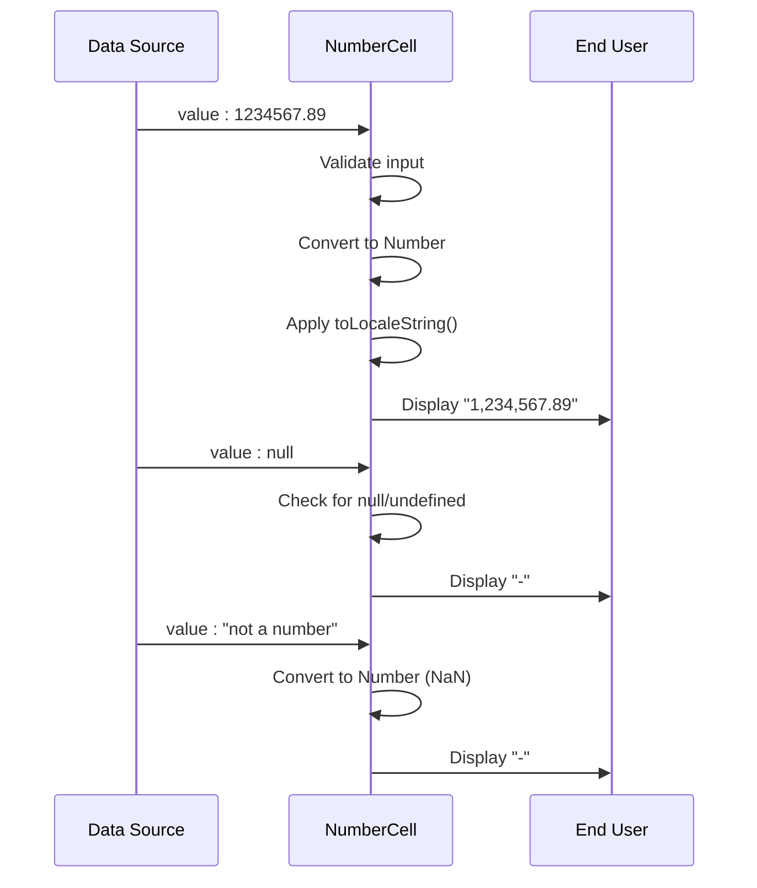

# NumberCell

<cite>
**Referenced Files in This Document**   
- [NumberCell.tsx](file://packages/ui/src/components/ui/data-display/cells/NumberCell/NumberCell.tsx)
- [NumberCell.stories.tsx](file://packages/ui/src/components/ui/data-display/cells/NumberCell/NumberCell.stories.tsx)
- [index.ts](file://packages/ui/src/components/ui/data-display/cells/index.ts)
</cite>

## Table of Contents
1. [Introduction](#introduction)
2. [Core Implementation](#core-implementation)
3. [Props Interface](#props-interface)
4. [Number Formatting](#number-formatting)
5. [Usage Scenarios](#usage-scenarios)
6. [Error Handling](#error-handling)
7. [Integration and Theming](#integration-and-theming)
8. [Performance Considerations](#performance-considerations)
9. [Accessibility](#accessibility)

## Introduction
The NumberCell component is a specialized UI element designed for displaying numeric values in tabular or data grid contexts. It provides consistent formatting of numbers with locale-specific thousand separators while handling edge cases such as null, undefined, and invalid values. The component is part of the shared UI library and is optimized for use in data-intensive applications where reliable number presentation is critical.

## Core Implementation

The NumberCell component implements a robust approach to number formatting and validation. It accepts various input types and ensures consistent output formatting using JavaScript's built-in `toLocaleString()` method, which automatically applies appropriate thousand separators based on the user's locale.



**Diagram sources**
- [NumberCell.tsx](file://packages/ui/src/components/ui/data-display/cells/NumberCell/NumberCell.tsx#L1-L16)

**Section sources**
- [NumberCell.tsx](file://packages/ui/src/components/ui/data-display/cells/NumberCell/NumberCell.tsx#L1-L16)

## Props Interface

The NumberCell component accepts a single prop that supports multiple data types, providing flexibility in data handling:

```typescript
interface NumberCellProps {
    value: number | string | null | undefined;
}
```

This flexible typing allows the component to handle data from various sources, including API responses that might return numbers as strings or null values for missing data.

**Section sources**
- [NumberCell.tsx](file://packages/ui/src/components/ui/data-display/cells/NumberCell/NumberCell.tsx#L1-L3)

## Number Formatting

The component leverages the browser's `toLocaleString()` method to format numbers with appropriate thousand separators based on the user's locale settings. This ensures that numbers are displayed in a culturally appropriate format without requiring additional configuration.

For example:
- 1234 becomes "1,234" in US English locale
- 1234567.89 becomes "1,234,567.89" in US English locale
- Negative numbers are properly formatted with the minus sign

The formatting automatically adapts to the user's browser locale settings, providing internationalization support out of the box.

**Section sources**
- [NumberCell.tsx](file://packages/ui/src/components/ui/data-display/cells/NumberCell/NumberCell.tsx#L15)

## Usage Scenarios

The NumberCell component is designed for various numeric display scenarios:

### Integer Display
For whole numbers, the component provides clean formatting with thousand separators for improved readability of large values.

### Decimal Values
Decimal numbers are preserved in their original precision and formatted with appropriate separators.

### Large Numbers
Numbers with many digits are automatically formatted with thousand separators to enhance readability.

### String Numbers
Numeric values received as strings (common in API responses) are properly converted and formatted.



**Diagram sources**
- [NumberCell.stories.tsx](file://packages/ui/src/components/ui/data-display/cells/NumberCell/NumberCell.stories.tsx#L23-L81)
- [NumberCell.tsx](file://packages/ui/src/components/ui/data-display/cells/NumberCell/NumberCell.tsx#L1-L16)

**Section sources**
- [NumberCell.stories.tsx](file://packages/ui/src/components/ui/data-display/cells/NumberCell/NumberCell.stories.tsx#L23-L81)

## Error Handling

The component implements comprehensive error handling for various edge cases:

- **Null/Undefined Values**: Returns a hyphen ("-") to indicate missing data
- **Empty Strings**: Treated as missing data and displays a hyphen
- **Invalid Numbers**: Strings that cannot be converted to valid numbers display a hyphen
- **NaN Values**: Explicit NaN values are handled consistently with other invalid inputs

This consistent approach to error handling ensures that the UI remains clean and predictable even when data quality issues occur.

**Section sources**
- [NumberCell.tsx](file://packages/ui/src/components/ui/data-display/cells/NumberCell/NumberCell.tsx#L6-L13)

## Integration and Theming

The NumberCell component is designed for seamless integration within the larger UI component ecosystem. It's exported through the main cells index, making it easily accessible to consuming applications.

The component follows the design system's typography and spacing guidelines, ensuring visual consistency with other UI elements. While it doesn't accept specific styling props, it inherits styling from the global theme and CSS variables.

**Section sources**
- [index.ts](file://packages/ui/src/components/ui/data-display/cells/index.ts#L7)

## Performance Considerations

The NumberCell component is optimized for performance in data grid scenarios:

- **Minimal Re-renders**: The component is a simple functional component with no internal state
- **Efficient Number Conversion**: Uses native JavaScript number conversion methods
- **Locale-Aware Formatting**: Leverages built-in browser methods for efficient formatting
- **Lightweight**: No external dependencies beyond React

For applications displaying large datasets, the component's simplicity ensures smooth scrolling and quick rendering.

**Section sources**
- [NumberCell.tsx](file://packages/ui/src/components/ui/data-display/cells/NumberCell/NumberCell.tsx#L1-L16)

## Accessibility

The NumberCell component supports accessibility through:

- **Semantic HTML**: Uses appropriate HTML elements for content
- **Screen Reader Compatibility**: Formatted numbers are properly announced by screen readers
- **Consistent Presentation**: Predictable formatting helps users with cognitive disabilities
- **Keyboard Navigation**: Works seamlessly within tabular interfaces

The component inherits accessibility features from the surrounding table or grid component, ensuring a cohesive experience for assistive technology users.

**Section sources**
- [NumberCell.tsx](file://packages/ui/src/components/ui/data-display/cells/NumberCell/NumberCell.tsx#L1-L16)