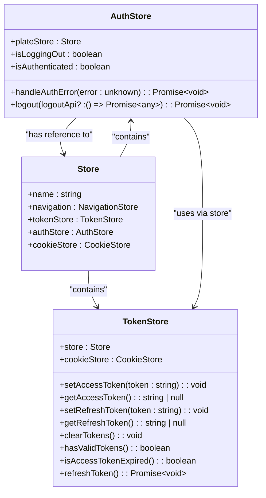
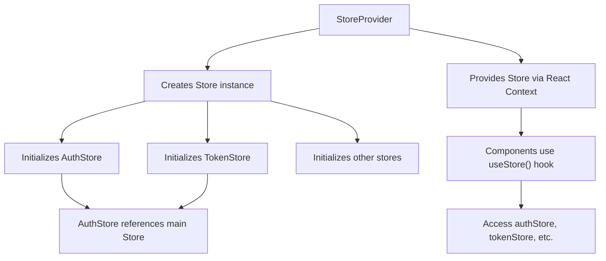
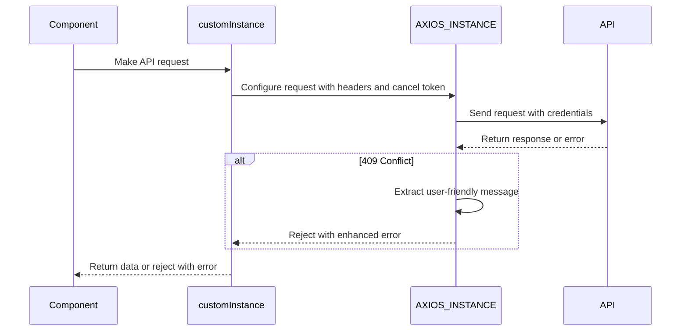
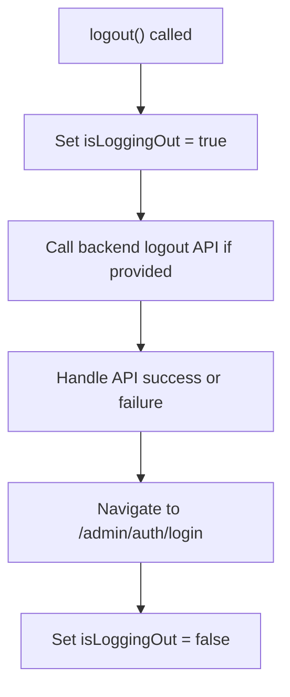

# Authentication State Management

<cite>
**Referenced Files in This Document**   
- [authStore.ts](file://packages/store/src/stores/authStore.ts)
- [Store.ts](file://packages/store/src/stores/Store.ts)
- [tokenStore.ts](file://packages/store/src/stores/tokenStore.ts)
- [StoreProvider.tsx](file://packages/store/src/providers/StoreProvider.tsx)
- [useStore.ts](file://packages/store/src/stores/useStore.ts)
- [customAxios.ts](file://packages/api/src/libs/customAxios.ts)
</cite>

## Table of Contents
1. [Introduction](#introduction)
2. [Core Components](#core-components)
3. [Authentication State Management with MobX](#authentication-state-management-with-mobx)
4. [AuthProvider and Context Provision](#authprovider-and-context-provision)
5. [Request Interception and Authorization](#request-interception-and-authorization)
6. [Token Validation and Expiration Handling](#token-validation-and-expiration-handling)
7. [Logout Process and Cleanup](#logout-process-and-cleanup)
8. [Memory Management and Event Handling](#memory-management-and-event-handling)
9. [Conclusion](#conclusion)

## Introduction
This document provides a comprehensive overview of the authentication state management system implemented across the frontend applications in the project. The system leverages MobX for reactive state management, uses a centralized store architecture, and integrates with Axios for automatic header injection and error handling. It ensures consistent authentication state across components and handles session expiration, token refresh, and user logout in a robust manner.

## Core Components

The authentication system is composed of several key components that work together to manage user sessions and secure API communication. These components are organized within the shared packages to ensure reusability across different frontend applications.

**Section sources**
- [Store.ts](file://packages/store/src/stores/Store.ts#L1-L25)
- [authStore.ts](file://packages/store/src/stores/authStore.ts#L1-L84)
- [tokenStore.ts](file://packages/store/src/stores/tokenStore.ts#L1-L67)

## Authentication State Management with MobX

The authentication state is managed through the `AuthStore` class, which is part of a larger MobX store hierarchy. This store maintains the authentication status and provides methods to handle authentication errors and user logout.

The `AuthStore` is initialized with a reference to the main `Store` instance, allowing it to access other stores such as `tokenStore` for token management. The store uses `makeAutoObservable` from MobX to enable reactivity, ensuring that components that observe the authentication state are automatically updated when changes occur.

A key property of the `AuthStore` is `isAuthenticated`, which returns a boolean indicating whether the user is currently authenticated. This is determined by checking whether the access token has expired via the `tokenStore`.

**Diagram sources**
- [authStore.ts](file://packages/store/src/stores/authStore.ts#L8-L84)
- [Store.ts](file://packages/store/src/stores/Store.ts#L8-L25)
- [tokenStore.ts](file://packages/store/src/stores/tokenStore.ts#L4-L67)

**Section sources**
- [authStore.ts](file://packages/store/src/stores/authStore.ts#L8-L84)
- [tokenStore.ts](file://packages/store/src/stores/tokenStore.ts#L4-L67)

## AuthProvider and Context Provision

The authentication context is provided to all components through the `StoreProvider` component, which uses React's Context API to make the MobX store available throughout the component tree.

The `StoreProvider` initializes a singleton instance of the `Store` class and provides it via `StoreContext`. This allows any component in the application to access the authentication state and other store properties through the `useStore` hook.

**Diagram sources**
- [StoreProvider.tsx](file://packages/store/src/providers/StoreProvider.tsx#L1-L16)
- [useStore.ts](file://packages/store/src/stores/useStore.ts#L1-L13)
- [Store.ts](file://packages/store/src/stores/Store.ts#L1-L25)

**Section sources**
- [StoreProvider.tsx](file://packages/store/src/providers/StoreProvider.tsx#L1-L16)
- [useStore.ts](file://packages/store/src/stores/useStore.ts#L1-L13)

## Request Interception and Authorization

API requests are managed through a custom Axios instance that includes interceptors for handling authentication. The `customAxios` module creates an Axios instance with default configuration including credentials support and request timeout.

Although the current implementation shows commented-out interceptors in `AuthStore`, the primary response interceptor in `customAxios.ts` handles 409 conflict errors by extracting user-friendly messages from the response data. This pattern could be extended to handle 401 unauthorized responses by triggering token refresh or redirecting to the login page.

The `customInstance` function serves as a wrapper around the Axios instance, allowing for additional configuration and cancellation support. This function is likely used by generated API clients to make authenticated requests.

**Diagram sources**
- [customAxios.ts](file://packages/api/src/libs/customAxios.ts#L1-L56)

**Section sources**
- [customAxios.ts](file://packages/api/src/libs/customAxios.ts#L1-L56)

## Token Validation and Expiration Handling

Token management is handled by the `TokenStore` class, which stores tokens in HTTP-only cookies for security. The store provides methods to set and retrieve both access and refresh tokens, as well as to clear them during logout.

The `isAccessTokenExpired` method parses the JWT access token to check its expiration claim (`exp`). It decodes the token payload and compares the expiration timestamp with the current time. If the token is missing, malformed, or expired, the method returns true.

Currently, the `refreshToken` method is defined but not implemented. In a complete implementation, this method would use the refresh token to obtain a new access token from the authentication server without requiring user interaction.

**Section sources**
- [tokenStore.ts](file://packages/store/src/stores/tokenStore.ts#L4-L67)

## Logout Process and Cleanup

The logout process is managed by the `logout` method in `AuthStore`. This method first sets a flag to indicate that logout is in progress, then optionally calls a backend logout API to invalidate the server-side session.

After calling the logout API, the method redirects the user to the login page using `navigateTo`. The current implementation includes TODO comments indicating that local and session storage should be cleared, though these functions are not yet implemented.

The logout process is designed to be resilient: even if the API call fails, the user is still redirected to the login page to ensure they cannot continue accessing protected resources.

**Diagram sources**
- [authStore.ts](file://packages/store/src/stores/authStore.ts#L54-L82)

**Section sources**
- [authStore.ts](file://packages/store/src/stores/authStore.ts#L54-L82)

## Memory Management and Event Handling

The current implementation does not explicitly show event listeners for cross-tab synchronization, but the use of cookies for token storage suggests that authentication state is shared across browser tabs. When a user logs out in one tab, other tabs would detect the missing tokens on their next API request and redirect to the login page.

The MobX stores are designed to be long-lived for the duration of the application session. The `StoreProvider` creates a single instance that persists for the lifetime of the React application. This approach minimizes memory overhead and ensures consistent state across components.

No explicit cleanup of event listeners is shown in the provided code, but the use of MobX's `makeAutoObservable` ensures that computed properties and reactions are properly managed and disposed of when the store is garbage collected.

## Conclusion

The authentication state management system provides a robust foundation for handling user sessions in the frontend applications. By leveraging MobX for reactive state management and Axios for API communication, the system ensures that authentication state is consistently maintained and automatically applied to API requests.

Key strengths of the implementation include the centralized store architecture, the use of secure cookie storage for tokens, and the reactive `isAuthenticated` property that enables components to respond to authentication state changes. The system is designed to handle session expiration and user logout gracefully, though some functionality like token refresh and storage cleanup remains to be fully implemented.

Future improvements could include implementing the token refresh functionality, adding cross-tab synchronization via localStorage events, and completing the storage cleanup functions to ensure all client-side data is properly cleared during logout.