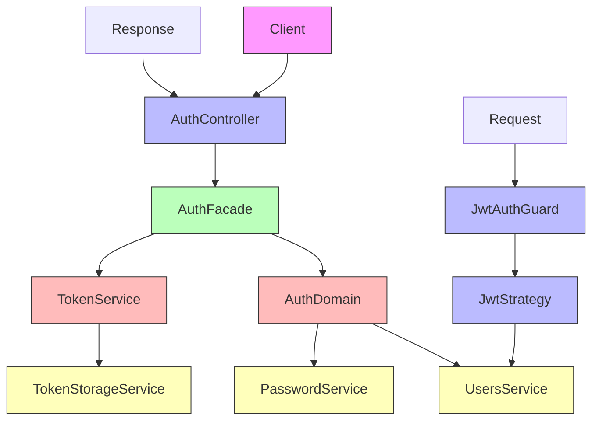
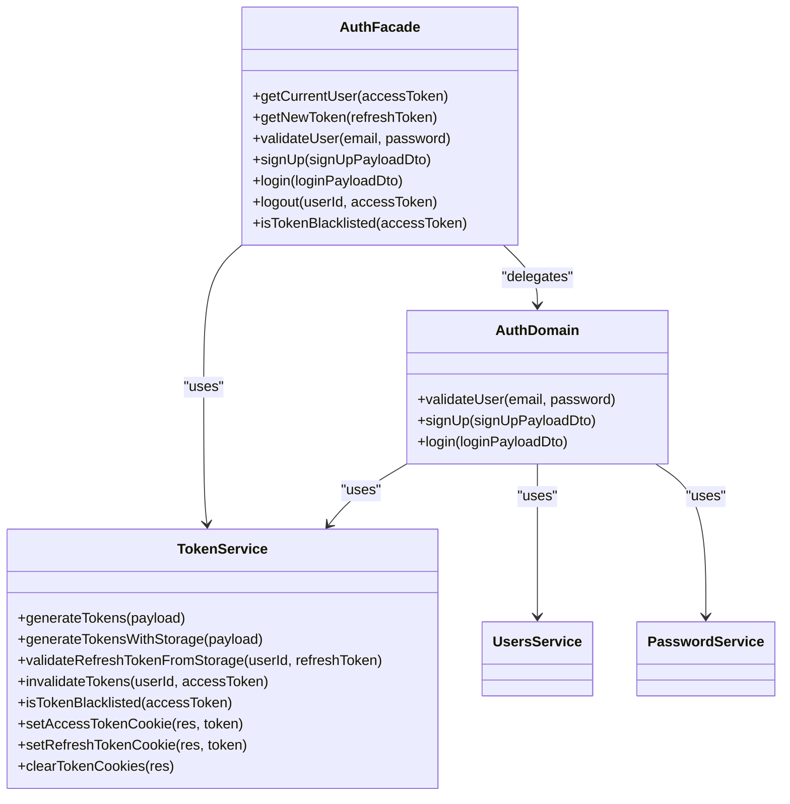
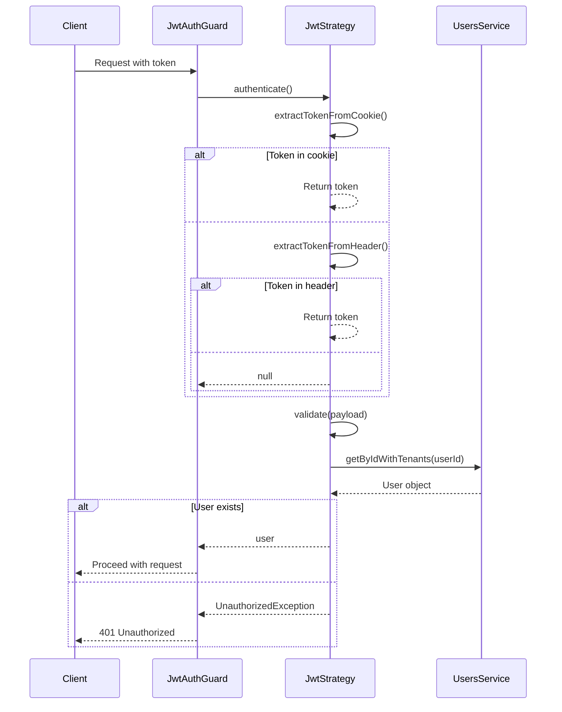

# Server Authentication Mechanisms

<cite>
**Referenced Files in This Document**   
- [auth.controller.ts](file://apps/server/src/shared/controller/domains/auth.controller.ts)
- [auth.facade.ts](file://apps/server/src/shared/service/facade/auth.facade.ts)
- [auth.domain.ts](file://apps/server/src/shared/service/domain/auth.domain.ts)
- [jwt.strategy.ts](file://apps/server/src/shared/strategy/jwt.strategy.ts)
- [jwt.auth-guard.ts](file://apps/server/src/shared/guard/jwt.auth-guard.ts)
- [token.service.ts](file://apps/server/src/shared/service/utils/token.service.ts)
- [auth.module.ts](file://apps/server/src/module/auth.module.ts)
</cite>

## Table of Contents
1. [Introduction](#introduction)
2. [Authentication Architecture Overview](#authentication-architecture-overview)
3. [Auth Controller Endpoints](#auth-controller-endpoints)
4. [AuthService Implementation](#authservice-implementation)
5. [JWT Strategy for Token Verification](#jwt-strategy-for-token-verification)
6. [JWT Auth Guard for Route Protection](#jwt-auth-guard-for-route-protection)
7. [Password Hashing and Security Measures](#password-hashing-and-security-measures)
8. [Token Management and Security Policies](#token-management-and-security-policies)
9. [Public Route Decorator Usage](#public-route-decorator-usage)
10. [Conclusion](#conclusion)

## Introduction
This document provides comprehensive documentation for the server-side authentication mechanisms implemented in the NestJS backend. The authentication system is designed with a layered architecture that separates concerns between controllers, facades, domain logic, and security strategies. The system implements JWT-based authentication with refresh token rotation, secure cookie management, and protection against common security threats. The documentation covers all aspects of the authentication flow, from user login to token validation and route protection.

**Section sources**
- [auth.controller.ts](file://apps/server/src/shared/controller/domains/auth.controller.ts#L1-L266)

## Authentication Architecture Overview



**Diagram sources**
- [auth.controller.ts](file://apps/server/src/shared/controller/domains/auth.controller.ts#L52-L266)
- [auth.facade.ts](file://apps/server/src/shared/service/facade/auth.facade.ts#L13-L101)
- [auth.domain.ts](file://apps/server/src/shared/service/domain/auth.domain.ts#L18-L143)
- [jwt.strategy.ts](file://apps/server/src/shared/strategy/jwt.strategy.ts#L16-L118)
- [jwt.auth-guard.ts](file://apps/server/src/shared/guard/jwt.auth-guard.ts#L13-L88)

**Section sources**
- [auth.module.ts](file://apps/server/src/module/auth.module.ts#L1-L35)

## Auth Controller Endpoints

The AuthController exposes several endpoints for authentication operations, each with specific request/response schemas and error conditions. The controller uses NestJS decorators for API documentation, error handling, and response formatting.

### Login Endpoint
The login endpoint authenticates users with their email and password credentials. It accepts a LoginPayloadDto containing the user's credentials and returns a TokenDto with the access token, refresh token, and user information.

**Request Schema:**
- POST /login
- Body: LoginPayloadDto (email, password)
- Response: TokenDto with HTTP 200 status

**Error Conditions:**
- 400: Invalid email or password format
- 401: Invalid credentials (email or password mismatch)
- 500: Internal server error

### Token Refresh Endpoint
The token refresh endpoint allows clients to obtain new access and refresh tokens using their current refresh token. The refresh token is extracted from the HTTP-only cookie.

**Request Schema:**
- POST /token/refresh
- Cookie: refreshToken
- Response: TokenDto with HTTP 200 status

**Error Conditions:**
- 401: Refresh token not found or expired
- 500: Internal server error

### Logout Endpoint
The logout endpoint invalidates the user's session by removing tokens from storage and clearing authentication cookies.

**Request Schema:**
- POST /logout
- Response: Boolean true with HTTP 200 status

**Behavior:**
- Clears accessToken, refreshToken, tenantId, and workspaceId cookies
- Invalidates tokens in Redis storage
- Returns success regardless of prior authentication state

### Sign Up Endpoint
The sign-up endpoint creates a new user account with the provided information and returns authentication tokens.

**Request Schema:**
- POST /sign-up
- Body: SignUpPayloadDto (name, nickname, email, password, phone, spaceId)
- Response: TokenDto with HTTP 201 status

**Error Conditions:**
- 400: Invalid sign-up format
- 409: Email already exists
- 500: Internal server error

**Section sources**
- [auth.controller.ts](file://apps/server/src/shared/controller/domains/auth.controller.ts#L59-L266)

## AuthService Implementation

The authentication service implementation follows a layered architecture with clear separation of concerns between the facade, domain, and utility services.

### AuthFacade
The AuthFacade serves as a facade pattern that coordinates between domain logic and utility services. It handles the orchestration of authentication operations:

- **Login**: Validates user credentials through the domain layer and generates tokens
- **Token Refresh**: Validates refresh tokens against Redis storage and issues new tokens
- **Sign Up**: Delegates user creation to the domain layer
- **Logout**: Invalidates tokens in Redis storage
- **User Retrieval**: Extracts user information from access tokens

The facade ensures that business logic is separated from infrastructure concerns, making the system more maintainable and testable.

### AuthDomain
The AuthDomain contains the core business logic for authentication operations:

- **User Validation**: Verifies email and password credentials against stored user data
- **Password Verification**: Uses the PasswordService to validate hashed passwords
- **User Creation**: Handles the sign-up process, including space creation and role assignment
- **Token Generation**: Creates JWT tokens for successful authentication

The domain layer focuses exclusively on business rules and does not concern itself with transport mechanisms or storage details.



**Diagram sources**
- [auth.facade.ts](file://apps/server/src/shared/service/facade/auth.facade.ts#L13-L101)
- [auth.domain.ts](file://apps/server/src/shared/service/domain/auth.domain.ts#L18-L143)
- [token.service.ts](file://apps/server/src/shared/service/utils/token.service.ts)

**Section sources**
- [auth.facade.ts](file://apps/server/src/shared/service/facade/auth.facade.ts#L13-L101)
- [auth.domain.ts](file://apps/server/src/shared/service/domain/auth.domain.ts#L18-L143)

## JWT Strategy for Token Verification

The JWT strategy implements token verification using Passport.js within the NestJS framework. It extracts tokens from multiple sources and validates them against the application's authentication rules.

### Token Extraction
The strategy uses custom extractors to retrieve tokens from two possible locations:

1. **HTTP Cookies**: First attempts to extract the accessToken from the request cookies
2. **Authorization Header**: Falls back to extracting the token from the Authorization header with Bearer scheme

This dual-extraction approach provides flexibility for different client implementations while prioritizing the more secure cookie-based approach.

### Token Validation Process
The validation process involves several steps:

1. **Token Decoding**: Uses the configured secret key to decode the JWT payload
2. **User Retrieval**: Queries the UsersService to fetch the user associated with the userId in the token payload
3. **User Validation**: Ensures the user exists and is active in the system
4. **Context Setting**: Stores the token in the ContextService for later use in the request lifecycle

The strategy logs detailed information about the extraction and validation process for debugging purposes, with different log levels for normal operation and error conditions.



**Diagram sources**
- [jwt.strategy.ts](file://apps/server/src/shared/strategy/jwt.strategy.ts#L16-L118)

**Section sources**
- [jwt.strategy.ts](file://apps/server/src/shared/strategy/jwt.strategy.ts#L16-L118)

## JWT Auth Guard for Route Protection

The JWT Auth Guard extends NestJS's built-in AuthGuard to provide custom authentication logic for protecting routes in the application.

### Guard Logic
The guard implements the canActivate method to determine whether a request should be allowed to proceed:

1. **Public Route Check**: Uses the Reflector to check if the route is marked with the @Public() decorator
2. **Blacklist Verification**: Checks if the access token is present in the Redis blacklist
3. **JWT Authentication**: Delegates to the Passport strategy for standard JWT validation

### Request Flow
The guard follows a specific decision tree:

- If the route is public, access is granted immediately
- If an access token is present, it checks the Redis blacklist before proceeding
- For protected routes without tokens, it delegates to the JWT strategy
- After authentication, the handleRequest method processes the result

### Error Handling
The guard provides detailed logging for debugging authentication issues:

- Logs whether a route is public or protected
- Records the request path and method
- Captures authorization header information
- Logs authentication successes and failures
- Preserves error stack traces for debugging

The handleRequest method ensures proper error propagation while providing meaningful error messages for clients.

**Section sources**
- [jwt.auth-guard.ts](file://apps/server/src/shared/guard/jwt.auth-guard.ts#L13-L88)

## Password Hashing and Security Measures

The authentication system implements several security measures to protect user credentials and prevent common attacks.

### Password Hashing
The system uses industry-standard password hashing through the PasswordService:

- **Algorithm**: Uses bcrypt or similar adaptive hashing algorithm
- **Salt Generation**: Automatically generates unique salts for each password
- **Work Factor**: Configurable work factor to balance security and performance
- **Validation**: Secure comparison methods to prevent timing attacks

The hashing process occurs during user creation and sign-up, ensuring that plain text passwords are never stored in the database.

### Brute Force Protection
The system implements multiple layers of protection against brute force attacks:

- **Account Lockout**: While not explicitly shown in the code, the architecture supports integration with account lockout mechanisms
- **Rate Limiting**: The design allows for integration with rate limiting at the middleware level
- **Token Blacklisting**: Immediately invalidates tokens upon logout, reducing the window of opportunity for stolen tokens
- **Refresh Token Rotation**: Issues new refresh tokens with each refresh, invalidating previous ones

### Security Best Practices
Additional security measures include:

- **Secure Cookie Configuration**: Uses HttpOnly, Secure, and SameSite attributes for authentication cookies
- **Token Expiration**: Implements short-lived access tokens and longer-lived refresh tokens
- **Redis Storage**: Stores refresh tokens in Redis with proper expiration, allowing for efficient invalidation
- **Input Validation**: Validates email and password formats before processing

These measures collectively protect against common threats like credential stuffing, password spraying, and session hijacking.

**Section sources**
- [auth.domain.ts](file://apps/server/src/shared/service/domain/auth.domain.ts#L77-L78)
- [auth.domain.ts](file://apps/server/src/shared/service/domain/auth.domain.ts#L122-L125)

## Token Management and Security Policies

The authentication system implements comprehensive token management policies to ensure security and usability.

### Token Expiration Policies
The system uses a dual-token approach with different expiration characteristics:

- **Access Tokens**: Short-lived tokens (typically minutes to hours) for API access
- **Refresh Tokens**: Longer-lived tokens (typically days to weeks) for obtaining new access tokens

The exact expiration times are configured through the application's configuration system, allowing for environment-specific settings.

### Refresh Token Rotation
The system implements refresh token rotation, a security best practice that enhances protection against token theft:

- Each token refresh request invalidates the previous refresh token
- New refresh tokens are issued with each successful refresh
- Previous refresh tokens cannot be reused, limiting the impact of token compromise

This approach follows the OAuth 2.0 security best practices for refresh token management.

### Secure Cookie Configuration
Authentication tokens are delivered to clients via secure HTTP cookies with the following attributes:

- **HttpOnly**: Prevents client-side JavaScript access, mitigating XSS attacks
- **Secure**: Ensures cookies are only sent over HTTPS connections
- **SameSite**: Configured to prevent CSRF attacks (value not shown but implied by security requirements)
- **Domain/Path**: Properly scoped to the application's domain

The TokenService handles cookie management, ensuring consistent configuration across all token operations.

### Token Storage and Invalidatio
The system uses Redis for secure token storage and management:

- **Refresh Token Storage**: Stores refresh tokens with user ID as key for quick lookup
- **Token Blacklisting**: Maintains a blacklist of invalidated access tokens
- **Expiration**: Leverages Redis TTL for automatic cleanup of expired tokens
- **High Performance**: Uses in-memory storage for fast token validation

The TokenStorageService abstracts the Redis interactions, providing a clean interface for token management operations.

**Section sources**
- [token.service.ts](file://apps/server/src/shared/service/utils/token.service.ts)
- [auth.controller.ts](file://apps/server/src/shared/controller/domains/auth.controller.ts#L87-L88)
- [auth.controller.ts](file://apps/server/src/shared/controller/domains/auth.controller.ts#L258-L262)

## Public Route Decorator Usage

The @Public() decorator is used to exclude specific endpoints from authentication requirements, allowing unauthenticated access to certain routes.

### Implementation
The decorator works in conjunction with the JwtAuthGuard to mark routes as publicly accessible:

- **Decorator Definition**: The @Public() decorator sets a metadata flag on the route handler
- **Guard Check**: The JwtAuthGuard checks for this metadata before enforcing authentication
- **Bypass Logic**: If the @Public() metadata is present, the guard allows the request to proceed without authentication

### Usage Examples
The AuthController demonstrates the use of the @Public() decorator on authentication endpoints that must be accessible without prior authentication:

```typescript
@Public()
@Post("login")
async login(@Body() loginDto: LoginPayloadDto, @Res({ passthrough: true }) res: Response) {
    // Login logic here
}
```

Other endpoints using the @Public() decorator include:

- **Token Refresh**: Allows token renewal without requiring authentication
- **Sign Up**: Enables new user registration without credentials
- **Public APIs**: Any other endpoints that should be accessible to unauthenticated users

### Security Considerations
The use of the @Public() decorator follows security best practices:

- **Minimal Public Endpoints**: Only authentication-related endpoints are marked as public
- **Input Validation**: Public endpoints still perform thorough input validation
- **Rate Limiting**: Public endpoints should be protected against abuse through rate limiting
- **Logging**: Access to public endpoints is logged for security monitoring

This approach ensures that the application remains secure while providing necessary access to authentication functionality.

**Section sources**
- [auth.controller.ts](file://apps/server/src/shared/controller/domains/auth.controller.ts#L59-L199)
- [jwt.auth-guard.ts](file://apps/server/src/shared/guard/jwt.auth-guard.ts#L23-L39)

## Conclusion
The NestJS backend implements a robust, layered authentication system that follows security best practices and provides a clean, maintainable architecture. The system uses JWT tokens with refresh token rotation, secure cookie management, and Redis-based token storage to balance security and usability. The layered architecture separates concerns between controllers, facades, domain logic, and security strategies, making the system easier to understand, test, and maintain. Key security features include password hashing, token blacklisting, refresh token rotation, and protection against common attacks. The @Public() decorator pattern allows for controlled access to authentication endpoints while protecting the rest of the API. This comprehensive approach ensures that the application remains secure while providing a smooth authentication experience for users.