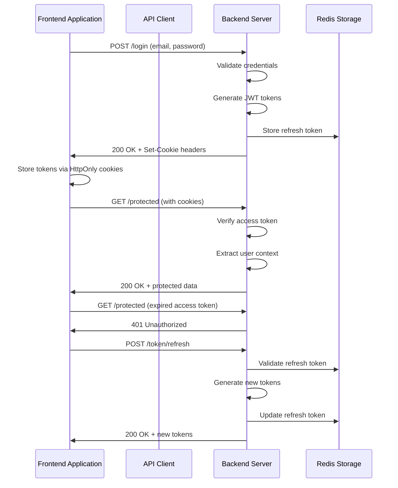
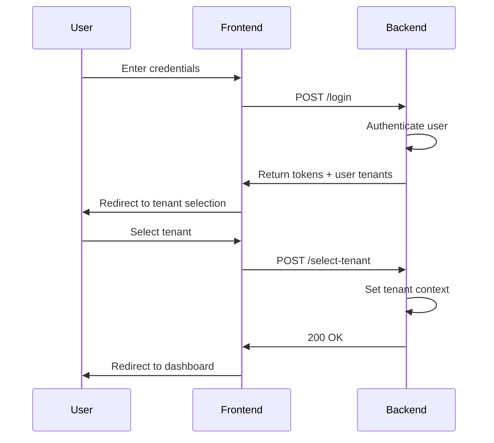

# Authentication Integration

<cite>
**Referenced Files in This Document**   
- [auth.controller.ts](file://apps/server/src/shared/controller/domains/auth.controller.ts)
- [auth.guard.ts](file://apps/server/src/shared/guard/auth.guard.ts)
- [auth.decorator.ts](file://packages/decorator/src/auth.decorator.ts)
- [authStore.ts](file://packages/store/src/stores/authStore.ts)
- [tokenStore.ts](file://packages/store/src/stores/tokenStore.ts)
- [customAxios.ts](file://packages/api/src/libs/customAxios.ts)
- [token.service.ts](file://apps/server/src/shared/service/utils/token.service.ts)
- [cookieStore.ts](file://packages/store/src/stores/cookieStore.ts)
- [login.tsx](file://apps/admin/src/routes/admin/auth/login.tsx)
- [tenant-select.tsx](file://apps/admin/src/routes/admin/auth/login/tenant-select.tsx)
- [useAdminLoginRoute.ts](file://apps/admin/src/hooks/useAdminLoginRoute.ts)
- [useAdminTenantSelectRoute.ts](file://apps/admin/src/hooks/useAdminTenantSelectRoute.ts)
- [selectTenantDto.ts](file://packages/dto/src/select-tenant.dto.ts)
</cite>

## Table of Contents
1. [Introduction](#introduction)
2. [Authentication Flow Overview](#authentication-flow-overview)
3. [Server-Side Authentication Implementation](#server-side-authentication-implementation)
4. [Frontend Authentication Management](#frontend-authentication-management)
5. [Token Lifecycle and Security](#token-lifecycle-and-security)
6. [Tenant Selection Integration](#tenant-selection-integration)
7. [Error Handling and Troubleshooting](#error-handling-and-troubleshooting)
8. [Security Considerations](#security-considerations)

## Introduction
The prj-core system implements a comprehensive JWT-based authentication system that securely manages user sessions across the frontend and backend. This document details the integration between client and server components, focusing on the flow of authentication tokens, protection of endpoints, and handling of user sessions. The system uses HttpOnly cookies for secure token storage, automatic token refresh mechanisms, and tenant-aware authentication flows to support multi-tenancy.

## Authentication Flow Overview



**Diagram sources**
- [auth.controller.ts](file://apps/server/src/shared/controller/domains/auth.controller.ts#L59-L96)
- [tokenStore.ts](file://packages/store/src/stores/tokenStore.ts#L13-L36)
- [customAxios.ts](file://packages/api/src/libs/customAxios.ts#L7)

**Section sources**
- [auth.controller.ts](file://apps/server/src/shared/controller/domains/auth.controller.ts)
- [tokenStore.ts](file://packages/store/src/stores/tokenStore.ts)

## Server-Side Authentication Implementation

### Authentication Controller
The `AuthController` handles all authentication endpoints including login, token refresh, logout, and user registration. It uses NestJS decorators for route metadata and implements proper error handling for various authentication scenarios.

Key endpoints:
- `POST /login`: Authenticates user credentials and returns JWT tokens
- `POST /token/refresh`: Generates new tokens using refresh token
- `POST /logout`: Invalidates tokens and clears session
- `POST /sign-up`: Creates new user account

The controller sets HttpOnly cookies for both access and refresh tokens, preventing client-side JavaScript access and reducing XSS attack surface.

```mermaid
classDiagram
class AuthController {
+login(loginDto : LoginPayloadDto) : TokenDto
+refreshToken() : TokenDto
+getNewToken() : TokenDto
+signUpUser(signUpDto : SignUpPayloadDto) : TokenDto
+verifyToken() : boolean
+logout() : boolean
}
class TokenService {
+setAccessTokenCookie(res : Response, token : string)
+setRefreshTokenCookie(res : Response, token : string)
+clearTokenCookies(res : Response)
+generateTokens(payload : { userId : string }) : Tokens
+validateRefreshTokenFromStorage(userId : string, refreshToken : string) : boolean
+invalidateTokens(userId : string, accessToken? : string) : void
}
class AuthGuard {
+AuthGuard(options? : { public : boolean }) : Type~IAuthGuard~
}
class TokenStorageService {
+saveRefreshToken(userId : string, refreshToken : string) : void
+validateRefreshToken(userId : string, refreshToken : string) : boolean
+deleteRefreshToken(userId : string) : void
+addToBlacklist(accessToken : string) : void
}
AuthController --> TokenService : "uses"
AuthController --> TokenStorageService : "uses"
TokenService --> TokenStorageService : "uses"
```

**Diagram sources**
- [auth.controller.ts](file://apps/server/src/shared/controller/domains/auth.controller.ts)
- [token.service.ts](file://apps/server/src/shared/service/utils/token.service.ts)
- [auth.guard.ts](file://apps/server/src/shared/guard/auth.guard.ts)
- [token-storage.service.ts](file://apps/server/src/shared/service/utils/token-storage.service.ts)

**Section sources**
- [auth.controller.ts](file://apps/server/src/shared/controller/domains/auth.controller.ts#L52-L265)
- [auth.guard.ts](file://apps/server/src/shared/guard/auth.guard.ts#L3-L13)

### JWT Authentication Guard
The `AuthGuard` implements NestJS's passport integration to protect routes using JWT strategy. It supports both public and authenticated routes through optional configuration.

```typescript
export function AuthGuard(options?: Partial<{ public: boolean }>): Type<IAuthGuard> {
    const strategies = ["jwt"];
    
    if (options?.public) {
        strategies.push("public");
    }
    
    return NestAuthGuard(strategies);
}
```

This guard is used with the `@ApiAuth()` decorator to protect endpoints that require authentication, automatically extracting user context from the JWT token and making it available in the request object.

## Frontend Authentication Management

### Token Storage and Management
The frontend uses a combination of HttpOnly cookies and in-memory stores to manage authentication tokens securely. The `TokenStore` class provides methods for accessing and validating tokens without exposing them to potential XSS attacks.

```mermaid
classDiagram
class TokenStore {
+setAccessToken(token : string)
+getAccessToken() : string | null
+setRefreshToken(token : string)
+getRefreshToken() : string | null
+clearTokens()
+hasValidTokens() : boolean
+isAccessTokenExpired() : boolean
+refreshToken()
}
class CookieStore {
+set(name : string, value : any, options? : any)
+get(name : string) : any
+remove(name : string, options? : any)
+getAll() : { [key : string] : any }
}
class AuthStore {
+isAuthenticated() : boolean
+handleAuthError(error : unknown)
+logout(logoutApi? : () => Promise<any>)
}
TokenStore --> CookieStore : "uses"
AuthStore --> TokenStore : "uses"
```

**Diagram sources**
- [tokenStore.ts](file://packages/store/src/stores/tokenStore.ts#L4-L66)
- [cookieStore.ts](file://packages/store/src/stores/cookieStore.ts#L3-L25)
- [authStore.ts](file://packages/store/src/stores/authStore.ts#L8-L83)

**Section sources**
- [tokenStore.ts](file://packages/store/src/stores/tokenStore.ts)
- [cookieStore.ts](file://packages/store/src/stores/cookieStore.ts)
- [authStore.ts](file://packages/store/src/stores/authStore.ts)

### API Request Interception
The system uses Axios interceptors to automatically include authentication tokens in requests and handle token expiration through silent refresh.

```mermaid
flowchart TD
A[API Request] --> B{Access Token Expired?}
B --> |No| C[Send Request with Cookies]
B --> |Yes| D[Call refreshToken()]
D --> E{Refresh Successful?}
E --> |Yes| F[Retry Original Request]
E --> |No| G[Redirect to Login]
C --> H[Receive Response]
H --> I{Status 401?}
I --> |Yes| J[Handle Authentication Error]
I --> |No| K[Return Response Data]
```

The `customAxios` instance is configured with `withCredentials: true` to ensure cookies are included in cross-origin requests, enabling the automatic transmission of JWT tokens stored in HttpOnly cookies.

**Section sources**
- [customAxios.ts](file://packages/api/src/libs/customAxios.ts#L1-L56)
- [authStore.ts](file://packages/store/src/stores/authStore.ts#L15-L33)

## Token Lifecycle and Security

### Token Configuration
The system implements a dual-token strategy with different expiration policies:

| Token Type | Expiration | Storage | Purpose |
|------------|-----------|---------|---------|
| Access Token | 15 minutes | HttpOnly Cookie | Short-lived session access |
| Refresh Token | 7 days | HttpOnly Cookie + Redis | Long-lived token renewal |

This approach balances security (short-lived access tokens) with user experience (long-lived refresh tokens).

### Token Refresh Flow
When an access token expires, the frontend automatically requests a new one using the refresh token:

1. API request fails with 401 status
2. Frontend calls `/token/refresh` endpoint
3. Server validates refresh token against Redis storage
4. Server generates new access and refresh tokens
5. New tokens are set in cookies and returned to client
6. Original request is retried with new tokens

This process is transparent to the user and maintains session continuity.

**Section sources**
- [token.service.ts](file://apps/server/src/shared/service/utils/token.service.ts)
- [auth.controller.ts](file://apps/server/src/shared/controller/domains/auth.controller.ts#L98-L143)

## Tenant Selection Integration

### Multi-Tenancy Authentication Flow
The authentication system integrates tenant selection as a post-login step, allowing users to choose their active tenant after successful authentication.



After login, users are redirected to a tenant selection page where they can choose their active workspace. The selected tenant ID is stored in cookies and included in subsequent requests to ensure proper data isolation.

**Section sources**
- [login.tsx](file://apps/admin/src/routes/admin/auth/login.tsx)
- [tenant-select.tsx](file://apps/admin/src/routes/admin/auth/login/tenant-select.tsx)
- [useAdminLoginRoute.ts](file://apps/admin/src/hooks/useAdminLoginRoute.ts)
- [useAdminTenantSelectRoute.ts](file://apps/admin/src/hooks/useAdminTenantSelectRoute.ts)

## Error Handling and Troubleshooting

### Common Authentication Issues
The system implements comprehensive error handling for authentication scenarios:

| Error Code | Cause | Resolution |
|----------|------|------------|
| 401 Unauthorized | Invalid/missing token | Redirect to login page |
| 401 Refresh Token Not Found | No refresh token in cookies | Force re-authentication |
| 401 Token Invalid | Malformed/expired token | Clear cookies and redirect to login |
| 409 Conflict | Email already exists | Show appropriate error message |

The `AuthStore` handles 401 responses by redirecting users to the login page, ensuring a consistent user experience across the application.

### Troubleshooting Guide
**Issue: User cannot log in**
- Verify credentials are correct
- Check if account is active
- Ensure email is verified (if applicable)
- Clear browser cookies and retry

**Issue: Session expires too quickly**
- Verify access token expiration is set to 15 minutes
- Check if refresh token is properly stored in Redis
- Ensure clock synchronization between server and client

**Issue: Tenant selection not persisting**
- Verify tenantId cookie is being set with proper domain/path
- Check if cookie is HttpOnly and secure
- Ensure backend properly reads tenant context from cookies

**Section sources**
- [auth.controller.ts](file://apps/server/src/shared/controller/domains/auth.controller.ts)
- [authStore.ts](file://packages/store/src/stores/authStore.ts#L42-L52)
- [tokenStore.ts](file://packages/store/src/stores/tokenStore.ts#L47-L63)

## Security Considerations

### Protection Against Common Vulnerabilities
The authentication system implements multiple security measures:

**XSS Protection:**
- Access and refresh tokens stored in HttpOnly cookies
- Secure flag enabled on all authentication cookies
- SameSite=strict policy to prevent CSRF

**CSRF Protection:**
- Double submit cookie pattern with SameSite=strict
- Synchronizer token pattern for state-changing operations
- Origin and Referer header validation

**Token Security:**
- Refresh tokens stored in Redis with user ID binding
- Token blacklisting on logout
- Refresh token rotation (new refresh token issued on each refresh)

**Rate Limiting:**
- Login attempts throttled to prevent brute force attacks
- IP-based rate limiting for authentication endpoints
- Account lockout after multiple failed attempts

### Secure Token Implementation
The system follows JWT best practices:
- Tokens contain minimal user information (primarily userId)
- All tokens are signed with HS256 algorithm
- Secret keys stored in environment variables
- Token expiration enforced on both client and server
- Refresh tokens have shorter lifespan than access tokens

The combination of HttpOnly cookies, token blacklisting, and refresh token validation in Redis provides robust protection against common web application vulnerabilities.

**Section sources**
- [token.service.ts](file://apps/server/src/shared/service/utils/token.service.ts)
- [auth.controller.ts](file://apps/server/src/shared/controller/domains/auth.controller.ts)
- [cookieStore.ts](file://packages/store/src/stores/cookieStore.ts)