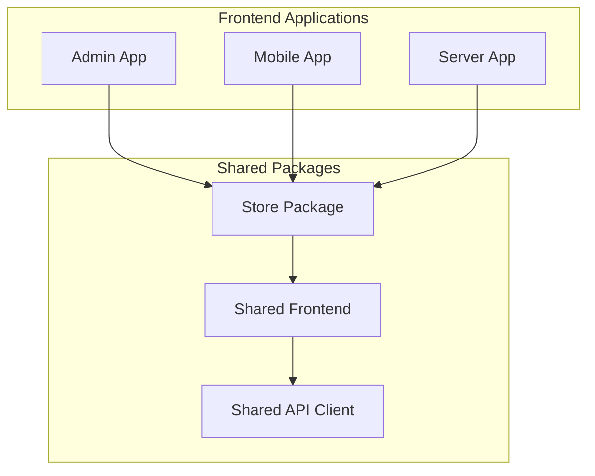
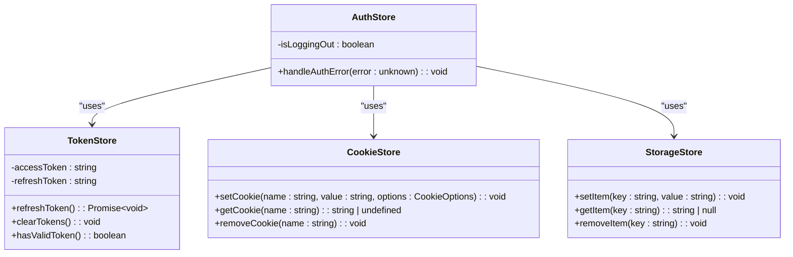
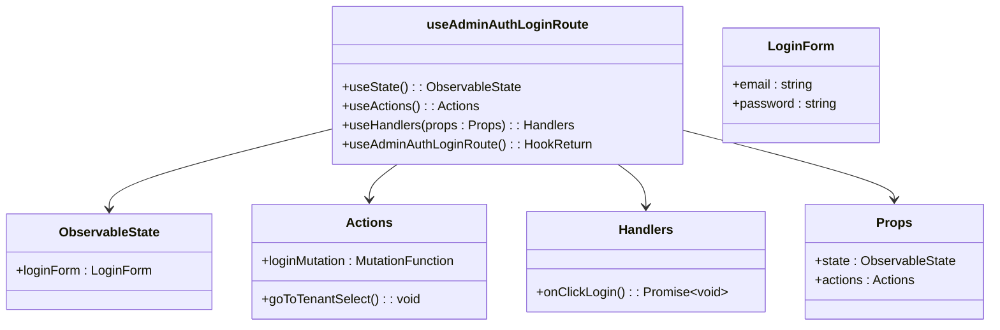
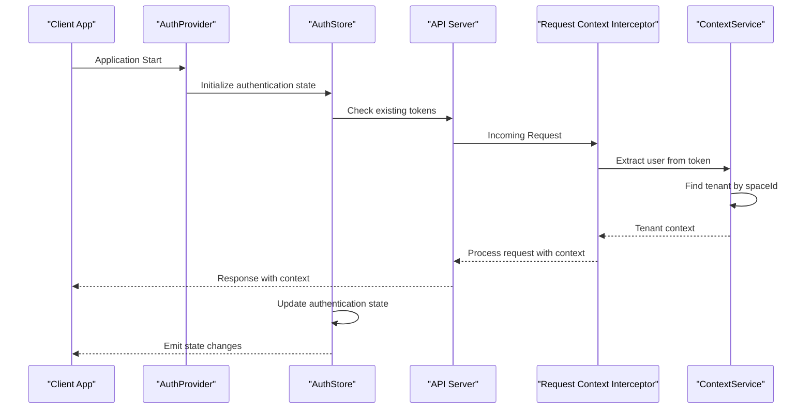
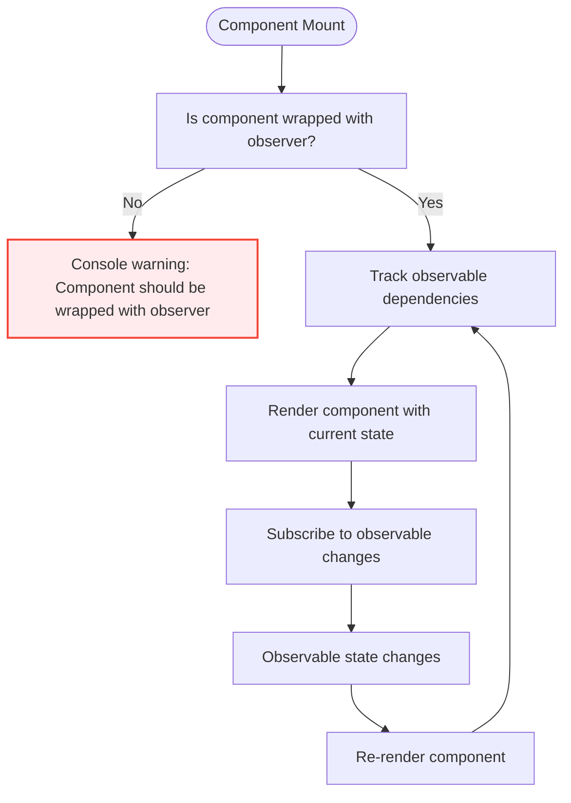
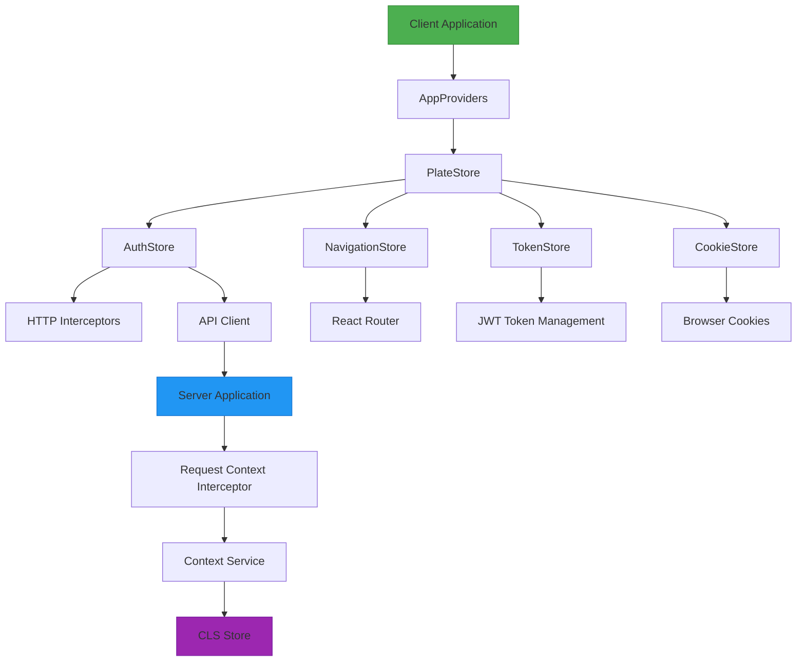

# State Consumption Patterns

<cite>
**Referenced Files in This Document**   
- [useAdminLoginRoute.ts](file://apps/admin/src/hooks/useAdminLoginRoute.ts)
- [useAdminTenantSelectRoute.ts](file://apps/admin/src/hooks/useAdminTenantSelectRoute.ts)
- [auth.tsx](file://apps/admin/src/routes/admin/auth.tsx)
- [dashboard.tsx](file://apps/admin/src/routes/admin/dashboard.tsx)
- [Store.ts](file://packages/store/src/stores/Store.ts)
- [authStore.ts](file://packages/store/src/stores/authStore.ts)
- [tokenStore.ts](file://packages/store/src/stores/tokenStore.ts)
- [navigationStore.ts](file://packages/store/src/stores/navigationStore.ts)
- [cookieStore.ts](file://packages/store/src/stores/cookieStore.ts)
- [request-context.interceptor.ts](file://apps/server/src/shared/interceptor/request-context.interceptor.ts)
- [context.service.spec.ts](file://apps/server/src/shared/service/utils/context.service.spec.ts)
- [context.provider.ts](file://apps/server/src/shared/provider/context.provider.ts)
- [README.md](file://packages/store/README.md)
</cite>

## Table of Contents
1. [Introduction](#introduction)
2. [Project Structure](#project-structure)
3. [Core Components](#core-components)
4. [Architecture Overview](#architecture-overview)
5. [Detailed Component Analysis](#detailed-component-analysis)
6. [Dependency Analysis](#dependency-analysis)
7. [Performance Considerations](#performance-considerations)
8. [Troubleshooting Guide](#troubleshooting-guide)
9. [Conclusion](#conclusion)

## Introduction
This document provides comprehensive documentation on the state consumption patterns used throughout the prj-core applications. It details how components access global state through context consumers, custom hooks, and store observables, with a focus on authentication state management and route protection mechanisms. The system leverages MobX for reactive state management, providing a robust framework for handling complex state interactions across the application ecosystem.

## Project Structure



**Diagram sources**
- [Store.ts](file://packages/store/src/stores/Store.ts)
- [README.md](file://packages/store/README.md)

**Section sources**
- [Store.ts](file://packages/store/src/stores/Store.ts)
- [README.md](file://packages/store/README.md)

## Core Components

The prj-core applications utilize a centralized state management system built on MobX, with the PlateStore (referred to as Store in implementation) serving as the root store that composes all child stores. This architecture enables consistent state consumption patterns across different applications within the monorepo. The core components include authentication state management, token handling, navigation state, and persistent storage abstractions.

**Section sources**
- [Store.ts](file://packages/store/src/stores/Store.ts)
- [README.md](file://packages/store/README.md)

## Architecture Overview

```mermaid
graph TD
PlateStore[PlateStore (Root)] --> AuthStore[AuthStore]
PlateStore --> NavigationStore[NavigationStore]
PlateStore --> TokenStore[TokenStore]
PlateStore --> CookieStore[CookieStore]
PlateStore --> StorageStore[StorageStore]
NavigationStore --> NavigatorStore[NavigatorStore]
NavigationStore --> RouteStore[RouteStore]
AuthStore --> HTTPInterceptors[HTTP Interceptors]
TokenStore --> JWTHandling[JWT Token Lifecycle]
CookieStore --> CookieOperations[Cookie Operations]
StorageStore --> PersistentStorage[LocalStorage/SessionStorage]
ClientApp[Client Application] --> AppProviders[AppProviders]
AppProviders --> PlateStore
ReactComponent[React Component] --> Observer[observer HOC]
Observer --> Store[Store Properties]
```

**Diagram sources**
- [Store.ts](file://packages/store/src/stores/Store.ts)
- [README.md](file://packages/store/README.md)

## Detailed Component Analysis

### Authentication State Management

The authentication state management system provides a comprehensive solution for handling user authentication, token management, and session state. The AuthStore class manages the authentication state and integrates with HTTP interceptors to handle authentication errors automatically.



**Diagram sources**
- [authStore.ts](file://packages/store/src/stores/authStore.ts)
- [tokenStore.ts](file://packages/store/src/stores/tokenStore.ts)
- [cookieStore.ts](file://packages/store/src/stores/cookieStore.ts)

**Section sources**
- [authStore.ts](file://packages/store/src/stores/authStore.ts)
- [tokenStore.ts](file://packages/store/src/stores/tokenStore.ts)

### Custom Hooks for State Access

The system implements custom hooks to abstract state access logic and provide type safety. These hooks follow a pattern of separating state, actions, and handlers to promote reusability and maintainability.



**Diagram sources**
- [useAdminLoginRoute.ts](file://apps/admin/src/hooks/useAdminLoginRoute.ts)

**Section sources**
- [useAdminLoginRoute.ts](file://apps/admin/src/hooks/useAdminLoginRoute.ts)

### Route Protection and Authentication Checks

The system implements route protection through a combination of server-side context management and client-side state checks. The request-context.interceptor on the server side sets up the authentication context, while the client-side stores maintain the authentication state.



**Diagram sources**
- [request-context.interceptor.ts](file://apps/server/src/shared/interceptor/request-context.interceptor.ts)
- [context.provider.ts](file://apps/server/src/shared/provider/context.provider.ts)
- [authStore.ts](file://packages/store/src/stores/authStore.ts)

**Section sources**
- [request-context.interceptor.ts](file://apps/server/src/shared/interceptor/request-context.interceptor.ts)
- [context.provider.ts](file://apps/server/src/shared/provider/context.provider.ts)

### State Subscription and Change Handling

The system handles state subscriptions and changes through MobX observables and reactions. Components that need to consume state must be wrapped with the observer HOC to automatically track observable dependencies and re-render when those observables change.



**Diagram sources**
- [Store.ts](file://packages/store/src/stores/Store.ts)
- [README.md](file://packages/store/README.md)

**Section sources**
- [Store.ts](file://packages/store/src/stores/Store.ts)
- [README.md](file://packages/store/README.md)

## Dependency Analysis



**Diagram sources**
- [Store.ts](file://packages/store/src/stores/Store.ts)
- [request-context.interceptor.ts](file://apps/server/src/shared/interceptor/request-context.interceptor.ts)
- [context.provider.ts](file://apps/server/src/shared/provider/context.provider.ts)

**Section sources**
- [Store.ts](file://packages/store/src/stores/Store.ts)
- [request-context.interceptor.ts](file://apps/server/src/shared/interceptor/request-context.interceptor.ts)
- [context.provider.ts](file://apps/server/src/shared/provider/context.provider.ts)

## Performance Considerations

The state consumption patterns in prj-core applications follow MobX best practices to ensure optimal performance. Key considerations include using the observer HOC to wrap components that consume store state, avoiding direct state mutations by using MobX actions, and initializing the PlateStore instance only once at the application root. The system leverages MobX reactions for side effects, ensuring that computations are only performed when relevant observables change. This reactive approach minimizes unnecessary re-renders and computations, maintaining component performance even with complex state interactions.

## Troubleshooting Guide

When troubleshooting state consumption issues in prj-core applications, verify that components consuming store state are properly wrapped with the observer HOC. Check that the PlateStore instance is initialized at the application root and provided through AppProviders. For authentication-related issues, verify that tokens are properly stored and refreshed, and that HTTP interceptors are correctly configured to handle authentication errors. When debugging state changes, use MobX developer tools to inspect observable dependencies and reaction triggers. For route protection issues, ensure that the request-context.interceptor is properly configured on the server side and that the client-side AuthStore is correctly synchronized with the server authentication state.

**Section sources**
- [README.md](file://packages/store/README.md)
- [authStore.ts](file://packages/store/src/stores/authStore.ts)
- [request-context.interceptor.ts](file://apps/server/src/shared/interceptor/request-context.interceptor.ts)

## Conclusion

The prj-core applications implement a robust state consumption pattern using MobX for reactive state management. The architecture centers around the PlateStore as a root store that composes specialized stores for authentication, navigation, token management, and persistent storage. Custom hooks abstract state access logic and provide type safety, while the observer pattern ensures efficient re-renders when state changes. The system handles authentication flows with careful attention to race conditions and concurrent updates, using server-side context management in conjunction with client-side state stores. This comprehensive approach enables consistent, type-safe state consumption across the application ecosystem while maintaining performance and reusability.