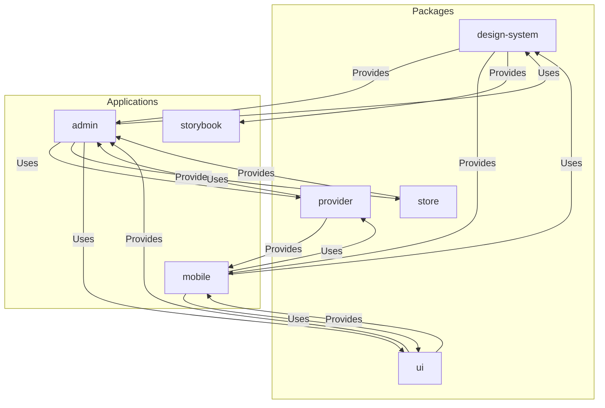
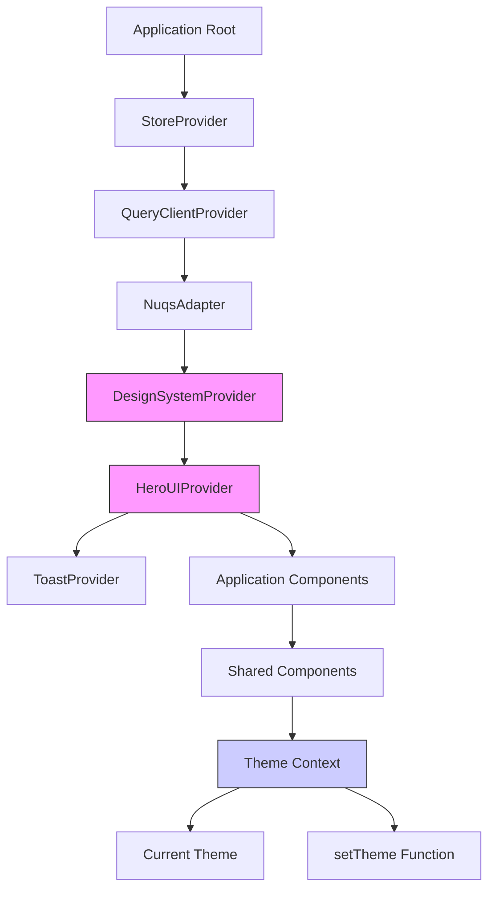
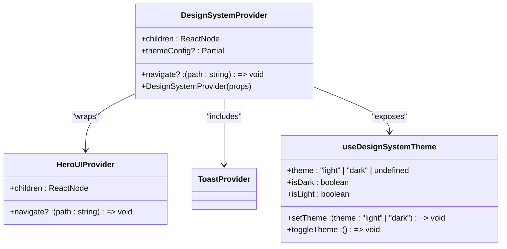
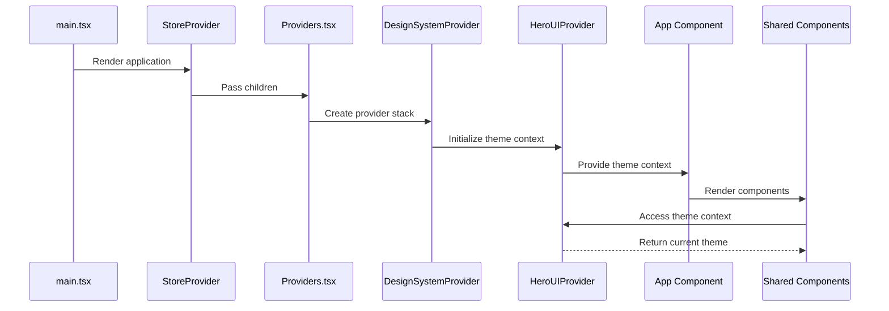
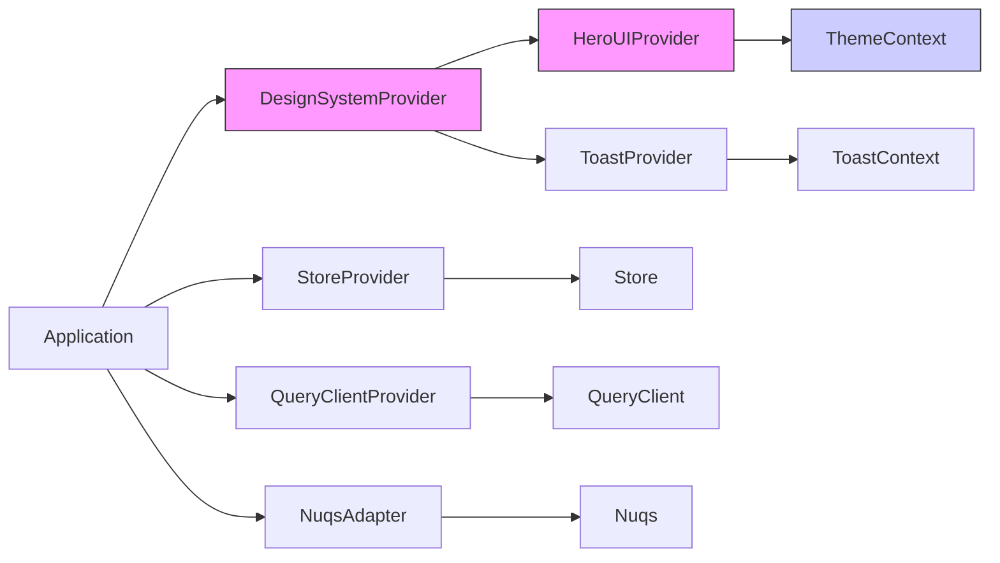

# Theme and Configuration

<cite>
**Referenced Files in This Document**   
- [DesignSystemProvider.tsx](file://packages/design-system/src/provider/DesignSystemProvider.tsx)
- [heroui.config.ts](file://packages/design-system/src/theme/heroui.config.ts)
- [Providers.tsx](file://apps/admin/src/providers/Providers.tsx)
- [main.tsx](file://apps/admin/src/main.tsx)
- [StoreProvider.tsx](file://packages/store/src/providers/StoreProvider.tsx)
- [context.provider.ts](file://apps/server/src/shared/provider/context.provider.ts)
</cite>

## Table of Contents
1. [Introduction](#introduction)
2. [Project Structure](#project-structure)
3. [Core Components](#core-components)
4. [Architecture Overview](#architecture-overview)
5. [Detailed Component Analysis](#detailed-component-analysis)
6. [Dependency Analysis](#dependency-analysis)
7. [Performance Considerations](#performance-considerations)
8. [Troubleshooting Guide](#troubleshooting-guide)
9. [Conclusion](#conclusion)

## Introduction
This document details the implementation of theme and global configuration for shared components across the admin and mobile applications. It explains how the UIProviders component (specifically DesignSystemProvider) sets up theme context, dark mode support, and other global UI settings using React context. The documentation covers how theme configuration is passed down to all shared components, ensuring consistent styling across applications. It also details the DarkModeSwitch component interaction with theme context, initialization in application entry points, and configuration options for customizing shared component appearance while maintaining design consistency.

## Project Structure
The theme and configuration system is organized across multiple packages and applications in the monorepo. The core theme implementation resides in the design-system package, while application-specific providers are located in their respective app directories. The structure follows a layered approach with shared components, providers, and application entry points.



**Diagram sources**
- [DesignSystemProvider.tsx](file://packages/design-system/src/provider/DesignSystemProvider.tsx)
- [Providers.tsx](file://apps/admin/src/providers/Providers.tsx)

**Section sources**
- [DesignSystemProvider.tsx](file://packages/design-system/src/provider/DesignSystemProvider.tsx)
- [heroui.config.ts](file://packages/design-system/src/theme/heroui.config.ts)

## Core Components
The theme and configuration system is built around several core components that work together to provide a consistent UI experience across applications. The DesignSystemProvider serves as the central component that wraps the HeroUIProvider and manages theme context. The theme configuration is defined in heroui.config.ts with distinct light and dark theme color palettes. Applications consume these components through their provider stacks, with the admin application using a Providers component that composes multiple context providers including the theme provider.

**Section sources**
- [DesignSystemProvider.tsx](file://packages/design-system/src/provider/DesignSystemProvider.tsx)
- [heroui.config.ts](file://packages/design-system/src/theme/heroui.config.ts)
- [Providers.tsx](file://apps/admin/src/providers/Providers.tsx)

## Architecture Overview
The theme architecture follows a provider pattern where the DesignSystemProvider wraps the application and provides theme context to all child components through React context. This allows shared components to access the current theme and update it when needed. The architecture separates theme definition from provider implementation, with theme colors and configuration defined in heroui.config.ts and the provider implementation in DesignSystemProvider.tsx. Applications consume this architecture by wrapping their root components with the appropriate providers, ensuring consistent theme behavior across the entire application.



**Diagram sources**
- [DesignSystemProvider.tsx](file://packages/design-system/src/provider/DesignSystemProvider.tsx)
- [Providers.tsx](file://apps/admin/src/providers/Providers.tsx)
- [main.tsx](file://apps/admin/src/main.tsx)

## Detailed Component Analysis

### DesignSystemProvider Analysis
The DesignSystemProvider is the core component responsible for setting up theme context and global UI settings. It wraps the HeroUIProvider from the HeroUI library and provides additional functionality for theme management. The provider exposes a useDesignSystemTheme hook that allows components to access the current theme state and functions to update it. This component is designed to be placed at the top level of the application to ensure all components have access to the theme context.



**Diagram sources**
- [DesignSystemProvider.tsx](file://packages/design-system/src/provider/DesignSystemProvider.tsx)

**Section sources**
- [DesignSystemProvider.tsx](file://packages/design-system/src/provider/DesignSystemProvider.tsx)

### Theme Configuration Analysis
The theme configuration is implemented in heroui.config.ts, which defines the color palettes for both light and dark themes. The configuration includes specific color values for various UI elements such as background, foreground, and content areas. The dark theme maintains consistency with the light theme for secondary, success, warning, and danger colors by reusing the light theme values for these categories. This ensures visual consistency while providing a proper dark mode experience.

```mermaid
classDiagram
class ThemeConfig {
+defaultTheme : "light" | "dark" | "system"
+disableBaseline : boolean
}
class lightThemeColors {
+background : "#FFFFFF"
+foreground : "#11181C"
+primary : {50 : "#E6F1FE", ..., DEFAULT : "#006FEE"}
+secondary : {50 : "#F2EAFA", ..., DEFAULT : "#7828C8"}
+success : {50 : "#E8FAF0", ..., DEFAULT : "#17C964"}
+warning : {50 : "#FEFCE8", ..., DEFAULT : "#F5A524"}
+danger : {50 : "#FEE7EF", ..., DEFAULT : "#F31260"}
}
class darkThemeColors {
+background : "#000000"
+foreground : "#ECEDEE"
+primary : {50 : "#001731", ..., DEFAULT : "#006FEE"}
+secondary : lightThemeColors.secondary
+success : lightThemeColors.success
+warning : lightThemeColors.warning
+danger : lightThemeColors.danger
}
class heroUIThemeConfig {
+themes : {light : {colors : lightThemeColors}, dark : {colors : darkThemeColors}}
+layout : {disabledOpacity : "0.5", radius : {small : "4px", medium : "6px", large : "8px"}, borderWidth : {small : "1px", medium : "2px", large : "3px"}}
}
ThemeConfig <|-- defaultThemeConfig
heroUIThemeConfig --> lightThemeColors
heroUIThemeConfig --> darkThemeColors
```

**Diagram sources**
- [heroui.config.ts](file://packages/design-system/src/theme/heroui.config.ts)

**Section sources**
- [heroui.config.ts](file://packages/design-system/src/theme/heroui.config.ts)

### Application Integration Analysis
The integration of the theme system into applications follows a consistent pattern across both admin and mobile applications. In the admin application, the Providers component composes multiple context providers including the DesignSystemProvider. The main.tsx file then wraps the application with the StoreProvider and Providers components, establishing the complete context hierarchy. This pattern ensures that all shared components have access to the theme context and can respond to theme changes appropriately.



**Diagram sources**
- [main.tsx](file://apps/admin/src/main.tsx)
- [Providers.tsx](file://apps/admin/src/providers/Providers.tsx)
- [DesignSystemProvider.tsx](file://packages/design-system/src/provider/DesignSystemProvider.tsx)

**Section sources**
- [main.tsx](file://apps/admin/src/main.tsx)
- [Providers.tsx](file://apps/admin/src/providers/Providers.tsx)

## Dependency Analysis
The theme and configuration system has a clear dependency hierarchy that ensures proper initialization and access to context. The DesignSystemProvider depends on the HeroUI library for the underlying theme context implementation, while applications depend on the design-system package for the provider components. The provider stack in the admin application shows a composition of multiple providers, each adding a specific context layer to the application.



**Diagram sources**
- [Providers.tsx](file://apps/admin/src/providers/Providers.tsx)
- [DesignSystemProvider.tsx](file://packages/design-system/src/provider/DesignSystemProvider.tsx)
- [StoreProvider.tsx](file://packages/store/src/providers/StoreProvider.tsx)

**Section sources**
- [Providers.tsx](file://apps/admin/src/providers/Providers.tsx)
- [DesignSystemProvider.tsx](file://packages/design-system/src/provider/DesignSystemProvider.tsx)
- [StoreProvider.tsx](file://packages/store/src/providers/StoreProvider.tsx)

## Performance Considerations
The theme implementation is designed with performance in mind, using React context efficiently to avoid unnecessary re-renders. The theme context is stable and only updates when the theme actually changes, minimizing the impact on component re-renders. The use of memoization in the useDesignSystemTheme hook ensures that the returned object is only recreated when necessary. The theme configuration is defined as constants, allowing for tree-shaking and minimizing bundle size.

## Troubleshooting Guide
When troubleshooting theme-related issues, check the provider hierarchy to ensure the DesignSystemProvider is properly wrapped around the application components. Verify that the theme context is accessible by using the useDesignSystemTheme hook in a component and logging the returned values. If dark mode is not working correctly, check that the dark theme colors are properly defined in heroui.config.ts and that the theme toggle function is correctly updating the context. For issues with theme persistence, ensure that the theme state is being properly saved and restored, potentially using browser storage or server-side configuration.

**Section sources**
- [DesignSystemProvider.tsx](file://packages/design-system/src/provider/DesignSystemProvider.tsx)
- [heroui.config.ts](file://packages/design-system/src/theme/heroui.config.ts)

## Conclusion
The theme and configuration system provides a robust and consistent approach to managing UI appearance across applications. By leveraging React context through the DesignSystemProvider, the system ensures that all shared components have access to the current theme state and can respond to changes appropriately. The separation of theme definition from provider implementation allows for easy customization while maintaining design consistency. The architecture supports both light and dark modes with carefully designed color palettes that ensure readability and visual appeal. Applications integrate with this system through a standardized provider pattern, making it easy to maintain consistency across the codebase.