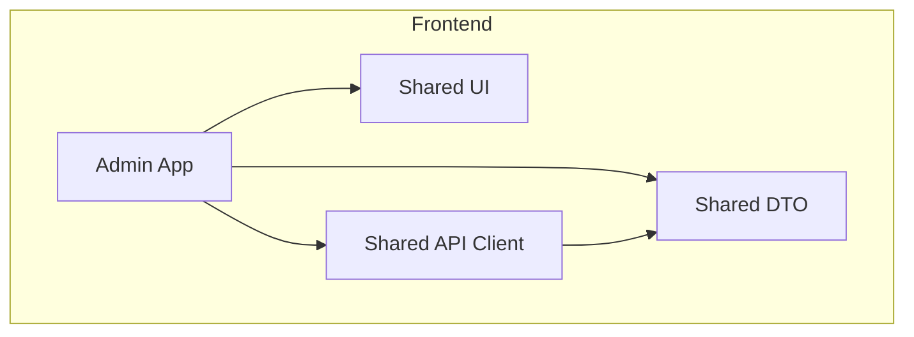
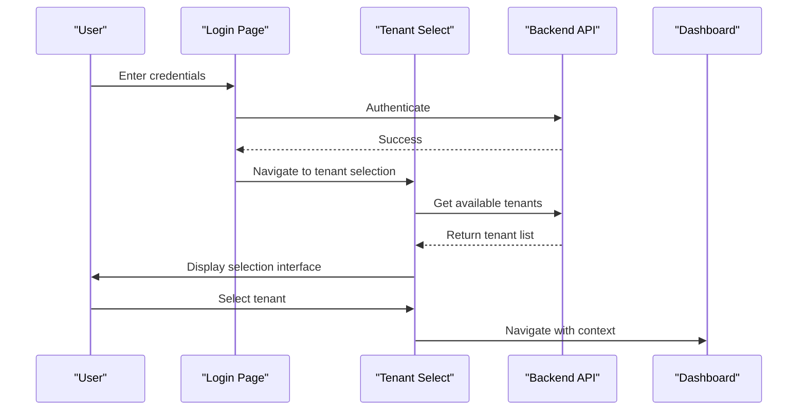
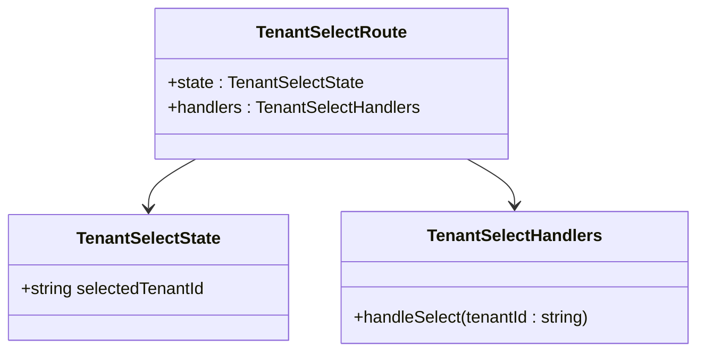
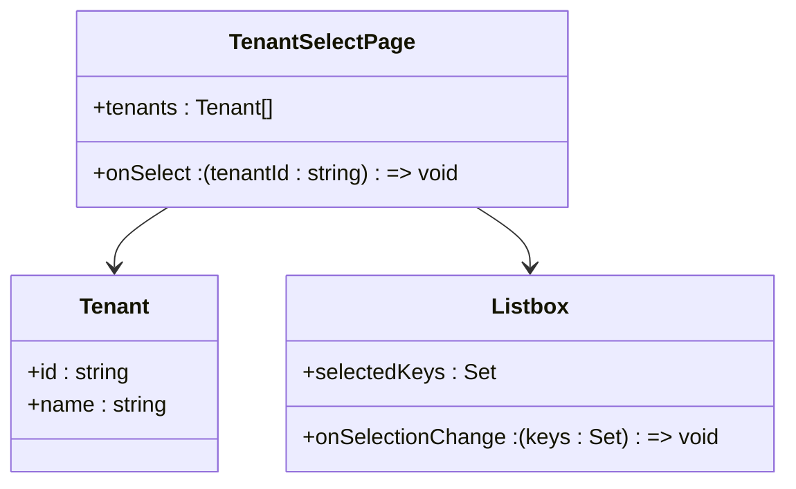
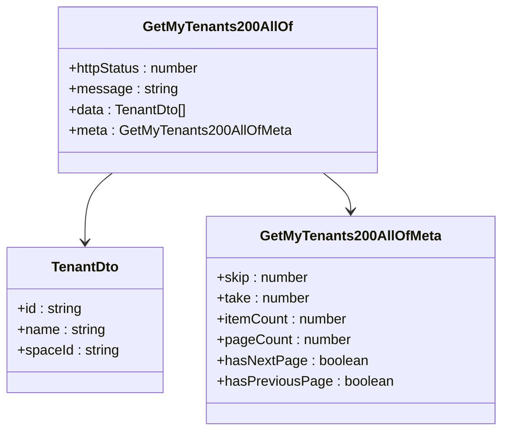
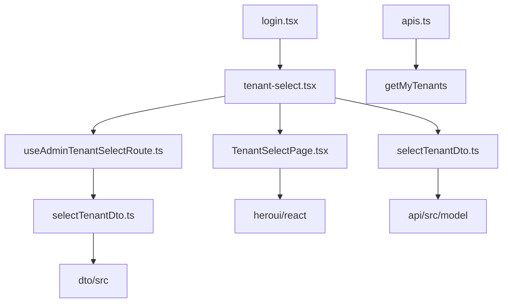

# Tenant Selection Process

<cite>
**Referenced Files in This Document**   
- [tenant-select.tsx](file://apps/admin/src/routes/admin/auth/login/tenant-select.tsx)
- [useAdminTenantSelectRoute.ts](file://apps/admin/src/hooks/useAdminTenantSelectRoute.ts)
- [selectTenantDto.ts](file://packages/dto/src/select-tenant.dto.ts)
- [selectTenantDto.ts](file://packages/api/src/model/selectTenantDto.ts)
- [login.tsx](file://apps/admin/src/routes/admin/auth/login.tsx)
- [useAdminLoginRoute.ts](file://apps/admin/src/hooks/useAdminLoginRoute.ts)
- [TenantSelectPage.tsx](file://packages/ui/src/components/page/TenantSelectPage.tsx)
- [getMyTenants200AllOf.ts](file://packages/api/src/model/getMyTenants200AllOf.ts)
- [getMyTenants200AllOfMeta.ts](file://packages/api/src/model/getMyTenants200AllOfMeta.ts)
- [tenantDto.ts](file://packages/api/src/model/tenantDto.ts)
- [apis.ts](file://packages/api/src/apis.ts)
- [context.service.spec.ts](file://apps/server/src/shared/service/utils/context.service.spec.ts)
</cite>

## Table of Contents
1. [Introduction](#introduction)
2. [Project Structure](#project-structure)
3. [Core Components](#core-components)
4. [Architecture Overview](#architecture-overview)
5. [Detailed Component Analysis](#detailed-component-analysis)
6. [Dependency Analysis](#dependency-analysis)
7. [Performance Considerations](#performance-considerations)
8. [Troubleshooting Guide](#troubleshooting-guide)
9. [Conclusion](#conclusion)

## Introduction
The Tenant Selection Process in prj-core's admin authentication system enables users to select their appropriate tenant context after successful login. This document details the implementation of the post-login tenant selection flow, focusing on the tenant-select.tsx component that handles multi-tenant context establishment. The system supports both single and multiple tenant scenarios, providing a consistent user experience while maintaining proper isolation between tenant contexts. The process involves retrieving available tenants for the authenticated user, displaying them in a selection interface, and processing the selection to establish the user's context within the application.

## Project Structure
The tenant selection functionality is organized across multiple packages and directories in the prj-core monorepo. The frontend implementation resides in the admin application, while shared types and API definitions are maintained in dedicated packages. The structure follows a modular approach with clear separation of concerns between UI components, state management, API clients, and data transfer objects.



**Diagram sources**
- [tenant-select.tsx](file://apps/admin/src/routes/admin/auth/login/tenant-select.tsx)
- [TenantSelectPage.tsx](file://packages/ui/src/components/page/TenantSelectPage.tsx)
- [selectTenantDto.ts](file://packages/api/src/model/selectTenantDto.ts)
- [selectTenantDto.ts](file://packages/dto/src/select-tenant.dto.ts)

**Section sources**
- [tenant-select.tsx](file://apps/admin/src/routes/admin/auth/login/tenant-select.tsx)
- [TenantSelectPage.tsx](file://packages/ui/src/components/page/TenantSelectPage.tsx)

## Core Components
The tenant selection process consists of several core components that work together to provide a seamless user experience. The main components include the tenant selection route handler, the UI presentation component, and the data transfer objects that ensure type safety across the system. The process begins after successful authentication and guides the user through selecting their appropriate tenant context before accessing the main application dashboard.

**Section sources**
- [tenant-select.tsx](file://apps/admin/src/routes/admin/auth/login/tenant-select.tsx)
- [useAdminTenantSelectRoute.ts](file://apps/admin/src/hooks/useAdminTenantSelectRoute.ts)
- [TenantSelectPage.tsx](file://packages/ui/src/components/page/TenantSelectPage.tsx)

## Architecture Overview
The tenant selection architecture follows a clean separation between presentation, state management, and data layers. The process begins with the authentication flow, transitions to tenant selection when multiple tenants are available, and concludes with context establishment in the main application. The architecture leverages React Router for navigation, MobX for state management, and a shared API client for backend communication.



**Diagram sources**
- [login.tsx](file://apps/admin/src/routes/admin/auth/login.tsx)
- [tenant-select.tsx](file://apps/admin/src/routes/admin/auth/login/tenant-select.tsx)
- [apis.ts](file://packages/api/src/apis.ts)
- [dashboard.tsx](file://apps/admin/src/routes/admin/dashboard.tsx)

## Detailed Component Analysis

### Tenant Selection Component Analysis
The tenant selection component handles the presentation and interaction logic for selecting a tenant after login. It manages the state of the selected tenant and coordinates navigation to the appropriate application context. The component uses MobX for state management and React Router for navigation.

#### State Management


**Diagram sources**
- [useAdminTenantSelectRoute.ts](file://apps/admin/src/hooks/useAdminTenantSelectRoute.ts)
- [tenant-select.tsx](file://apps/admin/src/routes/admin/auth/login/tenant-select.tsx)

#### UI Component


**Diagram sources**
- [TenantSelectPage.tsx](file://packages/ui/src/components/page/TenantSelectPage.tsx)
- [tenant-select.tsx](file://apps/admin/src/routes/admin/auth/login/tenant-select.tsx)

**Section sources**
- [TenantSelectPage.tsx](file://packages/ui/src/components/page/TenantSelectPage.tsx)
- [tenant-select.tsx](file://apps/admin/src/routes/admin/auth/login/tenant-select.tsx)

### Data Transfer and Type Safety
The tenant selection process relies on shared data transfer objects to ensure type safety between the frontend and backend. The selectTenantDto is used to standardize the data structure for tenant selection operations across the system.

#### Data Transfer Object
```mermaid
classDiagram
class SelectTenantDto {
+selectedTenantId : string
}
note right of SelectTenantDto
Used for type-safe data transfer
between frontend and backend
end note
```

**Diagram sources**
- [selectTenantDto.ts](file://packages/dto/src/select-tenant.dto.ts)
- [selectTenantDto.ts](file://packages/api/src/model/selectTenantDto.ts)

#### API Response Structure


**Diagram sources**
- [getMyTenants200AllOf.ts](file://packages/api/src/model/getMyTenants200AllOf.ts)
- [tenantDto.ts](file://packages/api/src/model/tenantDto.ts)
- [getMyTenants200AllOfMeta.ts](file://packages/api/src/model/getMyTenants200AllOfMeta.ts)

**Section sources**
- [getMyTenants200AllOf.ts](file://packages/api/src/model/getMyTenants200AllOf.ts)
- [getMyTenants200AllOfMeta.ts](file://packages/api/src/model/getMyTenants200AllOfMeta.ts)
- [tenantDto.ts](file://packages/api/src/model/tenantDto.ts)

## Dependency Analysis
The tenant selection process has dependencies across multiple packages in the prj-core monorepo. These dependencies ensure consistent type definitions, shared UI components, and proper API communication.



**Diagram sources**
- [tenant-select.tsx](file://apps/admin/src/routes/admin/auth/login/tenant-select.tsx)
- [useAdminTenantSelectRoute.ts](file://apps/admin/src/hooks/useAdminTenantSelectRoute.ts)
- [TenantSelectPage.tsx](file://packages/ui/src/components/page/TenantSelectPage.tsx)
- [selectTenantDto.ts](file://packages/api/src/model/selectTenantDto.ts)
- [selectTenantDto.ts](file://packages/dto/src/select-tenant.dto.ts)
- [login.tsx](file://apps/admin/src/routes/admin/auth/login.tsx)
- [apis.ts](file://packages/api/src/apis.ts)

**Section sources**
- [tenant-select.tsx](file://apps/admin/src/routes/admin/auth/login/tenant-select.tsx)
- [useAdminTenantSelectRoute.ts](file://apps/admin/src/hooks/useAdminTenantSelectRoute.ts)
- [TenantSelectPage.tsx](file://packages/ui/src/components/page/TenantSelectPage.tsx)
- [selectTenantDto.ts](file://packages/api/src/model/selectTenantDto.ts)
- [selectTenantDto.ts](file://packages/dto/src/select-tenant.dto.ts)

## Performance Considerations
The tenant selection process is designed to be efficient and responsive. The UI components are optimized for fast rendering, and API calls are structured to minimize data transfer. The system handles both single and multiple tenant scenarios appropriately, avoiding unnecessary selection steps when a user has access to only one tenant. Caching strategies can be implemented at the API client level to reduce redundant requests for tenant data.

## Troubleshooting Guide
Common issues in the tenant selection process include empty tenant lists, selection errors, and navigation failures. These issues are typically related to authentication state, API connectivity, or data formatting. The system should handle cases where a user has no available tenants by displaying an appropriate error message and providing options to contact support. Validation should be performed on the selected tenant ID to ensure it matches the expected format before proceeding with context establishment.

**Section sources**
- [tenant-select.tsx](file://apps/admin/src/routes/admin/auth/login/tenant-select.tsx)
- [TenantSelectPage.tsx](file://packages/ui/src/components/page/TenantSelectPage.tsx)
- [context.service.spec.ts](file://apps/server/src/shared/service/utils/context.service.spec.ts)

## Conclusion
The tenant selection process in prj-core's admin authentication system provides a robust mechanism for establishing user context in a multi-tenant environment. By leveraging shared types, consistent UI components, and well-defined API contracts, the system ensures type safety and maintainability across the codebase. The architecture supports both single and multiple tenant scenarios while maintaining proper isolation between tenant contexts. Future enhancements could include tenant preference persistence, improved error handling, and enhanced accessibility features for the selection interface.