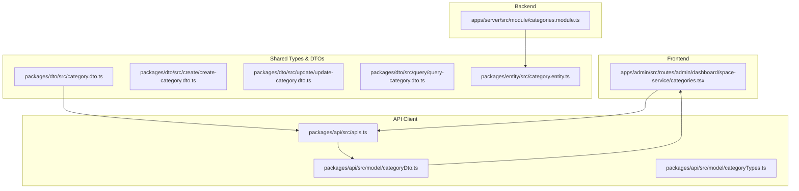
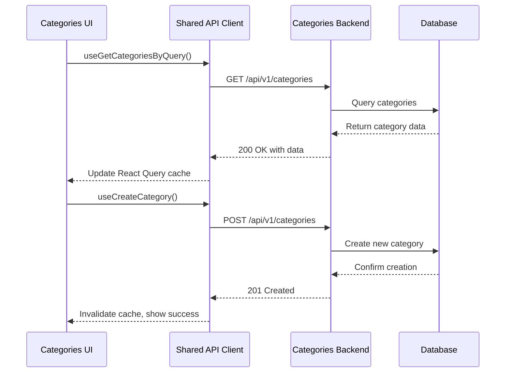
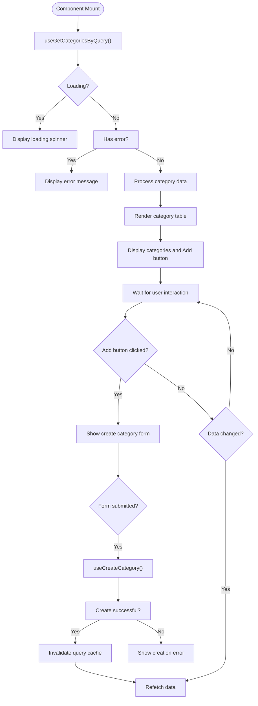
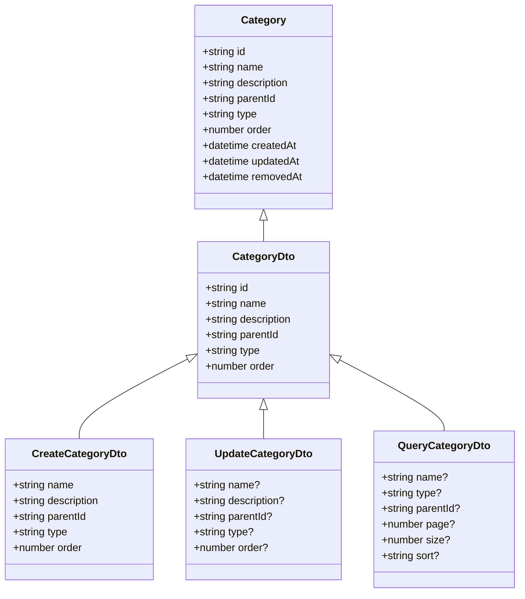
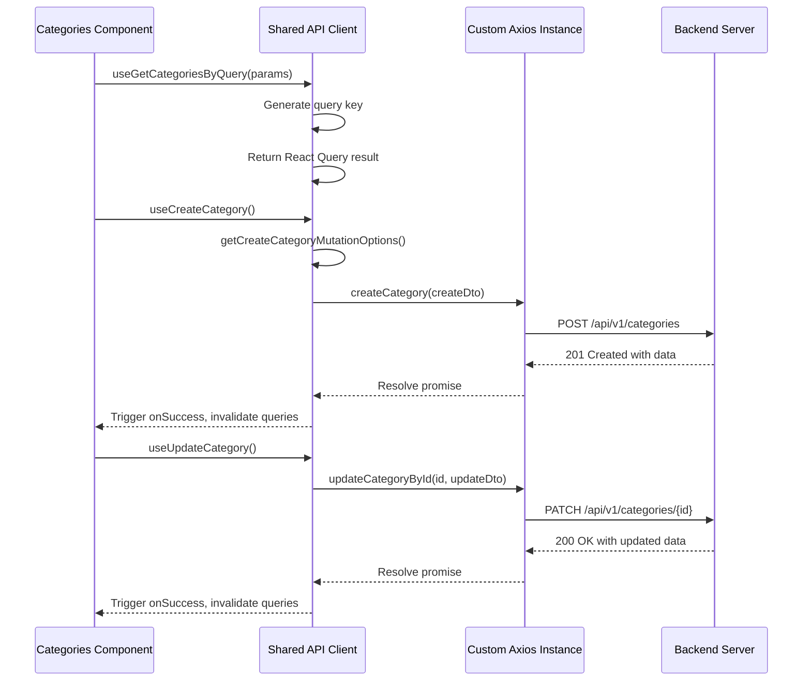
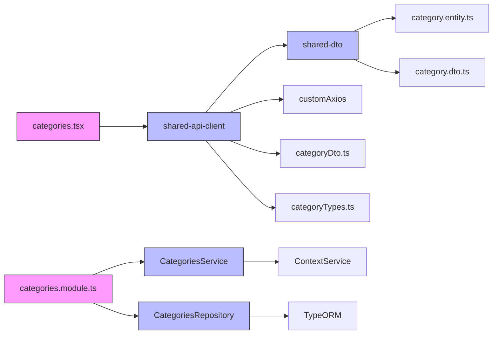

# Categories Management

<cite>
**Referenced Files in This Document**   
- [categories.tsx](file://apps/admin/src/routes/admin/dashboard/space-service/categories.tsx)
- [category.entity.ts](file://packages/entity/src/category.entity.ts)
- [category.dto.ts](file://packages/dto/src/category.dto.ts)
- [create-category.dto.ts](file://packages/dto/src/create/create-category.dto.ts)
- [update-category.dto.ts](file://packages/dto/src/update/update-category.dto.ts)
- [query-category.dto.ts](file://packages/dto/src/query/query-category.dto.ts)
- [categoryTypes.ts](file://packages/api/src/model/categoryTypes.ts)
- [categoryDto.ts](file://packages/api/src/model/categoryDto.ts)
- [apis.ts](file://packages/api/src/apis.ts)
- [categories.module.ts](file://apps/server/src/module/categories.module.ts)
</cite>

## Table of Contents
1. [Introduction](#introduction)
2. [Project Structure](#project-structure)
3. [Core Components](#core-components)
4. [Architecture Overview](#architecture-overview)
5. [Detailed Component Analysis](#detailed-component-analysis)
6. [Dependency Analysis](#dependency-analysis)
7. [Performance Considerations](#performance-considerations)
8. [Troubleshooting Guide](#troubleshooting-guide)
9. [Conclusion](#conclusion)

## Introduction
The Categories Management sub-feature within the Space Service Module provides a comprehensive interface for viewing, creating, and managing hierarchical categories that classify spaces within the application. This documentation details the implementation of the categories management system, including its data model, API integration, and user interface components. The system enables administrators to organize spaces into logical groupings such as "Soccer Field", "Basketball Court", and "Tennis Court", each with descriptive metadata and associated ground counts. The implementation follows a modular architecture with clear separation between frontend components, API clients, data transfer objects, and backend services.

## Project Structure
The categories management functionality is distributed across multiple packages in the monorepo architecture, following a domain-driven design pattern. The frontend component resides in the admin application, while shared types, DTOs, and API clients are maintained in dedicated packages for reusability across the ecosystem.

**Diagram sources**
- [categories.tsx](file://apps/admin/src/routes/admin/dashboard/space-service/categories.tsx)
- [category.entity.ts](file://packages/entity/src/category.entity.ts)
- [category.dto.ts](file://packages/dto/src/category.dto.ts)
- [apis.ts](file://packages/api/src/apis.ts)
- [categories.module.ts](file://apps/server/src/module/categories.module.ts)

**Section sources**
- [categories.tsx](file://apps/admin/src/routes/admin/dashboard/space-service/categories.tsx)
- [categories.module.ts](file://apps/server/src/module/categories.module.ts)

## Core Components
The core components of the Categories Management system include the React component for the user interface, the category data model that defines the structure of category entities, the DTOs that govern data transfer between frontend and backend, and the API client that provides type-safe operations. The implementation leverages the shared-frontend components like Table, Button, and TableColumn for consistent UI patterns across the application. The categories.tsx component serves as the main entry point for category management, providing a table-based interface for viewing existing categories and a button for adding new ones. The system is designed to support hierarchical categorization, allowing categories to have parent-child relationships for organizing spaces in a tree-like structure.

**Section sources**
- [categories.tsx](file://apps/admin/src/routes/admin/dashboard/space-service/categories.tsx)
- [category.entity.ts](file://packages/entity/src/category.entity.ts)
- [category.dto.ts](file://packages/dto/src/category.dto.ts)

## Architecture Overview
The Categories Management system follows a clean architecture pattern with well-defined boundaries between presentation, application logic, and data layers. The frontend component in the admin application consumes a type-safe API client generated from OpenAPI specifications, ensuring compile-time type safety for all API operations. When a user interacts with the categories interface, React Query hooks manage the asynchronous data fetching, caching, and state synchronization. The API client communicates with the backend NestJS service through REST endpoints, which are implemented in the categories.module.ts file. The backend service uses the category.entity.ts definition to interact with the database through TypeORM, while validation is enforced through DTOs that define the expected structure for create, update, and query operations.

**Diagram sources**
- [categories.tsx](file://apps/admin/src/routes/admin/dashboard/space-service/categories.tsx)
- [apis.ts](file://packages/api/src/apis.ts)
- [categories.module.ts](file://apps/server/src/module/categories.module.ts)
- [category.entity.ts](file://packages/entity/src/category.entity.ts)

## Detailed Component Analysis

### Categories Component Analysis
The categories.tsx component implements a table-based interface for managing space categories with support for viewing, creating, and eventually editing and deleting categories. Currently, the component displays a static list of categories with their names, descriptions, and associated ground counts. The interface includes a "Add Category" button that will eventually open a form for creating new categories. The component uses the @heroui/react library components for consistent styling and accessibility. In the production implementation, the static data would be replaced with data fetched from the API using React Query hooks, which would handle loading states, error states, and automatic revalidation when data changes.

**Diagram sources**
- [categories.tsx](file://apps/admin/src/routes/admin/dashboard/space-service/categories.tsx)
- [apis.ts](file://packages/api/src/apis.ts)

**Section sources**
- [categories.tsx](file://apps/admin/src/routes/admin/dashboard/space-service/categories.tsx)

### Data Model Analysis
The category data model represents a hierarchical structure that allows for organizing spaces into logical groupings with parent-child relationships. The model supports various classification types defined in the category-types.enum.ts file, which likely includes values like "SPORTS", "RECREATION", or "EDUCATION" to categorize the purpose of spaces. Each category has a name, description, and metadata about associated grounds. The hierarchical nature of the model enables tree-based navigation, allowing users to browse categories in a nested structure. The implementation includes safeguards against circular references by validating parent-child relationships during creation and updates.

**Diagram sources**
- [category.entity.ts](file://packages/entity/src/category.entity.ts)
- [category.dto.ts](file://packages/dto/src/category.dto.ts)
- [create-category.dto.ts](file://packages/dto/src/create/create-category.dto.ts)
- [update-category.dto.ts](file://packages/dto/src/update/update-category.dto.ts)
- [query-category.dto.ts](file://packages/dto/src/query/query-category.dto.ts)

**Section sources**
- [category.entity.ts](file://packages/entity/src/category.entity.ts)
- [category.dto.ts](file://packages/dto/src/category.dto.ts)

### API Integration Analysis
The Categories Management system leverages the shared-api-client package to provide type-safe operations for all category-related API endpoints. The apis.ts file contains generated code for CRUD operations, including retrieving categories by query, creating new categories, updating existing categories, and deleting categories. The API client uses React Query hooks to manage data fetching, caching, and synchronization, providing features like automatic refetching, error retrying, and optimistic updates. The implementation follows REST conventions with endpoints under /api/v1/categories for category operations. The type safety provided by the generated API client ensures that frontend code cannot make requests with incorrect parameters or handle responses with incompatible data structures.

**Diagram sources**
- [apis.ts](file://packages/api/src/apis.ts)
- [categories.tsx](file://apps/admin/src/routes/admin/dashboard/space-service/categories.tsx)

**Section sources**
- [apis.ts](file://packages/api/src/apis.ts)

## Dependency Analysis
The Categories Management system has a well-defined dependency graph that ensures separation of concerns and reusability across the application ecosystem. The frontend component depends on the shared-api-client for type-safe API operations, which in turn depends on the DTO definitions in the shared-dto package. The backend service depends on the entity definitions in the shared-entity package, which are aligned with the DTOs to ensure consistency between frontend and backend data structures. The use of shared packages for DTOs, entities, and API clients enables multiple applications to consume the same category management functionality without code duplication. The dependency injection pattern used in the NestJS backend ensures that services and repositories can be easily mocked for testing.

**Diagram sources**
- [categories.tsx](file://apps/admin/src/routes/admin/dashboard/space-service/categories.tsx)
- [categories.module.ts](file://apps/server/src/module/categories.module.ts)
- [apis.ts](file://packages/api/src/apis.ts)
- [category.entity.ts](file://packages/entity/src/category.entity.ts)
- [category.dto.ts](file://packages/dto/src/category.dto.ts)

**Section sources**
- [categories.module.ts](file://apps/server/src/module/categories.module.ts)
- [apis.ts](file://packages/api/src/apis.ts)

## Performance Considerations
The Categories Management system implements several performance optimizations to ensure responsive user interfaces and efficient data handling. For large category hierarchies, the system supports pagination through the query-category.dto.ts parameters, allowing clients to request specific pages of data rather than loading all categories at once. The React Query caching mechanism prevents unnecessary network requests by serving data from the cache when possible and automatically handling cache invalidation when data changes. For hierarchical data, the system could implement virtualized rendering to efficiently display deep category trees without impacting performance. The API endpoints are designed to support filtering and sorting parameters, enabling clients to retrieve only the data they need. Additionally, the use of TypeScript and type-safe APIs reduces runtime errors and improves code maintainability.

## Troubleshooting Guide
Common issues in the Categories Management system typically involve data consistency, API connectivity, and UI rendering problems. When categories fail to load, check the network tab for API request failures and verify that the backend service is running. For issues with creating or updating categories, ensure that the DTO validation rules are satisfied, particularly for required fields like name and type. When implementing hierarchical relationships, validate that parent category IDs exist and that circular references are prevented. If the UI displays stale data, check the React Query cache invalidation logic to ensure that mutations properly invalidate relevant queries. For type errors when using the API client, verify that the shared-api-client package is properly installed and that the TypeScript definitions are up to date. When debugging, use the browser's developer tools to inspect network requests, React component state, and console errors.

**Section sources**
- [categories.tsx](file://apps/admin/src/routes/admin/dashboard/space-service/categories.tsx)
- [apis.ts](file://packages/api/src/apis.ts)
- [category.dto.ts](file://packages/dto/src/category.dto.ts)

## Conclusion
The Categories Management sub-feature provides a robust foundation for organizing spaces within the application through a hierarchical categorization system. The implementation follows modern frontend architecture patterns with a clear separation between UI components, data models, and API integration. By leveraging shared packages for DTOs, entities, and API clients, the system ensures consistency and reusability across the application ecosystem. The use of React Query for data fetching and state management provides an excellent developer experience with built-in support for loading states, error handling, and cache synchronization. Future enhancements could include drag-and-drop reordering of categories, bulk operations, and enhanced search functionality across nested categories. The current implementation provides a solid foundation that can be extended to meet evolving business requirements while maintaining code quality and type safety.