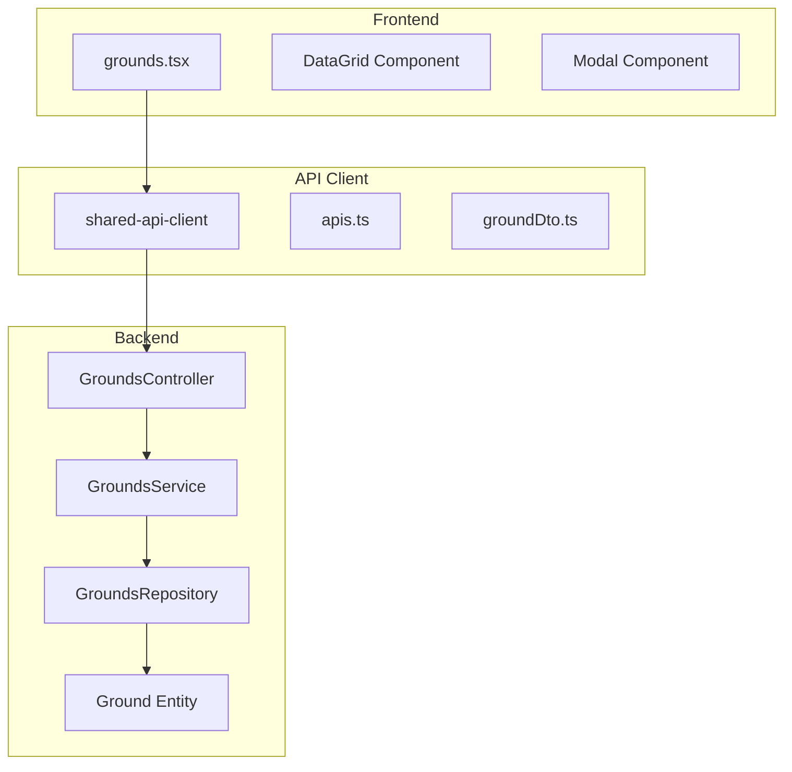
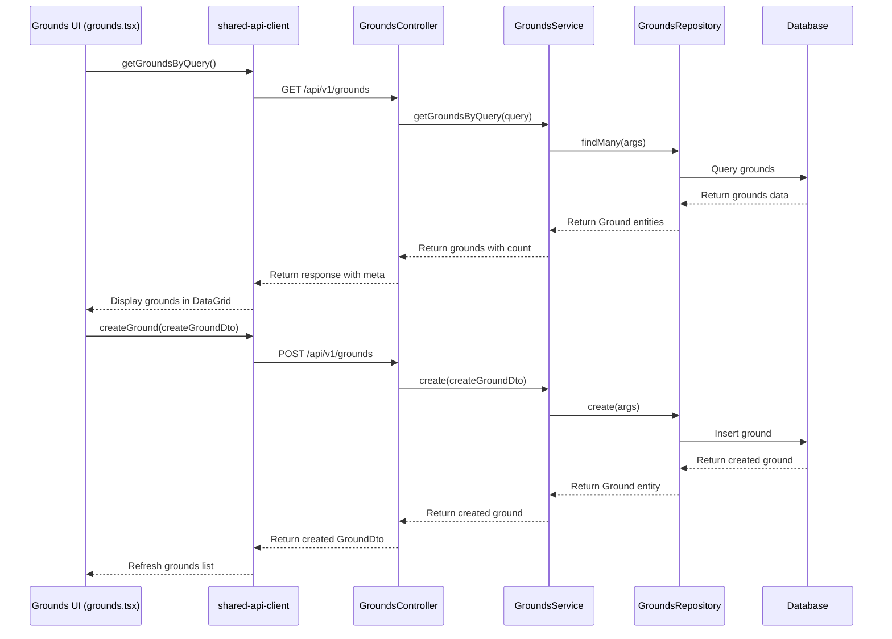
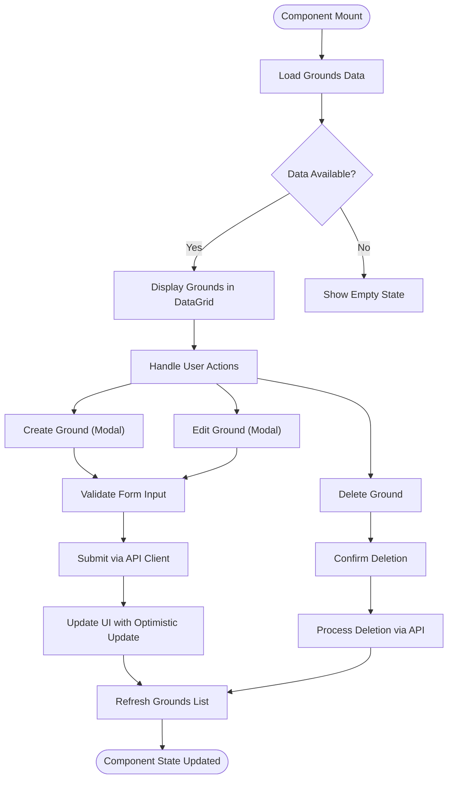
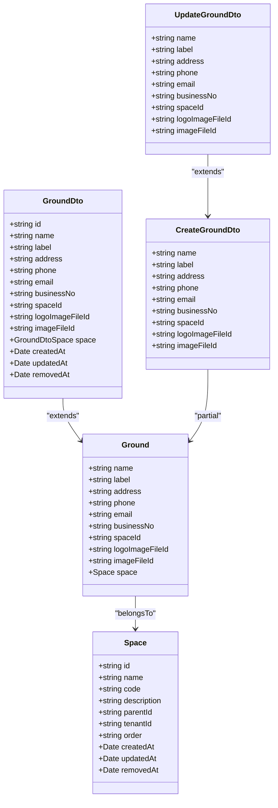
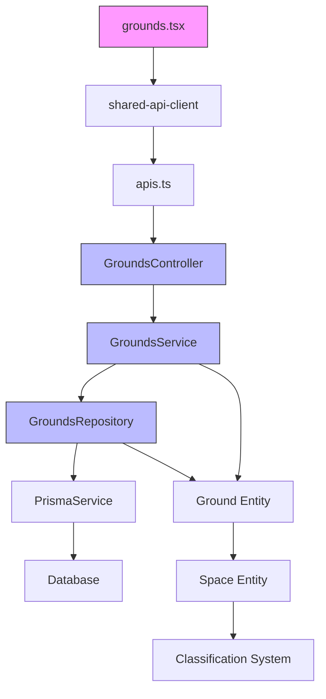

# Grounds Management

<cite>
**Referenced Files in This Document**   
- [grounds.tsx](file://apps/admin/src/routes/admin/dashboard/space-service/grounds.tsx)
- [grounds.module.ts](file://apps/server/src/module/grounds.module.ts)
- [grounds.repository.ts](file://apps/server/src/shared/repository/grounds.repository.ts)
- [grounds.service.ts](file://apps/server/src/shared/service/resources/grounds.service.ts)
- [grounds.controller.ts](file://apps/server/src/shared/controller/resources/grounds.controller.ts)
- [ground.entity.ts](file://packages/entity/src/ground.entity.ts)
- [create-ground.dto.ts](file://packages/dto/src/create/create-ground.dto.ts)
- [update-ground.dto.ts](file://packages/dto/src/update/update-ground.dto.ts)
- [apis.ts](file://packages/api/src/apis.ts)
- [groundDto.ts](file://packages/api/src/model/groundDto.ts)
</cite>

## Table of Contents
1. [Introduction](#introduction)
2. [Project Structure](#project-structure)
3. [Core Components](#core-components)
4. [Architecture Overview](#architecture-overview)
5. [Detailed Component Analysis](#detailed-component-analysis)
6. [Dependency Analysis](#dependency-analysis)
7. [Performance Considerations](#performance-considerations)
8. [Troubleshooting Guide](#troubleshooting-guide)
9. [Conclusion](#conclusion)

## Introduction
The Grounds Management sub-feature within the Space Service Module provides a comprehensive interface for viewing, creating, and managing grounds in the system. This documentation details the implementation of the `grounds.tsx` component, its data structure, relationship to spaces and classifications, and the API endpoints used for CRUD operations. The system follows a clean architecture pattern with separation of concerns between frontend components, API clients, and backend services.

## Project Structure

**Diagram sources**
- [grounds.tsx](file://apps/admin/src/routes/admin/dashboard/space-service/grounds.tsx)
- [grounds.controller.ts](file://apps/server/src/shared/controller/resources/grounds.controller.ts)
- [apis.ts](file://packages/api/src/apis.ts)

**Section sources**
- [grounds.tsx](file://apps/admin/src/routes/admin/dashboard/space-service/grounds.tsx)
- [grounds.module.ts](file://apps/server/src/module/grounds.module.ts)

## Core Components

The Grounds Management feature consists of several core components that work together to provide a seamless user experience. The frontend component `grounds.tsx` serves as the main interface for viewing and managing grounds, while the backend components handle data persistence and business logic. The shared-api-client provides type-safe API calls between the frontend and backend systems.

**Section sources**
- [grounds.tsx](file://apps/admin/src/routes/admin/dashboard/space-service/grounds.tsx)
- [ground.entity.ts](file://packages/entity/src/ground.entity.ts)
- [groundDto.ts](file://packages/api/src/model/groundDto.ts)

## Architecture Overview

**Diagram sources**
- [grounds.controller.ts](file://apps/server/src/shared/controller/resources/grounds.controller.ts)
- [grounds.service.ts](file://apps/server/src/shared/service/resources/grounds.service.ts)
- [grounds.repository.ts](file://apps/server/src/shared/repository/grounds.repository.ts)
- [apis.ts](file://packages/api/src/apis.ts)

## Detailed Component Analysis

### Grounds Component Analysis

The `grounds.tsx` component implements a comprehensive interface for managing grounds within the system. It uses the DataGrid component from shared-frontend to display grounds in a tabular format, with columns for name, location, and capacity. The component follows React best practices with proper state management and error handling.

**Diagram sources**
- [grounds.tsx](file://apps/admin/src/routes/admin/dashboard/space-service/grounds.tsx)
- [apis.ts](file://packages/api/src/apis.ts)

**Section sources**
- [grounds.tsx](file://apps/admin/src/routes/admin/dashboard/space-service/grounds.tsx)
- [create-ground.dto.ts](file://packages/dto/src/create/create-ground.dto.ts)
- [update-ground.dto.ts](file://packages/dto/src/update/update-ground.dto.ts)

### Data Structure and Relationships

The Ground entity has a well-defined structure with essential properties for managing physical locations. It maintains a relationship with the Space entity, allowing grounds to be associated with specific spaces in the system.

**Diagram sources**
- [ground.entity.ts](file://packages/entity/src/ground.entity.ts)
- [groundDto.ts](file://packages/api/src/model/groundDto.ts)
- [create-ground.dto.ts](file://packages/dto/src/create/create-ground.dto.ts)
- [update-ground.dto.ts](file://packages/dto/src/update/update-ground.dto.ts)

## Dependency Analysis

**Diagram sources**
- [grounds.module.ts](file://apps/server/src/module/grounds.module.ts)
- [grounds.controller.ts](file://apps/server/src/shared/controller/resources/grounds.controller.ts)
- [grounds.service.ts](file://apps/server/src/shared/service/resources/grounds.service.ts)
- [grounds.repository.ts](file://apps/server/src/shared/repository/grounds.repository.ts)

**Section sources**
- [grounds.module.ts](file://apps/server/src/module/grounds.module.ts)
- [go.mod](file://go.mod#L1-L30)

## Performance Considerations

For large ground datasets, the system implements several performance optimizations. The API endpoints support query parameters for filtering, sorting, and pagination, allowing the frontend to request only the data needed for the current view. The backend service uses efficient database queries with proper indexing on commonly searched fields like name and spaceId.

The frontend implements virtualized rendering for the DataGrid component, ensuring smooth scrolling even with thousands of grounds. Data fetching uses React Query for efficient caching and background updates, reducing the number of API calls and improving perceived performance.

When creating or updating grounds, the system uses optimistic updates to provide immediate feedback to users, while the actual API call happens in the background. This creates a responsive user experience even with network latency.

**Section sources**
- [grounds.service.ts](file://apps/server/src/shared/service/resources/grounds.service.ts)
- [apis.ts](file://packages/api/src/apis.ts)
- [grounds.tsx](file://apps/admin/src/routes/admin/dashboard/space-service/grounds.tsx)

## Troubleshooting Guide

Common issues in the Grounds Management system typically relate to form validation, API connectivity, and data consistency. Form validation follows a consistent pattern using the DTO classes which extend from base models and omit certain fields like entity metadata. When validation errors occur, they are typically related to required fields or format constraints.

For API connectivity issues, ensure that the shared-api-client is properly configured and that authentication tokens are valid. The system uses type-safe API calls which help catch many issues at compile time rather than runtime.

When dealing with classification hierarchies, ensure that the parent-child relationships are properly maintained and that circular references are avoided. The system handles soft deletes through the removedAt field, so deleted grounds remain in the database but are filtered out of normal queries.

For optimistic update issues, verify that the mutation functions in the shared-api-client are properly configured with appropriate onSuccess callbacks to refresh the query cache after mutations.

**Section sources**
- [grounds.controller.ts](file://apps/server/src/shared/controller/resources/grounds.controller.ts)
- [grounds.service.ts](file://apps/server/src/shared/service/resources/grounds.service.ts)
- [create-ground.dto.ts](file://packages/dto/src/create/create-ground.dto.ts)

## Conclusion

The Grounds Management sub-feature provides a robust and user-friendly interface for managing physical locations within the Space Service Module. The implementation follows clean architecture principles with clear separation between frontend components, API clients, and backend services. The system supports full CRUD operations with proper type safety, validation, and error handling.

Key strengths of the implementation include the use of shared components like DataGrid and Modal, type-safe API calls through the shared-api-client, and efficient data loading patterns for handling large datasets. The relationship between grounds and spaces is well-defined, allowing for hierarchical organization of physical locations.

For future improvements, consider adding bulk operations, enhanced filtering capabilities, and integration with mapping services for visual location management.