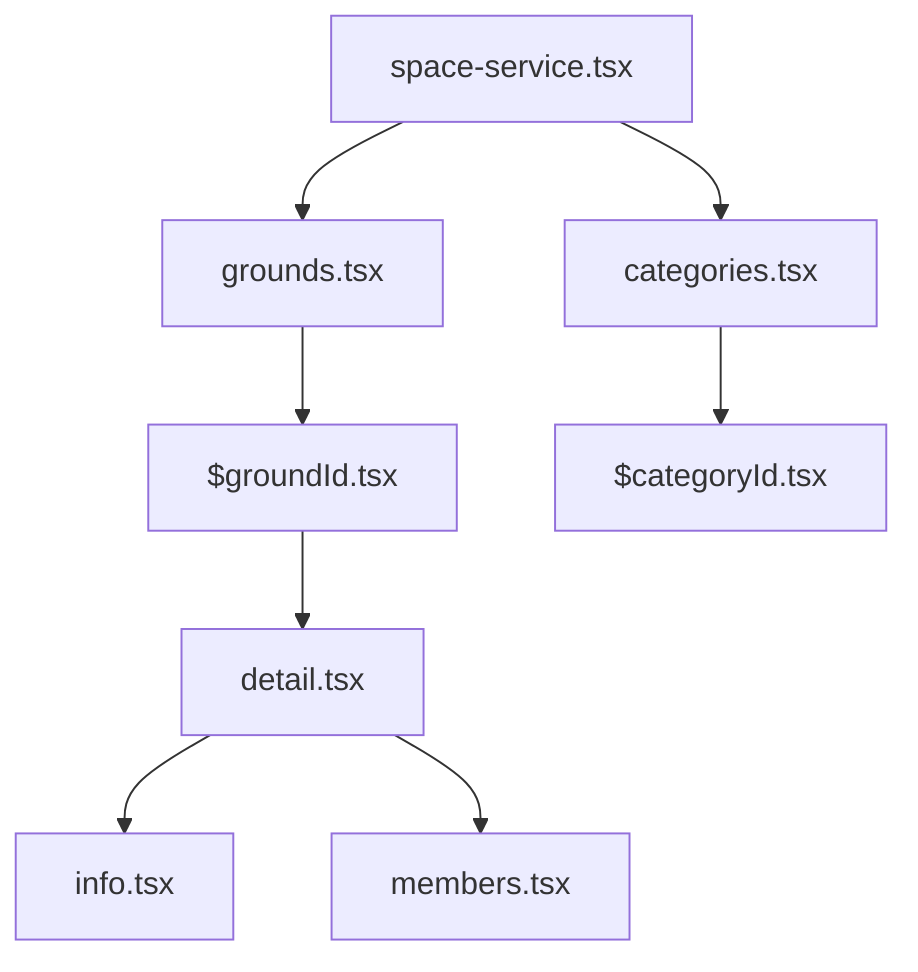
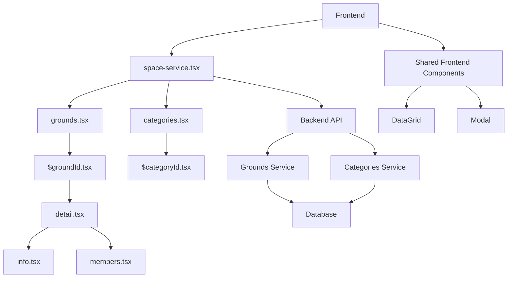
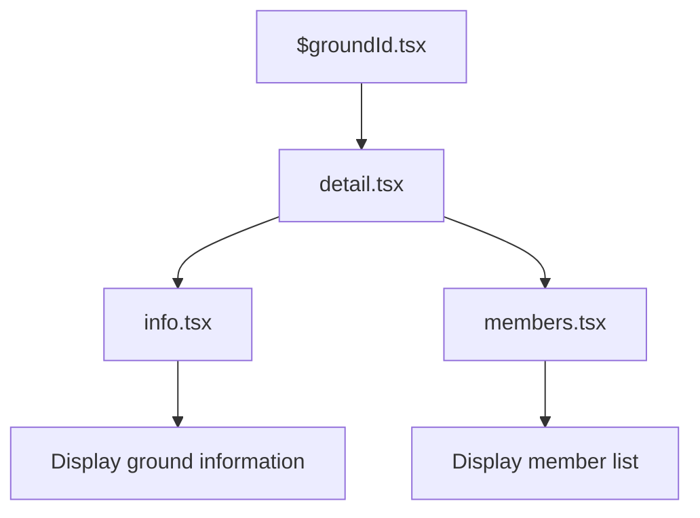
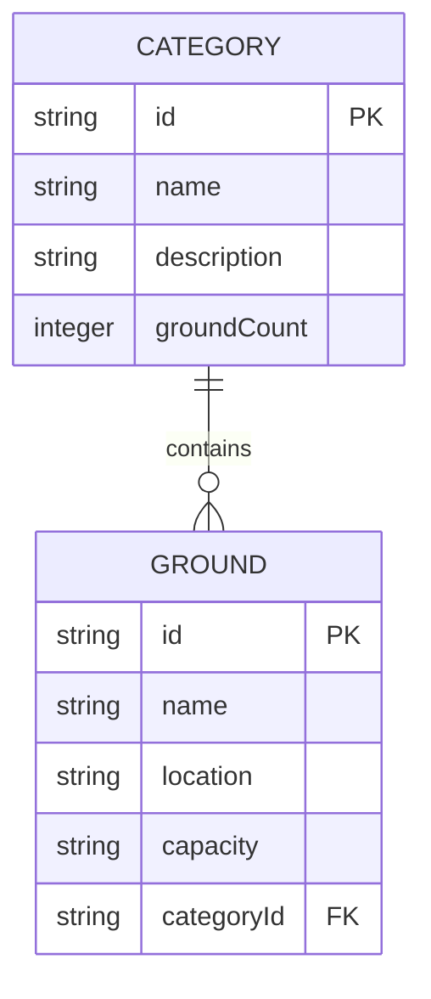
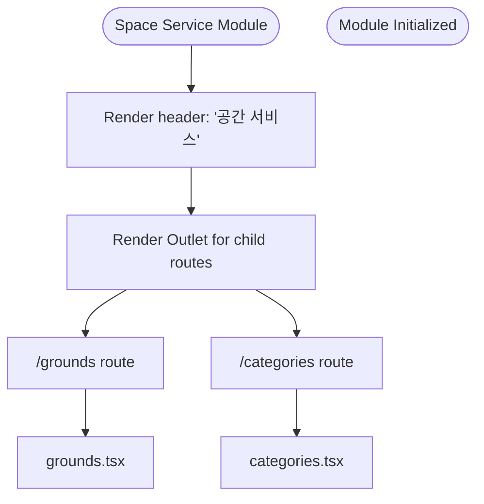

# Space Service Module

<cite>
**Referenced Files in This Document**   
- [space-service.tsx](file://apps/admin/src/routes/admin/dashboard/space-service.tsx)
- [grounds.tsx](file://apps/admin/src/routes/admin/dashboard/space-service/grounds.tsx)
- [categories.tsx](file://apps/admin/src/routes/admin/dashboard/space-service/categories.tsx)
- [$groundId.tsx](file://apps/admin/src/routes/admin/dashboard/space-service/grounds/$groundId.tsx)
- [detail.tsx](file://apps/admin/src/routes/admin/dashboard/space-service/grounds/$groundId/detail.tsx)
- [info.tsx](file://apps/admin/src/routes/admin/dashboard/space-service/grounds/$groundId/detail/info.tsx)
- [members.tsx](file://apps/admin/src/routes/admin/dashboard/space-service/grounds/$groundId/detail/members.tsx)
- [$categoryId.tsx](file://apps/admin/src/routes/admin/dashboard/space-service/categories/$categoryId.tsx)
- [grounds.service.ts](file://apps/server/src/shared/service/resources/grounds.service.ts)
- [spaceDto.ts](file://packages/api/src/model/spaceDto.ts)
- [create-ground.dto.ts](file://packages/dto/src/create/create-ground.dto.ts)
- [space-classification.entity.ts](file://packages/entity/src/space-classification.entity.ts)
- [migration.sql](file://packages/prisma/migrations/20250807132908_/migration.sql)
</cite>

## Table of Contents
1. [Introduction](#introduction)
2. [Project Structure](#project-structure)
3. [Core Components](#core-components)
4. [Architecture Overview](#architecture-overview)
5. [Detailed Component Analysis](#detailed-component-analysis)
6. [Dependency Analysis](#dependency-analysis)
7. [Performance Considerations](#performance-considerations)
8. [Troubleshooting Guide](#troubleshooting-guide)
9. [Conclusion](#conclusion)

## Introduction
The Space Service Module in prj-core provides comprehensive management capabilities for physical spaces through two primary interfaces: grounds and categories. This module enables administrators to organize, view, and manage spatial resources within the system. The implementation follows a hierarchical routing structure with shared state management and navigation context. The module leverages the shared-frontend UI components for consistent presentation across the application. This documentation details the implementation of the routing structure, data management patterns, and integration with backend services.

## Project Structure



**Diagram sources**
- [space-service.tsx](file://apps/admin/src/routes/admin/dashboard/space-service.tsx)
- [grounds.tsx](file://apps/admin/src/routes/admin/dashboard/space-service/grounds.tsx)
- [categories.tsx](file://apps/admin/src/routes/admin/dashboard/space-service/categories.tsx)

**Section sources**
- [space-service.tsx](file://apps/admin/src/routes/admin/dashboard/space-service.tsx)
- [grounds.tsx](file://apps/admin/src/routes/admin/dashboard/space-service/grounds.tsx)
- [categories.tsx](file://apps/admin/src/routes/admin/dashboard/space-service/categories.tsx)

## Core Components

The Space Service Module consists of several core components that work together to provide a cohesive user experience. The main container component, space-service.tsx, serves as the root for the module and provides shared context for its sub-modules. The grounds and categories components represent the two main management interfaces, each with their own routing hierarchy and data management patterns. These components utilize shared-frontend UI components like DataGrid and Modal to ensure consistent presentation across the application. The implementation demonstrates a clear separation of concerns between routing, data fetching, and presentation layers.

**Section sources**
- [space-service.tsx](file://apps/admin/src/routes/admin/dashboard/space-service.tsx)
- [grounds.tsx](file://apps/admin/src/routes/admin/dashboard/space-service/grounds.tsx)
- [categories.tsx](file://apps/admin/src/routes/admin/dashboard/space-service/categories.tsx)

## Architecture Overview



**Diagram sources**
- [space-service.tsx](file://apps/admin/src/routes/admin/dashboard/space-service.tsx)
- [grounds.service.ts](file://apps/server/src/shared/service/resources/grounds.service.ts)
- [spaceDto.ts](file://packages/api/src/model/spaceDto.ts)

## Detailed Component Analysis

### Grounds Management Interface

The grounds management interface provides comprehensive functionality for managing physical locations within the system. The implementation follows a hierarchical routing pattern with the main grounds.tsx component serving as the entry point. This component displays a list of all grounds using the DataGrid component from shared-frontend. When a specific ground is selected, the application navigates to the $groundId.tsx route, which serves as a container for detailed information about the selected ground.

#### Ground Detail Navigation


**Diagram sources**
- [$groundId.tsx](file://apps/admin/src/routes/admin/dashboard/space-service/grounds/$groundId.tsx)
- [detail.tsx](file://apps/admin/src/routes/admin/dashboard/space-service/grounds/$groundId/detail.tsx)
- [info.tsx](file://apps/admin/src/routes/admin/dashboard/space-service/grounds/$groundId/detail/info.tsx)
- [members.tsx](file://apps/admin/src/routes/admin/dashboard/space-service/grounds/$groundId/detail/members.tsx)

**Section sources**
- [$groundId.tsx](file://apps/admin/src/routes/admin/dashboard/space-service/grounds/$groundId.tsx)
- [detail.tsx](file://apps/admin/src/routes/admin/dashboard/space-service/grounds/$groundId/detail.tsx)
- [info.tsx](file://apps/admin/src/routes/admin/dashboard/space-service/grounds/$groundId/detail/info.tsx)
- [members.tsx](file://apps/admin/src/routes/admin/dashboard/space-service/grounds/$groundId/detail/members.tsx)

### Categories Management Interface

The categories management interface allows administrators to organize grounds into meaningful groups. The categories.tsx component serves as the main entry point, displaying a list of all categories with relevant metadata such as description and ground count. The implementation includes a "Add Category" button that enables creation of new categories. When a specific category is selected, the application navigates to the $categoryId.tsx route, which serves as a container for category-specific operations.

#### Category Data Structure


**Diagram sources**
- [categories.tsx](file://apps/admin/src/routes/admin/dashboard/space-service/categories.tsx)
- [$categoryId.tsx](file://apps/admin/src/routes/admin/dashboard/space-service/categories/$categoryId.tsx)
- [space-classification.entity.ts](file://packages/entity/src/space-classification.entity.ts)

**Section sources**
- [categories.tsx](file://apps/admin/src/routes/admin/dashboard/space-service/categories.tsx)
- [$categoryId.tsx](file://apps/admin/src/routes/admin/dashboard/space-service/categories/$categoryId.tsx)

### Space Service Container Component

The space-service.tsx component serves as the main container for the entire module. It provides a consistent header and layout for all sub-modules, ensuring a cohesive user experience. The component uses the Outlet pattern from @tanstack/react-router to render child routes, allowing for nested navigation while maintaining shared context.

#### Routing Structure


**Diagram sources**
- [space-service.tsx](file://apps/admin/src/routes/admin/dashboard/space-service.tsx)
- [routeTree.gen.ts](file://apps/admin/src/routeTree.gen.ts)

**Section sources**
- [space-service.tsx](file://apps/admin/src/routes/admin/dashboard/space-service.tsx)

## Dependency Analysis

```mermaid
graph TD
A[space-service.tsx] --> B[@tanstack/react-router]
A --> C[@heroui/react]
B --> D[Outlet component]
C --> E[UI components]
F[grounds.service.ts] --> G[@cocrepo/dto]
F --> H[@cocrepo/entity]
F --> I[GroundsRepository]
G --> J[CreateGroundDto]
H --> K[Ground entity]
I --> L[Database operations]
```

**Diagram sources**
- [space-service.tsx](file://apps/admin/src/routes/admin/dashboard/space-service.tsx)
- [grounds.service.ts](file://apps/server/src/shared/service/resources/grounds.service.ts)
- [create-ground.dto.ts](file://packages/dto/src/create/create-ground.dto.ts)
- [space-classification.entity.ts](file://packages/entity/src/space-classification.entity.ts)

**Section sources**
- [grounds.service.ts](file://apps/server/src/shared/service/resources/grounds.service.ts)
- [create-ground.dto.ts](file://packages/dto/src/create/create-ground.dto.ts)
- [space-classification.entity.ts](file://packages/entity/src/space-classification.entity.ts)

## Performance Considerations

The Space Service Module implements several performance optimization strategies for handling large datasets. The use of virtualized rendering in the DataGrid component ensures smooth scrolling even with thousands of records. Data fetching is implemented with pagination and lazy loading patterns to minimize initial load times. The module also implements caching strategies to reduce redundant API calls when navigating between related views. For the grounds and categories lists, the implementation uses memoization to prevent unnecessary re-renders when the underlying data hasn't changed. The tab-based navigation pattern between ground information and members ensures that only the currently visible content is fully rendered, improving overall performance.

## Troubleshooting Guide

Common issues in the Space Service Module typically relate to data loading, state persistence, and permission handling. For data loading issues, ensure that the API endpoints are properly configured and that the necessary query parameters are being passed. State persistence across navigation can be maintained using the shared-frontend store or URL parameters. Permission-based access control is implemented through route guards that check user roles before allowing access to specific functionality. When encountering issues with the tab-based navigation, verify that the route parameters are correctly passed between components. For issues with data display, check that the DataGrid component is properly configured with the correct column definitions and data mapping.

**Section sources**
- [space-service.tsx](file://apps/admin/src/routes/admin/dashboard/space-service.tsx)
- [grounds.tsx](file://apps/admin/src/routes/admin/dashboard/space-service/grounds.tsx)
- [categories.tsx](file://apps/admin/src/routes/admin/dashboard/space-service/categories.tsx)

## Conclusion

The Space Service Module in prj-core provides a robust and scalable solution for managing physical spaces through its grounds and categories interfaces. The implementation demonstrates effective use of hierarchical routing, shared state management, and consistent UI patterns through the shared-frontend components. The module's architecture supports both beginner-friendly navigation patterns and advanced performance optimizations for handling large datasets. By following the documented patterns for data fetching, error handling, and permission control, developers can extend the module's functionality while maintaining consistency with the existing codebase.