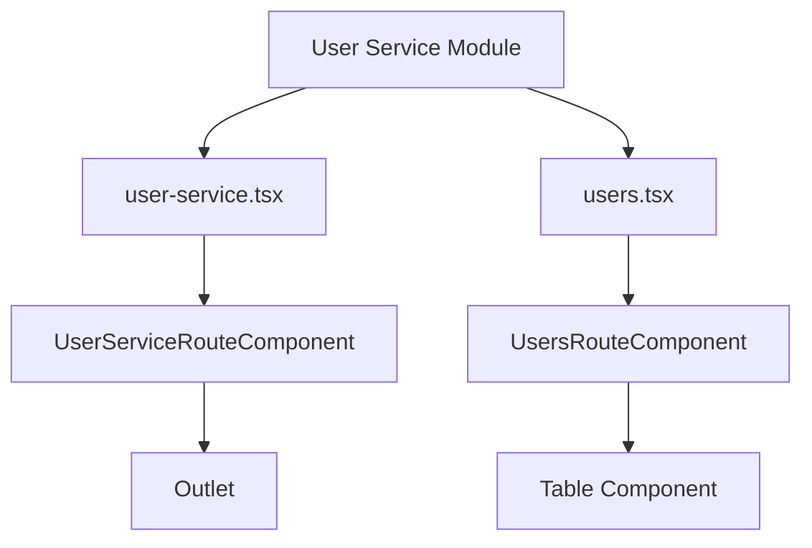
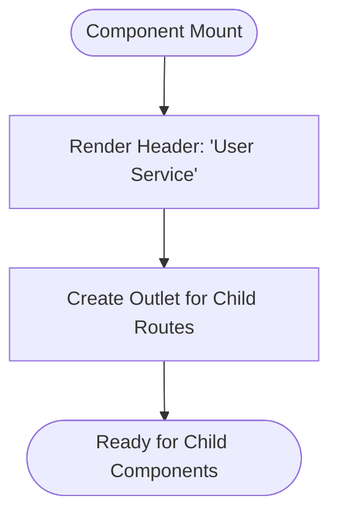
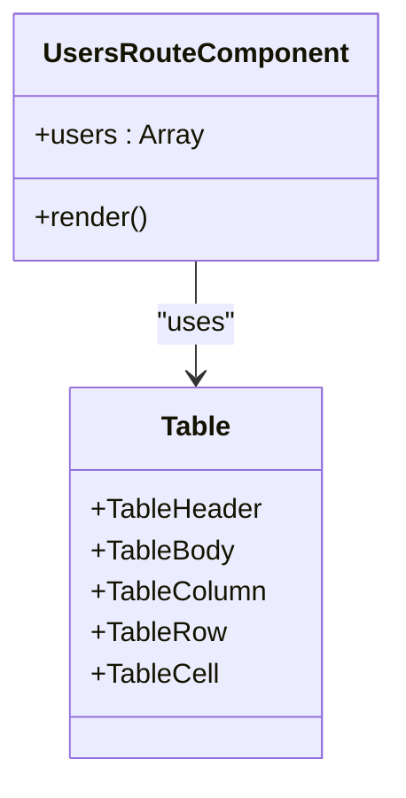
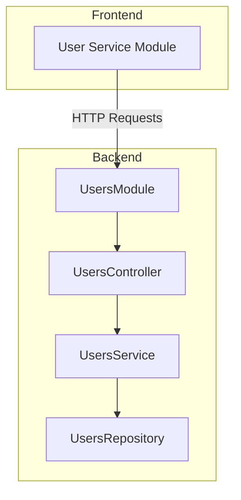

# User Service Module

<cite>
**Referenced Files in This Document**   
- [user-service.tsx](file://apps/admin/src/routes/admin/dashboard/user-service.tsx)
- [users.tsx](file://apps/admin/src/routes/admin/dashboard/user-service/users.tsx)
- [users.module.ts](file://apps/server/src/module/users.module.ts)
- [app.module.ts](file://apps/server/src/module/app.module.ts)
- [user.dto.ts](file://packages/dto/src/user.dto.ts)
</cite>

## Table of Contents
1. [Introduction](#introduction)
2. [Project Structure](#project-structure)
3. [Core Components](#core-components)
4. [Architecture Overview](#architecture-overview)
5. [Detailed Component Analysis](#detailed-component-analysis)
6. [Dependency Analysis](#dependency-analysis)
7. [Performance Considerations](#performance-considerations)
8. [Troubleshooting Guide](#troubleshooting-guide)
9. [Conclusion](#conclusion)

## Introduction
The User Service Module in prj-core provides a comprehensive interface for managing user data within the admin dashboard. This module implements a routing structure that organizes user management functionality under a dedicated dashboard section, with specialized views for listing and managing users. The implementation leverages React Query for data fetching, integrates with authentication context, and utilizes shared frontend components to maintain UI consistency across the application.

## Project Structure



**Diagram sources**
- [user-service.tsx](file://apps/admin/src/routes/admin/dashboard/user-service.tsx)
- [users.tsx](file://apps/admin/src/routes/admin/dashboard/user-service/users.tsx)

**Section sources**
- [user-service.tsx](file://apps/admin/src/routes/admin/dashboard/user-service.tsx)
- [users.tsx](file://apps/admin/src/routes/admin/dashboard/user-service/users.tsx)

## Core Components

The User Service Module consists of two primary components: the parent route component (user-service.tsx) that serves as a container for the user management interface, and the child route component (users.tsx) that renders the actual user listing. The parent component provides a consistent header and layout, while the child component implements the data display and interaction logic.

**Section sources**
- [user-service.tsx](file://apps/admin/src/routes/admin/dashboard/user-service.tsx)
- [users.tsx](file://apps/admin/src/routes/admin/dashboard/user-service/users.tsx)

## Architecture Overview

The User Service Module follows a hierarchical routing pattern where the main user-service route acts as a parent container, and specific user management views are rendered as children through the Outlet component. This architecture enables consistent layout and navigation while allowing for modular development of individual views.

```mermaid
graph TD
A[/admin/dashboard/user-service] --> B[/admin/dashboard/user-service/users]
A --> C[/admin/dashboard/user-service/roles]
A --> D[/admin/dashboard/user-service/permissions]
B --> E[Users Listing View]
C --> F[Roles Management View]
D --> G[Permissions Management View]
```

**Diagram sources**
- [user-service.tsx](file://apps/admin/src/routes/admin/dashboard/user-service.tsx)
- [routeTree.gen.ts](file://apps/admin/src/routeTree.gen.ts)

## Detailed Component Analysis

### User Service Route Analysis

The UserServiceRouteComponent serves as the parent route for all user management functionality. It provides a consistent header ("사용자 서비스" - User Service) and contains an Outlet component that renders child routes. This design pattern enables a cohesive user experience while maintaining separation of concerns between the container and content components.



**Diagram sources**
- [user-service.tsx](file://apps/admin/src/routes/admin/dashboard/user-service.tsx)

### Users Listing Analysis

The UsersRouteComponent implements the user listing interface with a table layout that displays user information including name and phone number. While the current implementation uses mock data, it follows a pattern that would be extended to integrate with API endpoints in a production environment. The component utilizes the Table component from the shared UI library to ensure consistent styling and behavior.



**Diagram sources**
- [users.tsx](file://apps/admin/src/routes/admin/dashboard/user-service/users.tsx)
- [@heroui/react](file://node_modules/@heroui/react)

### Backend Integration Analysis

The UsersModule on the server side provides the API endpoints that would support the user interface. Registered under the "/api/v1/users" path in the AppModule, this module exposes RESTful endpoints for user management operations. It follows a standard NestJS module pattern with controllers, services, and repositories organized through shared imports.



**Diagram sources**
- [users.module.ts](file://apps/server/src/module/users.module.ts)
- [app.module.ts](file://apps/server/src/module/app.module.ts)

**Section sources**
- [users.module.ts](file://apps/server/src/module/users.module.ts)
- [app.module.ts](file://apps/server/src/module/app.module.ts)

## Dependency Analysis

The User Service Module has dependencies on several shared components and services. On the frontend, it relies on the routing system from @tanstack/react-router and UI components from @heroui/react. On the backend, it integrates with the shared module that provides controllers, services, and repositories. The module also depends on the authentication system for access control.

```mermaid
graph LR
A[User Service Module] --> B[@tanstack/react-router]
A --> C[@heroui/react]
A --> D[Shared Frontend Components]
A --> E[Authentication Context]
A --> F[API Client]
F --> G[UsersModule]
G --> H[Database]
```

**Diagram sources**
- [user-service.tsx](file://apps/admin/src/routes/admin/dashboard/user-service.tsx)
- [users.module.ts](file://apps/server/src/module/users.module.ts)

**Section sources**
- [user-service.tsx](file://apps/admin/src/routes/admin/dashboard/user-service.tsx)
- [users.module.ts](file://apps/server/src/module/users.module.ts)

## Performance Considerations

The current implementation uses mock data in the users listing component, which provides immediate rendering but doesn't reflect real-world data fetching patterns. In a production environment, implementing React Query for data fetching would enable features like caching, background updates, and loading states. The hierarchical routing structure may impact initial load performance if not optimized with code splitting.

## Troubleshooting Guide

Common issues with the User Service Module include routing configuration errors, API integration problems, and state management inconsistencies. Ensure that route paths match exactly between the frontend and backend configurations. When implementing real data fetching, verify that the API client is properly configured and that authentication tokens are included in requests. For table rendering issues, check that the data structure matches the expected format of the Table component.

**Section sources**
- [user-service.tsx](file://apps/admin/src/routes/admin/dashboard/user-service.tsx)
- [users.tsx](file://apps/admin/src/routes/admin/dashboard/user-service/users.tsx)

## Conclusion

The User Service Module in prj-core demonstrates a well-structured approach to user management with a clear separation between routing, presentation, and data handling concerns. The implementation follows modern React patterns with TanStack Router for routing and leverages shared components for UI consistency. While currently using mock data, the architecture is designed to easily integrate with the backend UsersModule through API calls. Future enhancements should focus on implementing React Query for data fetching, adding form handling for user operations, and expanding the modal-based detail views for comprehensive user management.