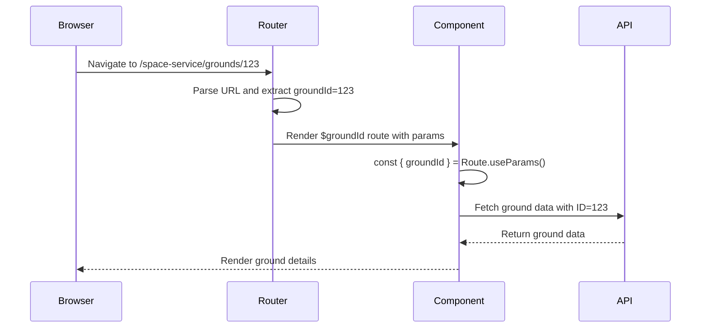
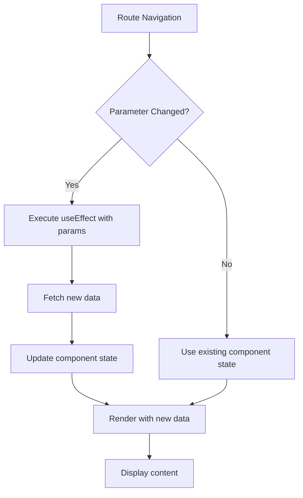
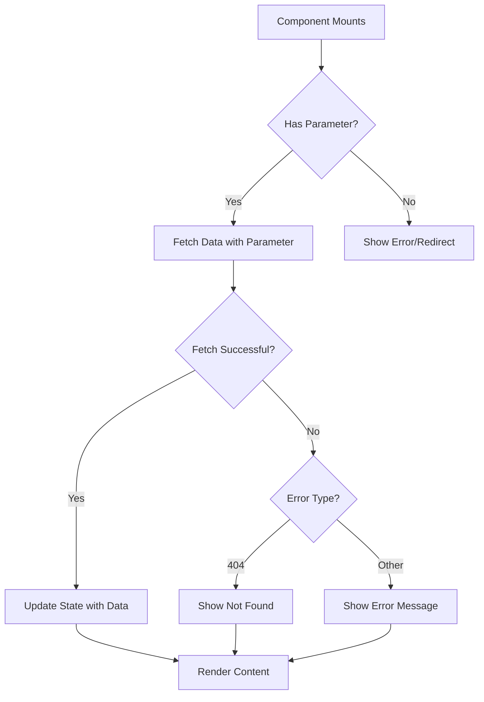
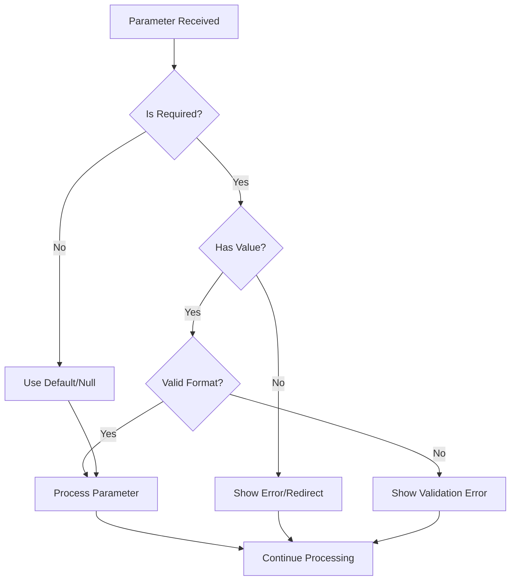
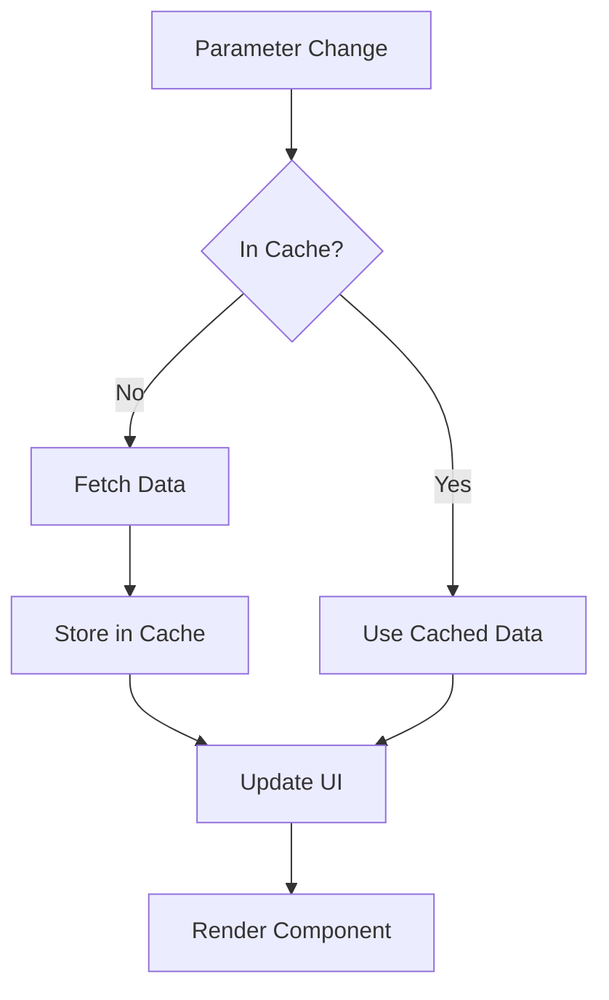

# Dynamic Route Parameters

<cite>
**Referenced Files in This Document**   
- [routeTree.gen.ts](file://apps/admin/src/routeTree.gen.ts)
- [index.tsx](file://apps/admin/src/routes/index.tsx)
- [admin.tsx](file://apps/admin/src/routes/admin.tsx)
- [$categoryId.tsx](file://apps/admin/src/routes/admin/dashboard/space-service/categories/$categoryId.tsx)
- [categories.tsx](file://apps/admin/src/routes/admin/dashboard/space-service/categories.tsx)
- [$groundId.tsx](file://apps/admin/src/routes/admin/dashboard/space-service/grounds/$groundId.tsx)
- [grounds.tsx](file://apps/admin/src/routes/admin/dashboard/space-service/grounds.tsx)
- [$groundId/detail.tsx](file://apps/admin/src/routes/admin/dashboard/space-service/grounds/$groundId/detail.tsx)
- [$groundId/detail/info.tsx](file://apps/admin/src/routes/admin/dashboard/space-service/grounds/$groundId/detail/info.tsx)
- [$groundId/detail/members.tsx](file://apps/admin/src/routes/admin/dashboard/space-service/grounds/$groundId/detail/members.tsx)
- [$groundId/modify.tsx](file://apps/admin/src/routes/admin/dashboard/space-service/grounds/$groundId/modify.tsx)
- [$groundId/create.tsx](file://apps/admin/src/routes/admin/dashboard/space-service/grounds/$groundId/create.tsx)
- [App.tsx](file://apps/admin/src/App.tsx)
</cite>

## Table of Contents
1. [Introduction](#introduction)
2. [Dynamic Route Parameters Implementation](#dynamic-route-parameters-implementation)
3. [Parameter Access and Usage](#parameter-access-and-usage)
4. [Nested Dynamic Routes](#nested-dynamic-routes)
5. [Common Issues and Solutions](#common-issues-and-solutions)
6. [Data Fetching Strategies](#data-fetching-strategies)
7. [Type Safety and Validation](#type-safety-and-validation)
8. [Performance Optimization](#performance-optimization)
9. [Conclusion](#conclusion)

## Introduction
The prj-core admin application implements a sophisticated routing system using dynamic parameters to enable data-driven navigation to specific resources. This documentation details the implementation and usage of dynamic route parameters, focusing on the $-prefix convention used throughout the space-service dashboard. The system allows for flexible navigation to specific categories, grounds, and their associated resources through parameterized routes that extract and utilize URL segments as data identifiers.

**Section sources**
- [routeTree.gen.ts](file://apps/admin/src/routeTree.gen.ts#L1-L572)
- [App.tsx](file://apps/admin/src/App.tsx#L1-L21)

## Dynamic Route Parameters Implementation
The dynamic routing system in prj-core's admin application follows the TanStack Router convention, using the $-prefix to denote dynamic segments in route paths. This implementation enables the application to create parameterized routes that can handle variable resource identifiers.

The route structure is defined in the file system with special naming conventions. Files containing dynamic parameters are named with the $-prefix followed by the parameter name (e.g., $categoryId.tsx, $groundId.tsx). These files are automatically processed by the router to create routes that can capture values from the URL.

The routeTree.gen.ts file contains the generated route definitions that map the file structure to actual routes. For example, the route `/admin/dashboard/space-service/categories/$categoryId` is defined with the path `/$categoryId`, allowing any value to be captured as the categoryId parameter.

```mermaid
graph TD
A[/admin] --> B[/dashboard]
B --> C[/space-service]
C --> D[/categories]
D --> E[$categoryId]
E --> F[detail]
F --> G[info]
F --> H[members]
C --> I[/grounds]
I --> J[$groundId]
J --> K[detail]
J --> L[modify]
J --> M[create]
K --> N[info]
K --> O[members]
```

**Diagram sources**
- [routeTree.gen.ts](file://apps/admin/src/routeTree.gen.ts#L1-L572)
- [categories.tsx](file://apps/admin/src/routes/admin/dashboard/space-service/categories.tsx#L1-L17)
- [grounds.tsx](file://apps/admin/src/routes/admin/dashboard/space-service/grounds.tsx#L1-L17)

**Section sources**
- [routeTree.gen.ts](file://apps/admin/src/routeTree.gen.ts#L1-L572)
- [$categoryId.tsx](file://apps/admin/src/routes/admin/dashboard/space-service/categories/$categoryId.tsx#L1-L12)
- [$groundId.tsx](file://apps/admin/src/routes/admin/dashboard/space-service/grounds/$groundId.tsx#L1-L21)

## Parameter Access and Usage
Dynamic route parameters are accessed within components using the `useParams()` hook provided by the TanStack Router. This hook returns an object containing all the parameters defined in the route path.

For example, in the $groundId.tsx component, the groundId parameter is extracted using `Route.useParams()`:

```typescript
const { groundId } = Route.useParams();
```

This parameter can then be used within the component for rendering, data fetching, or other logic. The groundId value is captured from the URL segment and made available as a string within the component.

The parameter values are automatically decoded and can be used directly in the application logic. For instance, when navigating to `/admin/dashboard/space-service/grounds/123`, the groundId parameter will have the value "123", which can be used to fetch the corresponding ground data from the API.



**Diagram sources**
- [$groundId.tsx](file://apps/admin/src/routes/admin/dashboard/space-service/grounds/$groundId.tsx#L1-L21)
- [$groundId/detail/info.tsx](file://apps/admin/src/routes/admin/dashboard/space-service/grounds/$groundId/detail/info.tsx#L1-L40)
- [$groundId/detail/members.tsx](file://apps/admin/src/routes/admin/dashboard/space-service/grounds/$groundId/detail/members.tsx#L1-L90)

**Section sources**
- [$groundId.tsx](file://apps/admin/src/routes/admin/dashboard/space-service/grounds/$groundId.tsx#L1-L21)
- [$categoryId.tsx](file://apps/admin/src/routes/admin/dashboard/space-service/categories/$categoryId.tsx#L1-L12)
- [$groundId/detail/info.tsx](file://apps/admin/src/routes/admin/dashboard/space-service/grounds/$groundId/detail/info.tsx#L1-L40)

## Nested Dynamic Routes
The prj-core admin application implements nested dynamic routes to support multi-level resource views. This pattern allows for complex navigation hierarchies where multiple levels of dynamic parameters can be used together.

For example, the ground detail view uses a nested route structure:
- `/admin/dashboard/space-service/grounds/$groundId` - The main ground route
- `/admin/dashboard/space-service/grounds/$groundId/detail` - The detail layout route
- `/admin/dashboard/space-service/grounds/$groundId/detail/info` - The info sub-route
- `/admin/dashboard/space-service/grounds/$groundId/detail/members` - The members sub-route

This nesting allows the application to maintain the groundId parameter throughout the nested routes, enabling access to the same parameter in all child routes. The parent route can render a layout with navigation between the child routes, while each child route can access the groundId parameter to fetch the appropriate data.

The nested route structure is defined in the file system with directories and files following the route hierarchy. The $groundId directory contains the detail directory, which in turn contains the info.tsx and members.tsx files, creating the nested route structure.

```mermaid
graph TD
A[$groundId] --> B[detail]
B --> C[info]
B --> D[members]
B --> E[modify]
B --> F[create]
style A fill:#f9f,stroke:#333
style B fill:#bbf,stroke:#333
style C fill:#f96,stroke:#333
style D fill:#f96,stroke:#333
style E fill:#f96,stroke:#333
style F fill:#f96,stroke:#333
subgraph "URL Pattern"
A1[/grounds/123]
A1 --> B1[/grounds/123/detail]
B1 --> C1[/grounds/123/detail/info]
B1 --> D1[/grounds/123/detail/members]
end
```

**Diagram sources**
- [routeTree.gen.ts](file://apps/admin/src/routeTree.gen.ts#L1-L572)
- [$groundId.tsx](file://apps/admin/src/routes/admin/dashboard/space-service/grounds/$groundId.tsx#L1-L21)
- [$groundId/detail.tsx](file://apps/admin/src/routes/admin/dashboard/space-service/grounds/$groundId/detail.tsx#L1-L24)

**Section sources**
- [$groundId/detail.tsx](file://apps/admin/src/routes/admin/dashboard/space-service/grounds/$groundId/detail.tsx#L1-L24)
- [$groundId/detail/info.tsx](file://apps/admin/src/routes/admin/dashboard/space-service/grounds/$groundId/detail/info.tsx#L1-L40)
- [$groundId/detail/members.tsx](file://apps/admin/src/routes/admin/dashboard/space-service/grounds/$groundId/detail/members.tsx#L1-L90)
- [$groundId/modify.tsx](file://apps/admin/src/routes/admin/dashboard/space-service/grounds/$groundId/modify.tsx#L1-L136)
- [$groundId/create.tsx](file://apps/admin/src/routes/admin/dashboard/space-service/grounds/$groundId/create.tsx#L1-L17)

## Common Issues and Solutions
When working with dynamic route parameters, several common issues can arise. Understanding these issues and their solutions is crucial for building robust applications.

### Parameter Parsing Errors
One common issue is parameter parsing errors when the parameter value contains special characters or is malformed. The router automatically handles URL decoding, but developers should validate that the parameter values are in the expected format.

### Type Safety Concerns
Since route parameters are always strings, type safety can be a concern when expecting numeric or other typed values. Developers should implement proper type conversion and validation when using parameters in type-sensitive contexts.

### Stale Data in Component Reuse
When navigating between different parameter values (e.g., from ground 123 to ground 456), React components may be reused, potentially leading to stale data if data fetching is not properly managed. This can be addressed by implementing proper data fetching patterns that respond to parameter changes.

### Route Lifecycle Management
Understanding the route lifecycle is important for managing side effects. When a parameter changes, the component may not be recreated, so effects that depend on parameter changes need to be properly set up with appropriate dependencies.



**Diagram sources**
- [$groundId.tsx](file://apps/admin/src/routes/admin/dashboard/space-service/grounds/$groundId.tsx#L1-L21)
- [$groundId/detail/info.tsx](file://apps/admin/src/routes/admin/dashboard/space-service/grounds/$groundId/detail/info.tsx#L1-L40)
- [$groundId/modify.tsx](file://apps/admin/src/routes/admin/dashboard/space-service/grounds/$groundId/modify.tsx#L1-L136)

**Section sources**
- [$groundId.tsx](file://apps/admin/src/routes/admin/dashboard/space-service/grounds/$groundId.tsx#L1-L21)
- [$groundId/detail/info.tsx](file://apps/admin/src/routes/admin/dashboard/space-service/grounds/$groundId/detail/info.tsx#L1-L40)
- [$groundId/modify.tsx](file://apps/admin/src/routes/admin/dashboard/space-service/grounds/$groundId/modify.tsx#L1-L136)

## Data Fetching Strategies
Effective data fetching is critical when working with dynamic route parameters. The prj-core admin application should implement strategies that ensure data is fetched correctly when parameters change.

### Using useEffect with Parameters
The most common approach is to use the useEffect hook with the parameter as a dependency. This ensures that data is refetched whenever the parameter changes:

```typescript
useEffect(() => {
  if (groundId) {
    fetchGroundData(groundId);
  }
}, [groundId]);
```

### Route Preloading
For better user experience, data can be preloaded when navigating to a route. This can be achieved by fetching data in the route definition or using router hooks that trigger before the component mounts.

### Error Handling
Proper error handling should be implemented to manage cases where the parameter does not correspond to a valid resource. This includes handling 404 errors when a resource is not found and providing appropriate user feedback.



**Diagram sources**
- [$groundId/detail/info.tsx](file://apps/admin/src/routes/admin/dashboard/space-service/grounds/$groundId/detail/info.tsx#L1-L40)
- [$groundId/detail/members.tsx](file://apps/admin/src/routes/admin/dashboard/space-service/grounds/$groundId/detail/members.tsx#L1-L90)
- [$groundId/modify.tsx](file://apps/admin/src/routes/admin/dashboard/space-service/grounds/$groundId/modify.tsx#L1-L136)

**Section sources**
- [$groundId/detail/info.tsx](file://apps/admin/src/routes/admin/dashboard/space-service/grounds/$groundId/detail/info.tsx#L1-L40)
- [$groundId/detail/members.tsx](file://apps/admin/src/routes/admin/dashboard/space-service/grounds/$groundId/detail/members.tsx#L1-L90)
- [$groundId/modify.tsx](file://apps/admin/src/routes/admin/dashboard/space-service/grounds/$groundId/modify.tsx#L1-L136)

## Type Safety and Validation
Ensuring type safety and proper validation is essential when working with dynamic route parameters. The prj-core admin application should implement robust type checking and validation mechanisms.

### Parameter Type Conversion
Since route parameters are always strings, explicit type conversion should be performed when numeric or other typed values are expected:

```typescript
const numericId = parseInt(groundId, 10);
if (isNaN(numericId)) {
  // Handle invalid number
}
```

### Validation Middleware
Validation can be implemented as middleware or within the component to ensure parameters meet expected criteria before proceeding with data fetching or rendering.

### Required vs Optional Parameters
The routing system should distinguish between required and optional parameters, with appropriate handling for each case. Required parameters should be validated, while optional parameters should have default values or null handling.



**Diagram sources**
- [$groundId.tsx](file://apps/admin/src/routes/admin/dashboard/space-service/grounds/$groundId.tsx#L1-L21)
- [$categoryId.tsx](file://apps/admin/src/routes/admin/dashboard/space-service/categories/$categoryId.tsx#L1-L12)

**Section sources**
- [$groundId.tsx](file://apps/admin/src/routes/admin/dashboard/space-service/grounds/$groundId.tsx#L1-L21)
- [$categoryId.tsx](file://apps/admin/src/routes/admin/dashboard/space-service/categories/$categoryId.tsx#L1-L12)

## Performance Optimization
Optimizing performance is crucial when working with dynamic routes, especially when dealing with frequent parameter changes or complex data fetching.

### Memoization
Use memoization techniques to prevent unnecessary re-renders when parameters change. React's useMemo and useCallback hooks can be used to memoize expensive computations or callback functions that depend on parameters.

### Data Caching
Implement data caching strategies to avoid refetching the same data when navigating between routes with the same parameters. This can significantly improve performance and reduce server load.

### Lazy Loading
Consider lazy loading components for nested routes to improve initial load times and reduce bundle size.



**Diagram sources**
- [$groundId/detail/info.tsx](file://apps/admin/src/routes/admin/dashboard/space-service/grounds/$groundId/detail/info.tsx#L1-L40)
- [$groundId/detail/members.tsx](file://apps/admin/src/routes/admin/dashboard/space-service/grounds/$groundId/detail/members.tsx#L1-L90)

**Section sources**
- [$groundId/detail/info.tsx](file://apps/admin/src/routes/admin/dashboard/space-service/grounds/$groundId/detail/info.tsx#L1-L40)
- [$groundId/detail/members.tsx](file://apps/admin/src/routes/admin/dashboard/space-service/grounds/$groundId/detail/members.tsx#L1-L90)

## Conclusion
The dynamic route parameter system in prj-core's admin application provides a flexible and powerful way to navigate to specific resources using the $-prefix convention. By understanding the implementation details, parameter access patterns, and best practices for data fetching and performance optimization, developers can effectively utilize this system to create rich, data-driven user experiences.

The nested route structure enables complex navigation hierarchies while maintaining access to dynamic parameters throughout the route tree. Proper handling of common issues such as parameter parsing errors, type safety concerns, and stale data is essential for building robust applications.

By following the patterns and strategies outlined in this documentation, both beginner and experienced developers can effectively work with dynamic route parameters in the prj-core admin application, creating efficient and maintainable code that provides excellent user experiences.