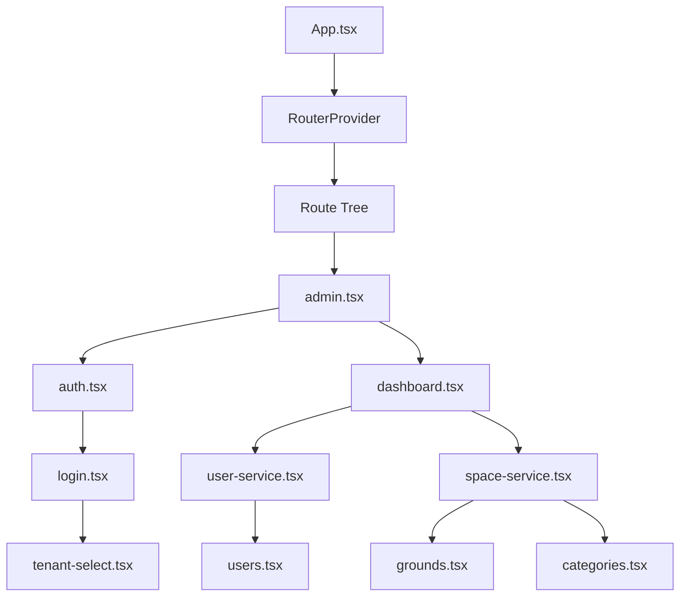
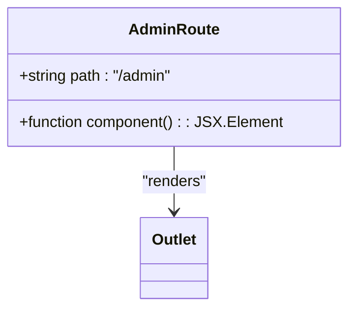
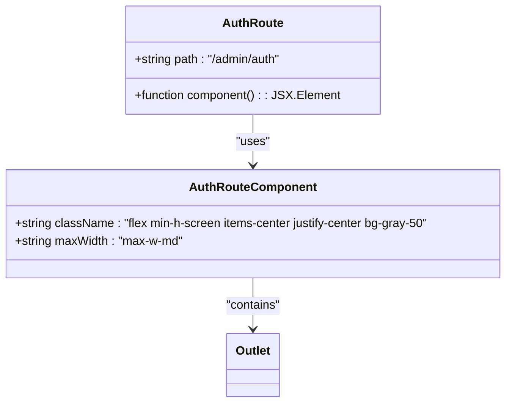
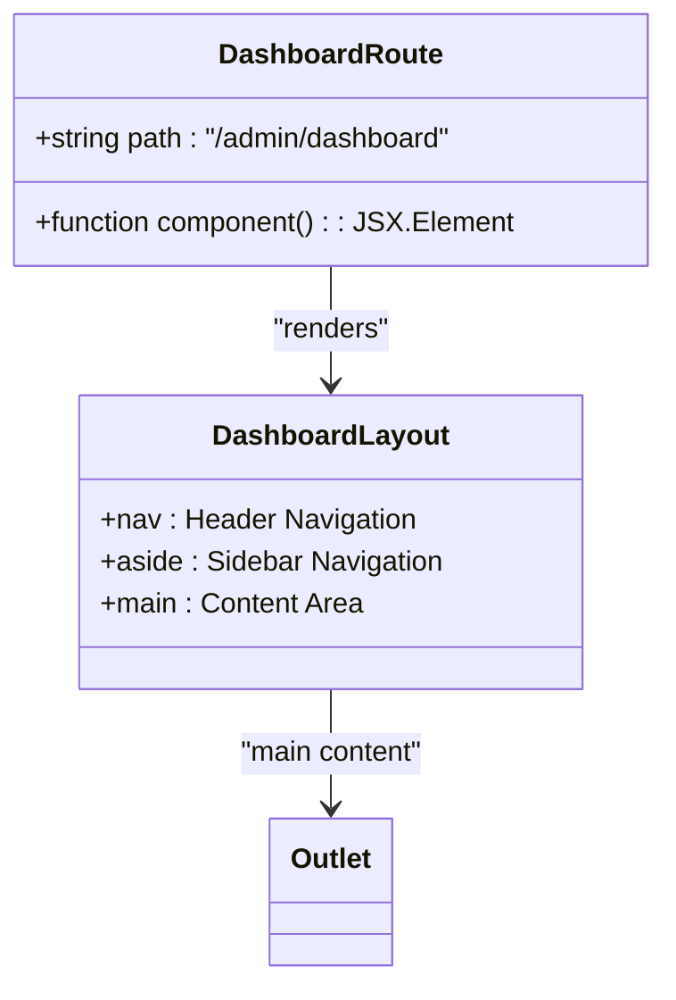
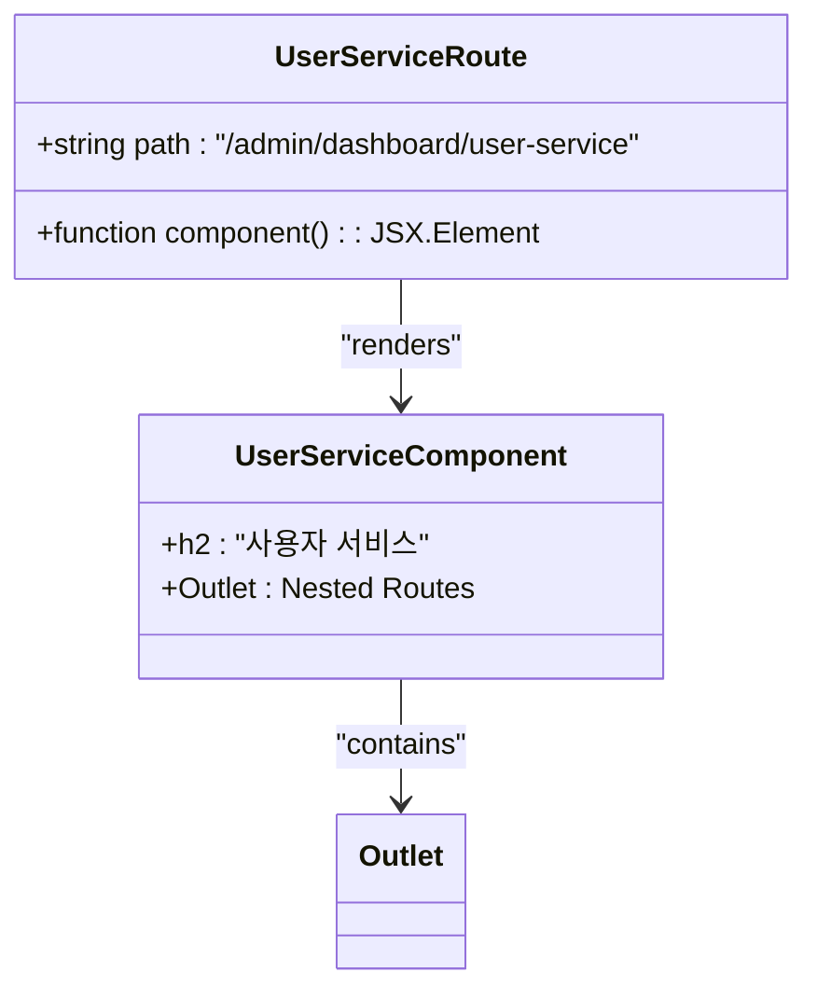
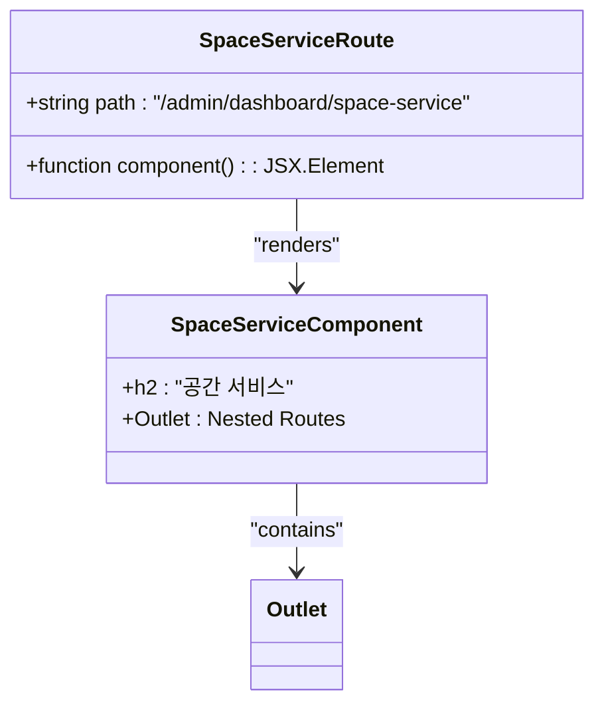
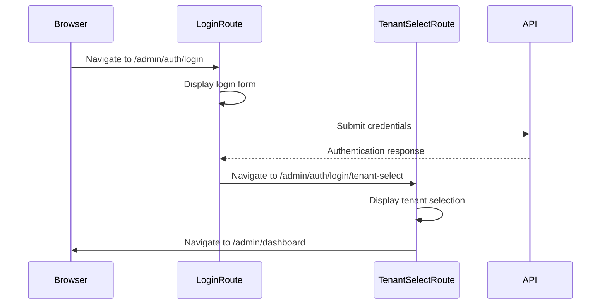
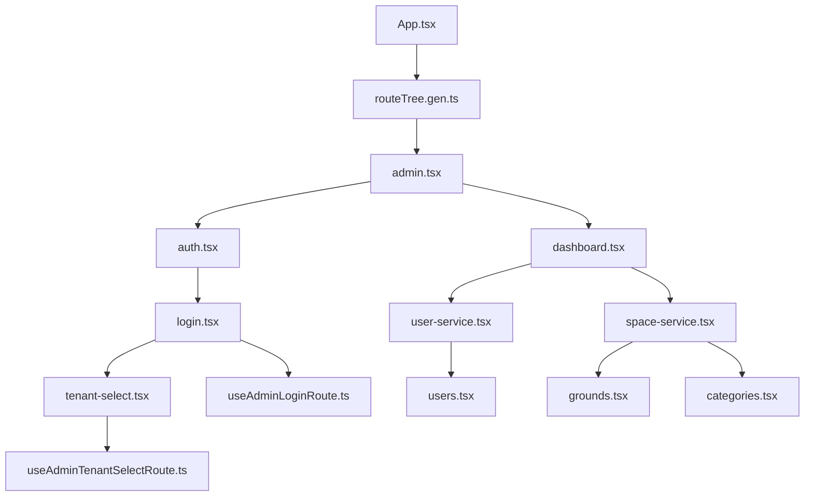

# Route Configuration and Layout

<cite>
**Referenced Files in This Document**   
- [admin.tsx](file://apps/admin/src/routes/admin.tsx)
- [auth.tsx](file://apps/admin/src/routes/admin/auth.tsx)
- [dashboard.tsx](file://apps/admin/src/routes/admin/dashboard.tsx)
- [user-service.tsx](file://apps/admin/src/routes/admin/dashboard/user-service.tsx)
- [space-service.tsx](file://apps/admin/src/routes/admin/dashboard/space-service.tsx)
- [login.tsx](file://apps/admin/src/routes/admin/auth/login.tsx)
- [tenant-select.tsx](file://apps/admin/src/routes/admin/auth/login/tenant-select.tsx)
- [App.tsx](file://apps/admin/src/App.tsx)
- [routeTree.gen.ts](file://apps/admin/src/routeTree.gen.ts)
- [useAdminLoginRoute.ts](file://apps/admin/src/hooks/useAdminLoginRoute.ts)
- [useAdminTenantSelectRoute.ts](file://apps/admin/src/hooks/useAdminTenantSelectRoute.ts)
</cite>

## Table of Contents
1. [Introduction](#introduction)
2. [Project Structure](#project-structure)
3. [Core Components](#core-components)
4. [Architecture Overview](#architecture-overview)
5. [Detailed Component Analysis](#detailed-component-analysis)
6. [Dependency Analysis](#dependency-analysis)
7. [Performance Considerations](#performance-considerations)
8. [Troubleshooting Guide](#troubleshooting-guide)
9. [Conclusion](#conclusion)

## Introduction
The Route Configuration and Layout system in prj-core's admin application implements a hierarchical routing structure using TanStack Router. This system organizes the application into major sections including authentication and dashboard, with nested routing for service-specific functionality. The layout components provide shared UI elements and route composition patterns that enable consistent navigation and access control throughout the application.

## Project Structure

```mermaid
graph TD
A[Root] --> B[/admin]
B --> C[/admin/auth]
B --> D[/admin/dashboard]
C --> E[/admin/auth/login]
E --> F[/admin/auth/login/tenant-select]
D --> G[/admin/dashboard/user-service]
D --> H[/admin/dashboard/space-service]
G --> I[/admin/dashboard/user-service/users]
H --> J[/admin/dashboard/space-service/grounds]
H --> K[/admin/dashboard/space-service/categories]
```

**Diagram sources**
- [routeTree.gen.ts](file://apps/admin/src/routeTree.gen.ts)

**Section sources**
- [routeTree.gen.ts](file://apps/admin/src/routeTree.gen.ts)

## Core Components

The core components of the routing system include the root layout component (admin.tsx), authentication layout (auth.tsx), and dashboard layout (dashboard.tsx). These components define the application shell and organize major sections with shared UI elements. The system uses nested routing to create a hierarchical structure where child routes inherit layout properties from their parent routes.

**Section sources**
- [admin.tsx](file://apps/admin/src/routes/admin.tsx)
- [auth.tsx](file://apps/admin/src/routes/admin/auth.tsx)
- [dashboard.tsx](file://apps/admin/src/routes/admin/dashboard.tsx)

## Architecture Overview



**Diagram sources**
- [App.tsx](file://apps/admin/src/App.tsx)
- [routeTree.gen.ts](file://apps/admin/src/routeTree.gen.ts)

## Detailed Component Analysis

### Root Layout Component (admin.tsx)

The admin.tsx file serves as the root layout component for the admin application. It defines the base route "/admin" and uses the Outlet component to render nested routes. This component establishes the foundation for the application shell without defining specific UI elements, allowing child layouts to provide their own styling and structure.



**Diagram sources**
- [admin.tsx](file://apps/admin/src/routes/admin.tsx)

**Section sources**
- [admin.tsx](file://apps/admin/src/routes/admin.tsx)

### Authentication Layout (auth.tsx)

The auth.tsx component provides a dedicated layout for authentication flows with centered content and responsive design. It wraps child routes in a consistent UI shell with specific styling for login screens, including a centered container with maximum width constraints and gray background.



**Diagram sources**
- [auth.tsx](file://apps/admin/src/routes/admin/auth.tsx)

**Section sources**
- [auth.tsx](file://apps/admin/src/routes/admin/auth.tsx)
- [login.tsx](file://apps/admin/src/routes/admin/auth/login.tsx)
- [tenant-select.tsx](file://apps/admin/src/routes/admin/auth/login/tenant-select.tsx)

### Dashboard Layout (dashboard.tsx)

The dashboard.tsx component implements a comprehensive layout for the admin dashboard with navigation sidebar, header, and main content area. It provides a structured interface with persistent navigation elements and organized content regions.



**Diagram sources**
- [dashboard.tsx](file://apps/admin/src/routes/admin/dashboard.tsx)

**Section sources**
- [dashboard.tsx](file://apps/admin/src/routes/admin/dashboard.tsx)

### Service-Specific Routes

The dashboard organizes functionality under service-specific routes: user-service and space-service. These intermediate layout components provide service-level organization and shared context for their child routes.

#### User Service Layout



**Diagram sources**
- [user-service.tsx](file://apps/admin/src/routes/admin/dashboard/user-service.tsx)

**Section sources**
- [user-service.tsx](file://apps/admin/src/routes/admin/dashboard/user-service.tsx)

#### Space Service Layout



**Diagram sources**
- [space-service.tsx](file://apps/admin/src/routes/admin/dashboard/space-service.tsx)

**Section sources**
- [space-service.tsx](file://apps/admin/src/routes/admin/dashboard/space-service.tsx)

### Authentication Flow

The authentication system implements a multi-step flow from login to tenant selection, demonstrating route composition and state management patterns.



**Diagram sources**
- [login.tsx](file://apps/admin/src/routes/admin/auth/login.tsx)
- [tenant-select.tsx](file://apps/admin/src/routes/admin/auth/login/tenant-select.tsx)

**Section sources**
- [login.tsx](file://apps/admin/src/routes/admin/auth/login.tsx)
- [tenant-select.tsx](file://apps/admin/src/routes/admin/auth/login/tenant-select.tsx)
- [useAdminLoginRoute.ts](file://apps/admin/src/hooks/useAdminLoginRoute.ts)
- [useAdminTenantSelectRoute.ts](file://apps/admin/src/hooks/useAdminTenantSelectRoute.ts)

## Dependency Analysis



**Diagram sources**
- [App.tsx](file://apps/admin/src/App.tsx)
- [routeTree.gen.ts](file://apps/admin/src/routeTree.gen.ts)

**Section sources**
- [App.tsx](file://apps/admin/src/App.tsx)
- [routeTree.gen.ts](file://apps/admin/src/routeTree.gen.ts)

## Performance Considerations

The routing system demonstrates several performance optimization opportunities. Currently, all route components are eagerly loaded, which could impact initial load time as the application grows. Implementing lazy loading for route components would improve performance by loading components only when needed. The use of MobX for state management in route hooks provides efficient reactivity, but care should be taken to avoid memory leaks by properly disposing of observables.

## Troubleshooting Guide

Common issues in this routing system include:

1. **Layout hierarchy mismatches**: Ensure that parent routes properly wrap child routes with appropriate layout components.
2. **Incorrect outlet placement**: Verify that Outlet components are placed correctly within layout components to render child routes.
3. **State leakage between route transitions**: When using MobX observables in route hooks, ensure proper cleanup or use of local state to prevent data persistence across unrelated routes.
4. **Navigation issues**: Check route paths and parameters to ensure correct navigation between routes, especially with dynamic segments like $groundId.

**Section sources**
- [admin.tsx](file://apps/admin/src/routes/admin.tsx)
- [auth.tsx](file://apps/admin/src/routes/admin/auth.tsx)
- [dashboard.tsx](file://apps/admin/src/routes/admin/dashboard.tsx)

## Conclusion

The Route Configuration and Layout system in prj-core's admin application effectively organizes functionality into a hierarchical structure with clear separation between authentication and dashboard sections. The use of nested layouts enables consistent UI patterns while allowing for service-specific customization. The system leverages TanStack Router for type-safe routing and implements proper route composition patterns. Future improvements could include lazy loading of route components and enhanced error handling for navigation failures.