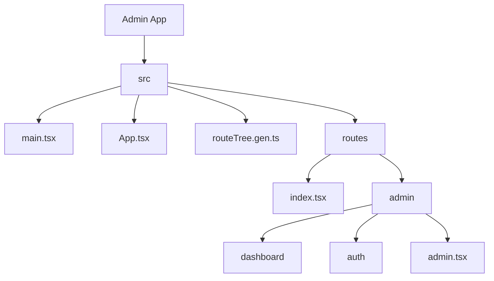
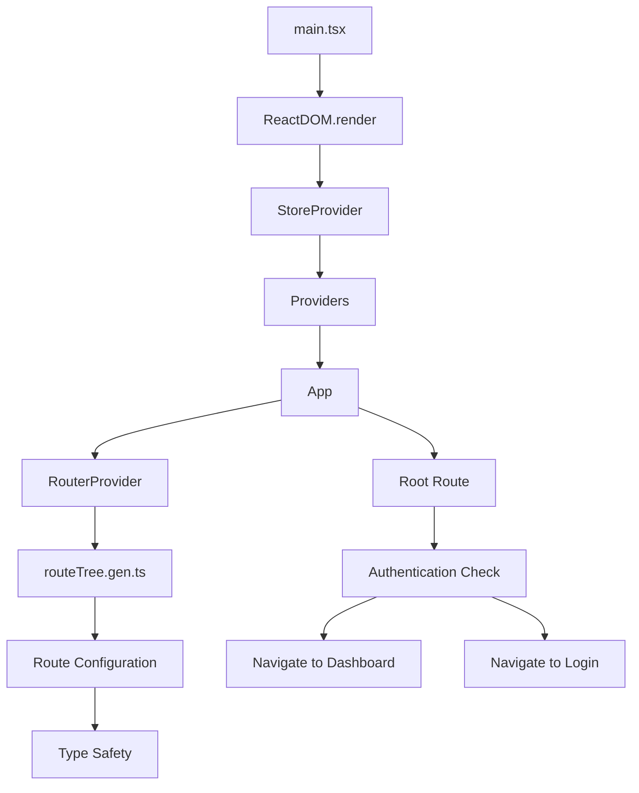
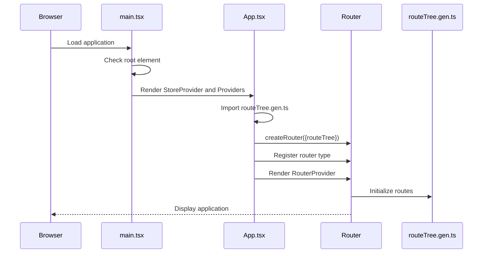
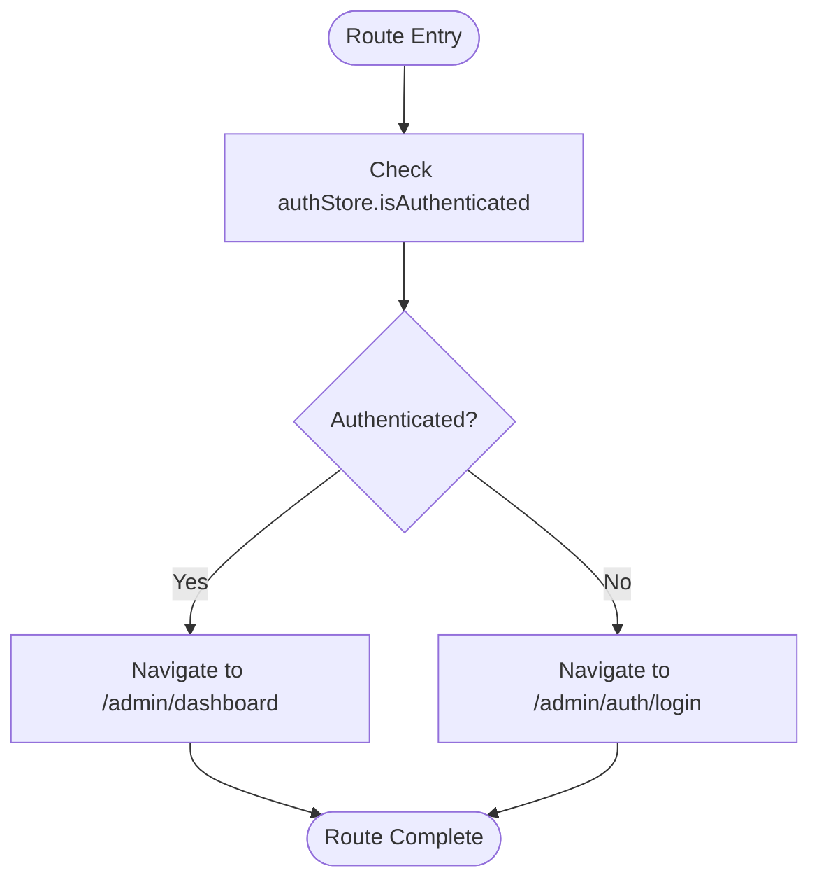
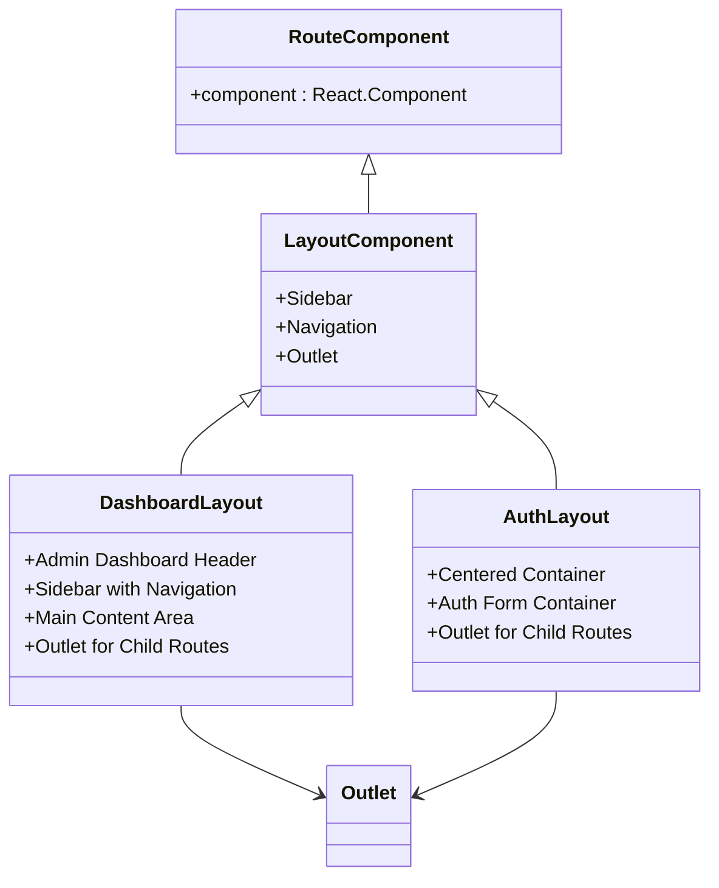
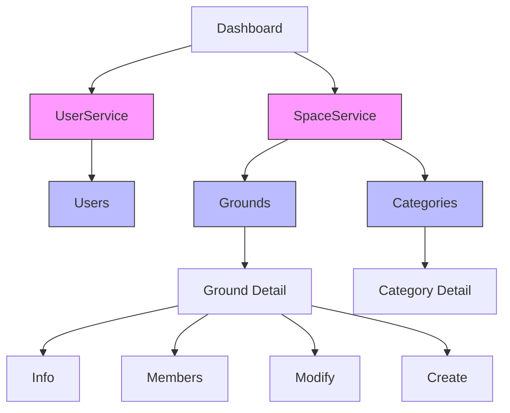

# Routing Integration and Navigation

<cite>
**Referenced Files in This Document**   
- [main.tsx](file://apps/admin/src/main.tsx)
- [App.tsx](file://apps/admin/src/App.tsx)
- [index.tsx](file://apps/admin/src/routes/index.tsx)
- [routeTree.gen.ts](file://apps/admin/src/routeTree.gen.ts)
- [admin.tsx](file://apps/admin/src/routes/admin.tsx)
- [dashboard.tsx](file://apps/admin/src/routes/admin/dashboard.tsx)
- [auth.tsx](file://apps/admin/src/routes/admin/auth.tsx)
- [user-service.tsx](file://apps/admin/src/routes/admin/dashboard/user-service.tsx)
- [space-service.tsx](file://apps/admin/src/routes/admin/dashboard/space-service.tsx)
- [grounds.tsx](file://apps/admin/src/routes/admin/dashboard/space-service/grounds.tsx)
- [categories.tsx](file://apps/admin/src/routes/admin/dashboard/space-service/categories.tsx)
- [__root.tsx](file://apps/admin/src/routes/__root.tsx)
</cite>

## Table of Contents
1. [Introduction](#introduction)
2. [Project Structure](#project-structure)
3. [Core Components](#core-components)
4. [Architecture Overview](#architecture-overview)
5. [Detailed Component Analysis](#detailed-component-analysis)
6. [Dependency Analysis](#dependency-analysis)
7. [Performance Considerations](#performance-considerations)
8. [Troubleshooting Guide](#troubleshooting-guide)
9. [Conclusion](#conclusion)

## Introduction
The Routing Integration and Navigation system in prj-core's admin application provides a robust, type-safe routing solution built on TanStack Router. This documentation explains how the routing system is initialized, integrated with the React component tree, and connected to state management. The system enables seamless navigation across the admin interface while maintaining type safety through auto-generated route definitions. The implementation supports complex nested routing scenarios, route guarding for authentication, and efficient data loading patterns.

## Project Structure



**Diagram sources**
- [main.tsx](file://apps/admin/src/main.tsx)
- [App.tsx](file://apps/admin/src/App.tsx)
- [routeTree.gen.ts](file://apps/admin/src/routeTree.gen.ts)
- [index.tsx](file://apps/admin/src/routes/index.tsx)

**Section sources**
- [main.tsx](file://apps/admin/src/main.tsx)
- [App.tsx](file://apps/admin/src/App.tsx)
- [routeTree.gen.ts](file://apps/admin/src/routeTree.gen.ts)

## Core Components

The routing system in prj-core's admin application consists of several core components that work together to provide a seamless navigation experience. The system is bootstrapped in main.tsx where the React application is initialized and rendered to the DOM. The App component serves as the root component that integrates the routing framework with the React component tree. The auto-generated routeTree.gen.ts file contains the complete route configuration that is used to create the router instance. The index.tsx file defines the root route with navigation logic based on authentication state.

**Section sources**
- [main.tsx](file://apps/admin/src/main.tsx#L1-L17)
- [App.tsx](file://apps/admin/src/App.tsx#L1-L22)
- [index.tsx](file://apps/admin/src/routes/index.tsx#L1-L17)
- [routeTree.gen.ts](file://apps/admin/src/routeTree.gen.ts#L1-L572)

## Architecture Overview



**Diagram sources**
- [main.tsx](file://apps/admin/src/main.tsx#L1-L17)
- [App.tsx](file://apps/admin/src/App.tsx#L1-L22)
- [index.tsx](file://apps/admin/src/routes/index.tsx#L1-L17)
- [routeTree.gen.ts](file://apps/admin/src/routeTree.gen.ts#L1-L572)

## Detailed Component Analysis

### Routing Initialization and Integration

The routing system is initialized in the main.tsx file where the React application is bootstrapped. The entry point checks if the root element is empty before rendering the application, preventing duplicate renders in development mode with React 18's strict mode. The App component imports the auto-generated routeTree.gen.ts file and creates a router instance using TanStack Router's createRouter function. This approach ensures type safety throughout the application by leveraging TypeScript's module augmentation to register the router instance globally.



**Diagram sources**
- [main.tsx](file://apps/admin/src/main.tsx#L1-L17)
- [App.tsx](file://apps/admin/src/App.tsx#L1-L22)
- [routeTree.gen.ts](file://apps/admin/src/routeTree.gen.ts#L1-L572)

**Section sources**
- [main.tsx](file://apps/admin/src/main.tsx#L1-L17)
- [App.tsx](file://apps/admin/src/App.tsx#L1-L22)

### Root Route Configuration and Navigation Logic

The root route configuration in index.tsx implements navigation logic based on authentication state. The component uses the authStore from the global store to determine whether the user is authenticated. If authenticated, it navigates to the dashboard; otherwise, it redirects to the login page. This pattern provides a clean separation of concerns where the routing system handles navigation decisions based on application state rather than embedding this logic in individual components.



**Diagram sources**
- [index.tsx](file://apps/admin/src/routes/index.tsx#L1-L17)

**Section sources**
- [index.tsx](file://apps/admin/src/routes/index.tsx#L1-L17)

### Route Hierarchy and Layout Structure

The application implements a nested route hierarchy with shared layout components. The admin route serves as a parent route with an Outlet component that renders child routes. The dashboard route provides a comprehensive layout with navigation sidebar and main content area, while the auth route provides a centered layout optimized for authentication forms. This structure allows for consistent UI patterns across different sections of the application while enabling code reuse.



**Diagram sources**
- [admin.tsx](file://apps/admin/src/routes/admin.tsx#L1-L6)
- [dashboard.tsx](file://apps/admin/src/routes/admin/dashboard.tsx#L1-L50)
- [auth.tsx](file://apps/admin/src/routes/admin/auth.tsx#L1-L16)

**Section sources**
- [admin.tsx](file://apps/admin/src/routes/admin.tsx#L1-L6)
- [dashboard.tsx](file://apps/admin/src/routes/admin/dashboard.tsx#L1-L50)
- [auth.tsx](file://apps/admin/src/routes/admin/auth.tsx#L1-L16)

### Service-Specific Routing Patterns

The application implements service-specific routing patterns for different functional areas. The user-service and space-service routes provide dedicated sections within the dashboard with their own navigation contexts. The space-service includes complex nested routes for managing grounds and categories with dynamic parameters ($groundId, $categoryId). These patterns demonstrate how to organize related functionality under logical groupings while maintaining a consistent navigation experience.



**Diagram sources**
- [user-service.tsx](file://apps/admin/src/routes/admin/dashboard/user-service.tsx#L1-L17)
- [space-service.tsx](file://apps/admin/src/routes/admin/dashboard/space-service.tsx#L1-L15)
- [grounds.tsx](file://apps/admin/src/routes/admin/dashboard/space-service/grounds.tsx#L1-L63)
- [categories.tsx](file://apps/admin/src/routes/admin/dashboard/space-service/categories.tsx#L1-L75)

**Section sources**
- [user-service.tsx](file://apps/admin/src/routes/admin/dashboard/user-service.tsx#L1-L17)
- [space-service.tsx](file://apps/admin/src/routes/admin/dashboard/space-service.tsx#L1-L15)

## Dependency Analysis

```mermaid
graph TD
A[main.tsx] --> B[App.tsx]
B --> C[routeTree.gen.ts]
C --> D[TanStack Router]
B --> E[@tanstack/react-router]
B --> F[mobx-react-lite]
A --> G[StoreProvider]
A --> H[Providers]
G --> I[@cocrepo/store]
H --> J[State Management]
H --> K[API Clients]
H --> L[Theme Providers]
```

**Diagram sources**
- [main.tsx](file://apps/admin/src/main.tsx#L1-L17)
- [App.tsx](file://apps/admin/src/App.tsx#L1-L22)
- [routeTree.gen.ts](file://apps/admin/src/routeTree.gen.ts#L1-L572)

**Section sources**
- [main.tsx](file://apps/admin/src/main.tsx#L1-L17)
- [App.tsx](file://apps/admin/src/App.tsx#L1-L22)

## Performance Considerations

The routing system in prj-core's admin application is designed with performance in mind. The auto-generation of routeTree.gen.ts ensures that route configurations are optimized at build time rather than runtime. The use of React's concurrent features through ReactDOM.createRoot enables smooth rendering and hydration. The routing implementation avoids unnecessary re-renders by leveraging MobX's observer pattern and efficient state management. For complex nested routes, the application could benefit from code splitting and lazy loading of route components to reduce initial bundle size.

## Troubleshooting Guide

Common issues in the routing system typically involve hydration mismatches, navigation race conditions, and route resolution errors. Hydration mismatches can occur when server-rendered content differs from client-rendered content, which is mitigated by the root element check in main.tsx. Navigation race conditions may happen when multiple navigation events are triggered simultaneously, which can be addressed by implementing navigation guards and ensuring proper state synchronization. Route resolution errors in complex nested scenarios can be debugged by verifying parameter naming conventions and ensuring proper route hierarchy configuration.

**Section sources**
- [main.tsx](file://apps/admin/src/main.tsx#L8-L16)
- [index.tsx](file://apps/admin/src/routes/index.tsx#L4-L12)

## Conclusion

The Routing Integration and Navigation system in prj-core's admin application provides a robust foundation for building complex administrative interfaces. By leveraging TanStack Router and auto-generated route configurations, the system ensures type safety and maintainability across the application. The integration with state management through MobX enables responsive navigation based on authentication and application state. The nested route hierarchy with shared layouts promotes code reuse and consistent user experiences. For future improvements, implementing code splitting, route preloading, and enhanced error boundaries would further optimize the routing system's performance and reliability.