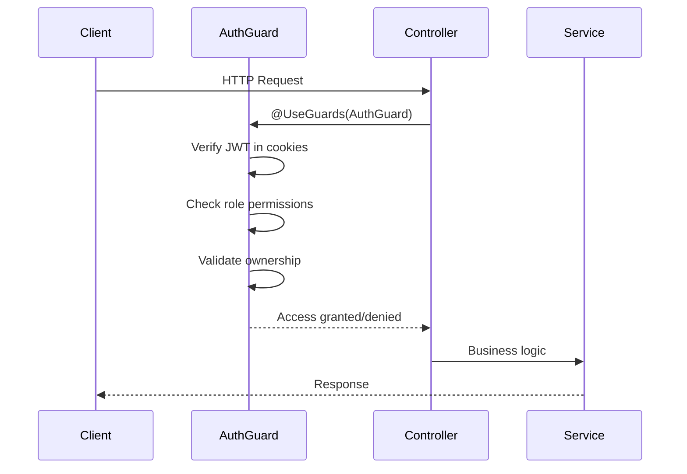
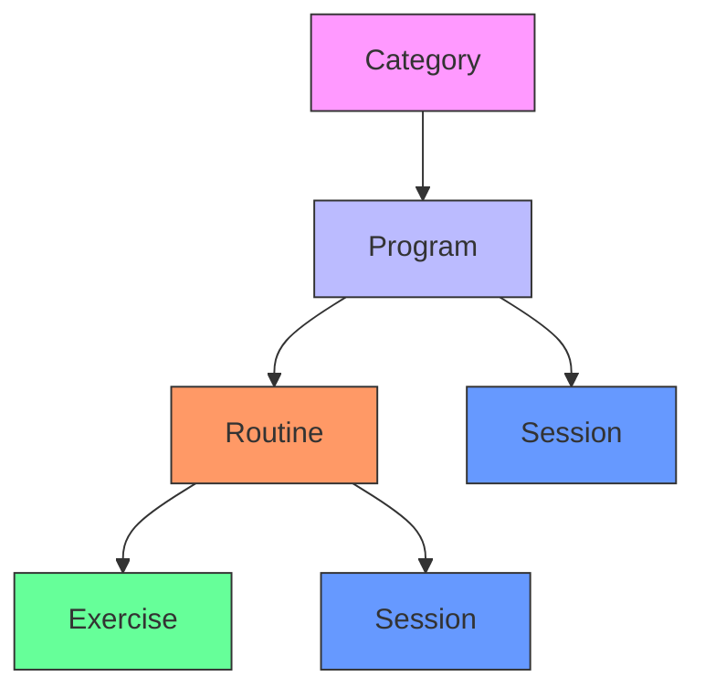

# Content Management Endpoints

<cite>
**Referenced Files in This Document**   
- [categories.module.ts](file://apps/server/src/module/categories.module.ts)
- [programs.module.ts](file://apps/server/src/module/programs.module.ts)
- [routines.module.ts](file://apps/server/src/module/routines.module.ts)
- [exercises.module.ts](file://apps/server/src/module/exercises.module.ts)
- [sessions.module.ts](file://apps/server/src/module/sessions.module.ts)
- [category.dto.ts](file://packages/shared-schema/src/dto/category.dto.ts)
- [program.dto.ts](file://packages/shared-schema/src/dto/program.dto.ts)
- [routine.dto.ts](file://packages/shared-schema/src/dto/routine.dto.ts)
- [exercise.dto.ts](file://packages/shared-schema/src/dto/exercise.dto.ts)
- [session.dto.ts](file://packages/shared-schema/src/dto/session.dto.ts)
- [main.ts](file://apps/server/src/main.ts)
- [session-types.enum.ts](file://packages/shared-schema/src/enum/session-types.enum.ts)
- [repeat-cycle-types.enum.ts](file://packages/shared-schema/src/enum/repeat-cycle-types.enum.ts)
- [recurring-day-of-week.enum.ts](file://packages/shared-schema/src/enum/recurring-day-of-week.enum.ts)
</cite>

## Table of Contents
1. [Introduction](#introduction)
2. [Authentication and Headers](#authentication-and-headers)
3. [Hierarchical Content Model](#hierarchical-content-model)
4. [Category Endpoints](#category-endpoints)
5. [Program Endpoints](#program-endpoints)
6. [Routine Endpoints](#routine-endpoints)
7. [Exercise Endpoints](#exercise-endpoints)
8. [Session Endpoints](#session-endpoints)
9. [Pagination, Filtering, and Sorting](#pagination-filtering-and-sorting)
10. [Error Handling](#error-handling)
11. [Sample Requests](#sample-requests)

## Introduction

The Content Management Endpoints in prj-core provide a RESTful API for managing hierarchical content structures including categories, programs, routines, exercises, and sessions. These endpoints follow a parent-child relationship where categories contain programs, programs contain routines, routines contain exercises, and sessions represent scheduled instances of routines or programs.

The API is built using NestJS and follows standard REST conventions with proper HTTP status codes, JSON request/response formats, and comprehensive error handling. All endpoints are documented in Swagger and available at `/api` path when running the server.

**Section sources**
- [main.ts](file://apps/server/src/main.ts#L50-L72)
- [app.module.ts](file://apps/server/src/module/app.module.ts)

## Authentication and Headers

All content management endpoints require authentication via JWT tokens passed in cookies. The system uses cookie-based authentication with HttpOnly cookies for security.

### Required Authentication
- **Method**: JWT via HttpOnly cookies
- **Authentication Header**: Automatically handled by cookie authentication
- **Security Scheme**: Cookie-based with `accessToken` cookie
- **Public Endpoints**: None in content management (all require authentication)

### Required Headers
- `Content-Type: application/json` - Required for all POST and PUT requests
- `Accept: application/json` - Recommended for all requests

### Access Control
The system implements role-based access control (RBAC) with the following permissions:
- **Admin**: Full CRUD access to all content
- **Editor**: Create, read, update content; cannot delete
- **Viewer**: Read-only access to published content
- **Owner**: Full control over content they created

Access is enforced through NestJS guards and decorators that check both role permissions and content ownership.



**Diagram sources**
- [main.ts](file://apps/server/src/main.ts#L58-L63)
- [auth.module.ts](file://apps/server/src/module/auth.module.ts)

**Section sources**
- [main.ts](file://apps/server/src/main.ts#L50-L64)
- [auth.module.ts](file://apps/server/src/module/auth.module.ts)

## Hierarchical Content Model

The content management system follows a strict hierarchical structure where each level represents a different granularity of content organization.



**Diagram sources**
- [categories.module.ts](file://apps/server/src/module/categories.module.ts)
- [programs.module.ts](file://apps/server/src/module/programs.module.ts)
- [routines.module.ts](file://apps/server/src/module/routines.module.ts)
- [exercises.module.ts](file://apps/server/src/module/exercises.module.ts)
- [sessions.module.ts](file://apps/server/src/module/sessions.module.ts)

**Section sources**
- [categories.module.ts](file://apps/server/src/module/categories.module.ts)
- [programs.module.ts](file://apps/server/src/module/programs.module.ts)

### Relationship Rules
- **Category**: Top-level organizational unit (e.g., "Fitness", "Yoga", "Meditation")
- **Program**: Collection of routines under a category with a specific goal
- **Routine**: Sequence of exercises designed for a particular purpose
- **Exercise**: Atomic unit of content with specific instructions
- **Session**: Scheduled instance of a program or routine with start/end times

### Ownership and Permissions
- Content inherits permissions from its parent
- Users can only modify content they own unless they have admin privileges
- Deleting a parent automatically soft-deletes all children
- Publishing a program automatically publishes all contained routines and exercises

## Category Endpoints

Category endpoints manage top-level content organization units.

### GET /categories
Retrieve a list of categories with pagination, filtering, and sorting.

**Parameters**
- Query Parameters:
  - `page`: Page number (default: 1)
  - `limit`: Items per page (default: 10, max: 100)
  - `search`: Text search on name and description
  - `status`: Filter by status (active, inactive, draft)
  - `sort`: Sort field (name, createdAt, updatedAt)
  - `order`: Sort order (ASC, DESC)

**Response Schema**
```json
{
  "data": [
    {
      "id": "uuid",
      "name": "string",
      "description": "string",
      "status": "active|inactive|draft",
      "order": "number",
      "createdAt": "datetime",
      "updatedAt": "datetime"
    }
  ],
  "meta": {
    "page": "number",
    "limit": "number",
    "total": "number",
    "totalPages": "number"
  }
}
```

### GET /categories/{id}
Retrieve a specific category by ID.

**Path Parameters**
- `id`: UUID of the category

**Response Schema**
```json
{
  "data": {
    "id": "uuid",
    "name": "string",
    "description": "string",
    "status": "active|inactive|draft",
    "order": "number",
    "createdAt": "datetime",
    "updatedAt": "datetime",
    "programs": [
      {
        "id": "uuid",
        "name": "string",
        "status": "string"
      }
    ]
  }
}
```

### POST /categories
Create a new category.

**Request Body**
```json
{
  "name": "string (required, unique, 2-50 characters)",
  "description": "string (optional, max 500 characters)",
  "status": "active|inactive|draft (default: draft)",
  "order": "number (optional, default: auto-assigned)"
}
```

**Validation Rules**
- Name must be unique across all categories
- Name must be 2-50 characters long
- Status must be one of: active, inactive, draft
- Description cannot exceed 500 characters

### PATCH /categories/{id}
Update an existing category.

**Path Parameters**
- `id`: UUID of the category

**Request Body**
```json
{
  "name": "string",
  "description": "string",
  "status": "active|inactive|draft",
  "order": "number"
}
```

### DELETE /categories/{id}
Delete a category (soft delete).

**Path Parameters**
- `id`: UUID of the category

**Behavior**
- Sets status to "deleted"
- Updates deletedAt timestamp
- Cascades soft delete to all programs, routines, and exercises in this category

**Section sources**
- [categories.module.ts](file://apps/server/src/module/categories.module.ts)
- [category.dto.ts](file://packages/shared-schema/src/dto/category.dto.ts)

## Program Endpoints

Program endpoints manage collections of routines under categories.

### GET /programs
Retrieve a list of programs with filtering and pagination.

**Parameters**
- Query Parameters:
  - `page`: Page number (default: 1)
  - `limit`: Items per page (default: 10, max: 100)
  - `categoryId`: Filter by category ID
  - `search`: Text search on name and description
  - `status`: Filter by status (published, unpublished, draft)
  - `difficulty`: Filter by difficulty level
  - `duration`: Filter by estimated duration
  - `sort`: Sort field (name, createdAt, difficulty)
  - `order`: Sort order (ASC, DESC)

**Response Schema**
```json
{
  "data": [
    {
      "id": "uuid",
      "name": "string",
      "description": "string",
      "categoryId": "uuid",
      "categoryName": "string",
      "status": "published|unpublished|draft",
      "difficulty": "beginner|intermediate|advanced",
      "estimatedDuration": "number (minutes)",
      "thumbnailUrl": "string",
      "order": "number",
      "createdAt": "datetime",
      "updatedAt": "datetime"
    }
  ],
  "meta": {
    "page": "number",
    "limit": "number",
    "total": "number",
    "totalPages": "number"
  }
}
```

### GET /programs/{id}
Retrieve a specific program by ID with its routines.

**Path Parameters**
- `id`: UUID of the program

**Query Parameters**
- `includeRoutines`: Boolean to include routines in response (default: true)

**Response Schema**
```json
{
  "data": {
    "id": "uuid",
    "name": "string",
    "description": "string",
    "categoryId": "uuid",
    "categoryName": "string",
    "status": "published|unpublished|draft",
    "difficulty": "beginner|intermediate|advanced",
    "estimatedDuration": "number",
    "thumbnailUrl": "string",
    "order": "number",
    "createdAt": "datetime",
    "updatedAt": "datetime",
    "routines": [
      {
        "id": "uuid",
        "name": "string",
        "estimatedDuration": "number",
        "order": "number"
      }
    ]
  }
}
```

### POST /programs
Create a new program.

**Request Body**
```json
{
  "name": "string (required, 2-100 characters)",
  "description": "string (optional, max 1000 characters)",
  "categoryId": "uuid (required)",
  "status": "published|unpublished|draft (default: draft)",
  "difficulty": "beginner|intermediate|advanced (default: beginner)",
  "estimatedDuration": "number (minutes, positive)",
  "thumbnailUrl": "string (optional, valid URL)",
  "order": "number (optional, default: auto-assigned)"
}
```

**Validation Rules**
- Name must be unique within the category
- Name must be 2-100 characters long
- Category ID must exist and be active
- Difficulty must be one of: beginner, intermediate, advanced
- Estimated duration must be a positive number
- Thumbnail URL must be a valid URL format

### PATCH /programs/{id}
Update an existing program.

**Path Parameters**
- `id`: UUID of the program

**Request Body**
```json
{
  "name": "string",
  "description": "string",
  "categoryId": "uuid",
  "status": "published|unpublished|draft",
  "difficulty": "beginner|intermediate|advanced",
  "estimatedDuration": "number",
  "thumbnailUrl": "string",
  "order": "number"
}
```

### DELETE /programs/{id}
Delete a program (soft delete).

**Path Parameters**
- `id`: UUID of the program

**Behavior**
- Sets status to "deleted"
- Updates deletedAt timestamp
- Cascades soft delete to all routines and exercises in this program

**Section sources**
- [programs.module.ts](file://apps/server/src/module/programs.module.ts)
- [program.dto.ts](file://packages/shared-schema/src/dto/program.dto.ts)

## Routine Endpoints

Routine endpoints manage sequences of exercises.

### GET /routines
Retrieve a list of routines with filtering.

**Parameters**
- Query Parameters:
  - `page`: Page number (default: 1)
  - `limit`: Items per page (default: 10, max: 100)
  - `programId`: Filter by program ID
  - `search`: Text search on name and description
  - `status`: Filter by status (active, inactive)
  - `estimatedDuration`: Filter by duration range
  - `sort`: Sort field (name, createdAt, estimatedDuration)
  - `order`: Sort order (ASC, DESC)

**Response Schema**
```json
{
  "data": [
    {
      "id": "uuid",
      "name": "string",
      "description": "string",
      "programId": "uuid",
      "programName": "string",
      "status": "active|inactive",
      "estimatedDuration": "number (seconds)",
      "order": "number",
      "createdAt": "datetime",
      "updatedAt": "datetime"
    }
  ],
  "meta": {
    "page": "number",
    "limit": "number",
    "total": "number",
    "totalPages": "number"
  }
}
```

### GET /routines/{id}
Retrieve a specific routine by ID with its exercises.

**Path Parameters**
- `id`: UUID of the routine

**Query Parameters**
- `includeExercises`: Boolean to include exercises (default: true)

**Response Schema**
```json
{
  "data": {
    "id": "uuid",
    "name": "string",
    "description": "string",
    "programId": "uuid",
    "programName": "string",
    "status": "active|inactive",
    "estimatedDuration": "number",
    "order": "number",
    "createdAt": "datetime",
    "updatedAt": "datetime",
    "exercises": [
      {
        "id": "uuid",
        "name": "string",
        "duration": "number (seconds)",
        "order": "number",
        "instructions": "string"
      }
    ]
  }
}
```

### POST /routines
Create a new routine.

**Request Body**
```json
{
  "name": "string (required, 2-100 characters)",
  "description": "string (optional, max 1000 characters)",
  "programId": "uuid (required)",
  "status": "active|inactive (default: active)",
  "estimatedDuration": "number (seconds, positive)",
  "order": "number (optional, default: auto-assigned)"
}
```

**Validation Rules**
- Name must be unique within the program
- Name must be 2-100 characters long
- Program ID must exist and be active
- Estimated duration must be a positive number

### PATCH /routines/{id}
Update an existing routine.

**Path Parameters**
- `id`: UUID of the routine

**Request Body**
```json
{
  "name": "string",
  "description": "string",
  "programId": "uuid",
  "status": "active|inactive",
  "estimatedDuration": "number",
  "order": "number"
}
```

### DELETE /routines/{id}
Delete a routine (soft delete).

**Path Parameters**
- `id`: UUID of the routine

**Behavior**
- Sets status to "deleted"
- Updates deletedAt timestamp
- Cascades soft delete to all exercises in this routine

**Section sources**
- [routines.module.ts](file://apps/server/src/module/routines.module.ts)
- [routine.dto.ts](file://packages/shared-schema/src/dto/routine.dto.ts)

## Exercise Endpoints

Exercise endpoints manage atomic units of content.

### GET /exercises
Retrieve a list of exercises.

**Parameters**
- Query Parameters:
  - `page`: Page number (default: 1)
  - `limit`: Items per page (default: 10, max: 100)
  - `routineId`: Filter by routine ID
  - `search`: Text search on name and instructions
  - `difficulty`: Filter by difficulty level
  - `duration`: Filter by duration range
  - `sort`: Sort field (name, createdAt, difficulty)
  - `order`: Sort order (ASC, DESC)

**Response Schema**
```json
{
  "data": [
    {
      "id": "uuid",
      "name": "string",
      "instructions": "string",
      "routineId": "uuid",
      "routineName": "string",
      "difficulty": "beginner|intermediate|advanced",
      "duration": "number (seconds)",
      "order": "number",
      "createdAt": "datetime",
      "updatedAt": "datetime"
    }
  ],
  "meta": {
    "page": "number",
    "limit": "number",
    "total": "number",
    "totalPages": "number"
  }
}
```

### GET /exercises/{id}
Retrieve a specific exercise by ID.

**Path Parameters**
- `id`: UUID of the exercise

**Response Schema**
```json
{
  "data": {
    "id": "uuid",
    "name": "string",
    "instructions": "string",
    "routineId": "uuid",
    "routineName": "string",
    "difficulty": "beginner|intermediate|advanced",
    "duration": "number",
    "order": "number",
    "createdAt": "datetime",
    "updatedAt": "datetime"
  }
}
```

### POST /exercises
Create a new exercise.

**Request Body**
```json
{
  "name": "string (required, 2-100 characters)",
  "instructions": "string (required, 10-2000 characters)",
  "routineId": "uuid (required)",
  "difficulty": "beginner|intermediate|advanced (default: beginner)",
  "duration": "number (seconds, positive)",
  "order": "number (optional, default: auto-assigned)"
}
```

**Validation Rules**
- Name must be 2-100 characters long
- Instructions must be 10-2000 characters long
- Routine ID must exist and be active
- Difficulty must be one of: beginner, intermediate, advanced
- Duration must be a positive number

### PATCH /exercises/{id}
Update an existing exercise.

**Path Parameters**
- `id`: UUID of the exercise

**Request Body**
```json
{
  "name": "string",
  "instructions": "string",
  "routineId": "uuid",
  "difficulty": "beginner|intermediate|advanced",
  "duration": "number",
  "order": "number"
}
```

### DELETE /exercises/{id}
Delete an exercise.

**Path Parameters**
- `id`: UUID of the exercise

**Behavior**
- Removes the exercise from its routine
- Adjusts order of remaining exercises

**Section sources**
- [exercises.module.ts](file://apps/server/src/module/exercises.module.ts)
- [exercise.dto.ts](file://packages/shared-schema/src/dto/exercise.dto.ts)

## Session Endpoints

Session endpoints manage scheduled instances of programs and routines.

### GET /sessions
Retrieve a list of sessions with date filtering.

**Parameters**
- Query Parameters:
  - `page`: Page number (default: 1)
  - `limit`: Items per page (default: 10, max: 100)
  - `programId`: Filter by program ID
  - `routineId`: Filter by routine ID
  - `startDate`: Filter sessions from this date (ISO format)
  - `endDate`: Filter sessions to this date (ISO format)
  - `status`: Filter by status (scheduled, completed, cancelled)
  - `type`: Filter by session type (program, routine)
  - `sort`: Sort field (startTime, createdAt)
  - `order`: Sort order (ASC, DESC)

**Response Schema**
```json
{
  "data": [
    {
      "id": "uuid",
      "programId": "uuid",
      "programName": "string",
      "routineId": "uuid",
      "routineName": "string",
      "type": "program|routine",
      "startTime": "datetime",
      "endTime": "datetime",
      "status": "scheduled|completed|cancelled",
      "notes": "string",
      "recurring": "boolean",
      "repeatCycleType": "daily|weekly|monthly|null",
      "recurringDayOfWeek": ["monday","tuesday",...],
      "createdAt": "datetime",
      "updatedAt": "datetime"
    }
  ],
  "meta": {
    "page": "number",
    "limit": "number",
    "total": "number",
    "totalPages": "number"
  }
}
```

### GET /sessions/{id}
Retrieve a specific session by ID.

**Path Parameters**
- `id`: UUID of the session

**Response Schema**
```json
{
  "data": {
    "id": "uuid",
    "programId": "uuid",
    "programName": "string",
    "routineId": "uuid",
    "routineName": "string",
    "type": "program|routine",
    "startTime": "datetime",
    "endTime": "datetime",
    "status": "scheduled|completed|cancelled",
    "notes": "string",
    "recurring": "boolean",
    "repeatCycleType": "daily|weekly|monthly|null",
    "recurringDayOfWeek": ["monday","tuesday",...],
    "createdAt": "datetime",
    "updatedAt": "datetime",
    "content": {
      "type": "program|routine",
      "data": {}
    }
  }
}
```

### POST /sessions
Create a new session.

**Request Body**
```json
{
  "programId": "uuid (one of programId or routineId required)",
  "routineId": "uuid (one of programId or routineId required)",
  "startTime": "datetime (required, ISO format)",
  "endTime": "datetime (required, after startTime)",
  "status": "scheduled|completed|cancelled (default: scheduled)",
  "notes": "string (optional, max 1000 characters)",
  "recurring": "boolean (default: false)",
  "repeatCycleType": "daily|weekly|monthly|null (required if recurring=true)",
  "recurringDayOfWeek": ["monday","tuesday",...] (required for weekly recurrences)
}
```

**Validation Rules**
- Either programId or routineId must be provided (not both)
- Start time must be before end time
- Start and end times must be in valid ISO format
- For recurring sessions:
  - repeatCycleType must be specified
  - For weekly recurrences, recurringDayOfWeek must contain at least one day
  - Recurrence rules must not create infinite loops
- End time must not exceed 24 hours from start time

### PATCH /sessions/{id}
Update an existing session.

**Path Parameters**
- `id`: UUID of the session

**Request Body**
```json
{
  "startTime": "datetime",
  "endTime": "datetime",
  "status": "scheduled|completed|cancelled",
  "notes": "string",
  "recurring": "boolean",
  "repeatCycleType": "daily|weekly|monthly|null",
  "recurringDayOfWeek": ["monday","tuesday",...]
}
```

### DELETE /sessions/{id}
Cancel a session.

**Path Parameters**
- `id`: UUID of the session

**Behavior**
- Sets status to "cancelled"
- Does not delete the session record (preserves history)
- For recurring sessions, cancels all future instances if requested

**Section sources**
- [sessions.module.ts](file://apps/server/src/module/sessions.module.ts)
- [session.dto.ts](file://packages/shared-schema/src/dto/session.dto.ts)
- [session-types.enum.ts](file://packages/shared-schema/src/enum/session-types.enum.ts)
- [repeat-cycle-types.enum.ts](file://packages/shared-schema/src/enum/repeat-cycle-types.enum.ts)
- [recurring-day-of-week.enum.ts](file://packages/shared-schema/src/enum/recurring-day-of-week.enum.ts)

## Pagination, Filtering, and Sorting

All list endpoints support consistent pagination, filtering, and sorting parameters.

### Pagination Parameters
| Parameter | Type | Required | Default | Description |
|---------|------|----------|---------|-------------|
| `page` | number | No | 1 | Page number (1-indexed) |
| `limit` | number | No | 10 | Items per page (max 100) |

### Common Filtering Parameters
| Parameter | Type | Description |
|---------|------|-------------|
| `search` | string | Full-text search on name/description fields |
| `status` | string | Filter by status (varies by endpoint) |
| `sort` | string | Field to sort by |
| `order` | string | Sort order: ASC or DESC |

### Response Meta Object
All list responses include a meta object with pagination information:
```json
"meta": {
  "page": 1,
  "limit": 10,
  "total": 45,
  "totalPages": 5
}
```

### Date Range Filtering
For endpoints with date fields (like sessions):
- `startDate`: Include items where date >= startDate
- `endDate`: Include items where date <= endDate
- Both can be used together to specify a range

### Specialized Filters by Endpoint
- **Programs**: categoryId, difficulty, estimatedDuration
- **Routines**: programId, estimatedDuration
- **Exercises**: routineId, difficulty, duration
- **Sessions**: programId, routineId, type, startDate, endDate

**Section sources**
- [programs.module.ts](file://apps/server/src/module/programs.module.ts)
- [routines.module.ts](file://apps/server/src/module/routines.module.ts)
- [exercises.module.ts](file://apps/server/src/module/exercises.module.ts)
- [sessions.module.ts](file://apps/server/src/module/sessions.module.ts)
- [shared-schema/src/lib/PaginationUtil.ts](file://packages/shared-schema/src/lib/PaginationUtil.ts)

## Error Handling

The API returns standardized error responses with appropriate HTTP status codes.

### Standard Error Response Schema
```json
{
  "statusCode": "number",
  "message": "string or array of strings",
  "error": "string",
  "timestamp": "datetime",
  "path": "string",
  "method": "string"
}
```

### Common Status Codes
| Code | Status | Description |
|------|--------|-------------|
| 400 | Bad Request | Invalid request body or parameters |
| 401 | Unauthorized | Missing or invalid authentication |
| 403 | Forbidden | Insufficient permissions |
| 404 | Not Found | Resource not found |
| 409 | Conflict | Resource already exists or state conflict |
| 422 | Unprocessable Entity | Validation failed |
| 500 | Internal Server Error | Unexpected server error |

### Validation Error Format
For validation errors (422), the message field contains an array of validation issues:
```json
{
  "statusCode": 422,
  "message": [
    "name must be shorter than or equal to 100 characters",
    "categoryId must be a UUID",
    "startTime must be before endTime"
  ],
  "error": "Unprocessable Entity",
  "timestamp": "2023-08-15T10:00:00Z",
  "path": "/api/programs",
  "method": "POST"
}
```

### Error Handling Strategies
- **Client-side**: Validate input before sending requests
- **Server-side**: Comprehensive validation using DTOs and pipes
- **Logging**: All errors are logged with context for debugging
- **User Feedback**: Clear error messages that guide users to fix issues

**Section sources**
- [main.ts](file://apps/server/src/main.ts#L44-L47)
- [shared/interceptor](file://apps/server/src/shared/interceptor)
- [shared/filter](file://apps/server/src/shared/filter)

## Sample Requests

### Create a Program
```bash
curl -X POST https://api.prj-core.com/programs \
  -H "Content-Type: application/json" \
  -H "Cookie: accessToken=your-jwt-token" \
  -d '{
    "name": "30-Day Fitness Challenge",
    "description": "A comprehensive fitness program for beginners",
    "categoryId": "c3a5b6e0-8b2d-4e1a-9c1c-8b2d4e1a9c1c",
    "status": "published",
    "difficulty": "beginner",
    "estimatedDuration": 30
  }'
```

### Define a Routine
```bash
curl -X POST https://api.prj-core.com/routines \
  -H "Content-Type: application/json" \
  -H "Cookie: accessToken=your-jwt-token" \
  -d '{
    "name": "Morning Workout",
    "description": "A 15-minute morning exercise routine",
    "programId": "p3a5b6e0-8b2d-4e1a-9c1c-8b2d4e1a9c1c",
    "estimatedDuration": 900
  }'
```

### Schedule a Recurring Session
```bash
curl -X POST https://api.prj-core.com/sessions \
  -H "Content-Type: application/json" \
  -H "Cookie: accessToken=your-jwt-token" \
  -d '{
    "programId": "p3a5b6e0-8b2d-4e1a-9c1c-8b2d4e1a9c1c",
    "startTime": "2023-08-20T07:00:00Z",
    "endTime": "2023-08-20T07:30:00Z",
    "status": "scheduled",
    "recurring": true,
    "repeatCycleType": "weekly",
    "recurringDayOfWeek": ["monday", "wednesday", "friday"]
  }'
```

### Get Programs with Filtering
```bash
curl -X GET "https://api.prj-core.com/programs?categoryId=c3a5b6e0-8b2d-4e1a-9c1c-8b2d4e1a9c1c&status=published&sort=name&order=ASC&page=1&limit=10" \
  -H "Cookie: accessToken=your-jwt-token"
```

### Update an Exercise
```bash
curl -X PATCH https://api.prj-core.com/exercises/e3a5b6e0-8b2d-4e1a-9c1c-8b2d4e1a9c1c \
  -H "Content-Type: application/json" \
  -H "Cookie: accessToken=your-jwt-token" \
  -d '{
    "instructions": "Perform 10 reps with proper form, rest for 30 seconds",
    "duration": 60
  }'
```

**Section sources**
- [programs.module.ts](file://apps/server/src/module/programs.module.ts)
- [routines.module.ts](file://apps/server/src/module/routines.module.ts)
- [sessions.module.ts](file://apps/server/src/module/sessions.module.ts)
- [exercises.module.ts](file://apps/server/src/module/exercises.module.ts)