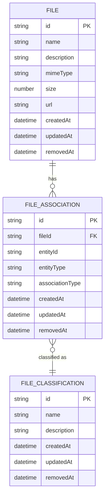

# File Management Endpoints

<cite>
**Referenced Files in This Document**   
- [files.controller.ts](file://apps/server/src/shared/controller/resources/files.controller.ts)
- [file-associations.controller.ts](file://apps/server/src/shared/controller/resources/file-associations.controller.ts)
- [file-classifications.controller.ts](file://apps/server/src/shared/controller/resources/file-classifications.controller.ts)
- [CreateFileDto.ts](file://packages/dto/src/create/file.dto.ts)
- [FileDto.ts](file://packages/dto/src/file.dto.ts)
- [CreateFileAssociationDto.ts](file://packages/dto/src/create/file-association.dto.ts)
- [FileAssociationDto.ts](file://packages/dto/src/file-association.dto.ts)
- [CreateFileClassificationDto.ts](file://packages/dto/src/create/file-classification.dto.ts)
- [FileClassificationDto.ts](file://packages/dto/src/file-classification.dto.ts)
</cite>

## Table of Contents
1. [Introduction](#introduction)
2. [Authentication and Headers](#authentication-and-headers)
3. [File Endpoints](#file-endpoints)
4. [File Association Endpoints](#file-association-endpoints)
5. [File Classification Endpoints](#file-classification-endpoints)
6. [Request/Response Examples](#requestresponse-examples)
7. [Error Handling](#error-handling)
8. [File Policies](#file-policies)
9. [Relationships](#relationships)

## Introduction
This document provides comprehensive documentation for the File Management Endpoints in the prj-core system. The API enables file upload, download, deletion, classification, and association with various entities. The endpoints support role-based access control and file ownership validation to ensure secure file operations.

## Authentication and Headers
All file management endpoints require authentication via JWT tokens. The following headers must be included in requests:

- `Authorization: Bearer <JWT_TOKEN>` - Required for all endpoints
- `Content-Type: application/json` - Required for JSON payloads
- `Content-Type: multipart/form-data` - Required for file uploads

Access permissions are enforced based on user roles and file ownership. Users can only modify files they own unless they have administrative privileges.

## File Endpoints

### Upload File
- **HTTP Method**: POST
- **URL**: `/files`
- **Description**: Uploads a new file to the system
- **Request Parameters**:
  - Body: `CreateFileDto` containing file metadata
- **Response**: `FileDto` with file details including storage location
- **Status Codes**:
  - 201: File created successfully
  - 400: Invalid request payload
  - 401: Authentication required
  - 403: Insufficient permissions

### Retrieve File Metadata
- **HTTP Method**: GET
- **URL**: `/files/:fileId`
- **Description**: Retrieves metadata for a specific file
- **Request Parameters**:
  - Path: `fileId` (string) - The unique identifier of the file
- **Response**: `FileDto` containing file metadata
- **Status Codes**:
  - 200: File metadata retrieved successfully
  - 401: Authentication required
  - 403: Insufficient permissions
  - 404: File not found

### Update File
- **HTTP Method**: PATCH
- **URL**: `/files/:fileId`
- **Description**: Updates an existing file (replace content)
- **Request Parameters**:
  - Path: `fileId` (string) - The unique identifier of the file
  - Files: `files` - The new file content (multipart/form-data)
- **Response**: `FileDto` with updated file details
- **Status Codes**:
  - 200: File updated successfully
  - 400: Invalid request
  - 401: Authentication required
  - 403: Insufficient permissions
  - 404: File not found

### Delete File
- **HTTP Method**: PATCH
- **URL**: `/files/:fileId/removedAt`
- **Description**: Soft deletes a file by setting the removedAt timestamp
- **Request Parameters**:
  - Path: `fileId` (string) - The unique identifier of the file
- **Response**: `FileDto` with removedAt timestamp set
- **Status Codes**:
  - 200: File marked as deleted successfully
  - 401: Authentication required
  - 403: Insufficient permissions
  - 404: File not found

**Section sources**
- [files.controller.ts](file://apps/server/src/shared/controller/resources/files.controller.ts#L21-L67)

## File Association Endpoints

### Create File Association
- **HTTP Method**: POST
- **URL**: `/file-associations`
- **Description**: Creates an association between a file and an entity
- **Request Parameters**:
  - Body: `CreateFileAssociationDto` containing file ID and target entity details
- **Response**: `FileAssociationDto` with association details
- **Status Codes**:
  - 200: Association created successfully
  - 400: Invalid request payload
  - 401: Authentication required
  - 403: Insufficient permissions

### Retrieve File Association
- **HTTP Method**: GET
- **URL**: `/file-associations/:fileAssociationId`
- **Description**: Retrieves a specific file association
- **Request Parameters**:
  - Path: `fileAssociationId` (string) - The unique identifier of the association
- **Response**: `FileAssociationDto` with association details
- **Status Codes**:
  - 200: Association retrieved successfully
  - 401: Authentication required
  - 403: Insufficient permissions
  - 404: Association not found

### List File Associations
- **HTTP Method**: GET
- **URL**: `/file-associations`
- **Description**: Retrieves file associations with filtering and pagination
- **Request Parameters**:
  - Query: `QueryFileAssociationDto` supporting:
    - `page` (number) - Page number (default: 1)
    - `limit` (number) - Items per page (default: 10)
    - `sortBy` (string) - Field to sort by
    - `sortOrder` (ASC|DESC) - Sort direction
    - `fileId` (string) - Filter by file ID
    - `entityType` (string) - Filter by associated entity type
    - `entityId` (string) - Filter by specific entity ID
- **Response**: Paginated list of `FileAssociationDto` objects
- **Status Codes**:
  - 200: Associations retrieved successfully
  - 401: Authentication required

### Update File Association
- **HTTP Method**: PATCH
- **URL**: `/file-associations/:fileAssociationId`
- **Description**: Updates metadata of a file association
- **Request Parameters**:
  - Path: `fileAssociationId` (string) - The unique identifier of the association
  - Body: `UpdateFileAssociationDto` with updated association data
- **Response**: `FileAssociationDto` with updated details
- **Status Codes**:
  - 200: Association updated successfully
  - 400: Invalid request
  - 401: Authentication required
  - 403: Insufficient permissions

### Remove File Association
- **HTTP Method**: PATCH
- **URL**: `/file-associations/:fileAssociationId/removedAt`
- **Description**: Soft deletes a file association
- **Request Parameters**:
  - Path: `fileAssociationId` (string) - The unique identifier of the association
- **Response**: `FileAssociationDto` with removedAt timestamp set
- **Status Codes**:
  - 200: Association marked as deleted successfully
  - 401: Authentication required
  - 403: Insufficient permissions

### Delete File Association
- **HTTP Method**: DELETE
- **URL**: `/file-associations/:fileAssociationId`
- **Description**: Hard deletes a file association
- **Request Parameters**:
  - Path: `fileAssociationId` (string) - The unique identifier of the association
- **Response**: `FileAssociationDto` of the deleted association
- **Status Codes**:
  - 200: Association deleted successfully
  - 401: Authentication required
  - 403: Insufficient permissions

### Remove Multiple File Associations
- **HTTP Method**: PATCH
- **URL**: `/file-associations/removedAt`
- **Description**: Soft deletes multiple file associations
- **Request Parameters**:
  - Body: Array of file association IDs to remove
- **Response**: Number of associations successfully removed
- **Status Codes**:
  - 200: Associations marked as deleted successfully
  - 401: Authentication required
  - 403: Insufficient permissions

**Section sources**
- [file-associations.controller.ts](file://apps/server/src/shared/controller/resources/file-associations.controller.ts#L30-L108)

## File Classification Endpoints

### Create File Classification
- **HTTP Method**: POST
- **URL**: `/file-classifications`
- **Description**: Creates a new file classification category
- **Request Parameters**:
  - Body: `CreateFileClassificationDto` containing classification details
- **Response**: `FileClassificationDto` with created classification
- **Status Codes**:
  - 200: Classification created successfully
  - 400: Invalid request payload
  - 401: Authentication required
  - 403: Insufficient permissions

### Retrieve File Classification
- **HTTP Method**: GET
- **URL**: `/file-classifications/:fileClassificationId`
- **Description**: Retrieves a specific file classification
- **Request Parameters**:
  - Path: `fileClassificationId` (string) - The unique identifier of the classification
- **Response**: `FileClassificationDto` with classification details
- **Status Codes**:
  - 200: Classification retrieved successfully
  - 401: Authentication required
  - 403: Insufficient permissions
  - 404: Classification not found

### List File Classifications
- **HTTP Method**: GET
- **URL**: `/file-classifications`
- **Description**: Retrieves file classifications with filtering and pagination
- **Request Parameters**:
  - Query: `QueryFileClassificationDto` supporting:
    - `page` (number) - Page number (default: 1)
    - `limit` (number) - Items per page (default: 10)
    - `sortBy` (string) - Field to sort by
    - `sortOrder` (ASC|DESC) - Sort direction
    - `name` (string) - Filter by classification name
- **Response**: Paginated list of `FileClassificationDto` objects
- **Status Codes**:
  - 200: Classifications retrieved successfully
  - 401: Authentication required

### Update File Classification
- **HTTP Method**: PATCH
- **URL**: `/file-classifications/:fileClassificationId`
- **Description**: Updates a file classification
- **Request Parameters**:
  - Path: `fileClassificationId` (string) - The unique identifier of the classification
  - Body: `UpdateFileClassificationDto` with updated classification data
- **Response**: `FileClassificationDto` with updated details
- **Status Codes**:
  - 200: Classification updated successfully
  - 400: Invalid request
  - 401: Authentication required
  - 403: Insufficient permissions

### Remove File Classification
- **HTTP Method**: PATCH
- **URL**: `/file-classifications/:fileClassificationId/removedAt`
- **Description**: Soft deletes a file classification
- **Request Parameters**:
  - Path: `fileClassificationId` (string) - The unique identifier of the classification
- **Response**: `FileClassificationDto` with removedAt timestamp set
- **Status Codes**:
  - 200: Classification marked as deleted successfully
  - 401: Authentication required
  - 403: Insufficient permissions

### Delete File Classification
- **HTTP Method**: DELETE
- **URL**: `/file-classifications/:fileClassificationId`
- **Description**: Hard deletes a file classification
- **Request Parameters**:
  - Path: `fileClassificationId` (string) - The unique identifier of the classification
- **Response**: `FileClassificationDto` of the deleted classification
- **Status Codes**:
  - 200: Classification deleted successfully
  - 401: Authentication required
  - 403: Insufficient permissions

**Section sources**
- [file-classifications.controller.ts](file://apps/server/src/shared/controller/resources/file-classifications.controller.ts#L29-L86)

## Request/Response Examples

### File Upload Request (curl)
```bash
curl -X POST "http://localhost:3000/files" \
  -H "Authorization: Bearer <JWT_TOKEN>" \
  -H "Content-Type: multipart/form-data" \
  -F "files=@/path/to/file.pdf" \
  -F "name=example.pdf" \
  -F "description=Sample document"
```

### File Upload Response
```json
{
  "data": {
    "id": "file-123",
    "name": "example.pdf",
    "description": "Sample document",
    "mimeType": "application/pdf",
    "size": 10240,
    "url": "/files/download/file-123",
    "createdAt": "2025-01-01T00:00:00.000Z",
    "updatedAt": "2025-01-01T00:00:00.000Z"
  },
  "meta": {}
}
```

### File Association Request (curl)
```bash
curl -X POST "http://localhost:3000/file-associations" \
  -H "Authorization: Bearer <JWT_TOKEN>" \
  -H "Content-Type: application/json" \
  -d '{
    "fileId": "file-123",
    "entityType": "USER",
    "entityId": "user-456",
    "associationType": "PROFILE_PICTURE"
  }'
```

### File Association Response
```json
{
  "data": {
    "id": "fa-789",
    "fileId": "file-123",
    "entityType": "USER",
    "entityId": "user-456",
    "associationType": "PROFILE_PICTURE",
    "createdAt": "2025-01-01T00:00:00.000Z",
    "updatedAt": "2025-01-01T00:00:00.000Z"
  },
  "meta": {}
}
```

### List Files with Filtering
```bash
curl -X GET "http://localhost:3000/file-associations?entityType=USER&entityId=user-456&page=1&limit=10" \
  -H "Authorization: Bearer <JWT_TOKEN>"
```

## Error Handling

### Common Error Responses
```json
{
  "statusCode": 400,
  "message": "Bad Request",
  "error": "Validation failed"
}
```

```json
{
  "statusCode": 401,
  "message": "Unauthorized",
  "error": "Authentication token is required"
}
```

```json
{
  "statusCode": 403,
  "message": "Forbidden",
  "error": "Insufficient permissions to perform this action"
}
```

```json
{
  "statusCode": 404,
  "message": "Not Found",
  "error": "Requested resource not found"
}
```

### Error Handling Strategies
- Validate all input parameters before processing
- Return appropriate HTTP status codes for different error conditions
- Include descriptive error messages to aid debugging
- Log errors for monitoring and troubleshooting
- Implement rate limiting to prevent abuse
- Use consistent error response format across all endpoints

## File Policies

### File Size Limits
- Maximum upload size: 50MB per file
- Maximum total storage per user: 5GB
- Files exceeding size limits will be rejected with 413 Payload Too Large

### Accepted MIME Types
- Documents: application/pdf, application/msword, application/vnd.openxmlformats-officedocument.wordprocessingml.document
- Images: image/jpeg, image/png, image/gif, image/webp
- Spreadsheets: application/vnd.ms-excel, application/vnd.openxmlformats-officedocument.spreadsheetml.sheet
- Presentations: application/vnd.ms-powerpoint, application/vnd.openxmlformats-officedocument.presentationml.presentation

### Storage Duration
- Active files: Stored indefinitely
- Soft-deleted files: Retained for 30 days before permanent deletion
- Permanent deletion: Files are completely removed from storage after hard delete

## Relationships



**Diagram sources**
- [file.entity.ts](file://packages/entity/src/file.entity.ts)
- [file-association.entity.ts](file://packages/entity/src/file-association.entity.ts)
- [file-classification.entity.ts](file://packages/entity/src/file-classification.entity.ts)

The file management system consists of three core entities:
- **File**: Represents the actual file with metadata and storage information
- **File Classification**: Categorizes files into types (e.g., document, image, video)
- **File Association**: Links files to other entities in the system (users, programs, etc.)

Each file can have multiple associations but belongs to a single classification. The association entity enables flexible linking of files to various system entities while maintaining referential integrity.