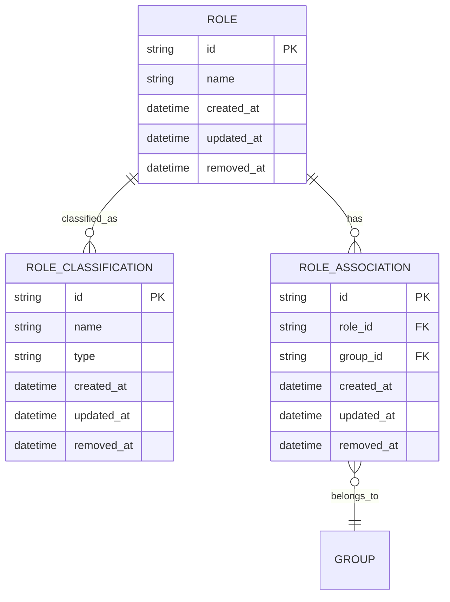

# Role Management Endpoints

<cite>
**Referenced Files in This Document**   
- [roles.controller.ts](file://apps/server/src/shared/controller/resources/roles.controller.ts)
- [role-associations.controller.ts](file://apps/server/src/shared/controller/resources/role-associations.controller.ts)
- [role-classifications.controller.ts](file://apps/server/src/shared/controller/resources/role-classifications.controller.ts)
- [roles.service.ts](file://apps/server/src/shared/service/resources/roles.service.ts)
- [role-associations.service.ts](file://apps/server/src/shared/service/resources/role-associations.service.ts)
- [role-classifications.service.ts](file://apps/server/src/shared/service/resources/role-classifications.service.ts)
- [roles.module.ts](file://apps/server/src/module/roles.module.ts)
- [role-associations.module.ts](file://apps/server/src/module/role-associations.module.ts)
- [role-classifications.module.ts](file://apps/server/src/module/role-classifications.module.ts)
- [role.dto.ts](file://packages/api/src/model/roleDto.ts)
- [roleAssociationDto.ts](file://packages/api/src/model/roleAssociationDto.ts)
- [roleClassificationDto.ts](file://packages/api/src/model/roleClassificationDto.ts)
</cite>

## Table of Contents
1. [Introduction](#introduction)
2. [Authentication and Authorization](#authentication-and-authorization)
3. [Role CRUD Operations](#role-crud-operations)
4. [Role Associations](#role-associations)
5. [Role Classifications](#role-classifications)
6. [Request and Response Examples](#request-and-response-examples)
7. [Error Handling](#error-handling)
8. [Filtering and Sorting](#filtering-and-sorting)
9. [Validation Rules](#validation-rules)
10. [Sample Requests](#sample-requests)
11. [Relationships Between Roles, Categories, and Groups](#relationships-between-roles-categories-and-groups)

## Introduction

The Role Management Endpoints in prj-core provide a comprehensive RESTful API for managing roles, role associations, and role classifications within the system. These endpoints enable CRUD operations for roles, establish relationships between roles and other entities through role associations, and categorize roles through role classifications. The API follows a consistent pattern across all endpoints with standardized response formats and error handling.

The role management system is implemented as three separate modules in the NestJS application: RolesModule, RoleAssociationsModule, and RoleClassificationsModule. Each module contains corresponding controllers, services, and repositories that handle the business logic and data access for their respective domain.

**Section sources**
- [roles.module.ts](file://apps/server/src/module/roles.module.ts)
- [role-associations.module.ts](file://apps/server/src/module/role-associations.module.ts)
- [role-classifications.module.ts](file://apps/server/src/module/role-classifications.module.ts)

## Authentication and Authorization

All role management endpoints require authentication via JWT (JSON Web Token) tokens. The API uses a hierarchical role structure for access control, where users must have appropriate permissions to perform operations on roles, role associations, and role classifications.

The system implements role-based access control through custom guards and decorators that validate user permissions before allowing access to specific endpoints. Users must possess the necessary role privileges to create, read, update, or delete roles and their associated entities.

Authentication is performed by including a valid JWT token in the Authorization header of each request:
```
Authorization: Bearer <JWT_TOKEN>
```

The token contains user identity and role information that is validated on each request to ensure the user has the required permissions for the requested operation.

**Section sources**
- [roles.controller.ts](file://apps/server/src/shared/controller/resources/roles.controller.ts)
- [role-associations.controller.ts](file://apps/server/src/shared/controller/resources/role-associations.controller.ts)
- [role-classifications.controller.ts](file://apps/server/src/shared/controller/resources/role-classifications.controller.ts)

## Role CRUD Operations

The Role CRUD endpoints provide standard create, read, update, and delete operations for managing roles within the system.

### Create Role
- **HTTP Method**: POST
- **URL Pattern**: `/roles`
- **Authentication**: Required (JWT)
- **Request Body**: `CreateRoleDto` containing role name
- **Response**: `RoleDto` with created role details
- **Status Code**: 200 OK

### Get Role by ID
- **HTTP Method**: GET
- **URL Pattern**: `/roles/:roleId`
- **Authentication**: Required (JWT)
- **Path Parameters**: `roleId` (string) - The unique identifier of the role
- **Response**: `RoleDto` with role details
- **Status Code**: 200 OK

### Update Role
- **HTTP Method**: PATCH
- **URL Pattern**: `/roles/:roleId`
- **Authentication**: Required (JWT)
- **Path Parameters**: `roleId` (string) - The unique identifier of the role
- **Request Body**: `UpdateRoleDto` containing fields to update
- **Response**: `RoleDto` with updated role details
- **Status Code**: 200 OK

### Soft Delete Role
- **HTTP Method**: PATCH
- **URL Pattern**: `/roles/:roleId/removedAt`
- **Authentication**: Required (JWT)
- **Path Parameters**: `roleId` (string) - The unique identifier of the role
- **Response**: `RoleDto` with role details (removedAt timestamp set)
- **Status Code**: 200 OK

### Hard Delete Role
- **HTTP Method**: DELETE
- **URL Pattern**: `/roles/:roleId`
- **Authentication**: Required (JWT)
- **Path Parameters**: `roleId` (string) - The unique identifier of the role
- **Response**: `RoleDto` with deleted role details
- **Status Code**: 200 OK

### List Roles with Query Parameters
- **HTTP Method**: GET
- **URL Pattern**: `/roles`
- **Authentication**: Required (JWT)
- **Query Parameters**: Various filtering, sorting, and pagination parameters
- **Response**: Paginated list of `RoleDto` objects
- **Status Code**: 200 OK

**Section sources**
- [roles.controller.ts](file://apps/server/src/shared/controller/resources/roles.controller.ts)
- [roles.service.ts](file://apps/server/src/shared/service/resources/roles.service.ts)

## Role Associations

Role associations establish relationships between roles and other entities such as groups. These endpoints manage the many-to-many relationships between roles and their associated entities.

### Create Role Association
- **HTTP Method**: POST
- **URL Pattern**: `/role-associations`
- **Authentication**: Required (JWT)
- **Request Body**: `CreateRoleAssociationDto` containing association data
- **Response**: `RoleAssociationDto` with created association details
- **Status Code**: 200 OK

### Get Role Association by ID
- **HTTP Method**: GET
- **URL Pattern**: `/role-associations/:roleAssociationId`
- **Authentication**: Required (JWT)
- **Path Parameters**: `roleAssociationId` (string) - The unique identifier of the role association
- **Response**: `RoleAssociationDto` with association details
- **Status Code**: 200 OK

### Update Role Association
- **HTTP Method**: PATCH
- **URL Pattern**: `/role-associations/:roleAssociationId`
- **Authentication**: Required (JWT)
- **Path Parameters**: `roleAssociationId` (string) - The unique identifier of the role association
- **Request Body**: `UpdateRoleAssociationDto` containing fields to update
- **Response**: `RoleAssociationDto` with updated association details
- **Status Code**: 200 OK

### Soft Delete Role Association
- **HTTP Method**: PATCH
- **URL Pattern**: `/role-associations/:roleAssociationId/removedAt`
- **Authentication**: Required (JWT)
- **Path Parameters**: `roleAssociationId` (string) - The unique identifier of the role association
- **Response**: `RoleAssociationDto` with association details (removedAt timestamp set)
- **Status Code**: 200 OK

### Hard Delete Role Association
- **HTTP Method**: DELETE
- **URL Pattern**: `/role-associations/:roleAssociationId`
- **Authentication**: Required (JWT)
- **Path Parameters**: `roleAssociationId` (string) - The unique identifier of the role association
- **Response**: `RoleAssociationDto` with deleted association details
- **Status Code**: 200 OK

### Bulk Soft Delete Role Associations
- **HTTP Method**: PATCH
- **URL Pattern**: `/role-associations/removedAt`
- **Authentication**: Required (JWT)
- **Request Body**: Array of role association IDs to soft delete
- **Response**: Count of successfully removed associations
- **Status Code**: 200 OK

### List Role Associations with Query Parameters
- **HTTP Method**: GET
- **URL Pattern**: `/role-associations`
- **Authentication**: Required (JWT)
- **Query Parameters**: Various filtering, sorting, and pagination parameters
- **Response**: Paginated list of `RoleAssociationDto` objects
- **Status Code**: 200 OK

**Section sources**
- [role-associations.controller.ts](file://apps/server/src/shared/controller/resources/role-associations.controller.ts)
- [role-associations.service.ts](file://apps/server/src/shared/service/resources/role-associations.service.ts)

## Role Classifications

Role classifications provide a way to categorize roles into meaningful groups or types. These endpoints manage the classification of roles, allowing for better organization and filtering of roles based on their purpose or function.

### Create Role Classification
- **HTTP Method**: POST
- **URL Pattern**: `/role-classifications`
- **Authentication**: Required (JWT)
- **Request Body**: `CreateRoleClassificationDto` containing classification data
- **Response**: `RoleClassificationDto` with created classification details
- **Status Code**: 200 OK

### Get Role Classification by ID
- **HTTP Method**: GET
- **URL Pattern**: `/role-classifications/:id`
- **Authentication**: Required (JWT)
- **Path Parameters**: `id` (string) - The unique identifier of the role classification
- **Response**: `RoleClassificationDto` with classification details
- **Status Code**: 200 OK

### Update Role Classification
- **HTTP Method**: PATCH
- **URL Pattern**: `/role-classifications/:id`
- **Authentication**: Required (JWT)
- **Path Parameters**: `id` (string) - The unique identifier of the role classification
- **Request Body**: `UpdateRoleClassificationDto` containing fields to update
- **Response**: `RoleClassificationDto` with updated classification details
- **Status Code**: 200 OK

### Soft Delete Role Classification
- **HTTP Method**: PATCH
- **URL Pattern**: `/role-classifications/:id/removedAt`
- **Authentication**: Required (JWT)
- **Path Parameters**: `id` (string) - The unique identifier of the role classification
- **Response**: `RoleClassificationDto` with classification details (removedAt timestamp set)
- **Status Code**: 200 OK

### Hard Delete Role Classification
- **HTTP Method**: DELETE
- **URL Pattern**: `/role-classifications/:id`
- **Authentication**: Required (JWT)
- **Path Parameters**: `id` (string) - The unique identifier of the role classification
- **Response**: `RoleClassificationDto` with deleted classification details
- **Status Code**: 200 OK

### List Role Classifications with Query Parameters
- **HTTP Method**: GET
- **URL Pattern**: `/role-classifications`
- **Authentication**: Required (JWT)
- **Query Parameters**: Various filtering, sorting, and pagination parameters
- **Response**: Paginated list of `RoleClassificationDto` objects
- **Status Code**: 200 OK

**Section sources**
- [role-classifications.controller.ts](file://apps/server/src/shared/controller/resources/role-classifications.controller.ts)
- [role-classifications.service.ts](file://apps/server/src/shared/service/resources/role-classifications.service.ts)

## Request and Response Examples

### Create Role Request
```json
{
  "name": "Administrator"
}
```

### Create Role Response
```json
{
  "data": {
    "id": "123e4567-e89b-12d3-a456-426614174000",
    "name": "Administrator",
    "createdAt": "2025-01-01T00:00:00.000Z",
    "updatedAt": "2025-01-01T00:00:00.000Z"
  },
  "meta": {
    "message": "success"
  }
}
```

### Create Role Association Request
```json
{
  "roleId": "123e4567-e89b-12d3-a456-426614174000",
  "groupId": "456e7890-e89b-12d3-a456-426614174001"
}
```

### Create Role Association Response
```json
{
  "data": {
    "id": "789e0123-e89b-12d3-a456-426614174002",
    "roleId": "123e4567-e89b-12d3-a456-426614174000",
    "groupId": "456e7890-e89b-12d3-a456-426614174001",
    "createdAt": "2025-01-01T00:00:00.000Z",
    "updatedAt": "2025-01-01T00:00:00.000Z"
  },
  "meta": {
    "message": "success"
  }
}
```

### Create Role Classification Request
```json
{
  "name": "System Roles",
  "type": "SYSTEM"
}
```

### Create Role Classification Response
```json
{
  "data": {
    "id": "a1b2c3d4-e89b-12d3-a456-426614174003",
    "name": "System Roles",
    "type": "SYSTEM",
    "createdAt": "2025-01-01T00:00:00.000Z",
    "updatedAt": "2025-01-01T00:00:00.000Z"
  },
  "meta": {
    "message": "success"
  }
}
```

**Section sources**
- [roles.controller.ts](file://apps/server/src/shared/controller/resources/roles.controller.ts)
- [role-associations.controller.ts](file://apps/server/src/shared/controller/resources/role-associations.controller.ts)
- [role-classifications.controller.ts](file://apps/server/src/shared/controller/resources/role-classifications.controller.ts)

## Error Handling

The role management API follows a consistent error handling pattern with standardized response formats for different error scenarios.

### Common Status Codes
- **200 OK**: Successful operation
- **400 Bad Request**: Invalid request parameters or body
- **401 Unauthorized**: Authentication required or failed
- **403 Forbidden**: Insufficient permissions for the requested operation
- **404 Not Found**: Requested resource not found
- **409 Conflict**: Resource conflict (e.g., duplicate role name)
- **500 Internal Server Error**: Unexpected server error

### Error Response Format
```json
{
  "data": null,
  "meta": {
    "message": "Error description",
    "statusCode": 400,
    "error": "Bad Request"
  }
}
```

The API implements proper validation and error handling in the service layer, with appropriate error messages returned to the client. The controllers use NestJS decorators to define expected response formats and handle exceptions consistently across all endpoints.

**Section sources**
- [roles.controller.ts](file://apps/server/src/shared/controller/resources/roles.controller.ts)
- [role-associations.controller.ts](file://apps/server/src/shared/controller/resources/role-associations.controller.ts)
- [role-classifications.controller.ts](file://apps/server/src/shared/controller/resources/role-classifications.controller.ts)

## Filtering and Sorting

The listing endpoints for roles, role associations, and role classifications support various query parameters for filtering, sorting, and pagination.

### Common Query Parameters
- **page**: Page number (default: 1)
- **limit**: Number of items per page (default: 10)
- **sort**: Field to sort by (e.g., "createdAt", "name")
- **order**: Sort order ("ASC" or "DESC", default: "DESC")
- **search**: Text search term for filtering by name or other string fields

### Role-Specific Query Parameters
- **name**: Filter roles by name (exact or partial match)
- **createdAt[gte]**: Filter roles created after a specific date
- **createdAt[lte]**: Filter roles created before a specific date
- **removedAt[exists]**: Filter by whether the role has been soft-deleted (true/false)

### Role Association-Specific Query Parameters
- **roleId**: Filter associations by role ID
- **groupId**: Filter associations by group ID
- **group.name**: Filter by associated group name

### Role Classification-Specific Query Parameters
- **name**: Filter classifications by name
- **type**: Filter by classification type
- **createdBy**: Filter by user who created the classification

The query parameters are processed by the service layer, which converts them into appropriate database queries using Prisma. The response includes pagination metadata with total count, current page, and limits.

**Section sources**
- [roles.controller.ts](file://apps/server/src/shared/controller/resources/roles.controller.ts)
- [role-associations.controller.ts](file://apps/server/src/shared/controller/resources/role-associations.controller.ts)
- [role-classifications.controller.ts](file://apps/server/src/shared/controller/resources/role-classifications.controller.ts)

## Validation Rules

The role management system implements various validation rules to ensure data integrity and consistency.

### Role Validation Rules
- **Name**: Required, must be a non-empty string, unique across all roles
- **Name Length**: Minimum 1 character, maximum 100 characters
- **Name Format**: Alphanumeric characters, spaces, hyphens, and underscores allowed
- **Creation**: Role name must be provided in the create request
- **Update**: At least one field must be provided in the update request

### Role Association Validation Rules
- **Role ID**: Must reference an existing role
- **Group ID**: Must reference an existing group
- **Uniqueness**: A role-group association must be unique (no duplicates)
- **Existence**: Both role and group must exist before creating an association

### Role Classification Validation Rules
- **Name**: Required, must be a non-empty string
- **Type**: Required, must be one of the predefined classification types
- **Uniqueness**: Classification name must be unique within the system
- **Name Length**: Minimum 1 character, maximum 50 characters

The validation is implemented at multiple levels:
1. DTO validation using class-validator decorators
2. Service layer validation before database operations
3. Database constraints (unique indexes, foreign keys)
4. Controller-level parameter validation

**Section sources**
- [roles.service.ts](file://apps/server/src/shared/service/resources/roles.service.ts)
- [role-associations.service.ts](file://apps/server/src/shared/service/resources/role-associations.service.ts)
- [role-classifications.service.ts](file://apps/server/src/shared/service/resources/role-classifications.service.ts)

## Sample Requests

### Create a New Role (curl)
```bash
curl -X POST https://api.example.com/roles \
  -H "Authorization: Bearer <JWT_TOKEN>" \
  -H "Content-Type: application/json" \
  -d '{
    "name": "Project Manager"
  }'
```

### Assign a Role to a User (via Role Association) (curl)
```bash
curl -X POST https://api.example.com/role-associations \
  -H "Authorization: Bearer <JWT_TOKEN>" \
  -H "Content-Type: application/json" \
  -d '{
    "roleId": "123e4567-e89b-12d3-a456-426614174000",
    "groupId": "456e7890-e89b-12d3-a456-426614174001"
  }'
```

### Update Role Permissions (curl)
```bash
curl -X PATCH https://api.example.com/roles/123e4567-e89b-12d3-a456-426614174000 \
  -H "Authorization: Bearer <JWT_TOKEN>" \
  -H "Content-Type: application/json" \
  -d '{
    "name": "Senior Project Manager"
  }'
```

### List All Roles with Filtering (curl)
```bash
curl -X GET "https://api.example.com/roles?page=1&limit=20&sort=name&order=ASC&search=manager" \
  -H "Authorization: Bearer <JWT_TOKEN>"
```

### Create Role Classification (Postman)
```
POST /role-classifications
Headers:
  Authorization: Bearer <JWT_TOKEN>
  Content-Type: application/json

Body:
{
  "name": "Administrative Roles",
  "type": "ADMIN"
}
```

### Remove Role Assignment (Soft Delete) (curl)
```bash
curl -X PATCH https://api.example.com/role-associations/789e0123-e89b-12d3-a456-426614174002/removedAt \
  -H "Authorization: Bearer <JWT_TOKEN>"
```

**Section sources**
- [roles.controller.ts](file://apps/server/src/shared/controller/resources/roles.controller.ts)
- [role-associations.controller.ts](file://apps/server/src/shared/controller/resources/role-associations.controller.ts)
- [role-classifications.controller.ts](file://apps/server/src/shared/controller/resources/role-classifications.controller.ts)

## Relationships Between Roles, Categories, and Groups

The role management system implements a hierarchical relationship structure between roles, role classifications (categories), and role associations (groups).



**Diagram sources**
- [roles.controller.ts](file://apps/server/src/shared/controller/resources/roles.controller.ts)
- [role-associations.controller.ts](file://apps/server/src/shared/controller/resources/role-associations.controller.ts)
- [role-classifications.controller.ts](file://apps/server/src/shared/controller/resources/role-classifications.controller.ts)

### Role to Role Classification Relationship
Roles are classified into categories using the role-classifications endpoint. Each role can have one classification, establishing a one-to-many relationship where a classification can be assigned to multiple roles. This allows for organizing roles into logical groups such as "System Roles", "Administrative Roles", or "User Roles".

### Role to Group Relationship
Roles are associated with groups through role associations, creating a many-to-many relationship between roles and groups. This allows a role to be assigned to multiple groups and a group to have multiple roles. The role-associations endpoint manages these relationships, enabling flexible role-based access control across different organizational units.

### Hierarchical Structure
The system implements a hierarchical structure where:
1. Role Classifications (categories) define the type or category of roles
2. Roles represent specific permission sets or job functions
3. Role Associations connect roles to groups, defining which roles are available within each group

This three-layer structure provides a flexible and scalable approach to role-based access control, allowing for fine-grained permission management while maintaining organizational clarity.

**Section sources**
- [roles.module.ts](file://apps/server/src/module/roles.module.ts)
- [role-associations.module.ts](file://apps/server/src/module/role-associations.module.ts)
- [role-classifications.module.ts](file://apps/server/src/module/role-classifications.module.ts)
- [roles.service.ts](file://apps/server/src/shared/service/resources/roles.service.ts)
- [role-associations.service.ts](file://apps/server/src/shared/service/resources/role-associations.service.ts)
- [role-classifications.service.ts](file://apps/server/src/shared/service/resources/role-classifications.service.ts)