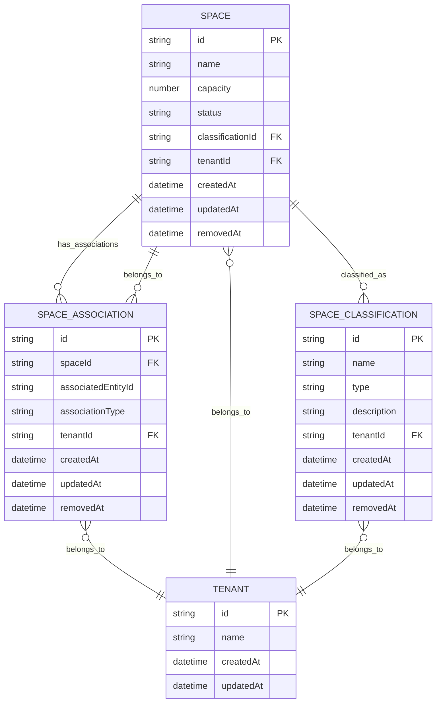

# Space Management Endpoints

<cite>
**Referenced Files in This Document**   
- [spaces.controller.ts](file://apps/server/src/shared/controller/resources/spaces.controller.ts)
- [space-associations.controller.ts](file://apps/server/src/shared/controller/resources/space-associations.controller.ts)
- [space-classifications.controller.ts](file://apps/server/src/shared/controller/resources/space-classifications.controller.ts)
- [spaces.service.ts](file://apps/server/src/shared/service/resources/spaces.service.ts)
- [space-associations.service.ts](file://apps/server/src/shared/service/resources/space-associations.service.ts)
- [space-classifications.service.ts](file://apps/server/src/shared/service/resources/space-classifications.service.ts)
- [spaces.repository.ts](file://apps/server/src/shared/repository/spaces.repository.ts)
- [space-associations.repository.ts](file://apps/server/src/shared/repository/space-associations.repository.ts)
- [space-classifications.repository.ts](file://apps/server/src/shared/repository/space-classifications.repository.ts)
- [create-space.dto.ts](file://packages/dto/src/create/create-space.dto.ts)
- [update-space.dto.ts](file://packages/dto/src/update/update-space.dto.ts)
- [query-space.dto.ts](file://packages/dto/src/query/query-space.dto.ts)
- [space-association.dto.ts](file://packages/dto/src/space-association.dto.ts)
- [space-classification.dto.ts](file://packages/dto/src/space-classification.dto.ts)
</cite>

## Table of Contents
1. [Introduction](#introduction)
2. [Authentication and Authorization](#authentication-and-authorization)
3. [Space CRUD Operations](#space-crud-operations)
4. [Space Associations](#space-associations)
5. [Space Classifications](#space-classifications)
6. [Request Parameters and Validation](#request-parameters-and-validation)
7. [Response Schema](#response-schema)
8. [Error Handling](#error-handling)
9. [Pagination, Filtering, and Sorting](#pagination-filtering-and-sorting)
10. [Sample Requests](#sample-requests)
11. [Data Model Relationships](#data-model-relationships)

## Introduction

The Space Management Endpoints API provides comprehensive functionality for managing spaces within the prj-core system. This API enables CRUD operations for spaces, management of space associations with programs, and classification of spaces according to organizational needs. The endpoints follow RESTful principles and are designed to support tenant isolation and role-based access control.

The API is organized into three main modules:
- Space CRUD operations for creating, reading, updating, and deleting spaces
- Space associations for linking spaces to programs and other entities
- Space classifications for categorizing spaces based on type, function, or other attributes

All endpoints require authentication via JWT tokens and enforce tenant-based isolation, ensuring that users can only access resources within their assigned tenant context.

**Section sources**
- [spaces.controller.ts](file://apps/server/src/shared/controller/resources/spaces.controller.ts#L1-L167)
- [space-associations.controller.ts](file://apps/server/src/shared/controller/resources/space-associations.controller.ts#L1-L91)
- [space-classifications.controller.ts](file://apps/server/src/shared/controller/resources/space-classifications.controller.ts#L1-L91)

## Authentication and Authorization

All space management endpoints require authentication using JWT (JSON Web Tokens). The authentication process follows these steps:

1. Users must first authenticate via the authentication endpoint to obtain a JWT token
2. The JWT token must be included in the `Authorization` header of all subsequent requests using the format: `Bearer <token>`
3. The system validates the token and extracts tenant and role information for access control

Access to space management endpoints is controlled by role-based access control (RBAC) with the following permissions:

- **Admin**: Full access to all space operations within their tenant
- **Manager**: Can create, read, and update spaces, but cannot delete them
- **User**: Read-only access to spaces within their tenant
- **SuperAdmin**: Full access across all tenants

Tenant isolation is enforced at the service layer, ensuring that users can only access spaces within their assigned tenant context. The system automatically filters all queries based on the tenant ID extracted from the authenticated user's context.

**Section sources**
- [spaces.controller.ts](file://apps/server/src/shared/controller/resources/spaces.controller.ts#L110-L167)
- [spaces.service.ts](file://apps/server/src/shared/service/resources/spaces.service.ts#L1-L50)
- [ContextService](file://apps/server/src/shared/service/utils/context.service.ts)

## Space CRUD Operations

The space CRUD endpoints provide standard operations for managing spaces within the system.

### Create Space
- **HTTP Method**: POST
- **URL Pattern**: `/spaces`
- **Authentication**: Required (JWT)
- **Access Control**: Admin, Manager

Creates a new space with the provided attributes. Returns the created space object with system-generated fields.

### Get Space
- **HTTP Method**: GET
- **URL Pattern**: `/spaces/:spaceId`
- **Authentication**: Required (JWT)
- **Access Control**: Admin, Manager, User

Retrieves a specific space by its ID.

### Update Space
- **HTTP Method**: PATCH
- **URL Pattern**: `/spaces/:spaceId`
- **Authentication**: Required (JWT)
- **Access Control**: Admin, Manager

Updates the specified fields of an existing space.

### Remove Space
- **HTTP Method**: PATCH
- **URL Pattern**: `/spaces/:spaceId/removedAt`
- **Authentication**: Required (JWT)
- **Access Control**: Admin

Marks a space as removed by setting the `removedAt` timestamp. This performs a soft delete.

### Delete Space
- **HTTP Method**: DELETE
- **URL Pattern**: `/spaces/:spaceId`
- **Authentication**: Required (JWT)
- **Access Control**: Admin

Permanently deletes a space from the system.

**Section sources**
- [spaces.controller.ts](file://apps/server/src/shared/controller/resources/spaces.controller.ts#L110-L167)
- [spaces.service.ts](file://apps/server/src/shared/service/resources/spaces.service.ts#L9-L50)
- [spaces.repository.ts](file://apps/server/src/shared/repository/spaces.repository.ts#L1-L43)

## Space Associations

The space associations endpoints manage the relationships between spaces and other entities such as programs.

### Create Space Association
- **HTTP Method**: POST
- **URL Pattern**: `/space-associations`
- **Authentication**: Required (JWT)
- **Access Control**: Admin, Manager

Creates an association between a space and another entity (e.g., program).

### Get Space Association
- **HTTP Method**: GET
- **URL Pattern**: `/space-associations/:spaceAssociationId`
- **Authentication**: Required (JWT)
- **Access Control**: Admin, Manager, User

Retrieves a specific space association by ID.

### Update Space Association
- **HTTP Method**: PATCH
- **URL Pattern**: `/space-associations/:spaceAssociationId`
- **Authentication**: Required (JWT)
- **Access Control**: Admin, Manager

Updates an existing space association.

### Remove Space Association
- **HTTP Method**: PATCH
- **URL Pattern**: `/space-associations/:spaceAssociationId/removedAt`
- **Authentication**: Required (JWT)
- **Access Control**: Admin

Marks a space association as removed (soft delete).

### Delete Space Association
- **HTTP Method**: DELETE
- **URL Pattern**: `/space-associations/:spaceAssociationId`
- **Authentication**: Required (JWT)
- **Access Control**: Admin

Permanently deletes a space association.

**Section sources**
- [space-associations.controller.ts](file://apps/server/src/shared/controller/resources/space-associations.controller.ts)
- [space-associations.service.ts](file://apps/server/src/shared/service/resources/space-associations.service.ts)
- [space-associations.repository.ts](file://apps/server/src/shared/repository/space-associations.repository.ts)

## Space Classifications

The space classifications endpoints manage the categorization of spaces.

### Create Space Classification
- **HTTP Method**: POST
- **URL Pattern**: `/space-classifications`
- **Authentication**: Required (JWT)
- **Access Control**: Admin

Creates a new space classification.

### Get Space Classification
- **HTTP Method**: GET
- **URL Pattern**: `/space-classifications/:spaceClassificationId`
- **Authentication**: Required (JWT)
- **Access Control**: Admin, Manager, User

Retrieves a specific space classification by ID.

### Update Space Classification
- **HTTP Method**: PATCH
- **URL Pattern**: `/space-classifications/:spaceClassificationId`
- **Authentication**: Required (JWT)
- **Access Control**: Admin

Updates an existing space classification.

### Remove Space Classification
- **HTTP Method**: PATCH
- **URL Pattern**: `/space-classifications/:spaceClassificationId/removedAt`
- **Authentication**: Required (JWT)
- **Access Control**: Admin

Marks a space classification as removed (soft delete).

### Delete Space Classification
- **HTTP Method**: DELETE
- **URL Pattern**: `/space-classifications/:spaceClassificationId`
- **Authentication**: Required (JWT)
- **Access Control**: Admin

Permanently deletes a space classification.

### List Space Classifications
- **HTTP Method**: GET
- **URL Pattern**: `/space-classifications`
- **Authentication**: Required (JWT)
- **Access Control**: Admin, Manager, User

Retrieves a list of space classifications with optional filtering and pagination.

**Section sources**
- [space-classifications.controller.ts](file://apps/server/src/shared/controller/resources/space-classifications.controller.ts#L1-L91)
- [space-classifications.service.ts](file://apps/server/src/shared/service/resources/space-classifications.service.ts)
- [space-classifications.repository.ts](file://apps/server/src/shared/repository/space-classifications.repository.ts#L1-L37)

## Request Parameters and Validation

### Create Space Request Parameters
```json
{
  "name": "string",
  "capacity": "number",
  "location": {
    "building": "string",
    "floor": "string",
    "roomNumber": "string"
  },
  "amenities": ["string"],
  "description": "string",
  "status": "ACTIVE|INACTIVE|MAINTENANCE",
  "classificationId": "string"
}
```

**Validation Rules:**
- **Name**: Required, minimum 2 characters, maximum 100 characters
- **Capacity**: Required, minimum 1, maximum 1000
- **Location**: Required, all fields are required
- **Building**: Minimum 1 character, maximum 50 characters
- **Floor**: Minimum 1 character, maximum 10 characters
- **RoomNumber**: Minimum 1 character, maximum 10 characters
- **Amenities**: Array of strings, maximum 20 items
- **Description**: Maximum 1000 characters
- **Status**: Must be one of: ACTIVE, INACTIVE, MAINTENANCE
- **ClassificationId**: Must reference an existing space classification

### Update Space Request Parameters
All fields are optional. Only provided fields will be updated.

### Query Parameters for List Endpoints
- **page**: Page number (default: 1)
- **limit**: Items per page (default: 10, maximum: 100)
- **sort**: Field to sort by (e.g., "name", "capacity", "createdAt")
- **order**: Sort order ("ASC" or "DESC", default: "ASC")
- **classificationId**: Filter by space classification
- **tenantId**: Filter by tenant (admin only)
- **status**: Filter by status ("ACTIVE", "INACTIVE", "MAINTENANCE")

**Section sources**
- [create-space.dto.ts](file://packages/dto/src/create/create-space.dto.ts)
- [update-space.dto.ts](file://packages/dto/src/update/update-space.dto.ts)
- [query-space.dto.ts](file://packages/dto/src/query/query-space.dto.ts)

## Response Schema

All successful responses follow a consistent schema:

```json
{
  "data": {},
  "message": "success",
  "meta": {
    "page": 1,
    "limit": 10,
    "totalItems": 100,
    "totalPages": 10,
    "hasNext": true,
    "hasPrev": false
  }
}
```

### Space Response Object
```json
{
  "id": "string",
  "name": "string",
  "capacity": "number",
  "location": {
    "building": "string",
    "floor": "string",
    "roomNumber": "string"
  },
  "amenities": ["string"],
  "description": "string",
  "status": "ACTIVE|INACTIVE|MAINTENANCE",
  "classificationId": "string",
  "classification": {
    "id": "string",
    "name": "string",
    "type": "string"
  },
  "tenantId": "string",
  "createdAt": "string",
  "updatedAt": "string",
  "removedAt": "string"
}
```

### Space Classification Response Object
```json
{
  "id": "string",
  "name": "string",
  "type": "string",
  "description": "string",
  "tenantId": "string",
  "createdAt": "string",
  "updatedAt": "string",
  "removedAt": "string"
}
```

### Space Association Response Object
```json
{
  "id": "string",
  "spaceId": "string",
  "associatedEntityId": "string",
  "associationType": "PROGRAM|EVENT|PROJECT",
  "tenantId": "string",
  "createdAt": "string",
  "updatedAt": "string",
  "removedAt": "string"
}
```

**Section sources**
- [spaceDto.ts](file://packages/dto/src/space.dto.ts)
- [space-association.dto.ts](file://packages/dto/src/space-association.dto.ts)
- [space-classification.dto.ts](file://packages/dto/src/space-classification.dto.ts)
- [response.util.ts](file://apps/server/src/shared/util/response.util.ts)

## Error Handling

The API returns standardized error responses with appropriate HTTP status codes.

### Common Status Codes
- **200 OK**: Successful operation
- **201 Created**: Resource successfully created
- **400 Bad Request**: Invalid request parameters or body
- **401 Unauthorized**: Missing or invalid authentication token
- **403 Forbidden**: Insufficient permissions for the operation
- **404 Not Found**: Requested resource not found
- **409 Conflict**: Resource already exists or operation conflicts with current state
- **422 Unprocessable Entity**: Validation failed
- **500 Internal Server Error**: Unexpected server error

### Error Response Format
```json
{
  "data": null,
  "message": "Error description",
  "meta": {
    "statusCode": 400,
    "error": "Bad Request"
  }
}
```

### Common Error Scenarios
- **Invalid Space Name**: Returns 422 with message "Space name must be 2-100 characters"
- **Capacity Out of Range**: Returns 422 with message "Capacity must be between 1 and 1000"
- **Missing Required Field**: Returns 400 with message indicating the missing field
- **Access Denied**: Returns 403 with message "Insufficient permissions for this operation"
- **Space Not Found**: Returns 404 with message "Space not found"
- **Classification Not Found**: Returns 404 with message "Space classification not found"

**Section sources**
- [spaces.controller.ts](file://apps/server/src/shared/controller/resources/spaces.controller.ts)
- [error.interceptor.ts](file://apps/server/src/shared/interceptor/error.interceptor.ts)
- [ApiResponseEntity decorator](file://apps/server/src/shared/decorator/api-response-entity.decorator.ts)

## Pagination, Filtering, and Sorting

All list endpoints support pagination, filtering, and sorting to handle large datasets efficiently.

### Pagination Parameters
- **page**: Current page number (1-based, default: 1)
- **limit**: Number of items per page (default: 10, maximum: 100)

### Sorting Parameters
- **sort**: Field name to sort by (e.g., "name", "capacity", "createdAt")
- **order**: Sort direction ("ASC" for ascending, "DESC" for descending, default: "ASC")

### Filtering Parameters
- **classificationId**: Filter spaces by classification ID
- **status**: Filter by space status ("ACTIVE", "INACTIVE", "MAINTENANCE")
- **name**: Filter by space name (partial match)
- **building**: Filter by building name
- **floor**: Filter by floor
- **tenantId**: Filter by tenant ID (admin only)

### Example Query
```
GET /spaces?page=2&limit=25&sort=name&order=ASC&status=ACTIVE&classificationId=cls_123
```

This query retrieves the second page of active spaces with classification ID "cls_123", sorted by name in ascending order, with 25 items per page.

**Section sources**
- [query-space.dto.ts](file://packages/dto/src/query/query-space.dto.ts)
- [PaginationUtil.ts](file://packages/shared-schema/src/lib/PaginationUtil.ts)
- [spaces.service.ts](file://apps/server/src/shared/service/resources/spaces.service.ts#L41-L50)

## Sample Requests

### Create Space
```bash
curl -X POST https://api.prj-core.com/spaces \
  -H "Authorization: Bearer <your-jwt-token>" \
  -H "Content-Type: application/json" \
  -d '{
    "name": "Conference Room A",
    "capacity": 20,
    "location": {
      "building": "Main Building",
      "floor": "3",
      "roomNumber": "301"
    },
    "amenities": ["Projector", "Whiteboard", "Video Conference"],
    "description": "Main conference room with video conferencing capabilities",
    "status": "ACTIVE",
    "classificationId": "cls_meeting_room"
  }'
```

### Update Space Classification
```bash
curl -X PATCH https://api.prj-core.com/space-classifications/cls_123 \
  -H "Authorization: Bearer <your-jwt-token>" \
  -H "Content-Type: application/json" \
  -d '{
    "name": "Executive Meeting Room",
    "description": "Premium meeting rooms for executive meetings"
  }'
```

### List Spaces with Filtering
```bash
curl -X GET "https://api.prj-core.com/spaces?page=1&limit=10&sort=capacity&order=DESC&status=ACTIVE" \
  -H "Authorization: Bearer <your-jwt-token>"
```

### Associate Space with Program
```bash
curl -X POST https://api.prj-core.com/space-associations \
  -H "Authorization: Bearer <your-jwt-token>" \
  -H "Content-Type: application/json" \
  -d '{
    "spaceId": "spc_456",
    "associatedEntityId": "prg_789",
    "associationType": "PROGRAM"
  }'
```

**Section sources**
- [spaces.controller.ts](file://apps/server/src/shared/controller/resources/spaces.controller.ts)
- [space-associations.controller.ts](file://apps/server/src/shared/controller/resources/space-associations.controller.ts)
- [space-classifications.controller.ts](file://apps/server/src/shared/controller/resources/space-classifications.controller.ts)

## Data Model Relationships

The space management system implements a relational data model with the following key relationships:



**Key Relationships:**
- A **Space** belongs to one **Space Classification** (many-to-one)
- A **Space** can have multiple **Space Associations** (one-to-many)
- Both **Space** and **Space Classification** are scoped to a **Tenant** (many-to-one)
- **Space Associations** link spaces to other entities like programs or events

This data model supports tenant isolation, soft deletes (via removedAt field), and flexible associations between spaces and other system entities.

**Diagram sources**
- [space.entity.ts](file://packages/shared-schema/src/entity/space.entity.ts)
- [space-classification.entity.ts](file://packages/shared-schema/src/entity/space-classification.entity.ts)
- [space-association.entity.ts](file://packages/shared-schema/src/entity/space-association.entity.ts)
- [tenant.entity.ts](file://packages/shared-schema/src/entity/tenant.entity.ts)

**Section sources**
- [space.entity.ts](file://packages/shared-schema/src/entity/space.entity.ts)
- [space-classification.entity.ts](file://packages/shared-schema/src/entity/space-classification.entity.ts)
- [space-association.entity.ts](file://packages/shared-schema/src/entity/space-association.entity.ts)