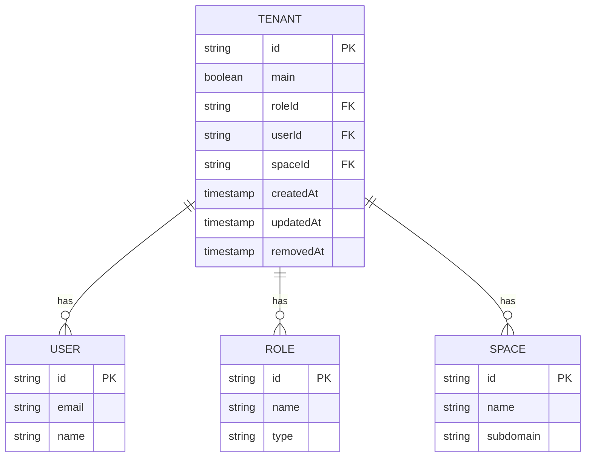

# Tenant Management Endpoints

<cite>
**Referenced Files in This Document**   
- [tenants.controller.ts](file://apps/server/src/shared/controller/resources/tenants.controller.ts)
- [tenants.service.ts](file://apps/server/src/shared/service/resources/tenants.service.ts)
- [tenants.repository.ts](file://apps/server/src/shared/repository/tenants.repository.ts)
- [tenant.entity.ts](file://packages/entity/src/tenant.entity.ts)
- [tenant.dto.ts](file://packages/dto/src/tenant.dto.ts)
- [create-tenant.dto.ts](file://packages/dto/src/create/create-tenant.dto.ts)
- [update-tenant.dto.ts](file://packages/dto/src/update/update-tenant.dto.ts)
- [query-tenant.dto.ts](file://packages/dto/src/query/query-tenant.dto.ts)
- [select-tenant.dto.ts](file://packages/dto/src/select-tenant.dto.ts)
</cite>

## Table of Contents
1. [Introduction](#introduction)
2. [Authentication and Authorization](#authentication-and-authorization)
3. [Tenant CRUD Operations](#tenant-crud-operations)
4. [Tenant Query and Filtering](#tenant-query-and-filtering)
5. [Tenant Selection](#tenant-selection)
6. [Data Models](#data-models)
7. [Error Handling](#error-handling)
8. [Relationships and Data Isolation](#relationships-and-data-isolation)
9. [Sample Requests](#sample-requests)

## Introduction

The Tenant Management API provides endpoints for creating, reading, updating, and deleting tenant records within the prj-core system. Tenants represent isolated organizational units that contain users, spaces, and associated data. This documentation details all available endpoints for managing tenants, including their configuration, access controls, and relationships with other entities.

The API follows RESTful principles and uses JSON for request and response payloads. All endpoints require authentication via JWT tokens and enforce role-based access control, with tenant administrator privileges required for most operations.

**Section sources**
- [tenants.controller.ts](file://apps/server/src/shared/controller/resources/tenants.controller.ts#L27-L103)

## Authentication and Authorization

All tenant management endpoints require authentication using JWT (JSON Web Tokens). Clients must include the JWT in the Authorization header of each request using the Bearer scheme.

Access to tenant operations is controlled by role-based permissions. Tenant administrators have full CRUD access to their assigned tenants, while regular users can only view tenants they belong to. The system validates user permissions through the ContextService, which extracts the authenticated user's identity and role from the JWT token.

The following headers are required for all requests:
- `Authorization: Bearer <JWT_TOKEN>`
- `Content-Type: application/json`

**Section sources**
- [tenants.service.ts](file://apps/server/src/shared/service/resources/tenants.service.ts#L92-L98)
- [tenants.controller.ts](file://apps/server/src/shared/controller/resources/tenants.controller.ts#L39-L41)

## Tenant CRUD Operations

### Create Tenant
Creates a new tenant with the specified configuration.

- **HTTP Method**: POST
- **URL Pattern**: `/tenants`
- **Request Body**: `CreateTenantDto`
- **Response**: `TenantDto`
- **Status Codes**:
  - 200: Tenant created successfully
  - 400: Validation error in request data
  - 401: Unauthorized (invalid or missing JWT)
  - 403: Forbidden (insufficient permissions)

**Section sources**
- [tenants.controller.ts](file://apps/server/src/shared/controller/resources/tenants.controller.ts#L45-L52)
- [tenants.service.ts](file://apps/server/src/shared/service/resources/tenants.service.ts#L15-L27)

### Get Tenant by ID
Retrieves a specific tenant by its unique identifier.

- **HTTP Method**: GET
- **URL Pattern**: `/tenants/:tenantId`
- **Path Parameters**:
  - `tenantId`: UUID of the tenant to retrieve
- **Response**: `TenantDto`
- **Status Codes**:
  - 200: Tenant retrieved successfully
  - 401: Unauthorized
  - 403: Forbidden
  - 404: Tenant not found

**Section sources**
- [tenants.controller.ts](file://apps/server/src/shared/controller/resources/tenants.controller.ts#L54-L60)
- [tenants.service.ts](file://apps/server/src/shared/service/resources/tenants.service.ts#L30-L43)

### Update Tenant
Modifies the configuration of an existing tenant.

- **HTTP Method**: PATCH
- **URL Pattern**: `/tenants/:tenantId`
- **Path Parameters**:
  - `tenantId`: UUID of the tenant to update
- **Request Body**: `UpdateTenantDto`
- **Response**: `TenantDto`
- **Status Codes**:
  - 200: Tenant updated successfully
  - 400: Validation error
  - 401: Unauthorized
  - 403: Forbidden
  - 404: Tenant not found

**Section sources**
- [tenants.controller.ts](file://apps/server/src/shared/controller/resources/tenants.controller.ts#L62-L71)
- [tenants.service.ts](file://apps/server/src/shared/service/resources/tenants.service.ts#L46-L63)

### Soft Delete Tenant
Marks a tenant as removed by setting the removedAt timestamp.

- **HTTP Method**: PATCH
- **URL Pattern**: `/tenants/:tenantId/removedAt`
- **Path Parameters**:
  - `tenantId`: UUID of the tenant to remove
- **Response**: `TenantDto`
- **Status Codes**:
  - 200: Tenant marked as removed
  - 401: Unauthorized
  - 403: Forbidden
  - 404: Tenant not found

**Section sources**
- [tenants.controller.ts](file://apps/server/src/shared/controller/resources/tenants.controller.ts#L73-L79)
- [tenants.service.ts](file://apps/server/src/shared/service/resources/tenants.service.ts#L66-L81)

### Hard Delete Tenant
Permanently deletes a tenant record from the database.

- **HTTP Method**: DELETE
- **URL Pattern**: `/tenants/:tenantId`
- **Path Parameters**:
  - `tenantId`: UUID of the tenant to delete
- **Response**: `TenantDto`
- **Status Codes**:
  - 200: Tenant deleted successfully
  - 401: Unauthorized
  - 403: Forbidden
  - 404: Tenant not found

**Section sources**
- [tenants.controller.ts](file://apps/server/src/shared/controller/resources/tenants.controller.ts#L81-L87)
- [tenants.service.ts](file://apps/server/src/shared/service/resources/tenants.service.ts#L83-L87)

## Tenant Query and Filtering

### List Tenants
Retrieves a paginated list of tenants based on query parameters.

- **HTTP Method**: GET
- **URL Pattern**: `/tenants`
- **Query Parameters**: `QueryTenantDto`
- **Response**: Paginated array of `TenantDto`
- **Status Codes**:
  - 200: Tenants retrieved successfully
  - 401: Unauthorized
  - 403: Forbidden

#### Filtering Parameters
- `skip`: Number of records to skip (for pagination)
- `take`: Maximum number of records to return
- `orderBy`: Field to sort by
- `order`: Sort order (ASC or DESC)
- `search`: Text search across tenant fields

#### Sorting Parameters
Tenants can be sorted by any field in ascending or descending order using the `orderBy` and `order` query parameters.

**Section sources**
- [tenants.controller.ts](file://apps/server/src/shared/controller/resources/tenants.controller.ts#L89-L102)
- [tenants.service.ts](file://apps/server/src/shared/service/resources/tenants.service.ts#L89-L118)

### Get User's Tenants
Retrieves all tenants associated with the authenticated user.

- **HTTP Method**: GET
- **URL Pattern**: `/tenants/my`
- **Response**: Array of `TenantDto`
- **Status Codes**:
  - 200: User's tenants retrieved successfully
  - 401: Unauthorized

This endpoint automatically filters tenants based on the authenticated user's ID extracted from the JWT token.

**Section sources**
- [tenants.controller.ts](file://apps/server/src/shared/controller/resources/tenants.controller.ts#L35-L43)
- [tenants.service.ts](file://apps/server/src/shared/service/resources/tenants.service.ts#L89-L118)

## Tenant Selection

### Select Active Tenant
Sets the currently active tenant for the authenticated user session.

- **HTTP Method**: PATCH
- **URL Pattern**: `/tenants/select`
- **Request Body**: `SelectTenantDto`
- **Response**: `TenantDto`
- **Status Codes**:
  - 200: Tenant selected successfully
  - 400: Invalid tenant ID
  - 401: Unauthorized
  - 403: User does not have access to the specified tenant
  - 404: Tenant not found

The selected tenant ID is validated against the user's authorized tenants, ensuring users can only select tenants they belong to.

**Section sources**
- [select-tenant.dto.ts](file://packages/dto/src/select-tenant.dto.ts#L1-L12)

## Data Models

### TenantDto
The response model for tenant entities.

```json
{
  "id": "string",
  "createdAt": "string",
  "updatedAt": "string",
  "main": "boolean",
  "roleId": "string",
  "userId": "string",
  "spaceId": "string",
  "user": "UserDto",
  "space": "SpaceDto",
  "role": "RoleDto"
}
```

**Section sources**
- [tenant.dto.ts](file://packages/dto/src/tenant.dto.ts#L1-L33)

### CreateTenantDto
The request model for creating new tenants.

```json
{
  "main": "boolean",
  "roleId": "string",
  "userId": "string",
  "spaceId": "string"
}
```

**Section sources**
- [create-tenant.dto.ts](file://packages/dto/src/create/create-tenant.dto.ts#L1-L11)

### UpdateTenantDto
The request model for updating existing tenants (all fields optional).

```json
{
  "main": "boolean",
  "roleId": "string",
  "userId": "string",
  "spaceId": "string"
}
```

**Section sources**
- [update-tenant.dto.ts](file://packages/dto/src/update/update-tenant.dto.ts#L1-L5)

### SelectTenantDto
The request model for selecting an active tenant.

```json
{
  "selectedTenantId": "string"
}
```

**Section sources**
- [select-tenant.dto.ts](file://packages/dto/src/select-tenant.dto.ts#L1-L12)

### Tenant Entity
The database entity model for tenants.

```typescript
class Tenant extends AbstractEntity implements TenantEntity {
  main!: boolean;
  spaceId!: string;
  userId!: string;
  roleId!: string;
  space?: Space;
  user?: User;
  role?: Role;
}
```

**Section sources**
- [tenant.entity.ts](file://packages/entity/src/tenant.entity.ts#L1-L16)

## Error Handling

The API returns standardized error responses following the ResponseEntity pattern. All error responses include:

- HTTP status code indicating the error type
- JSON body with error details including message and metadata
- Consistent structure across all endpoints

Common error responses:
- **400 Bad Request**: Invalid request parameters or body
- **401 Unauthorized**: Missing or invalid authentication token
- **403 Forbidden**: Insufficient permissions for the requested operation
- **404 Not Found**: Requested resource does not exist
- **500 Internal Server Error**: Unexpected server error

Validation errors include specific details about which fields failed validation and why.

**Section sources**
- [tenants.controller.ts](file://apps/server/src/shared/controller/resources/tenants.controller.ts#L37-L38)
- [tenants.controller.ts](file://apps/server/src/shared/controller/resources/tenants.controller.ts#L47-L48)

## Relationships and Data Isolation

### Entity Relationships
The tenant system implements the following relationships:



**Diagram sources**
- [tenant.entity.ts](file://packages/entity/src/tenant.entity.ts#L7-L15)
- [tenant.dto.ts](file://packages/dto/src/tenant.dto.ts#L11-L32)

### Data Isolation Mechanism
The system enforces data isolation between tenants through the ContextService, which:

1. Extracts the authenticated user's ID from the JWT token
2. Filters all tenant queries to include only tenants associated with the user
3. Validates tenant access for all operations
4. Prevents cross-tenant data access

When retrieving tenant lists, the service automatically applies a filter based on the authenticated user's ID, ensuring users can only access their own tenants.

**Section sources**
- [tenants.service.ts](file://apps/server/src/shared/service/resources/tenants.service.ts#L92-L98)

## Sample Requests

### Create Tenant (curl)
```bash
curl -X POST https://api.prj-core.com/tenants \
  -H "Authorization: Bearer <JWT_TOKEN>" \
  -H "Content-Type: application/json" \
  -d '{
    "main": true,
    "roleId": "123e4567-e89b-12d3-a456-426614174001",
    "userId": "123e4567-e89b-12d3-a456-426614174002",
    "spaceId": "123e4567-e89b-12d3-a456-426614174003"
  }'
```

### List User's Tenants (curl)
```bash
curl -X GET https://api.prj-core.com/tenants/my \
  -H "Authorization: Bearer <JWT_TOKEN>"
```

### Update Tenant (curl)
```bash
curl -X PATCH https://api.prj-core.com/tenants/123e4567-e89b-12d3-a456-426614174000 \
  -H "Authorization: Bearer <JWT_TOKEN>" \
  -H "Content-Type: application/json" \
  -d '{
    "main": false
  }'
```

### Select Tenant (curl)
```bash
curl -X PATCH https://api.prj-core.com/tenants/select \
  -H "Authorization: Bearer <JWT_TOKEN>" \
  -H "Content-Type: application/json" \
  -d '{
    "selectedTenantId": "123e4567-e89b-12d3-a456-426614174000"
  }'
```

### Create Tenant (Postman)
```
POST /tenants
Headers:
  Authorization: Bearer <JWT_TOKEN>
  Content-Type: application/json

Body:
{
  "main": true,
  "roleId": "123e4567-e89b-12d3-a456-426614174001",
  "userId": "123e4567-e89b-12d3-a456-426614174002",
  "spaceId": "123e4567-e89b-12d3-a456-426614174003"
}
```

**Section sources**
- [tenants.controller.ts](file://apps/server/src/shared/controller/resources/tenants.controller.ts#L45-L52)
- [tenants.controller.ts](file://apps/server/src/shared/controller/resources/tenants.controller.ts#L35-L43)
- [select-tenant.dto.ts](file://packages/dto/src/select-tenant.dto.ts#L1-L12)