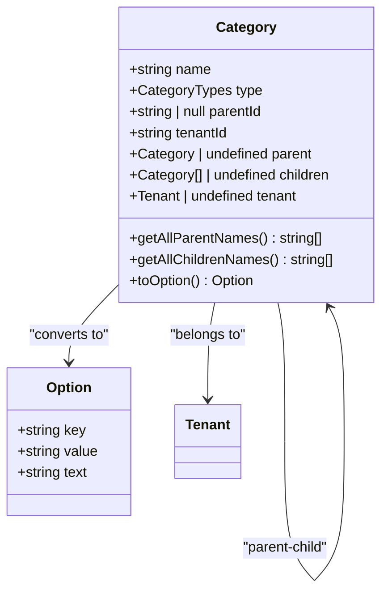
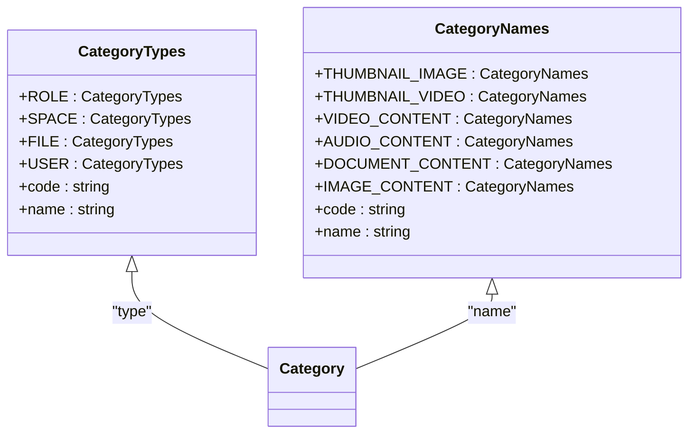
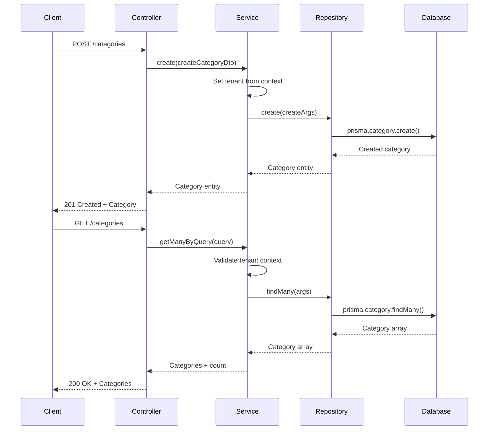
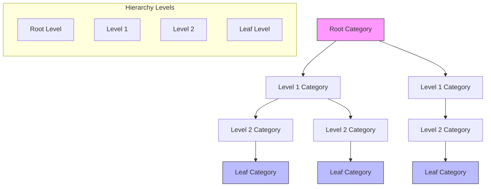

# Categories Module

<cite>
**Referenced Files in This Document**   
- [categories.module.ts](file://apps/server/src/module/categories.module.ts)
- [category.entity.ts](file://packages/entity/src/category.entity.ts)
- [category.dto.ts](file://packages/dto/src/category.dto.ts)
- [category-types.enum.ts](file://packages/enum/src/category-types.enum.ts)
- [category-names.enum.ts](file://packages/enum/src/category-names.enum.ts)
- [categories.repository.ts](file://apps/server/src/shared/repository/categories.repository.ts)
- [categories.service.ts](file://apps/server/src/shared/service/resources/categories.service.ts)
- [categories.controller.ts](file://apps/server/src/shared/controller/resources/categories.controller.ts)
</cite>

## Table of Contents
1. [Introduction](#introduction)
2. [Category Entity Model](#category-entity-model)
3. [Category Types and Names](#category-types-and-names)
4. [CRUD Operations](#crud-operations)
5. [Business Logic and Validation](#business-logic-and-validation)
6. [Hierarchical Structure and Relationships](#hierarchical-structure-and-relationships)
7. [Integration with Other Modules](#integration-with-other-modules)
8. [API Endpoints](#api-endpoints)
9. [Performance Considerations](#performance-considerations)
10. [Common Issues and Solutions](#common-issues-and-solutions)

## Introduction
The Categories Module in prj-core provides a foundational system for organizing and classifying content across the application. Categories serve as a hierarchical classification system that enables structured organization of programs, files, users, and other content types. This module implements a flexible category system with support for multiple category types, hierarchical nesting, and tenant-based isolation. The implementation follows a clean architectural pattern with separation of concerns between the controller, service, and repository layers, ensuring maintainability and testability.

**Section sources**
- [categories.module.ts](file://apps/server/src/module/categories.module.ts#L1-L14)

## Category Entity Model
The Category entity represents the core data structure for the categories system. It extends the AbstractEntity class and implements the CategoryEntity interface from Prisma. The entity contains essential fields including name, type, parentId, and tenantId, which enable hierarchical organization and multi-tenancy support. The model includes utility methods for traversing the category hierarchy, such as getAllParentNames() for retrieving all ancestor category names and getAllChildrenNames() for recursively collecting descendant category names. The toOption() method provides a standardized format for UI components, returning key-value-text structure suitable for dropdowns and selection controls.



**Diagram sources**
- [category.entity.ts](file://packages/entity/src/category.entity.ts#L5-L62)

**Section sources**
- [category.entity.ts](file://packages/entity/src/category.entity.ts#L1-L62)

## Category Types and Names
The category system supports multiple classification types through the CategoryTypes enum, which includes ROLE, SPACE, FILE, and USER categories. Each type serves a specific organizational purpose within the application. Additionally, the CategoryNames enum defines standardized category names for common content types such as THUMBNAIL_IMAGE, THUMBNAIL_VIDEO, VIDEO_CONTENT, AUDIO_CONTENT, DOCUMENT_CONTENT, and IMAGE_CONTENT. These enums ensure consistency in category classification across the application and provide a controlled vocabulary for content organization. The implementation uses the ts-jenum library to create TypeScript enums with additional metadata properties like code and name.



**Diagram sources**
- [category-types.enum.ts](file://packages/enum/src/category-types.enum.ts#L1-L25)
- [category-names.enum.ts](file://packages/enum/src/category-names.enum.ts#L1-L36)

**Section sources**
- [category-types.enum.ts](file://packages/enum/src/category-types.enum.ts#L1-L25)
- [category-names.enum.ts](file://packages/enum/src/category-names.enum.ts#L1-L36)

## CRUD Operations
The Categories Module provides comprehensive CRUD (Create, Read, Update, Delete) operations through a layered architecture. The CategoriesController exposes RESTful endpoints for category management, which are implemented by the CategoriesService. The service layer contains the business logic and coordinates with the CategoriesRepository for data persistence. The repository abstracts the Prisma client operations, providing a clean interface for database interactions. The create operation automatically associates the category with the current tenant from the context, ensuring proper multi-tenancy isolation.



**Diagram sources**
- [categories.controller.ts](file://apps/server/src/shared/controller/resources/categories.controller.ts#L25-L83)
- [categories.service.ts](file://apps/server/src/shared/service/resources/categories.service.ts#L8-L137)
- [categories.repository.ts](file://apps/server/src/shared/repository/categories.repository.ts#L7-L106)

**Section sources**
- [categories.controller.ts](file://apps/server/src/shared/controller/resources/categories.controller.ts#L1-L83)
- [categories.service.ts](file://apps/server/src/shared/service/resources/categories.service.ts#L1-L137)
- [categories.repository.ts](file://apps/server/src/shared/repository/categories.repository.ts#L1-L106)

## Business Logic and Validation
The Categories Service implements critical business logic for category management, including tenant context validation and hierarchical constraints. Before any category operation, the service verifies the presence of a valid tenant in the context, throwing appropriate errors if the tenant information is missing. The getManyByQuery method includes comprehensive logging for debugging and monitoring purposes. The service also implements a soft delete pattern through the removeById method, which updates the removedAt timestamp instead of permanently deleting the record, allowing for potential restoration and maintaining referential integrity. The updateById method ensures data consistency by using the repository's update operation with proper filtering.

**Section sources**
- [categories.service.ts](file://apps/server/src/shared/service/resources/categories.service.ts#L8-L137)

## Hierarchical Structure and Relationships
The category system implements a tree-like hierarchical structure using the parent-child relationship pattern. Each category can have zero or one parent (via parentId) and can have multiple children. This design enables the creation of nested category structures for organizing content in a logical hierarchy. The entity model includes both parent and children properties to facilitate bidirectional navigation through the category tree. The getAllParentNames() method traverses upward from a category to the root, collecting all ancestor names, while getAllChildrenNames() recursively collects all descendant names. The repository's findLastLeafCategoriesByServiceName method identifies leaf nodes (categories without children) for specific use cases.



**Diagram sources**
- [category.entity.ts](file://packages/entity/src/category.entity.ts#L5-L62)
- [categories.repository.ts](file://apps/server/src/shared/repository/categories.repository.ts#L84-L105)

**Section sources**
- [category.entity.ts](file://packages/entity/src/category.entity.ts#L1-L62)
- [categories.repository.ts](file://apps/server/src/shared/repository/categories.repository.ts#L84-L105)

## Integration with Other Modules
The Categories Module is designed to integrate with various content modules across the application, serving as the foundation for organizing programs, files, users, and other entities. The category types (ROLE, SPACE, FILE, USER) indicate the primary integration points with corresponding modules. The tenantId field ensures that categories are properly isolated within multi-tenant environments, allowing each tenant to have their own category hierarchy. The module's DTO (Data Transfer Object) pattern facilitates clean data exchange between layers and with external systems. The CategoriesController's use of ApiResponseEntity and ResponseMessage decorators ensures consistent API responses that can be easily consumed by frontend applications and other services.

**Section sources**
- [category.dto.ts](file://packages/dto/src/category.dto.ts#L1-L29)
- [categories.module.ts](file://apps/server/src/module/categories.module.ts#L1-L14)

## API Endpoints
The Categories Controller exposes a comprehensive set of RESTful API endpoints for category management. The GET /categories endpoint retrieves categories based on query parameters, returning a paginated response with metadata. The POST /categories endpoint creates a new category, automatically associating it with the current tenant. The GET /categories/:categoryId endpoint retrieves a specific category by ID, including its hierarchical relationships. The PATCH /categories/:categoryId endpoint updates an existing category, while the DELETE /categories/:categoryId endpoint permanently removes a category. All endpoints use standardized response formatting through the wrapResponse utility and include appropriate Swagger documentation via the ApiTags and ApiResponseEntity decorators.

```mermaid
erDiagram
CATEGORY ||--o{ CATEGORY : "parent-child"
CATEGORY ||--|| TENANT : "belongs to"
CATEGORY {
string id PK
string name
string type
string | null parentId FK
string tenantId FK
datetime createdAt
datetime updatedAt
datetime | null removedAt
}
TENANT {
string id PK
string name
string spaceId
datetime createdAt
datetime updatedAt
}
class CATEGORY {
getAllParentNames() string[]
getAllChildrenNames() string[]
toOption() Option
}
```

**Diagram sources**
- [categories.controller.ts](file://apps/server/src/shared/controller/resources/categories.controller.ts#L25-L83)
- [category.entity.ts](file://packages/entity/src/category.entity.ts#L5-L62)

**Section sources**
- [categories.controller.ts](file://apps/server/src/shared/controller/resources/categories.controller.ts#L1-L83)

## Performance Considerations
The Categories Module implements several performance optimizations to handle hierarchical data efficiently. The repository methods use Prisma's include feature to eagerly load related entities (parent, children) in a single database query, reducing the N+1 query problem. The getManyByQuery method in the service layer includes three levels of nested children in the include statement, enabling efficient retrieval of category trees up to four levels deep. The repository's findLastLeafCategoriesByServiceName method is optimized to find leaf nodes by checking for the absence of children. The use of plainToInstance from class-transformer ensures consistent data transformation between Prisma entities and domain objects. For large category hierarchies, the implementation may benefit from additional indexing on frequently queried fields like tenantId and parentId.

**Section sources**
- [categories.repository.ts](file://apps/server/src/shared/repository/categories.repository.ts#L84-L105)
- [categories.service.ts](file://apps/server/src/shared/service/resources/categories.service.ts#L61-L137)

## Common Issues and Solutions
The Categories Module addresses several common issues in hierarchical data management. For category nesting limits, the implementation does not enforce a strict depth limit at the code level, but the three-level include in queries suggests a practical limit of four levels for optimal performance. To prevent naming conflicts, the system relies on the application logic and validation layers rather than database constraints, allowing flexibility in naming while requiring proper validation in the service layer. Type validation is enforced through the CategoryTypes enum, ensuring only valid category types can be assigned. The tenant context validation in the service layer prevents unauthorized access to categories across tenants. For performance issues with large hierarchies, the implementation could be enhanced with caching strategies or lazy loading of deep nested structures.

**Section sources**
- [categories.service.ts](file://apps/server/src/shared/service/resources/categories.service.ts#L16-L37)
- [categories.service.ts](file://apps/server/src/shared/service/resources/categories.service.ts#L61-L137)
- [categories.repository.ts](file://apps/server/src/shared/repository/categories.repository.ts#L84-L105)