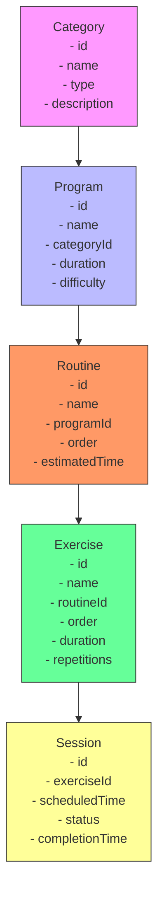
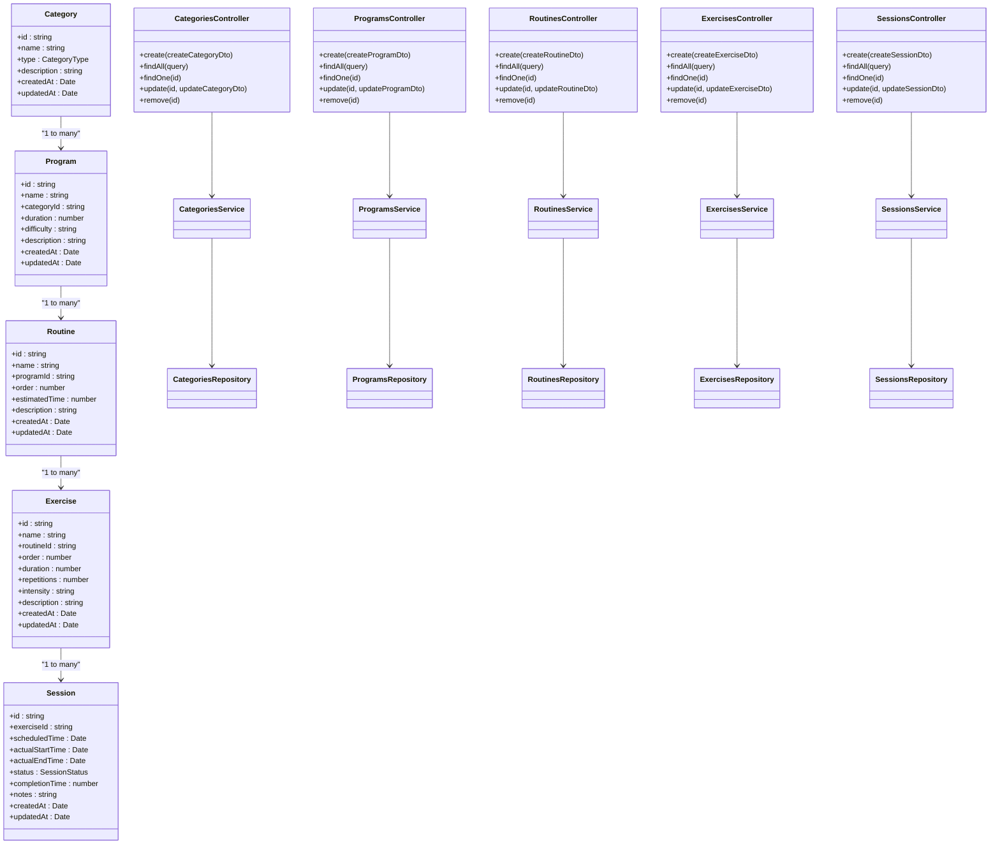
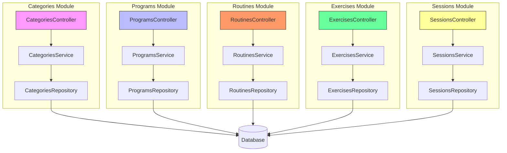
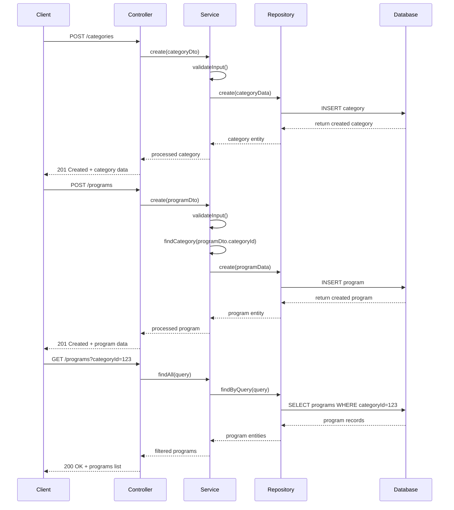
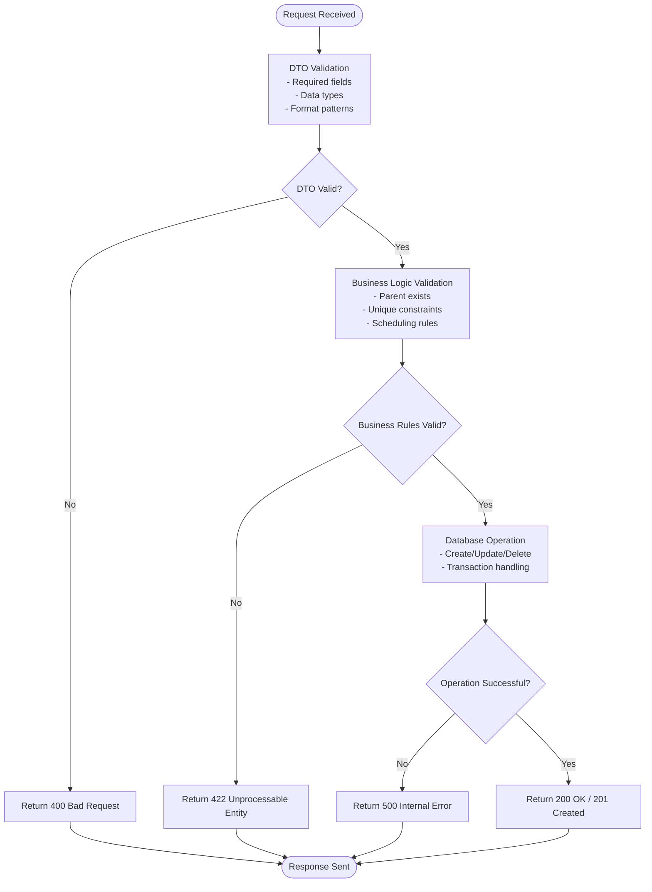

# Content Management Modules

<cite>
**Referenced Files in This Document**   
- [categories.module.ts](file://apps/server/src/module/categories.module.ts)
- [programs.module.ts](file://apps/server/src/module/programs.module.ts)
- [routines.module.ts](file://apps/server/src/module/routines.module.ts)
- [exercises.module.ts](file://apps/server/src/module/exercises.module.ts)
- [sessions.module.ts](file://apps/server/src/module/sessions.module.ts)
- [categories.repository.ts](file://apps/server/src/shared/repository/categories.repository.ts)
- [programs.repository.ts](file://apps/server/src/shared/repository/programs.repository.ts)
- [routines.repository.ts](file://apps/server/src/shared/repository/routines.repository.ts)
- [exercises.repository.ts](file://apps/server/src/shared/repository/exercises.repository.ts)
- [sessions.repository.ts](file://apps/server/src/shared/repository/sessions.repository.ts)
- [category.dto.ts](file://packages/shared-schema/src/dto/category.dto.ts)
- [program.dto.ts](file://packages/shared-schema/src/dto/program.dto.ts)
- [routine.dto.ts](file://packages/shared-schema/src/dto/routine.dto.ts)
- [exercise.dto.ts](file://packages/shared-schema/src/dto/exercise.dto.ts)
- [session.dto.ts](file://packages/shared-schema/src/dto/session.dto.ts)
- [category.entity.ts](file://packages/shared-schema/src/entity/category.entity.ts)
- [program.entity.ts](file://packages/shared-schema/src/entity/program.entity.ts)
- [routine.entity.ts](file://packages/shared-schema/src/entity/routine.entity.ts)
- [exercise.entity.ts](file://packages/shared-schema/src/entity/exercise.entity.ts)
- [session.entity.ts](file://packages/shared-schema/src/entity/session.entity.ts)
</cite>

## Table of Contents
1. [Introduction](#introduction)
2. [Content Hierarchy Overview](#content-hierarchy-overview)
3. [Core Components](#core-components)
4. [Module Architecture](#module-architecture)
5. [Data Flow and Relationships](#data-flow-and-relationships)
6. [Validation and Business Logic](#validation-and-business-logic)
7. [Dependency Management](#dependency-management)
8. [Performance Considerations](#performance-considerations)
9. [Troubleshooting Guide](#troubleshooting-guide)
10. [Conclusion](#conclusion)

## Introduction

The Content Management Modules in prj-core form a hierarchical structure that organizes content from broad categories down to specific session instances. This documentation provides a comprehensive analysis of the implementation details for Categories, Programs, Routines, Exercises, and Sessions, explaining how these modules work together to create a structured content management system. The system enables the creation and management of program workflows, exercise libraries, and scheduled sessions through well-defined relationships and constraints.

**Section sources**
- [categories.module.ts](file://apps/server/src/module/categories.module.ts)
- [programs.module.ts](file://apps/server/src/module/programs.module.ts)
- [routines.module.ts](file://apps/server/src/module/routines.module.ts)

## Content Hierarchy Overview

The content management system follows a strict hierarchical structure where each level represents a more specific content type:

1. **Categories**: Top-level organizational units that group related programs
2. **Programs**: Structured collections of routines designed for specific goals
3. **Routines**: Sequences of exercises organized for particular training sessions
4. **Exercises**: Individual physical or mental activities with defined parameters
5. **Sessions**: Scheduled instances of routines with specific timing and context

This hierarchy ensures content is organized logically, with proper relationships and constraints between levels. Each module builds upon the previous one, creating a cohesive system for content creation, management, and delivery.



**Diagram sources**
- [category.entity.ts](file://packages/shared-schema/src/entity/category.entity.ts)
- [program.entity.ts](file://packages/shared-schema/src/entity/program.entity.ts)
- [routine.entity.ts](file://packages/shared-schema/src/entity/routine.entity.ts)
- [exercise.entity.ts](file://packages/shared-schema/src/entity/exercise.entity.ts)
- [session.entity.ts](file://packages/shared-schema/src/entity/session.entity.ts)

**Section sources**
- [category.entity.ts](file://packages/shared-schema/src/entity/category.entity.ts)
- [program.entity.ts](file://packages/shared-schema/src/entity/program.entity.ts)
- [routine.entity.ts](file://packages/shared-schema/src/entity/routine.entity.ts)

## Core Components

The content management system consists of five core modules, each responsible for a specific level of the content hierarchy. These modules follow the NestJS architecture pattern with controllers, services, and repositories that handle HTTP requests, business logic, and data persistence respectively.

Each module operates independently but maintains relationships with adjacent levels in the hierarchy. The system uses DTOs (Data Transfer Objects) to define the structure of data passed between layers and entities to represent the database schema.



**Diagram sources**
- [category.dto.ts](file://packages/shared-schema/src/dto/category.dto.ts)
- [program.dto.ts](file://packages/shared-schema/src/dto/program.dto.ts)
- [routine.dto.ts](file://packages/shared-schema/src/dto/routine.dto.ts)
- [exercise.dto.ts](file://packages/shared-schema/src/dto/exercise.dto.ts)
- [session.dto.ts](file://packages/shared-schema/src/dto/session.dto.ts)

**Section sources**
- [categories.module.ts](file://apps/server/src/module/categories.module.ts)
- [programs.module.ts](file://apps/server/src/module/programs.module.ts)
- [routines.module.ts](file://apps/server/src/module/routines.module.ts)
- [exercises.module.ts](file://apps/server/src/module/exercises.module.ts)
- [sessions.module.ts](file://apps/server/src/module/sessions.module.ts)

## Module Architecture

The content management modules follow a consistent architectural pattern across all levels of the hierarchy. Each module is implemented as a NestJS module that encapsulates controllers, services, and repositories specific to that content type.

The architecture enforces separation of concerns, with controllers handling HTTP request/response cycles, services implementing business logic and validation rules, and repositories managing data persistence operations. This pattern ensures maintainability and testability across all content modules.



**Diagram sources**
- [categories.module.ts](file://apps/server/src/module/categories.module.ts)
- [programs.module.ts](file://apps/server/src/module/programs.module.ts)
- [routines.module.ts](file://apps/server/src/module/routines.module.ts)
- [exercises.module.ts](file://apps/server/src/module/exercises.module.ts)
- [sessions.module.ts](file://apps/server/src/module/sessions.module.ts)

**Section sources**
- [categories.module.ts](file://apps/server/src/module/categories.module.ts)
- [programs.module.ts](file://apps/server/src/module/programs.module.ts)
- [routines.module.ts](file://apps/server/src/module/routines.module.ts)
- [exercises.module.ts](file://apps/server/src/module/exercises.module.ts)
- [sessions.module.ts](file://apps/server/src/module/sessions.module.ts)

## Data Flow and Relationships

The content modules form a directed acyclic graph with strict parent-child relationships. Data flows from higher-level categories down to specific session instances, with each level adding more specific context and parameters.

When creating content, the system validates that parent references exist and that relationships are maintained. For example, when creating a program, the system verifies that the referenced category exists. Similarly, when creating a routine, it validates that the parent program exists.



**Diagram sources**
- [categories.repository.ts](file://apps/server/src/shared/repository/categories.repository.ts)
- [programs.repository.ts](file://apps/server/src/shared/repository/programs.repository.ts)
- [routines.repository.ts](file://apps/server/src/shared/repository/routines.repository.ts)
- [exercises.repository.ts](file://apps/server/src/shared/repository/exercises.repository.ts)
- [sessions.repository.ts](file://apps/server/src/shared/repository/sessions.repository.ts)

**Section sources**
- [categories.repository.ts](file://apps/server/src/shared/repository/categories.repository.ts)
- [programs.repository.ts](file://apps/server/src/shared/repository/programs.repository.ts)
- [routines.repository.ts](file://apps/server/src/shared/repository/routines.repository.ts)

## Validation and Business Logic

The content management system implements comprehensive validation rules and business logic to ensure data integrity and enforce domain constraints. Each module applies validation at multiple levels: DTO validation, service-level business rules, and database constraints.

Key validation rules include:
- Required field validation for all entities
- Unique constraints on critical fields
- Parent-child relationship validation
- Temporal constraints for scheduling
- Data type and format validation

The system uses NestJS pipes for automatic DTO validation and custom service methods for complex business rules that require database queries or cross-entity validation.



**Diagram sources**
- [category.dto.ts](file://packages/shared-schema/src/dto/category.dto.ts)
- [program.dto.ts](file://packages/shared-schema/src/dto/program.dto.ts)
- [routine.dto.ts](file://packages/shared-schema/src/dto/routine.dto.ts)
- [exercise.dto.ts](file://packages/shared-schema/src/dto/exercise.dto.ts)
- [session.dto.ts](file://packages/shared-schema/src/dto/session.dto.ts)

**Section sources**
- [category.dto.ts](file://packages/shared-schema/src/dto/category.dto.ts)
- [program.dto.ts](file://packages/shared-schema/src/dto/program.dto.ts)
- [routine.dto.ts](file://packages/shared-schema/src/dto/routine.dto.ts)

## Dependency Management

The content modules manage dependencies through a combination of database relationships, service coordination, and event-driven patterns. Each module maintains its independence while properly handling dependencies on parent entities.

When deleting content, the system implements cascading rules to maintain data integrity:
- Deleting a category removes all associated programs
- Deleting a program removes all associated routines
- Deleting a routine removes all associated exercises
- Deleting an exercise removes all associated sessions

The system also handles circular dependency prevention by enforcing the strict hierarchical structure and validating relationships before creation.

```mermaid
erDiagram
CATEGORY {
string id PK
string name UK
string type
string description
datetime created_at
datetime updated_at
}
PROGRAM {
string id PK
string name UK
string category_id FK
integer duration
string difficulty
string description
datetime created_at
datetime updated_at
}
ROUTINE {
string id PK
string name
string program_id FK
integer "order"
integer estimated_time
string description
datetime created_at
datetime updated_at
}
EXERCISE {
string id PK
string name
string routine_id FK
integer "order"
integer duration
integer repetitions
string intensity
string description
datetime created_at
datetime updated_at
}
SESSION {
string id PK
string exercise_id FK
timestamp scheduled_time
timestamp actual_start_time
timestamp actual_end_time
string status
integer completion_time
string notes
datetime created_at
datetime updated_at
}
CATEGORY ||--o{ PROGRAM : "contains"
PROGRAM ||--o{ ROUTINE : "contains"
ROUTINE ||--o{ EXERCISE : "contains"
EXERCISE ||--o{ SESSION : "generates"
```

**Diagram sources**
- [category.entity.ts](file://packages/shared-schema/src/entity/category.entity.ts)
- [program.entity.ts](file://packages/shared-schema/src/entity/program.entity.ts)
- [routine.entity.ts](file://packages/shared-schema/src/entity/routine.entity.ts)
- [exercise.entity.ts](file://packages/shared-schema/src/entity/exercise.entity.ts)
- [session.entity.ts](file://packages/shared-schema/src/entity/session.entity.ts)

**Section sources**
- [categories.repository.ts](file://apps/server/src/shared/repository/categories.repository.ts)
- [programs.repository.ts](file://apps/server/src/shared/repository/programs.repository.ts)
- [routines.repository.ts](file://apps/server/src/shared/repository/routines.repository.ts)

## Performance Considerations

The content management system implements several performance optimizations to handle large datasets efficiently:

1. **Indexing**: Database indexes on frequently queried fields like category IDs, program IDs, and timestamps
2. **Pagination**: Built-in support for paginated responses to prevent large data transfers
3. **Caching**: Strategic caching of frequently accessed content like category lists and popular programs
4. **Batch Operations**: Support for bulk creation and updates to reduce database round trips
5. **Query Optimization**: Efficient database queries that use proper joins and filtering

The repository layer abstracts these performance considerations, providing optimized data access methods while maintaining a clean interface for the service layer.

**Section sources**
- [categories.repository.ts](file://apps/server/src/shared/repository/categories.repository.ts)
- [programs.repository.ts](file://apps/server/src/shared/repository/programs.repository.ts)
- [routines.repository.ts](file://apps/server/src/shared/repository/routines.repository.ts)

## Troubleshooting Guide

Common issues in the content management system and their solutions:

### Content Versioning Issues
**Problem**: Multiple versions of content exist without proper version control
**Solution**: Implement versioning through createdAt timestamps and audit trails. Use the updatedAt field to track modifications and maintain historical records.

### Scheduling Conflicts
**Problem**: Sessions are scheduled at overlapping times
**Solution**: Implement scheduling validation in the SessionsService that checks for time conflicts before creating new sessions. Use database constraints to prevent duplicate scheduling.

### Orphaned Records
**Problem**: Child entities exist without parent entities
**Solution**: Implement cascading deletes in the database and validate parent existence during creation. Use foreign key constraints to maintain referential integrity.

### Performance Degradation
**Problem**: Slow response times with large content libraries
**Solution**: Ensure proper indexing on query fields, implement pagination, and use caching for frequently accessed data. Monitor query performance and optimize as needed.

**Section sources**
- [sessions.service.ts](file://apps/server/src/shared/service/resources/sessions.service.ts)
- [programs.service.ts](file://apps/server/src/shared/service/resources/programs.service.ts)
- [categories.service.ts](file://apps/server/src/shared/service/resources/categories.service.ts)

## Conclusion

The Content Management Modules in prj-core provide a robust hierarchical system for organizing and managing content from broad categories down to specific session instances. The implementation follows consistent architectural patterns across all levels, ensuring maintainability and scalability.

Key strengths of the system include:
- Clear hierarchical structure with well-defined relationships
- Comprehensive validation and business logic enforcement
- Efficient data flow and dependency management
- Performance optimizations for handling large datasets
- Consistent API patterns across all content types

The modular design allows for independent development and testing of each content type while maintaining the integrity of the overall hierarchy. This structure supports the creation of complex program workflows, comprehensive exercise libraries, and precisely scheduled sessions, making it a powerful foundation for content-driven applications.