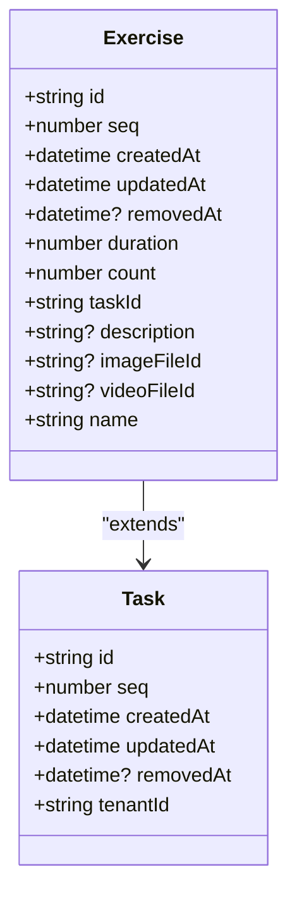
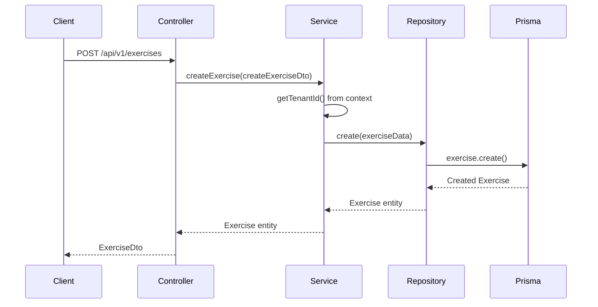
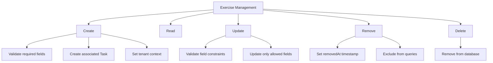
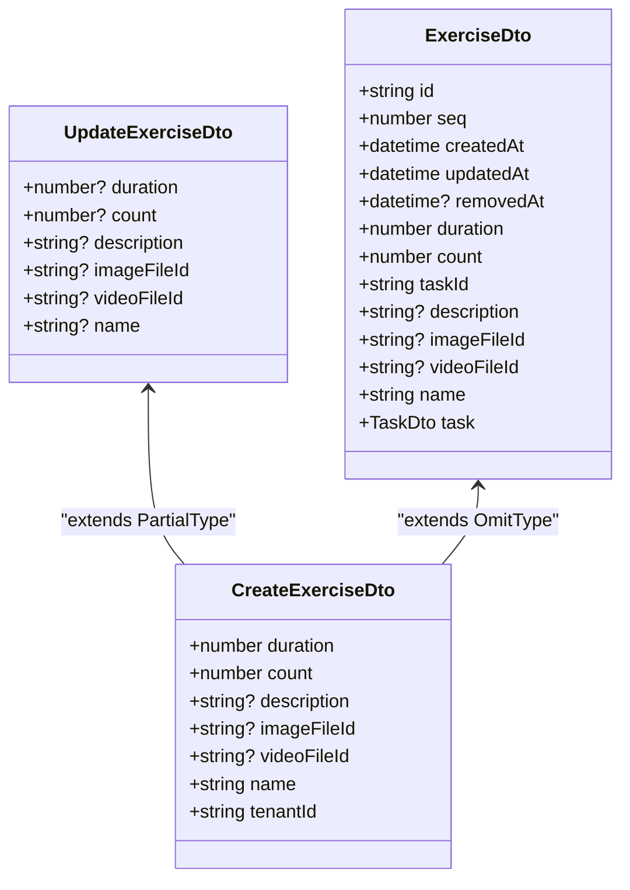

# Exercises Module

<cite>
**Referenced Files in This Document**   
- [exercises.module.ts](file://apps/server/src/module/exercises.module.ts)
- [exercises.controller.ts](file://apps/server/src/shared/controller/resources/exercises.controller.ts)
- [exercises.service.ts](file://apps/server/src/shared/service/resources/exercises.service.ts)
- [exercises.repository.ts](file://apps/server/src/shared/repository/exercises.repository.ts)
- [exercise.entity.ts](file://packages/entity/src/exercise.entity.ts)
- [exercise.dto.ts](file://packages/dto/src/exercise.dto.ts)
- [create-exercise.dto.ts](file://packages/dto/src/create/create-exercise.dto.ts)
- [update-exercise.dto.ts](file://packages/dto/src/update/update-exercise.dto.ts)
- [task.entity.ts](file://packages/entity/src/task.entity.ts)
- [task.prisma](file://packages/prisma/schema/task.prisma)
</cite>

## Table of Contents
1. [Introduction](#introduction)
2. [Exercise Entity Model](#exercise-entity-model)
3. [Content Hierarchy and Relationships](#content-hierarchy-and-relationships)
4. [Exercise Creation Workflow](#exercise-creation-workflow)
5. [Media Integration](#media-integration)
6. [Exercise Management and Validation](#exercise-management-and-validation)
7. [API Endpoints and DTOs](#api-endpoints-and-dtos)
8. [Performance Considerations](#performance-considerations)
9. [Troubleshooting Guide](#troubleshooting-guide)
10. [Conclusion](#conclusion)

## Introduction
The Exercises Module in prj-core serves as the atomic content unit for fitness content management. This module provides comprehensive functionality for creating, managing, and delivering exercise content within the platform's content hierarchy. The system is designed to support multi-tenant fitness businesses with complex content relationships, where exercises serve as fundamental building blocks that can be organized into routines, programs, and sessions. This documentation details the implementation of exercise creation, management, and content delivery, explaining entity relationships, validation rules, and business logic for exercise workflows.

**Section sources**
- [exercises.module.ts](file://apps/server/src/module/exercises.module.ts)

## Exercise Entity Model

The Exercise entity represents the atomic unit of fitness content in the system. It extends the abstract Task entity to provide domain-specific properties for exercise content while maintaining the ability to be referenced across multiple routines and programs.



**Diagram sources**
- [exercise.entity.ts](file://packages/entity/src/exercise.entity.ts)
- [task.entity.ts](file://packages/entity/src/task.entity.ts)

The Exercise entity contains essential properties for fitness content:
- **duration**: The duration of the exercise in seconds
- **count**: The number of repetitions or sets
- **description**: Optional detailed description of the exercise
- **imageFileId**: Reference to an image file demonstrating the exercise
- **videoFileId**: Reference to a video file showing exercise execution
- **name**: The name of the exercise

The entity inherits from AbstractEntity, which provides common fields like id, createdAt, updatedAt, and removedAt for all entities in the system. The Exercise entity is linked to its parent Task through the taskId field, establishing a 1:1 relationship where each Task can have at most one Exercise.

**Section sources**
- [exercise.entity.ts](file://packages/entity/src/exercise.entity.ts)

## Content Hierarchy and Relationships

Exercises serve as atomic content units within a hierarchical content structure that enables content reuse and efficient organization. The relationship between exercises and other content entities follows a specific pattern designed for maximum flexibility and reusability.

```mermaid
erDiagram
TASK {
string id PK
string tenantId
datetime createdAt
datetime updatedAt
datetime removedAt
}
EXERCISE {
string id PK
string taskId FK
number duration
number count
string name
string? description
string? imageFileId
string? videoFileId
}
ACTIVITY {
string id PK
string routineId FK
string taskId FK
number order
number repetitions
number restTime
}
ROUTINE {
string id PK
string name
string label
}
TASK ||--o{ ACTIVITY : "contains"
EXERCISE ||--|| TASK : "extends"
ROUTINE ||--o{ ACTIVITY : "contains"
```

**Diagram sources**
- [task.prisma](file://packages/prisma/schema/task.prisma)
- [exercise.entity.ts](file://packages/entity/src/exercise.entity.ts)

The content hierarchy follows this structure:
1. **Task**: The abstract base entity that serves as a bridge between domain-independent and domain-specific content
2. **Exercise**: The domain-specific extension of Task that contains all exercise-related information
3. **Activity**: Represents an instance of a Task within a Routine, with execution metadata like order, repetitions, and rest time
4. **Routine**: A collection of Activities that form a complete workout sequence
5. **Program**: A scheduled instance of a Routine within a Session
6. **Session**: A time-bound event that contains one or more Programs
7. **Timeline**: A logical grouping of Sessions

This hierarchical design enables powerful content reuse patterns. A single Exercise can be referenced by multiple Activities across different Routines, allowing fitness professionals to create standardized exercises that can be incorporated into various workout programs. The Task entity acts as an abstraction layer that allows the system to potentially support other domains beyond fitness in the future.

**Section sources**
- [task.prisma](file://packages/prisma/schema/task.prisma)
- [exercise.entity.ts](file://packages/entity/src/exercise.entity.ts)

## Exercise Creation Workflow

The exercise creation workflow follows a structured process that ensures data integrity and proper tenant isolation. When a new exercise is created, the system automatically creates a corresponding Task entity and establishes the necessary relationships.



**Diagram sources**
- [exercises.controller.ts](file://apps/server/src/shared/controller/resources/exercises.controller.ts)
- [exercises.service.ts](file://apps/server/src/shared/service/resources/exercises.service.ts)
- [exercises.repository.ts](file://apps/server/src/shared/repository/exercises.repository.ts)

The creation process involves the following steps:
1. The client sends a POST request to the `/api/v1/exercises` endpoint with exercise data
2. The ExercisesController receives the request and passes the data to the ExercisesService
3. The ExercisesService retrieves the current tenant ID from the context to ensure tenant isolation
4. The service creates the exercise with its associated Task in a single transaction
5. The ExercisesRepository handles the database operation using Prisma
6. The created exercise is returned to the client as a DTO

The system enforces that every Exercise must be associated with a Task, and both entities are created within the same tenant context. This ensures that exercises are properly isolated between different tenants in the multi-tenant architecture.

**Section sources**
- [exercises.service.ts](file://apps/server/src/shared/service/resources/exercises.service.ts)
- [exercises.controller.ts](file://apps/server/src/shared/controller/resources/exercises.controller.ts)

## Media Integration

The Exercises Module supports rich media integration through file associations, allowing exercises to include instructional images and videos. Media files are managed through a separate file management system and referenced by their IDs.

```mermaid
erDiagram
EXERCISE {
string id PK
string? imageFileId FK
string? videoFileId FK
}
FILE {
string id PK
string name
string url
string mimeType
number size
}
EXERCISE }o--|| FILE : "image"
EXERCISE }o--|| FILE : "video"
```

**Diagram sources**
- [exercise.entity.ts](file://packages/entity/src/exercise.entity.ts)

Media integration is implemented through two optional foreign key relationships:
- **imageFileId**: References a file entity that contains an image demonstrating the exercise
- **videoFileId**: References a file entity that contains a video showing the exercise execution

These relationships are optional, allowing exercises to be created without media content. When media is added, the system stores only the file IDs, not the actual media content, which enables efficient storage and retrieval. The actual media files are managed by the file management system, which handles storage, access control, and delivery.

The UI components for media management, such as the SortableMedia component, provide drag-and-drop functionality for arranging media files and easy removal of unwanted files. This enhances the user experience when building exercise content with multiple media assets.

**Section sources**
- [exercise.entity.ts](file://packages/entity/src/exercise.entity.ts)

## Exercise Management and Validation

The exercise management system provides comprehensive CRUD operations with proper validation and business rules enforcement. The system distinguishes between soft deletion (removal) and hard deletion to maintain data integrity and audit trails.



**Diagram sources**
- [exercises.service.ts](file://apps/server/src/shared/service/resources/exercises.service.ts)

The system implements the following validation rules and business logic:
- **Required fields**: Name, duration, and count are required for exercise creation
- **Tenant isolation**: All exercises are associated with a specific tenant and cannot be accessed by other tenants
- **Soft deletion**: The removeById operation sets a removedAt timestamp rather than permanently deleting the record, allowing for potential restoration
- **Hard deletion**: The deleteById operation permanently removes the exercise from the database
- **Field validation**: The system validates that duration and count are positive numbers

The validation is enforced at multiple levels:
1. DTO validation using class-validator decorators
2. Service-level validation for business rules
3. Database-level constraints for data integrity

This multi-layered approach ensures that invalid data cannot be persisted in the system while providing clear error messages to clients.

**Section sources**
- [exercises.service.ts](file://apps/server/src/shared/service/resources/exercises.service.ts)
- [exercise.dto.ts](file://packages/dto/src/exercise.dto.ts)

## API Endpoints and DTOs

The Exercises Module exposes a comprehensive REST API with standardized endpoints for exercise management. The API follows consistent patterns for request/response handling and uses Data Transfer Objects (DTOs) to define the contract between client and server.



**Diagram sources**
- [create-exercise.dto.ts](file://packages/dto/src/create/create-exercise.dto.ts)
- [update-exercise.dto.ts](file://packages/dto/src/update/update-exercise.dto.ts)
- [exercise.dto.ts](file://packages/dto/src/exercise.dto.ts)

The API provides the following endpoints:
- **GET /api/v1/exercises**: Retrieve a paginated list of exercises matching query parameters
- **POST /api/v1/exercises**: Create a new exercise
- **GET /api/v1/exercises/{exerciseId}**: Retrieve a specific exercise by ID
- **PATCH /api/v1/exercises/{exerciseId}**: Update an existing exercise
- **PATCH /api/v1/exercises/{exerciseId}/removedAt**: Soft delete an exercise by setting the removedAt timestamp
- **DELETE /api/v1/exercises/{exerciseId}**: Permanently delete an exercise

The DTOs are designed to provide type safety and validation:
- **CreateExerciseDto**: Defines the structure for creating new exercises, omitting fields that are automatically generated
- **UpdateExerciseDto**: Extends CreateExerciseDto with PartialType to make all fields optional for updates
- **ExerciseDto**: Represents the complete exercise entity as returned by the API, including all fields and relationships

The controller uses NestJS decorators to automatically validate incoming requests against the DTO definitions and generate appropriate Swagger documentation.

**Section sources**
- [exercises.controller.ts](file://apps/server/src/shared/controller/resources/exercises.controller.ts)
- [create-exercise.dto.ts](file://packages/dto/src/create/create-exercise.dto.ts)
- [update-exercise.dto.ts](file://packages/dto/src/update/update-exercise.dto.ts)

## Performance Considerations

The Exercises Module is designed with performance optimization in mind, particularly for read-heavy operations and complex queries involving related entities. The system implements several strategies to ensure responsive performance even with large datasets.

The repository pattern provides a clean abstraction over the Prisma client, allowing for efficient database operations with proper logging and error handling. Each repository method includes debug logging to facilitate performance monitoring and troubleshooting.

For list operations, the system implements pagination through the QueryExerciseDto, which extends the base QueryDto to support skip, take, and filtering parameters. This prevents performance issues when retrieving large collections of exercises.

The service layer optimizes database queries by using Prisma's relation loading capabilities to efficiently retrieve related entities when needed. For example, when retrieving an exercise with its associated task, the system uses Prisma's include or select options to fetch the related data in a single query rather than multiple round trips.

Caching strategies are implemented at the application level through the use of query keys in the API layer, allowing clients to implement efficient caching mechanisms. The system also benefits from Prisma's built-in query optimization and connection pooling.

For write operations, the system ensures data consistency by using transactions where appropriate and validating data at multiple levels to prevent invalid data from reaching the database.

**Section sources**
- [exercises.repository.ts](file://apps/server/src/shared/repository/exercises.repository.ts)
- [exercises.service.ts](file://apps/server/src/shared/service/resources/exercises.service.ts)

## Troubleshooting Guide

When working with the Exercises Module, several common issues may arise. This section provides guidance on identifying and resolving these issues.

**Tenant Context Errors**: If you encounter "No tenantId in context" errors during exercise creation, ensure that the tenant context is properly set in the request. This typically occurs when authentication is not properly configured or when making requests without proper tenant identification.

**Validation Errors**: When creating or updating exercises, ensure that required fields (name, duration, count) are provided and that numeric values are positive. The system validates these constraints at both the DTO and service levels.

**Media Association Issues**: If media files are not displaying properly, verify that the file IDs referenced in imageFileId and videoFileId exist in the file management system and that the user has appropriate permissions to access them.

**Performance Problems**: For slow query performance, check that appropriate indexes are in place on frequently queried fields like name and taskId. Consider implementing client-side caching for frequently accessed exercise data.

**Data Integrity Issues**: If you encounter constraint violations, verify that the exercise data adheres to the defined business rules, such as ensuring that duration and count are not both zero.

The system's comprehensive logging in the repository layer can help diagnose issues by providing visibility into database operations. The debug logs include information about the type of operation being performed, which can help identify performance bottlenecks or unexpected behavior.

**Section sources**
- [exercises.service.ts](file://apps/server/src/shared/service/resources/exercises.service.ts)
- [exercises.repository.ts](file://apps/server/src/shared/repository/exercises.repository.ts)

## Conclusion
The Exercises Module in prj-core provides a robust foundation for managing fitness content as atomic units within a hierarchical content structure. By implementing exercises as extensions of abstract Tasks, the system achieves a balance between domain-specific functionality and architectural flexibility. The module supports comprehensive CRUD operations with proper validation, tenant isolation, and media integration, enabling fitness professionals to create rich exercise content that can be reused across multiple routines and programs. The well-defined API endpoints and DTOs provide a clear contract for client applications, while the repository and service layers ensure data integrity and performance optimization. This design enables efficient content management and delivery, forming the foundation for more complex workout programs and training schedules.