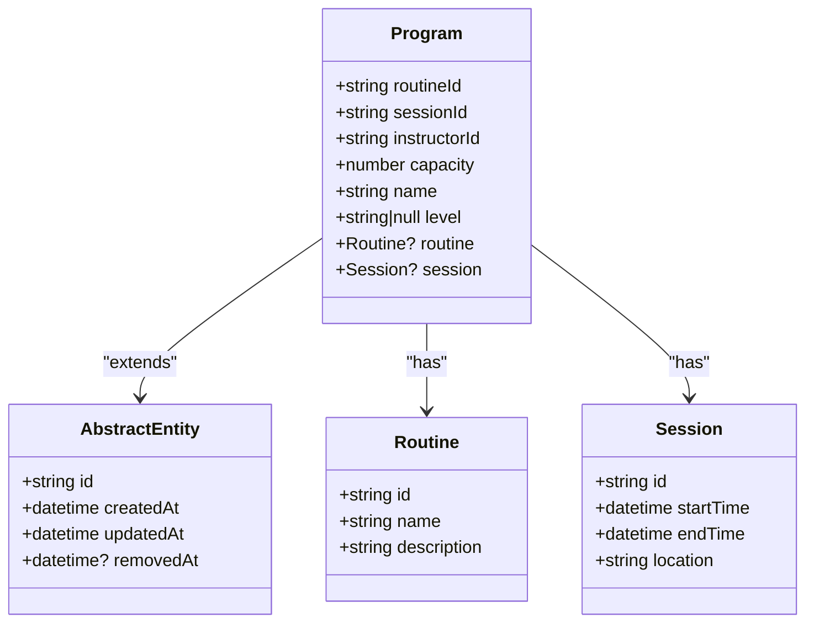
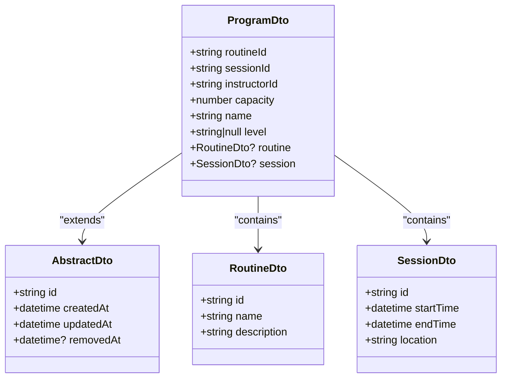
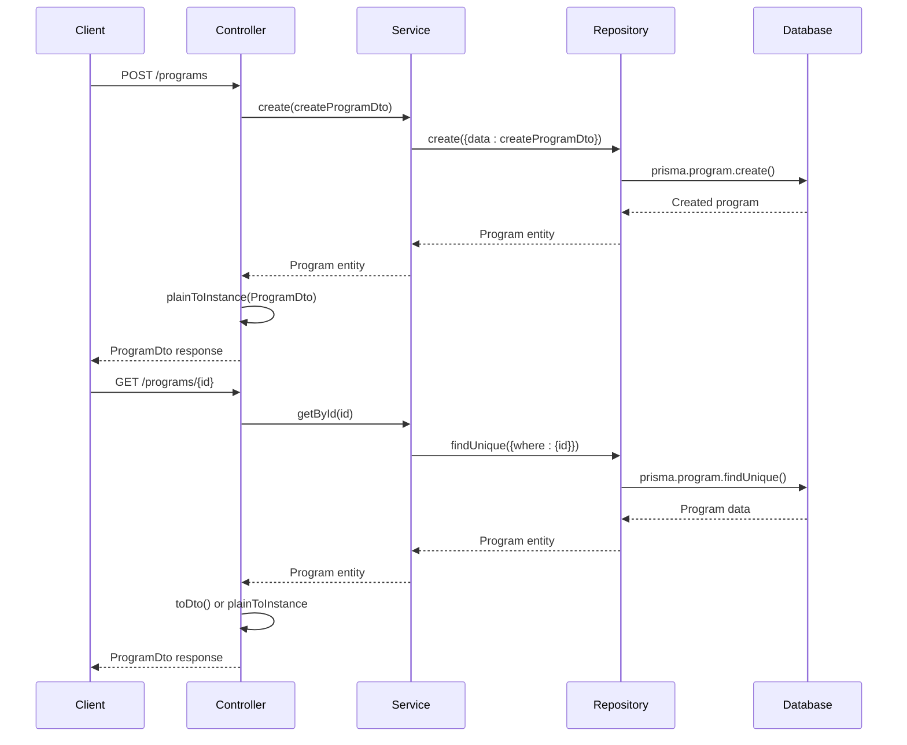
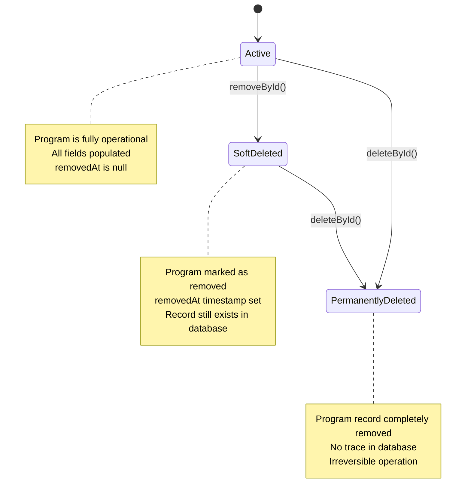
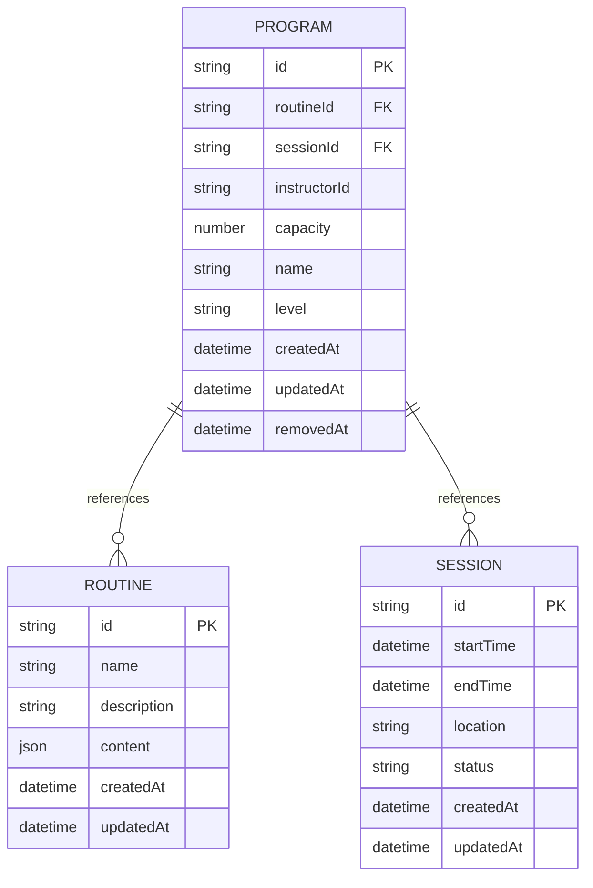
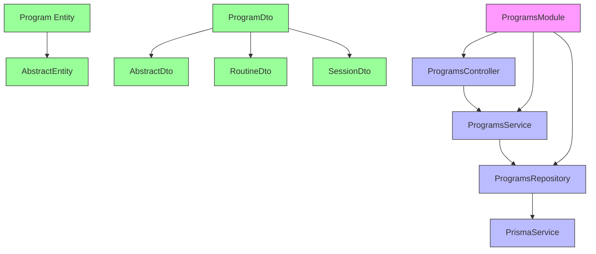

# Programs Module

<cite>
**Referenced Files in This Document**   
- [programs.controller.ts](file://apps/server/src/shared/controller/resources/programs.controller.ts)
- [programs.service.ts](file://apps/server/src/shared/service/resources/programs.service.ts)
- [programs.repository.ts](file://apps/server/src/shared/repository/programs.repository.ts)
- [program.entity.ts](file://packages/entity/src/program.entity.ts)
- [program.dto.ts](file://packages/dto/src/program.dto.ts)
- [programs.module.ts](file://apps/server/src/module/programs.module.ts)
</cite>

## Table of Contents
1. [Introduction](#introduction)
2. [Program Entity Model](#program-entity-model)
3. [Data Transfer Objects](#data-transfer-objects)
4. [CRUD Operations](#crud-operations)
5. [Lifecycle Management](#lifecycle-management)
6. [Relationships with Routines and Sessions](#relationships-with-routines-and-sessions)
7. [API Endpoints](#api-endpoints)
8. [Validation and Business Logic](#validation-and-business-logic)
9. [Dependency Management](#dependency-management)
10. [Performance Considerations](#performance-considerations)

## Introduction

The Programs Module in prj-core provides a structured framework for managing program entities that serve as containers for organized content sequences. Programs are central to the application's functionality, enabling the organization of routines and sessions into coherent structures. This module implements a comprehensive CRUD (Create, Read, Update, Delete) interface with proper lifecycle management, validation, and integration with related entities.

The implementation follows a clean architectural pattern with separation of concerns between controllers, services, and repositories. The module leverages NestJS framework features and Prisma ORM for database operations, ensuring type safety and maintainability.

**Section sources**
- [programs.module.ts](file://apps/server/src/module/programs.module.ts#L1-L13)

## Program Entity Model

The Program entity represents the core data structure for program management in the system. It extends the AbstractEntity class and implements the ProgramEntity interface from the Prisma schema. The entity defines the essential properties that characterize a program, including its relationship to routines, sessions, and instructors.

Key attributes of the Program entity include:
- `routineId`: Reference to the associated routine (required)
- `sessionId`: Reference to the associated session (required)
- `instructorId`: Reference to the instructor managing the program (required)
- `capacity`: Numeric value indicating the maximum number of participants
- `name`: String identifier for the program
- `level`: Optional string field for categorizing program difficulty

The entity also establishes relationships with other entities through optional properties:
- `routine`: Reference to the Routine entity
- `session`: Reference to the Session entity

This model enables programs to function as containers that organize and sequence content through their associations with routines and sessions.



**Diagram sources**
- [program.entity.ts](file://packages/entity/src/program.entity.ts#L1-L17)

**Section sources**
- [program.entity.ts](file://packages/entity/src/program.entity.ts#L1-L17)

## Data Transfer Objects

The Programs Module utilizes Data Transfer Objects (DTOs) to standardize data exchange between different layers of the application. The ProgramDto class extends AbstractDto and implements the ProgramEntity interface, providing a consistent interface for program data.

The DTO implementation includes validation decorators that enforce data integrity:
- `@UUIDField()`: Ensures UUID format for `routineId`, `sessionId`, and `instructorId`
- `@NumberField()`: Validates that `capacity` is a numeric value
- `@StringField()`: Ensures `name` is a valid string
- `@StringFieldOptional()`: Allows `level` to be either a string or null
- `@ClassField()`: Handles nested object serialization for `routine` and `session` relationships

These decorators provide automatic validation and type conversion, ensuring that data conforms to expected formats before processing. The DTO pattern separates the internal entity structure from the external API representation, allowing for flexibility in data presentation while maintaining data integrity.



**Diagram sources**
- [program.dto.ts](file://packages/dto/src/program.dto.ts#L1-L38)

**Section sources**
- [program.dto.ts](file://packages/dto/src/program.dto.ts#L1-L38)

## CRUD Operations

The Programs Module implements a comprehensive set of CRUD operations through its service layer. The ProgramsService class provides methods for creating, reading, updating, and deleting program entities, with each operation properly encapsulated and type-safe.

The service layer acts as an intermediary between the controller and repository, handling business logic and coordinating operations. Key methods include:
- `create()`: Creates a new program with the provided data
- `getManyByQuery()`: Retrieves multiple programs based on query parameters with pagination support
- `getById()`: Retrieves a single program by its unique identifier
- `updateById()`: Updates a program's properties by its identifier
- `deleteById()`: Permanently removes a program from the database
- `removeById()`: Soft deletes a program by setting the `removedAt` timestamp

These operations follow a consistent pattern of accepting input data, processing it through the repository layer, and returning the result. The service layer ensures proper error handling and data transformation between the repository's output and the controller's expected response format.



**Diagram sources**
- [programs.service.ts](file://apps/server/src/shared/service/resources/programs.service.ts#L1-L56)
- [programs.repository.ts](file://apps/server/src/shared/repository/programs.repository.ts#L1-L84)

**Section sources**
- [programs.service.ts](file://apps/server/src/shared/service/resources/programs.service.ts#L1-L56)

## Lifecycle Management

The Programs Module implements a sophisticated lifecycle management system that distinguishes between soft deletion and permanent deletion. This approach preserves data integrity while providing flexibility in program management.

The lifecycle operations are implemented through two distinct methods:
- `removeById()`: Performs a soft delete by updating the `removedAt` field with the current timestamp. This operation maintains the program record in the database while marking it as inactive.
- `deleteById()`: Performs a permanent deletion, completely removing the program record from the database.

This dual approach allows for different use cases:
- Soft deletion enables recovery of accidentally removed programs and maintains referential integrity with related entities
- Permanent deletion is used when data must be completely purged, typically after a retention period or for data privacy reasons

The implementation in the ProgramsService uses the repository's update and delete methods respectively, ensuring that the appropriate database operations are performed. The soft delete approach aligns with the AbstractEntity's `removedAt` field, which is inherited by the Program entity.



**Diagram sources**
- [programs.service.ts](file://apps/server/src/shared/service/resources/programs.service.ts#L48-L54)
- [programs.repository.ts](file://apps/server/src/shared/repository/programs.repository.ts#L38-L43)

**Section sources**
- [programs.service.ts](file://apps/server/src/shared/service/resources/programs.service.ts#L48-L54)

## Relationships with Routines and Sessions

Programs serve as containers that organize and sequence content through their relationships with routines and sessions. The entity model establishes these relationships through foreign key references (`routineId` and `sessionId`) and optional navigation properties (`routine` and `session`).

This design enables programs to:
- Reference specific routines that define the program's content and structure
- Associate with specific sessions that represent scheduled instances of the program
- Maintain data integrity through foreign key constraints
- Support eager loading of related entities when needed

The relationship pattern follows a composition model where programs "have" routines and sessions, but these entities can exist independently. This flexibility allows routines and sessions to be reused across multiple programs while maintaining the integrity of each program's specific configuration.

The implementation leverages Prisma's relation queries to efficiently load related data, minimizing database round trips and optimizing performance for common access patterns.



**Diagram sources**
- [program.entity.ts](file://packages/entity/src/program.entity.ts#L7-L15)
- [programs.repository.ts](file://apps/server/src/shared/repository/programs.repository.ts#L16-L19)

**Section sources**
- [program.entity.ts](file://packages/entity/src/program.entity.ts#L7-L15)

## API Endpoints

The Programs Controller exposes a comprehensive REST API for program management, following standard HTTP conventions and NestJS decorators for route definition and documentation.

The available endpoints include:
- `POST /`: Creates a new program with the provided data
- `GET /:programId`: Retrieves a specific program by its identifier
- `PATCH /:programId`: Updates a program's properties
- `PATCH /:programId/removedAt`: Soft deletes a program by setting the removedAt timestamp
- `DELETE /:programId`: Permanently deletes a program
- `GET /`: Retrieves a list of programs with query parameters for filtering and pagination

Each endpoint is decorated with appropriate HTTP status codes, response types, and Swagger documentation. The controller uses the `@ApiResponseEntity` decorator to standardize response formatting and the `@HttpCode` decorator to specify success status codes.

The implementation follows the service layer pattern, delegating business logic to the ProgramsService while handling request/response transformation and error handling at the controller level.

```mermaid
flowchart TD
A[Client Request] --> B{HTTP Method}
B --> |POST| C[Create Program]
B --> |GET with ID| D[Get Program by ID]
B --> |PATCH with ID| E[Update Program]
B --> |PATCH /removedAt| F[Soft Delete Program]
B --> |DELETE| G[Permanent Delete Program]
B --> |GET without ID| H[Get Programs List]
C --> I[programs.service.create()]
D --> J[programs.service.getById()]
E --> K[programs.service.updateById()]
F --> L[programs.service.removeById()]
G --> M[programs.service.deleteById()]
H --> N[programs.service.getManyByQuery()]
I --> O[Return ProgramDto]
J --> O
K --> O
L --> O
M --> O
N --> P[Return Array of ProgramDto]
O --> Q[Client Response]
P --> Q
```

**Diagram sources**
- [programs.controller.ts](file://apps/server/src/shared/controller/resources/programs.controller.ts#L31-L88)

**Section sources**
- [programs.controller.ts](file://apps/server/src/shared/controller/resources/programs.controller.ts#L31-L88)

## Validation and Business Logic

The Programs Module implements robust validation and business logic through a combination of DTO decorators and service layer validation. The validation strategy ensures data integrity while providing clear error messages for invalid inputs.

Key validation rules include:
- UUID format validation for all identifier fields (routineId, sessionId, instructorId)
- Numeric validation for capacity field
- String validation for name and level fields
- Required field validation for all non-optional properties
- Type safety through TypeScript interfaces and classes

The business logic is primarily contained within the service layer, which coordinates operations between the controller and repository. The service ensures that all operations follow the expected patterns and maintain data consistency.

Error handling is implemented through NestJS exception filters, which catch and format errors consistently across all endpoints. The controller uses `plainToInstance` from class-transformer to ensure proper serialization of response objects, maintaining type safety throughout the request-response cycle.

**Section sources**
- [program.dto.ts](file://packages/dto/src/program.dto.ts#L14-L37)
- [programs.service.ts](file://apps/server/src/shared/service/resources/programs.service.ts#L14-L55)

## Dependency Management

The Programs Module follows a clean dependency injection pattern, with clear separation between components. The module structure ensures loose coupling and high cohesion through proper dependency management.

Key dependencies include:
- ProgramsController depends on ProgramsService
- ProgramsService depends on ProgramsRepository
- ProgramsRepository depends on PrismaService
- Program entity depends on AbstractEntity
- ProgramDto depends on AbstractDto and related DTOs

The module uses NestJS decorators (`@Injectable`, `@Controller`, `@Module`) to manage dependencies and lifecycle. The ProgramsModule declaration explicitly lists controllers and providers, making dependencies transparent and testable.

This dependency structure enables:
- Easy testing through dependency injection
- Clear separation of concerns
- Reusability of components
- Maintainable code structure
- Scalable architecture

The use of interfaces and abstract classes allows for flexibility in implementation while maintaining contract consistency across the application.



**Diagram sources**
- [programs.module.ts](file://apps/server/src/module/programs.module.ts#L8-L12)
- [programs.controller.ts](file://apps/server/src/shared/controller/resources/programs.controller.ts#L29)
- [programs.service.ts](file://apps/server/src/shared/service/resources/programs.service.ts#L12)

**Section sources**
- [programs.module.ts](file://apps/server/src/module/programs.module.ts#L8-L12)

## Performance Considerations

The Programs Module implements several performance optimizations to ensure efficient operation at scale. The repository layer provides a comprehensive set of methods that map directly to Prisma operations, minimizing overhead and maximizing database efficiency.

Key performance features include:
- Batch operations through `createManyAndReturn` and `updateMany` methods
- Efficient querying with proper indexing on frequently accessed fields
- Pagination support for list operations to prevent memory issues with large datasets
- Selective field loading through Prisma's select and include options
- Connection pooling through Prisma Client
- Caching potential at the service layer for frequently accessed data

The implementation avoids N+1 query problems by using Prisma's relation queries and eager loading when appropriate. The service layer's `getManyByQuery` method converts query parameters to Prisma arguments efficiently, allowing for complex filtering without performance degradation.

For high-traffic scenarios, additional optimizations could include:
- Implementing Redis caching for frequently accessed programs
- Adding database indexes on commonly queried fields
- Implementing query optimization for complex filtering operations
- Using connection pooling with appropriate sizing for the expected load

**Section sources**
- [programs.repository.ts](file://apps/server/src/shared/repository/programs.repository.ts#L16-L84)
- [programs.service.ts](file://apps/server/src/shared/service/resources/programs.service.ts#L22-L31)