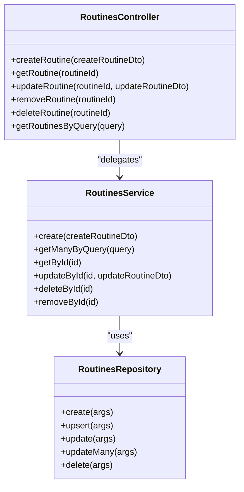
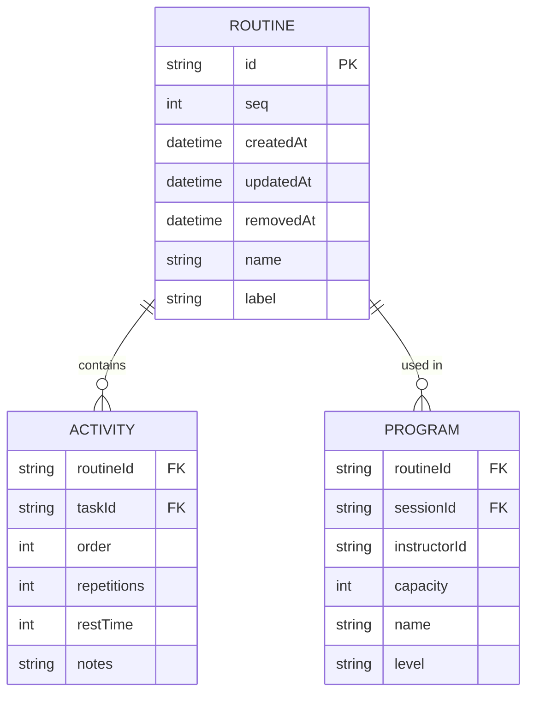
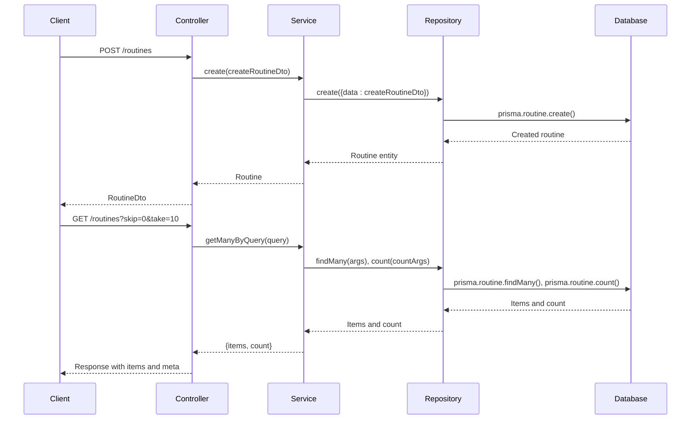
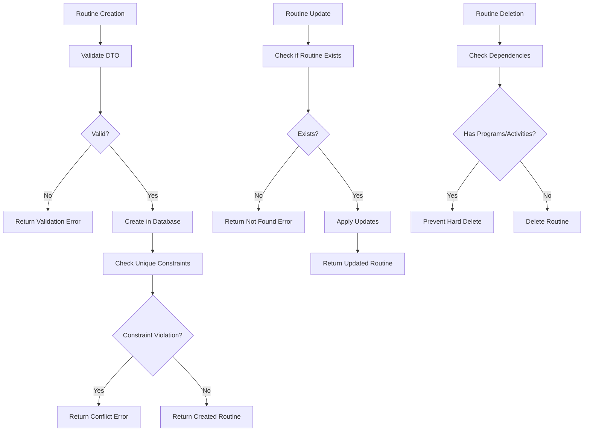
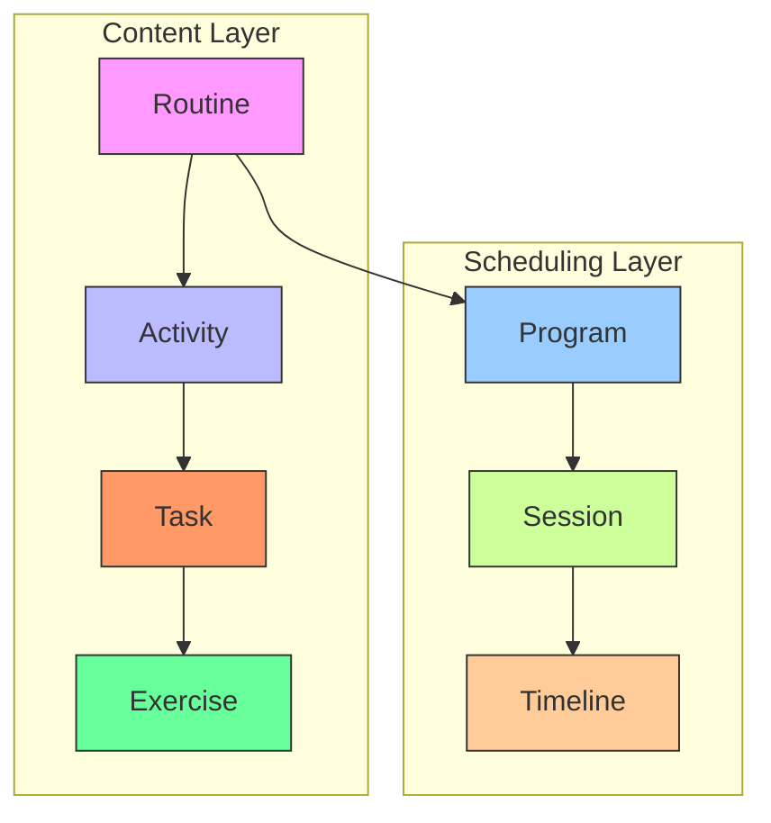
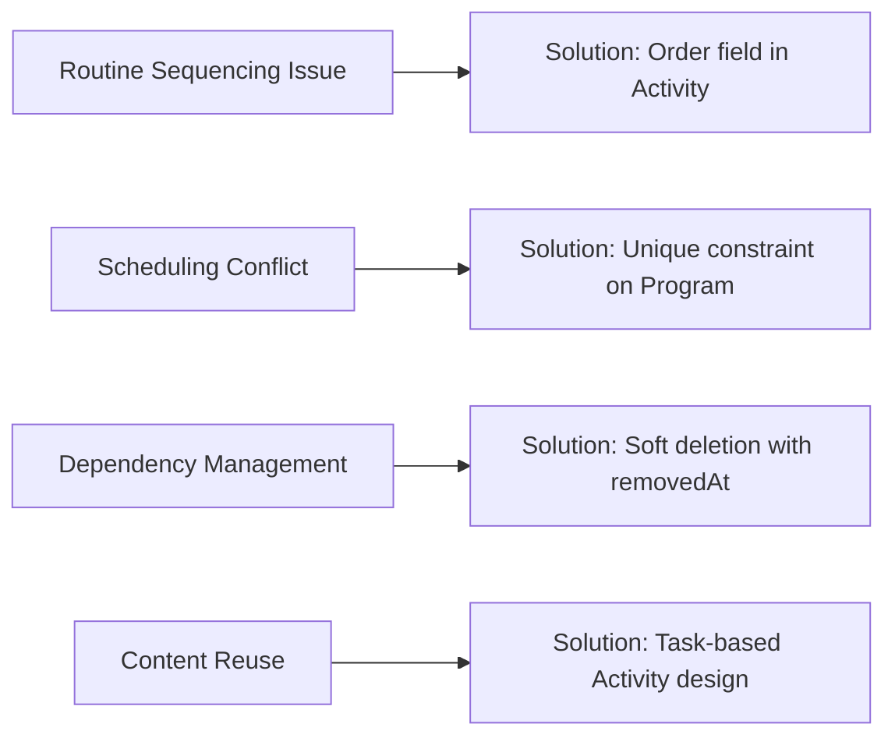

# Routines Module

<cite>
**Referenced Files in This Document**   
- [routines.module.ts](file://apps/server/src/module/routines.module.ts)
- [routines.controller.ts](file://apps/server/src/shared/controller/resources/routines.controller.ts)
- [routines.service.ts](file://apps/server/src/shared/service/resources/routines.service.ts)
- [routines.repository.ts](file://apps/server/src/shared/repository/routines.repository.ts)
- [routine.entity.ts](file://packages/entity/src/routine.entity.ts)
- [routine.dto.ts](file://packages/dto/src/routine.dto.ts)
- [activity.entity.ts](file://packages/entity/src/activity.entity.ts)
- [program.entity.ts](file://packages/entity/src/program.entity.ts)
</cite>

## Table of Contents
1. [Introduction](#introduction)
2. [Core Components](#core-components)
3. [Entity Relationships](#entity-relationships)
4. [Routine Creation and Management](#routine-creation-and-management)
5. [Validation Rules and Business Logic](#validation-rules-and-business-logic)
6. [Integration with Programs and Exercises](#integration-with-programs-and-exercises)
7. [Common Issues and Solutions](#common-issues-and-solutions)
8. [Performance Considerations](#performance-considerations)

## Introduction
The Routines Module in prj-core provides a structured framework for creating and managing exercise routines as building blocks for content delivery. This module enables the organization of activities into reusable routines that can be incorporated into programs and sessions. The implementation follows a clean architectural pattern with distinct layers for controllers, services, repositories, entities, and DTOs, ensuring separation of concerns and maintainability.

**Section sources**
- [routines.module.ts](file://apps/server/src/module/routines.module.ts)

## Core Components
The Routines Module consists of several key components that work together to provide routine management functionality. The module is defined in `routines.module.ts` and includes the controller, service, and repository. The controller handles HTTP requests, the service contains business logic, and the repository manages data persistence through Prisma.

**Diagram sources**
- [routines.controller.ts](file://apps/server/src/shared/controller/resources/routines.controller.ts#L28-L87)
- [routines.service.ts](file://apps/server/src/shared/service/resources/routines.service.ts#L11-L55)
- [routines.repository.ts](file://apps/server/src/shared/repository/routines.repository.ts#L7-L43)

**Section sources**
- [routines.module.ts](file://apps/server/src/module/routines.module.ts)
- [routines.controller.ts](file://apps/server/src/shared/controller/resources/routines.controller.ts)
- [routines.service.ts](file://apps/server/src/shared/service/resources/routines.service.ts)
- [routines.repository.ts](file://apps/server/src/shared/repository/routines.repository.ts)

## Entity Relationships
The Routine entity serves as a container for activities and can be associated with programs. Each routine contains multiple activities that reference tasks, creating a flexible structure where tasks can be reused across different routines. Programs link routines to specific sessions, establishing the connection between content and scheduling.

**Diagram sources**
- [routine.entity.ts](file://packages/entity/src/routine.entity.ts#L6-L12)
- [activity.entity.ts](file://packages/entity/src/activity.entity.ts#L6-L17)
- [program.entity.ts](file://packages/entity/src/program.entity.ts#L6-L17)

**Section sources**
- [routine.entity.ts](file://packages/entity/src/routine.entity.ts)
- [activity.entity.ts](file://packages/entity/src/activity.entity.ts)
- [program.entity.ts](file://packages/entity/src/program.entity.ts)

## Routine Creation and Management
The routine creation process begins with a POST request to the RoutinesController, which delegates to the RoutinesService. The service validates the input and passes it to the repository for persistence. Routines can be updated, soft-deleted (removed), or hard-deleted through corresponding endpoints. The module supports querying routines with pagination parameters.

**Diagram sources**
- [routines.controller.ts](file://apps/server/src/shared/controller/resources/routines.controller.ts#L31-L87)
- [routines.service.ts](file://apps/server/src/shared/service/resources/routines.service.ts#L14-L32)
- [routines.repository.ts](file://apps/server/src/shared/repository/routines.repository.ts#L16-L19)

**Section sources**
- [routines.controller.ts](file://apps/server/src/shared/controller/resources/routines.controller.ts)
- [routines.service.ts](file://apps/server/src/shared/service/resources/routines.service.ts)
- [routines.repository.ts](file://apps/server/src/shared/repository/routines.repository.ts)

## Validation Rules and Business Logic
The Routines Module implements several validation rules and business logic constraints. The DTO layer enforces that routine names and labels are strings through the @StringField decorator. The database schema enforces uniqueness constraints to prevent duplicate activities within a routine. Business rules ensure data integrity across related entities.

**Diagram sources**
- [routine.dto.ts](file://packages/dto/src/routine.dto.ts#L7-L19)
- [routines.service.ts](file://apps/server/src/shared/service/resources/routines.service.ts)
- [routines.repository.ts](file://apps/server/src/shared/repository/routines.repository.ts)

**Section sources**
- [routine.dto.ts](file://packages/dto/src/routine.dto.ts)
- [routines.service.ts](file://apps/server/src/shared/service/resources/routines.service.ts)
- [routines.repository.ts](file://apps/server/src/shared/repository/routines.repository.ts)

## Integration with Programs and Exercises
Routines serve as building blocks that integrate with programs and exercises through well-defined relationships. A routine can be part of multiple programs, each associated with a specific session. Activities within routines reference tasks, which can be specialized as exercises. This hierarchical structure enables content reuse and flexible scheduling.

**Diagram sources**
- [routine.entity.ts](file://packages/entity/src/routine.entity.ts)
- [activity.entity.ts](file://packages/entity/src/activity.entity.ts)
- [program.entity.ts](file://packages/entity/src/program.entity.ts)

**Section sources**
- [routine.entity.ts](file://packages/entity/src/routine.entity.ts)
- [activity.entity.ts](file://packages/entity/src/activity.entity.ts)
- [program.entity.ts](file://packages/entity/src/program.entity.ts)

## Common Issues and Solutions
The Routines Module addresses several common issues in routine management. For routine sequencing, the order field in activities ensures proper execution sequence within a routine. Scheduling conflicts are prevented through database constraints that ensure a routine can only be used once per session. Dependency management is handled through soft deletion (removal) to preserve historical data while allowing content reorganization.

**Diagram sources**
- [activity.entity.ts](file://packages/entity/src/activity.entity.ts#L9)
- [program.entity.ts](file://packages/entity/src/program.entity.ts)
- [routines.service.ts](file://apps/server/src/shared/service/resources/routines.service.ts#L48-L54)

**Section sources**
- [activity.entity.ts](file://packages/entity/src/activity.entity.ts)
- [program.entity.ts](file://packages/entity/src/program.entity.ts)
- [routines.service.ts](file://apps/server/src/shared/service/resources/routines.service.ts)

## Performance Considerations
The Routines Module is designed with performance in mind. The repository pattern abstracts database operations, allowing for efficient querying and updates. The service layer implements pagination for routine retrieval, preventing performance issues with large datasets. The use of Prisma's type-safe queries ensures optimized database operations and reduces the risk of N+1 query problems.

**Section sources**
- [routines.service.ts](file://apps/server/src/shared/service/resources/routines.service.ts)
- [routines.repository.ts](file://apps/server/src/shared/repository/routines.repository.ts)