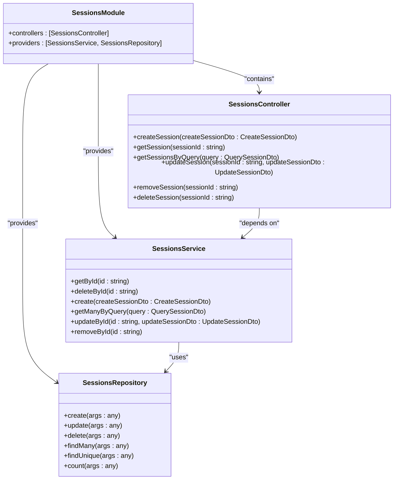
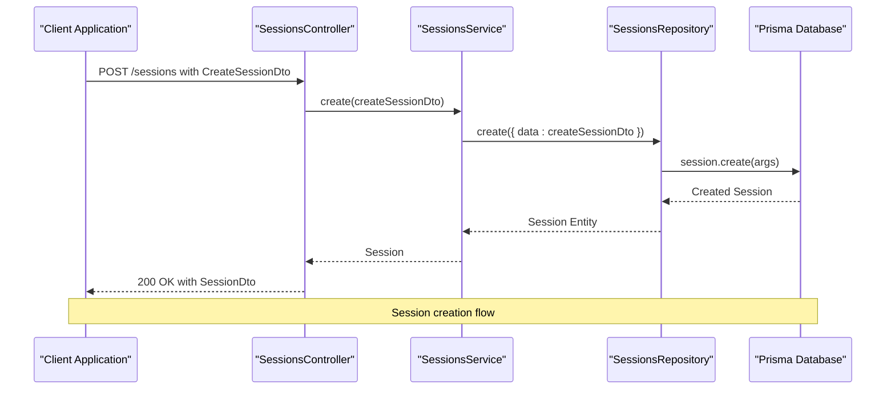
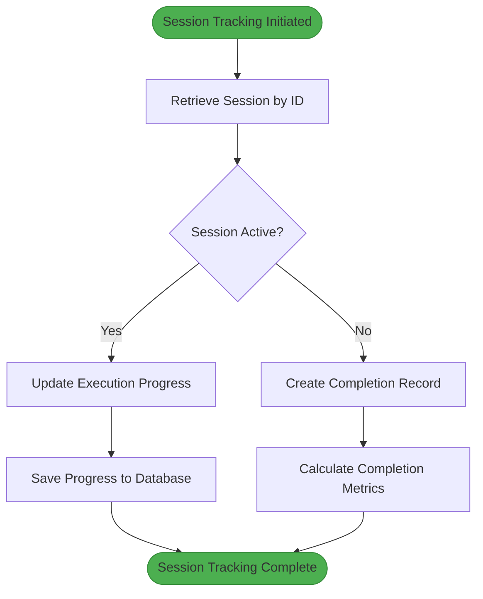
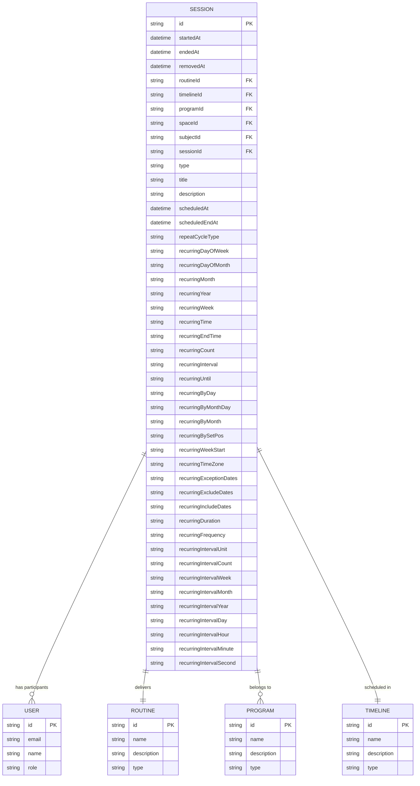
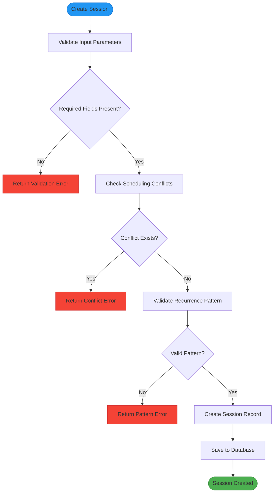
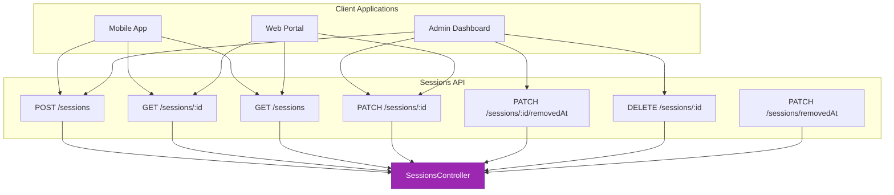
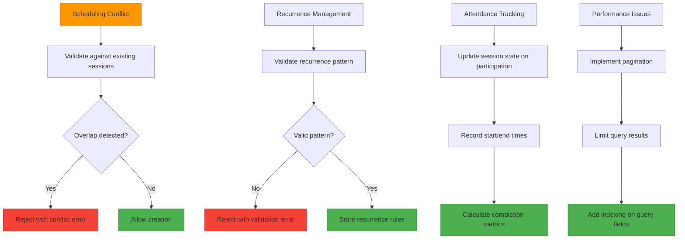

# Sessions Module

<cite>
**Referenced Files in This Document**   
- [sessions.module.ts](file://apps/server/src/module/sessions.module.ts)
- [sessions.controller.ts](file://apps/server/src/shared/controller/resources/sessions.controller.ts)
- [sessions.service.ts](file://apps/server/src/shared/service/resources/sessions.service.ts)
- [sessions.repository.ts](file://apps/server/src/shared/repository/sessions.repository.ts)
</cite>

## Table of Contents
1. [Introduction](#introduction)
2. [Core Components](#core-components)
3. [Session Creation and Scheduling](#session-creation-and-scheduling)
4. [Session Execution Tracking](#session-execution-tracking)
5. [Entity Relationships](#entity-relationships)
6. [Validation Rules and Business Logic](#validation-rules-and-business-logic)
7. [API Endpoints and Integration](#api-endpoints-and-integration)
8. [Common Issues and Solutions](#common-issues-and-solutions)
9. [Performance Considerations](#performance-considerations)
10. [Conclusion](#conclusion)

## Introduction
The Sessions Module in prj-core provides a comprehensive system for managing scheduled instances of content delivery. This module enables the creation, scheduling, and tracking of sessions that serve as time-bound occurrences of routines, programs, or other content. The implementation follows a clean architectural pattern with distinct layers for controllers, services, and repositories, ensuring separation of concerns and maintainability. Sessions function as the bridge between content (routines, programs) and users, facilitating structured delivery of educational or training materials at specified times.

**Section sources**
- [sessions.module.ts](file://apps/server/src/module/sessions.module.ts#L1-L13)

## Core Components
The Sessions Module consists of four primary components that work together to provide session management functionality: the module definition, controller, service, and repository. These components follow the NestJS framework's architectural patterns, with clear responsibilities and dependency injection.

**Diagram sources**
- [sessions.module.ts](file://apps/server/src/module/sessions.module.ts#L1-L13)
- [sessions.controller.ts](file://apps/server/src/shared/controller/resources/sessions.controller.ts#L1-L100)
- [sessions.service.ts](file://apps/server/src/shared/service/resources/sessions.service.ts#L1-L53)
- [sessions.repository.ts](file://apps/server/src/shared/repository/sessions.repository.ts#L1-L84)

**Section sources**
- [sessions.module.ts](file://apps/server/src/module/sessions.module.ts#L1-L13)
- [sessions.controller.ts](file://apps/server/src/shared/controller/resources/sessions.controller.ts#L1-L100)
- [sessions.service.ts](file://apps/server/src/shared/service/resources/sessions.service.ts#L1-L53)
- [sessions.repository.ts](file://apps/server/src/shared/repository/sessions.repository.ts#L1-L84)

## Session Creation and Scheduling
The session creation and scheduling functionality is implemented through a well-defined API that allows for the creation of individual or recurring sessions. The process begins with the SessionsController receiving a POST request containing a CreateSessionDto, which is then passed to the SessionsService for processing. The service layer handles the business logic and delegates persistence operations to the SessionsRepository, which interacts with the underlying database through Prisma.

Session scheduling supports various patterns including one-time sessions, recurring sessions with specific frequency, and sessions tied to specific timelines or programs. The system allows for flexible scheduling parameters such as start time, duration, recurrence rules, and associated content (routines, programs). When creating a session, the system validates the scheduling parameters and ensures there are no conflicts with existing sessions for the same user or resource.

**Diagram sources**
- [sessions.controller.ts](file://apps/server/src/shared/controller/resources/sessions.controller.ts#L31-L38)
- [sessions.service.ts](file://apps/server/src/shared/service/resources/sessions.service.ts#L22-L26)
- [sessions.repository.ts](file://apps/server/src/shared/repository/sessions.repository.ts#L16-L20)

**Section sources**
- [sessions.controller.ts](file://apps/server/src/shared/controller/resources/sessions.controller.ts#L31-L38)
- [sessions.service.ts](file://apps/server/src/shared/service/resources/sessions.service.ts#L22-L26)
- [sessions.repository.ts](file://apps/server/src/shared/repository/sessions.repository.ts#L16-L20)

## Session Execution Tracking
The Sessions Module provides comprehensive tracking capabilities for monitoring session execution and attendance. The system maintains session state through various properties that capture execution details, including start and end times, attendance records, and completion status. The repository layer offers multiple query methods to retrieve session data based on different criteria, enabling detailed tracking and reporting.

Execution tracking is implemented through a combination of database persistence and service layer logic. The SessionsRepository provides methods to find sessions by various parameters, update session status, and retrieve session counts. The service layer orchestrates these operations and ensures data consistency. The system supports soft deletion through the removedAt field, allowing for historical tracking of sessions while maintaining data integrity.

**Diagram sources**
- [sessions.repository.ts](file://apps/server/src/shared/repository/sessions.repository.ts#L57-L61)
- [sessions.service.ts](file://apps/server/src/shared/service/resources/sessions.service.ts#L14-L16)
- [sessions.controller.ts](file://apps/server/src/shared/controller/resources/sessions.controller.ts#L40-L46)

**Section sources**
- [sessions.repository.ts](file://apps/server/src/shared/repository/sessions.repository.ts#L57-L61)
- [sessions.service.ts](file://apps/server/src/shared/service/resources/sessions.service.ts#L14-L16)
- [sessions.controller.ts](file://apps/server/src/shared/controller/resources/sessions.controller.ts#L40-L46)

## Entity Relationships
The Session entity is designed to integrate with various other entities in the system, creating a rich network of relationships that support the overall functionality of content delivery and tracking. Sessions are connected to users, routines, programs, and timelines, forming the backbone of the scheduling system. These relationships enable the system to track which users are assigned to which sessions, what content is being delivered, and how sessions are organized within broader educational or training programs.

The entity relationships are implemented through foreign key references in the database schema, with appropriate constraints to maintain data integrity. The SessionsRepository handles these relationships transparently, allowing the service layer to work with fully populated session objects that include related entities. This design enables efficient querying and reduces the need for multiple database calls when retrieving session information with related data.

**Diagram sources**
- [sessions.repository.ts](file://apps/server/src/shared/repository/sessions.repository.ts#L1-L84)
- [sessions.service.ts](file://apps/server/src/shared/service/resources/sessions.service.ts#L1-L53)

**Section sources**
- [sessions.repository.ts](file://apps/server/src/shared/repository/sessions.repository.ts#L1-L84)
- [sessions.service.ts](file://apps/server/src/shared/service/resources/sessions.service.ts#L1-L53)

## Validation Rules and Business Logic
The Sessions Module implements a comprehensive set of validation rules and business logic to ensure data integrity and enforce business requirements. Validation occurs at multiple levels, starting with DTO validation in the controller layer and continuing with business logic validation in the service layer. The system validates scheduling parameters to prevent conflicts, ensures required fields are present, and enforces constraints on recurrence patterns.

Business logic is encapsulated in the SessionsService, which handles the core functionality of session management. The service layer coordinates operations between the controller and repository, applying business rules and orchestrating complex operations. For example, when creating a recurring session, the service validates the recurrence pattern and ensures it conforms to supported types. The system also implements soft deletion through the removeById method, which updates the removedAt field rather than permanently deleting the record, preserving historical data.

**Diagram sources**
- [sessions.controller.ts](file://apps/server/src/shared/controller/resources/sessions.controller.ts#L34-L38)
- [sessions.service.ts](file://apps/server/src/shared/service/resources/sessions.service.ts#L22-L26)
- [sessions.repository.ts](file://apps/server/src/shared/repository/sessions.repository.ts#L16-L20)

**Section sources**
- [sessions.controller.ts](file://apps/server/src/shared/controller/resources/sessions.controller.ts#L34-L38)
- [sessions.service.ts](file://apps/server/src/shared/service/resources/sessions.service.ts#L22-L26)
- [sessions.repository.ts](file://apps/server/src/shared/repository/sessions.repository.ts#L16-L20)

## API Endpoints and Integration
The Sessions Module exposes a comprehensive REST API that enables integration with frontend applications and other services. The API follows standard HTTP methods and status codes, providing a consistent interface for session management. Endpoints are organized around CRUD operations with additional methods for specialized functionality like bulk removal.

The integration with routines and users is facilitated through the session creation process, where sessions are associated with specific routines and participants. The system supports querying sessions by various parameters, enabling clients to retrieve sessions for specific users, routines, or time periods. The API also supports pagination through the QuerySessionDto, allowing efficient retrieval of large datasets.

**Diagram sources**
- [sessions.controller.ts](file://apps/server/src/shared/controller/resources/sessions.controller.ts#L31-L98)
- [sessions.service.ts](file://apps/server/src/shared/service/resources/sessions.service.ts#L1-L53)

**Section sources**
- [sessions.controller.ts](file://apps/server/src/shared/controller/resources/sessions.controller.ts#L31-L98)
- [sessions.service.ts](file://apps/server/src/shared/service/resources/sessions.service.ts#L1-L53)

## Common Issues and Solutions
The Sessions Module addresses several common issues in session management through its implementation patterns. Scheduling conflicts are prevented through validation logic that checks for overlapping sessions before creation. Recurrence management is handled by supporting standardized recurrence patterns with proper validation to ensure they are correctly formatted and feasible.

Attendance tracking is implemented through the session state and execution tracking features, allowing the system to record participation and completion status. The soft deletion pattern (using removedAt instead of permanent deletion) preserves historical data while allowing sessions to be effectively removed from active views. For performance considerations, the repository provides efficient querying methods with support for pagination and filtering, preventing performance issues when dealing with large numbers of sessions.

**Diagram sources**
- [sessions.service.ts](file://apps/server/src/shared/service/resources/sessions.service.ts#L28-L37)
- [sessions.repository.ts](file://apps/server/src/shared/repository/sessions.repository.ts#L45-L49)
- [sessions.controller.ts](file://apps/server/src/shared/controller/resources/sessions.controller.ts#L86-L98)

**Section sources**
- [sessions.service.ts](file://apps/server/src/shared/service/resources/sessions.service.ts#L28-L37)
- [sessions.repository.ts](file://apps/server/src/shared/repository/sessions.repository.ts#L45-L49)
- [sessions.controller.ts](file://apps/server/src/shared/controller/resources/sessions.controller.ts#L86-L98)

## Performance Considerations
The Sessions Module is designed with performance in mind, implementing several patterns to ensure efficient operation even with large datasets. The repository layer provides methods that map directly to Prisma operations, minimizing overhead and leveraging database optimization. Querying is optimized through the use of indexed fields and efficient filtering, with support for pagination to prevent excessive data retrieval.

The system uses plainToInstance from class-transformer to convert database entities to DTOs, ensuring consistent data formatting while maintaining performance. The service layer minimizes database calls by batching operations when possible, such as in the removeSessions method which uses Promise.all to process multiple removals concurrently. Database indexing is applied to frequently queried fields like IDs, timestamps, and relationship keys to ensure fast lookups.

**Section sources**
- [sessions.repository.ts](file://apps/server/src/shared/repository/sessions.repository.ts#L45-L49)
- [sessions.service.ts](file://apps/server/src/shared/service/resources/sessions.service.ts#L28-L37)
- [sessions.controller.ts](file://apps/server/src/shared/controller/resources/sessions.controller.ts#L86-L98)

## Conclusion
The Sessions Module in prj-core provides a robust and flexible system for managing scheduled content delivery. Through its well-structured architecture with clear separation of concerns, the module effectively handles session creation, scheduling, and execution tracking. The implementation supports complex recurrence patterns, integrates seamlessly with routines and users, and provides comprehensive API endpoints for client applications.

The module addresses common challenges in session management, including scheduling conflicts, recurrence handling, and attendance tracking, through thoughtful design and validation logic. Performance is optimized through efficient querying, pagination, and database indexing, ensuring the system can scale to handle large numbers of sessions. The soft deletion pattern preserves historical data while allowing for effective session management.

For developers, the module offers a clear and consistent API with comprehensive documentation through Swagger annotations. The codebase follows established patterns that make it maintainable and extensible, providing a solid foundation for future enhancements to the session management functionality.