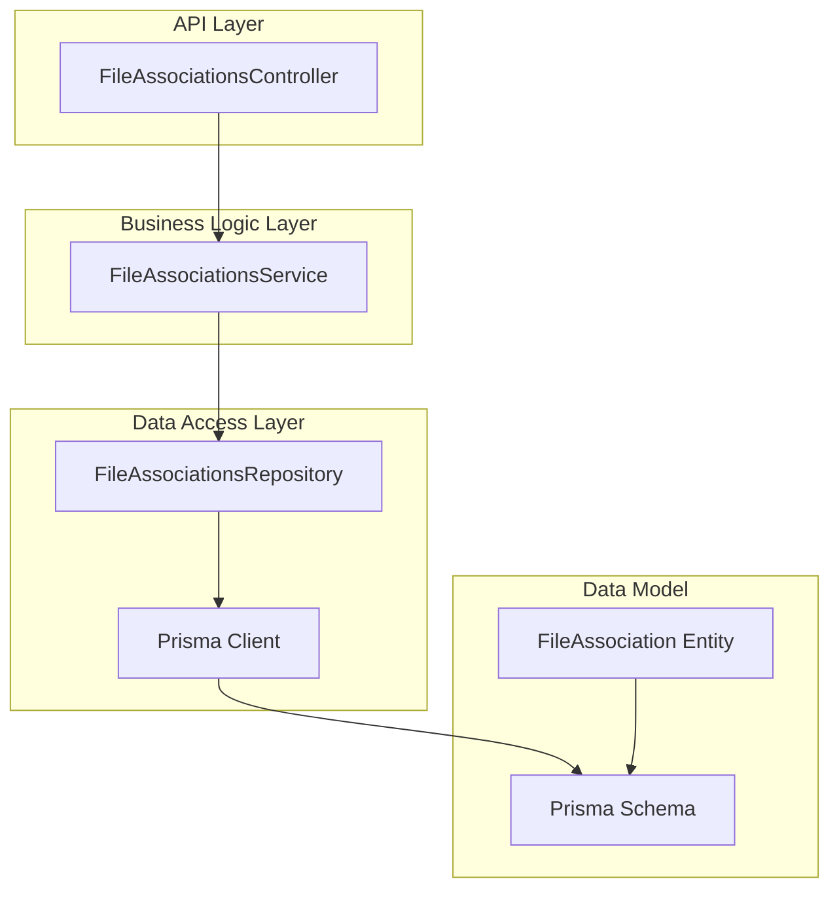
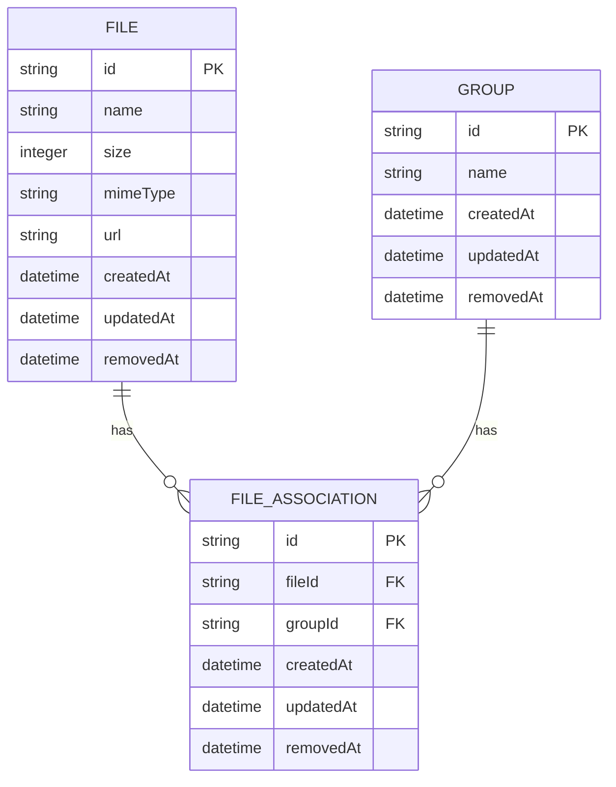
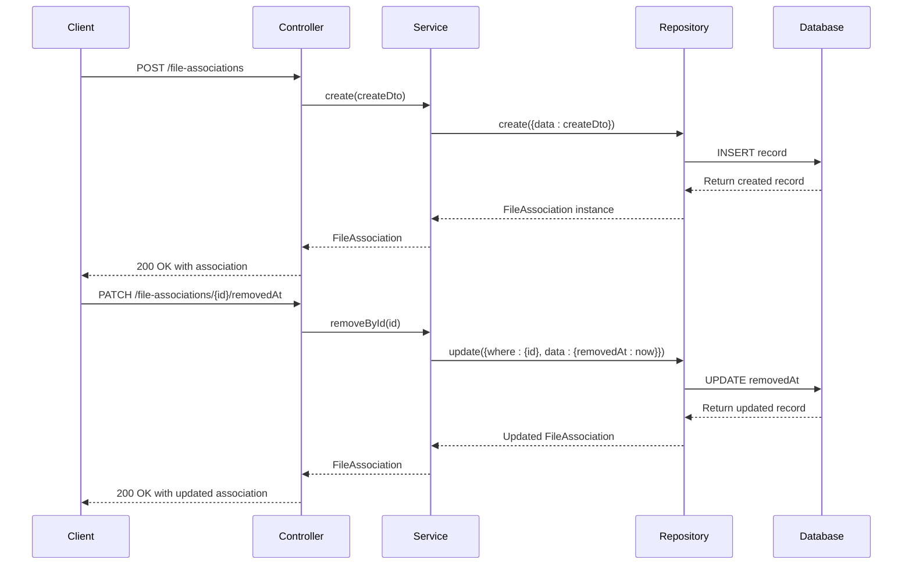
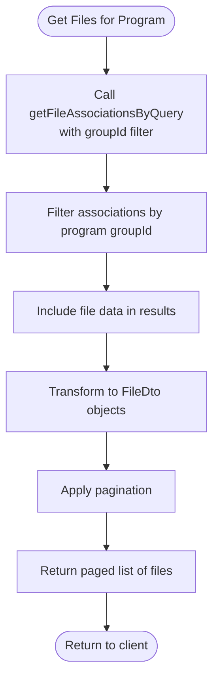
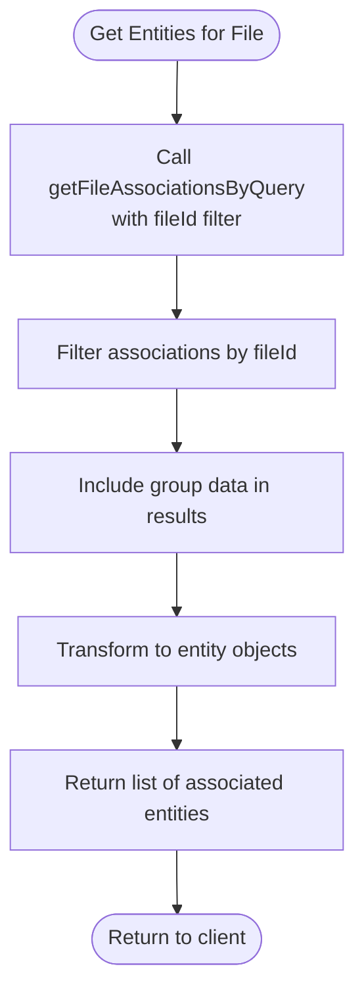

# File Association Mechanism

<cite>
**Referenced Files in This Document**   
- [file-association.entity.ts](file://packages/entity/src/file-association.entity.ts)
- [file-association.dto.ts](file://packages/dto/src/file-association.dto.ts)
- [create-file-association.dto.ts](file://packages/dto/src/create/create-file-association.dto.ts)
- [file.prisma](file://packages/prisma/schema/file.prisma)
- [file-associations.service.ts](file://apps/server/src/shared/service/resources/file-associations.service.ts)
- [file-associations.repository.ts](file://apps/server/src/shared/repository/file-associations.repository.ts)
- [file-associations.controller.ts](file://apps/server/src/shared/controller/resources/file-associations.controller.ts)
- [file-associations.module.ts](file://apps/server/src/module/file-associations.module.ts)
</cite>

## Table of Contents
1. [Introduction](#introduction)
2. [Architecture Overview](#architecture-overview)
3. [Entity Structure and Relationships](#entity-structure-and-relationships)
4. [CRUD Operations Implementation](#crud-operations-implementation)
5. [Querying Associations](#querying-associations)
6. [Referential Integrity and Cascade Behavior](#referential-integrity-and-cascade-behavior)
7. [Performance Considerations](#performance-considerations)
8. [Use Cases](#use-cases)
9. [Conclusion](#conclusion)

## Introduction

The File Association Mechanism in prj-core enables flexible many-to-many relationships between files and various domain entities such as programs, routines, sessions, and users. This system uses an association entity pattern to link files with other entities through dedicated association records, providing a scalable and maintainable approach to managing complex relationships across the domain model.

The mechanism is implemented using Prisma ORM with a clean separation of concerns following the NestJS architectural pattern, including dedicated modules, controllers, services, repositories, entities, and DTOs. The design supports soft deletion, efficient querying, and maintains referential integrity while allowing for extensibility to support additional entity types.

**Section sources**
- [file-association.entity.ts](file://packages/entity/src/file-association.entity.ts#L1-L17)
- [file.prisma](file://packages/prisma/schema/file.prisma#L37-L50)

## Architecture Overview

The File Association Mechanism follows a layered architecture with clear separation between data access, business logic, and API presentation layers. The system is organized into distinct components that work together to manage file associations.

**Diagram sources**
- [file-associations.controller.ts](file://apps/server/src/shared/controller/resources/file-associations.controller.ts#L25-L107)
- [file-associations.service.ts](file://apps/server/src/shared/service/resources/file-associations.service.ts#L10-L62)
- [file-associations.repository.ts](file://apps/server/src/shared/repository/file-associations.repository.ts#L7-L83)
- [file-association.entity.ts](file://packages/entity/src/file-association.entity.ts#L1-L17)
- [file.prisma](file://packages/prisma/schema/file.prisma#L37-L50)

## Entity Structure and Relationships

The File Association Mechanism is built around the `FileAssociation` entity, which establishes many-to-many relationships between files and other domain entities. In the current implementation, files are associated with groups, but the pattern can be extended to other entities.

The core structure consists of:

- **FileAssociation**: The association entity containing foreign keys to both the file and the associated entity
- **Composite Unique Constraint**: Ensures that each file can only be associated with a specific entity once
- **Bidirectional Relationships**: Both File and associated entities can navigate to their associations

**Diagram sources**
- [file.prisma](file://packages/prisma/schema/file.prisma#L37-L50)
- [file-association.entity.ts](file://packages/entity/src/file-association.entity.ts#L8-L16)

**Section sources**
- [file.prisma](file://packages/prisma/schema/file.prisma#L37-L50)
- [file-association.entity.ts](file://packages/entity/src/file-association.entity.ts#L8-L16)

## CRUD Operations Implementation

The File Association Mechanism provides comprehensive CRUD operations through a well-defined service layer that orchestrates interactions between controllers and repositories.

### Creation
File associations are created through the `create` method in the service layer, which accepts a `CreateFileAssociationDto` containing the necessary foreign keys. The operation validates the input and persists the association record.

### Update
Associations can be updated using the `updateById` method, which modifies specific fields of an existing association. The implementation uses Prisma's update functionality with proper type safety.

### Deletion vs. Removal
The system distinguishes between hard deletion and soft removal:
- **Hard Delete**: Permanently removes the association record using `deleteById`
- **Soft Remove**: Marks the association as removed by setting the `removedAt` timestamp using `removeById`

This pattern allows for data recovery and audit trails while effectively hiding removed associations from standard queries.

**Diagram sources**
- [file-associations.controller.ts](file://apps/server/src/shared/controller/resources/file-associations.controller.ts#L30-L39)
- [file-associations.service.ts](file://apps/server/src/shared/service/resources/file-associations.service.ts#L14-L20)
- [file-associations.repository.ts](file://apps/server/src/shared/repository/file-associations.repository.ts#L16-L20)

**Section sources**
- [file-associations.service.ts](file://apps/server/src/shared/service/resources/file-associations.service.ts#L14-L62)
- [file-associations.controller.ts](file://apps/server/src/shared/controller/resources/file-associations.controller.ts#L30-L95)

## Querying Associations

The File Association Mechanism provides flexible querying capabilities through the `getManyByQuery` method, which supports pagination, filtering, and sorting. The query system is built on Prisma's type-safe query builder pattern.

Key features of the querying system:
- **Pagination**: Built-in support for offset-based pagination with total count
- **Filtering**: Ability to filter associations by file ID, group ID, or other fields
- **Sorting**: Support for ordering results by any field in ascending or descending order
- **Inclusion**: Option to include related file data in the response

The `QueryFileAssociationDto` class provides a structured interface for query parameters, ensuring type safety and proper validation. When retrieving associations, the service automatically includes the associated file data by default, making it easy to access file properties without additional queries.

**Section sources**
- [file-associations.service.ts](file://apps/server/src/shared/service/resources/file-associations.service.ts#L22-L38)
- [file-associations.controller.ts](file://apps/server/src/shared/controller/resources/file-associations.controller.ts#L97-L106)

## Referential Integrity and Cascade Behavior

The File Association Mechanism enforces referential integrity at the database level through foreign key constraints. The Prisma schema defines relationships between the `FileAssociation` model and both the `File` and `Group` models.

Key integrity features:
- **Foreign Key Constraints**: Ensure that every association references existing records in both the File and Group tables
- **Composite Unique Index**: Prevents duplicate associations between the same file and entity
- **Soft Deletion Pattern**: Uses `removedAt` timestamp instead of immediate deletion to maintain historical data

The current implementation does not specify cascade delete behavior in the Prisma schema, which means:
- Deleting a file does not automatically delete its associations
- Associations must be explicitly removed or will remain as orphaned records
- This approach preserves audit trails and allows for data recovery

For production use, consider implementing one of the following cascade strategies:
1. **Restrict Delete**: Prevent deletion of files that have active associations
2. **Cascade Remove**: Automatically soft-delete associations when their parent file is removed
3. **Orphan Handling**: Allow orphaned associations but provide cleanup processes

**Section sources**
- [file.prisma](file://packages/prisma/schema/file.prisma#L45-L46)
- [file-association.entity.ts](file://packages/entity/src/file-association.entity.ts#L14-L15)

## Performance Considerations

The File Association Mechanism has been designed with performance in mind, but certain patterns should be followed to ensure optimal performance at scale.

### Indexing Strategy
The database automatically creates indexes for:
- Primary key (id)
- Unique constraints (seq, [groupId, fileId])
- Foreign keys (fileId, groupId)

These indexes ensure fast lookups when querying by ID or when joining with related tables.

### Query Optimization
Best practices for efficient queries:
- Use specific ID lookups (`getById`) when possible instead of filtered queries
- Leverage pagination for list operations to avoid loading large datasets
- Be selective about including related data to reduce payload size
- Use batch operations for creating or removing multiple associations

### Potential Bottlenecks
- **Bulk Operations**: The current implementation processes bulk removals sequentially, which could be optimized using Prisma's batch operations
- **N+1 Queries**: While the service includes file data by default, complex nested queries could still lead to performance issues
- **Index Maintenance**: As the number of associations grows, index maintenance overhead increases

For high-volume scenarios, consider implementing:
- Caching strategies for frequently accessed associations
- Database-level batch operations for bulk changes
- Materialized views for complex association queries

**Section sources**
- [file-associations.repository.ts](file://apps/server/src/shared/repository/file-associations.repository.ts#L45-L48)
- [file-associations.service.ts](file://apps/server/src/shared/service/resources/file-associations.service.ts#L26-L30)

## Use Cases

### Retrieving All Files for a Specific Program
To retrieve all files associated with a program (represented as a group), use the query endpoint with the group ID filter:

**Section sources**
- [file-associations.service.ts](file://apps/server/src/shared/service/resources/file-associations.service.ts#L22-L38)
- [file-associations.controller.ts](file://apps/server/src/shared/controller/resources/file-associations.controller.ts#L97-L106)

### Finding All Associated Entities for a Given File
To find all entities (groups) associated with a specific file, query the associations using the file ID:

**Section sources**
- [file-associations.service.ts](file://apps/server/src/shared/service/resources/file-associations.service.ts#L22-L38)
- [file-associations.controller.ts](file://apps/server/src/shared/controller/resources/file-associations.controller.ts#L97-L106)

### Bulk Operations
For creating or removing multiple associations, the system currently processes operations sequentially to ensure transactional integrity and proper error handling. While this approach is safe, it may impact performance with large batches.

Future enhancements could include:
- Implementing true batch operations using Prisma's `createMany` and `updateMany`
- Adding transaction support to ensure atomicity
- Providing progress tracking for long-running bulk operations

## Conclusion

The File Association Mechanism in prj-core provides a robust foundation for managing many-to-many relationships between files and domain entities. The current implementation focuses on groups as the associated entity type, but the pattern is easily extensible to other entities such as programs, routines, sessions, and users.

Key strengths of the current implementation include:
- Clean separation of concerns following NestJS patterns
- Support for both hard deletion and soft removal
- Type-safe querying with pagination and filtering
- Enforced referential integrity at the database level

Areas for potential improvement:
- Implementing cascade delete behaviors for better data consistency
- Optimizing bulk operations for better performance
- Adding more sophisticated indexing for complex queries
- Extending the pattern to support additional entity types

The mechanism provides a solid foundation that can be extended to meet evolving requirements while maintaining data integrity and performance.