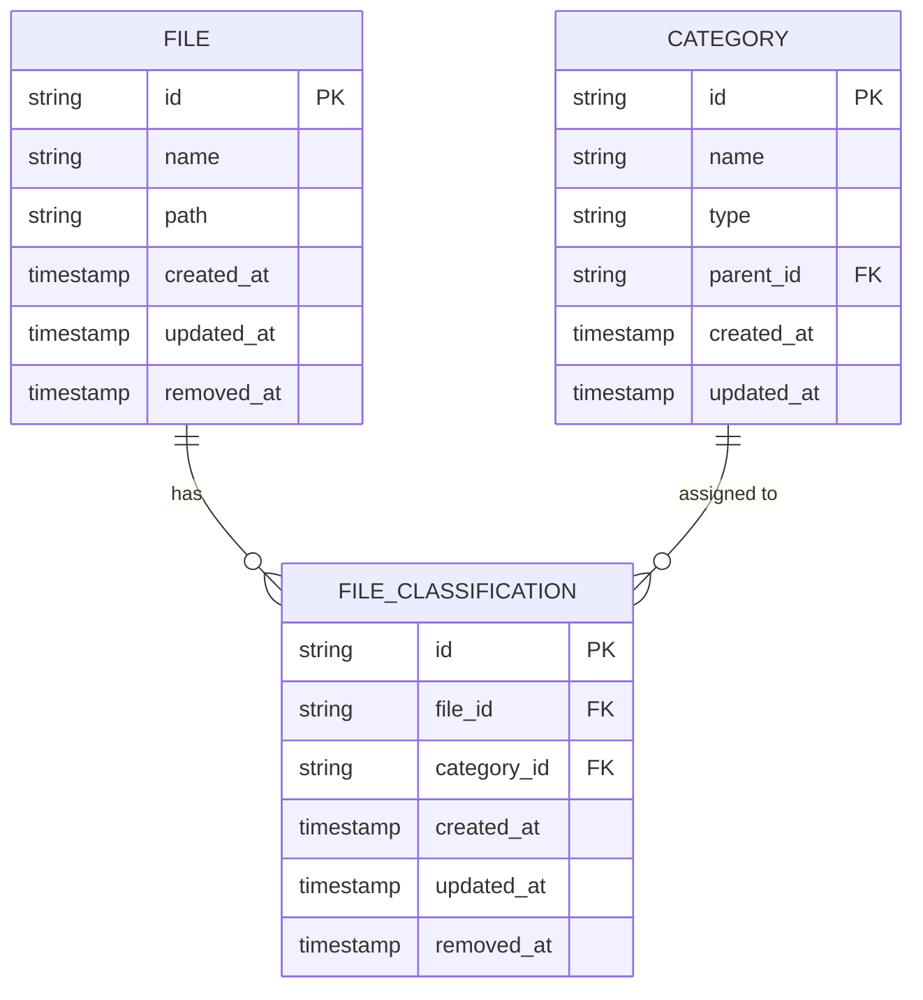
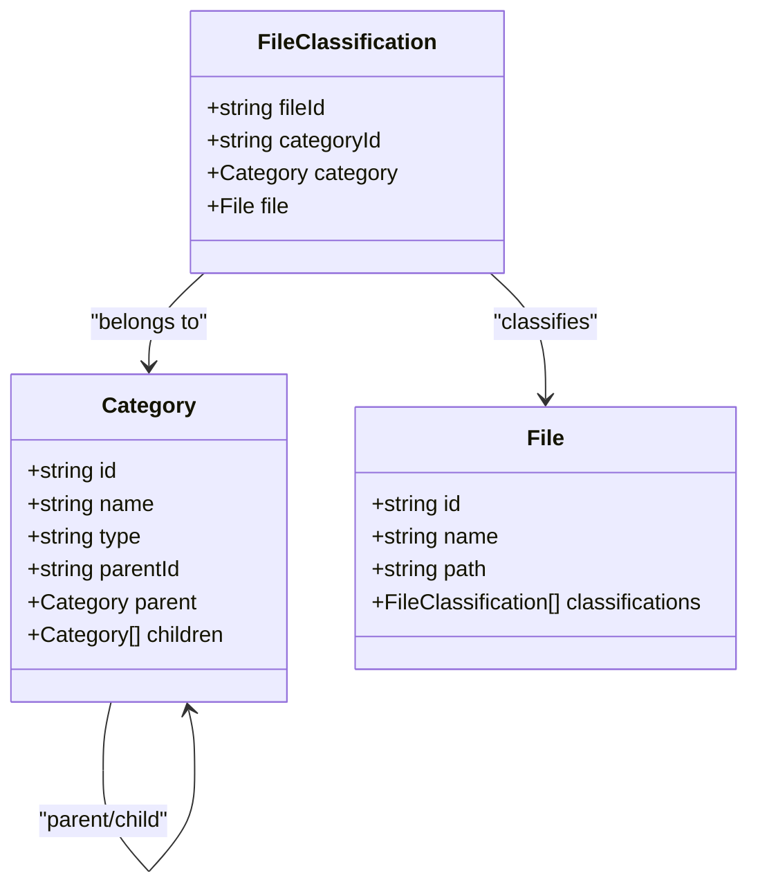
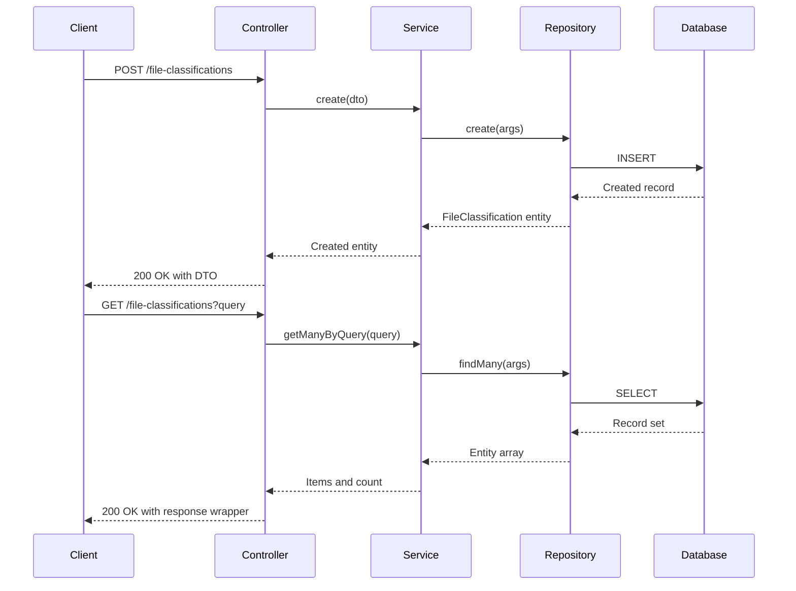
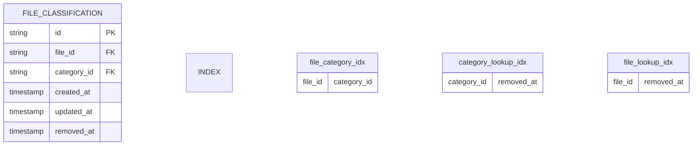
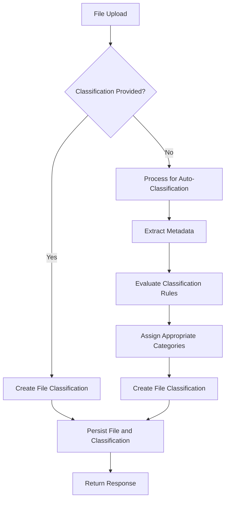
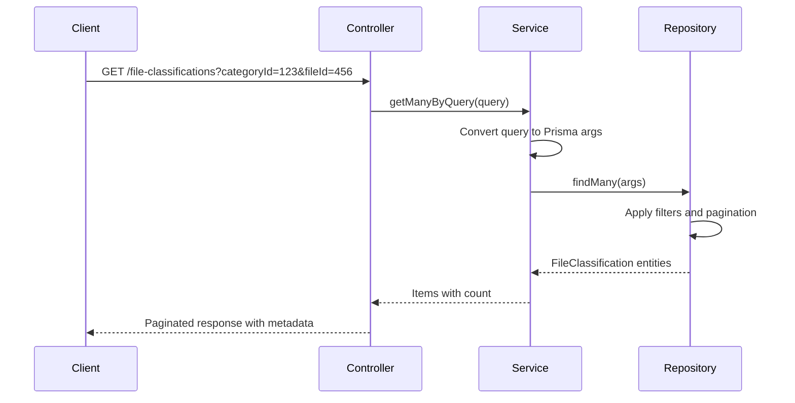
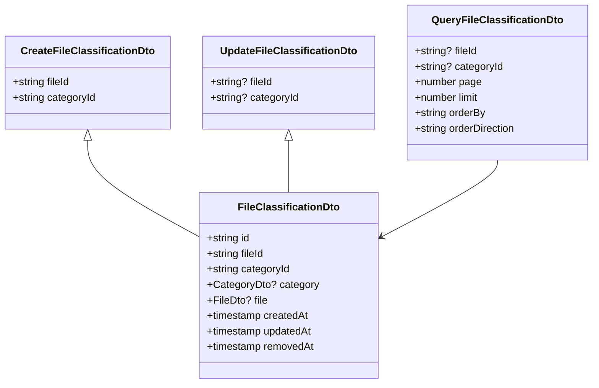
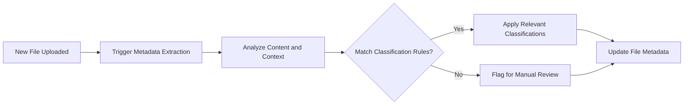

# File Classification System

<cite>
**Referenced Files in This Document**   
- [file-classification.entity.ts](file://packages/entity/src/file-classification.entity.ts)
- [file-classification.dto.ts](file://packages/dto/src/file-classification.dto.ts)
- [create-file-classification.dto.ts](file://packages/dto/src/create/create-file-classification.dto.ts)
- [update-file-classification.dto.ts](file://packages/dto/src/update/update-file-classification.dto.ts)
- [query-file-classification.dto.ts](file://packages/dto/src/query/query-file-classification.dto.ts)
- [file-classifications.controller.ts](file://apps/server/src/shared/controller/resources/file-classifications.controller.ts)
- [file-classifications.service.ts](file://apps/server/src/shared/service/resources/file-classifications.service.ts)
- [file-classifications.repository.ts](file://apps/server/src/shared/repository/file-classifications.repository.ts)
- [file-classifications.module.ts](file://apps/server/src/module/file-classifications.module.ts)
</cite>

## Table of Contents
1. [Introduction](#introduction)
2. [Entity Relationship Model](#entity-relationship-model)
3. [Classification Taxonomy and Hierarchical Structure](#classification-taxonomy-and-hierarchical-structure)
4. [CRUD Operations Implementation](#crud-operations-implementation)
5. [Database Schema and Indexing Strategy](#database-schema-and-indexing-strategy)
6. [File Classification Assignment Workflow](#file-classification-assignment-workflow)
7. [Querying Files by Classification](#querying-files-by-classification)
8. [Validation and Business Logic](#validation-and-business-logic)
9. [Use Cases](#use-cases)
10. [Extending the Classification System](#extending-the-classification-system)
11. [Integration with Metadata Services](#integration-with-metadata-services)

## Introduction
The File Classification System in prj-core provides a flexible mechanism for categorizing files using a taxonomy-based approach. This system enables organizations to manage content through structured classification tags, supporting use cases such as access control, content filtering, and automated workflows. The implementation follows a modular architecture using NestJS, with clear separation between controllers, services, repositories, and data transfer objects.

**Section sources**
- [file-classifications.module.ts](file://apps/server/src/module/file-classifications.module.ts)

## Entity Relationship Model
The file classification system implements a many-to-many relationship between files and categories through a dedicated junction entity. Each classification record links a specific file to a category, enabling multiple classifications per file and hierarchical categorization.

**Diagram sources**
- [file-classification.entity.ts](file://packages/entity/src/file-classification.entity.ts)

**Section sources**
- [file-classification.entity.ts](file://packages/entity/src/file-classification.entity.ts)

## Classification Taxonomy and Hierarchical Structure
The classification system supports hierarchical taxonomies through the Category entity, which can form parent-child relationships. This enables organizations to create nested classification schemes (e.g., "Confidential" → "Financial" → "Tax Records"). The system allows for flexible categorization types, with categories distinguished by type fields that support domain-specific taxonomies.

**Diagram sources**
- [file-classification.entity.ts](file://packages/entity/src/file-classification.entity.ts)
- [category.entity.ts](file://packages/entity/src/category.entity.ts)

## CRUD Operations Implementation
The system provides comprehensive CRUD operations for file classifications through a RESTful API interface. The implementation follows the NestJS controller-service-repository pattern, ensuring separation of concerns and testability.

**Diagram sources**
- [file-classifications.controller.ts](file://apps/server/src/shared/controller/resources/file-classifications.controller.ts)
- [file-classifications.service.ts](file://apps/server/src/shared/service/resources/file-classifications.service.ts)
- [file-classifications.repository.ts](file://apps/server/src/shared/repository/file-classifications.repository.ts)

**Section sources**
- [file-classifications.controller.ts](file://apps/server/src/shared/controller/resources/file-classifications.controller.ts)
- [file-classifications.service.ts](file://apps/server/src/shared/service/resources/file-classifications.service.ts)
- [file-classifications.repository.ts](file://apps/server/src/shared/repository/file-classifications.repository.ts)

## Database Schema and Indexing Strategy
The database schema is optimized for efficient querying of classified files. The file_classification table includes composite indexes on frequently queried field combinations, particularly the fileId and categoryId columns which are central to most operations.

The soft-delete pattern is implemented via the removedAt field, allowing for logical deletion while preserving historical classification data. This supports audit requirements and enables restoration of classifications when needed.

**Section sources**
- [file-classification.entity.ts](file://packages/entity/src/file-classification.entity.ts)

## File Classification Assignment Workflow
Files can be classified during upload or through post-processing workflows. The system supports both synchronous and asynchronous classification assignment.

The workflow integrates with metadata extraction services that can analyze file content to determine appropriate classifications based on predefined rules or machine learning models.

**Section sources**
- [file-classifications.service.ts](file://apps/server/src/shared/service/resources/file-classifications.service.ts)

## Querying Files by Classification
The system provides robust querying capabilities to retrieve files based on their classifications. The QueryFileClassificationDto supports filtering by multiple criteria including category IDs, file IDs, and date ranges.

The query system supports pagination, sorting, and complex filtering conditions, enabling efficient retrieval of classified files even in large datasets.

**Diagram sources**
- [file-classifications.controller.ts](file://apps/server/src/shared/controller/resources/file-classifications.controller.ts)
- [query-file-classification.dto.ts](file://packages/dto/src/query/query-file-classification.dto.ts)

**Section sources**
- [file-classifications.service.ts](file://apps/server/src/shared/service/resources/file-classifications.service.ts)
- [query-file-classification.dto.ts](file://packages/dto/src/query/query-file-classification.dto.ts)

## Validation and Business Logic
The system implements validation at multiple levels to ensure data integrity. DTOs include validation decorators that enforce field requirements, types, and constraints before processing.

The service layer enforces business rules such as preventing duplicate classifications for the same file-category combination and ensuring that referenced files and categories exist before creating classifications.

**Diagram sources**
- [create-file-classification.dto.ts](file://packages/dto/src/create/create-file-classification.dto.ts)
- [update-file-classification.dto.ts](file://packages/dto/src/update/update-file-classification.dto.ts)
- [query-file-classification.dto.ts](file://packages/dto/src/query/query-file-classification.dto.ts)
- [file-classification.dto.ts](file://packages/dto/src/file-classification.dto.ts)

**Section sources**
- [file-classifications.service.ts](file://apps/server/src/shared/service/resources/file-classifications.service.ts)

## Use Cases
### Content Filtering
The classification system enables sophisticated content filtering based on security levels, departments, or content types. Applications can restrict file visibility based on user permissions and classification levels.

### Access Control
Classification tags serve as the foundation for attribute-based access control (ABAC), where access to files is determined by the user's clearance level and the file's classification.

### Automated Tagging Workflows
The system supports automated tagging through integration with metadata extraction services. When files are uploaded, the system can automatically analyze content and apply appropriate classifications based on predefined rules.

**Diagram sources**
- [file-classifications.service.ts](file://apps/server/src/shared/service/resources/file-classifications.service.ts)

## Extending the Classification System
The modular design allows for easy extension with custom taxonomies. New classification types can be added by creating corresponding entities and modules that follow the same pattern as the file classification system.

```mermaid
classDiagram
class FileClassificationsModule
class SpaceClassificationsModule
class RoleClassificationsModule
class UserClassificationsModule
FileClassificationsModule --> FileClassificationsController
FileClassificationsModule --> FileClassificationsService
FileClassificationsModule --> FileClassificationsRepository
SpaceClassificationsModule --> SpaceClassificationsController
SpaceClassificationsModule --> SpaceClassificationsService
SpaceClassificationsModule --> SpaceClassificationsRepository
RoleClassificationsModule --> RoleClassificationsController
RoleClassificationsModule --> RoleClassificationsService
RoleClassificationsModule --> RoleClassificationsRepository
UserClassificationsModule --> UserClassificationsController
UserClassificationsModule --> UserClassificationsService
UserClassificationsModule --> UserClassificationsRepository
```

This pattern can be replicated for any entity that requires classification, maintaining consistency across the system.

**Diagram sources**
- [file-classifications.module.ts](file://apps/server/src/module/file-classifications.module.ts)
- [space-classifications.module.ts](file://apps/server/src/module/space-classifications.module.ts)
- [role-classifications.module.ts](file://apps/server/src/module/role-classifications.module.ts)
- [user-classifications.module.ts](file://apps/server/src/module/user-classifications.module.ts)

## Integration with Metadata Services
The classification system is designed to integrate with external metadata extraction services that can analyze file content to determine appropriate classifications. This enables automated tagging based on document type, sensitivity level, or content keywords.

The integration occurs through the service layer, which can invoke metadata extraction APIs during file processing. Extracted metadata is then mapped to existing classification categories or used to suggest new classifications for administrator approval.

**Section sources**
- [file-classifications.service.ts](file://apps/server/src/shared/service/resources/file-classifications.service.ts)