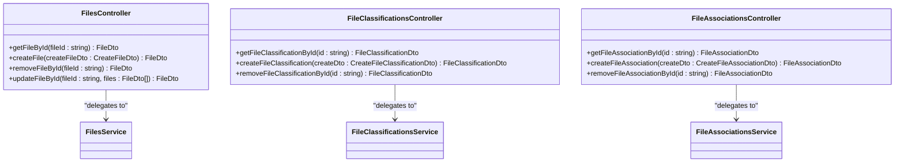

# File Management Modules

<cite>
**Referenced Files in This Document**   
- [files.module.ts](file://apps/server/src/module/files.module.ts)
- [file-classifications.module.ts](file://apps/server/src/module/file-classifications.module.ts)
- [file-associations.module.ts](file://apps/server/src/module/file-associations.module.ts)
- [files.controller.ts](file://apps/server/src/shared/controller/resources/files.controller.ts)
- [file-classifications.controller.ts](file://apps/server/src/shared/controller/resources/file-classifications.controller.ts)
- [file-associations.controller.ts](file://apps/server/src/shared/controller/resources/file-associations.controller.ts)
- [files.service.ts](file://apps/server/src/shared/service/resources/files.service.ts)
- [file-classifications.service.ts](file://apps/server/src/shared/service/resources/file-classifications.service.ts)
- [file-associations.service.ts](file://apps/server/src/shared/service/resources/file-associations.service.ts)
- [files.repository.ts](file://apps/server/src/shared/repository/files.repository.ts)
- [file-classifications.repository.ts](file://apps/server/src/shared/repository/file-classifications.repository.ts)
- [file-associations.repository.ts](file://apps/server/src/shared/repository/file-associations.repository.ts)
- [aws.config.ts](file://apps/server/src/shared/config/aws.config.ts)
- [aws.service.ts](file://apps/server/src/shared/service/utils/aws.service.ts)
- [file-size-validation.pipe.ts](file://apps/server/src/shared/pipe/file-size-validation.pipe.ts)
</cite>

## Table of Contents
1. [Introduction](#introduction)
2. [Project Structure](#project-structure)
3. [Core Components](#core-components)
4. [Architecture Overview](#architecture-overview)
5. [Detailed Component Analysis](#detailed-component-analysis)
6. [Dependency Analysis](#dependency-analysis)
7. [Performance Considerations](#performance-considerations)
8. [Troubleshooting Guide](#troubleshooting-guide)
9. [Conclusion](#conclusion)

## Introduction
The File Management Modules in prj-core provide a comprehensive system for handling file uploads, storage, metadata management, and access control. This documentation details the implementation of the FilesModule and its supporting modules for classification and association. The system integrates with AWS S3 for cloud storage and implements robust validation, security, and optimization features. The architecture follows NestJS patterns with clear separation of concerns between controllers, services, and repositories, enabling maintainable and scalable file management functionality.

## Project Structure

**Diagram sources**
- [files.module.ts](file://apps/server/src/module/files.module.ts)
- [file-classifications.module.ts](file://apps/server/src/module/file-classifications.module.ts)
- [file-associations.module.ts](file://apps/server/src/module/file-associations.module.ts)
- [aws.config.ts](file://apps/server/src/shared/config/aws.config.ts)
- [aws.service.ts](file://apps/server/src/shared/service/utils/aws.service.ts)

**Section sources**
- [files.module.ts](file://apps/server/src/module/files.module.ts)
- [file-classifications.module.ts](file://apps/server/src/module/file-classifications.module.ts)
- [file-associations.module.ts](file://apps/server/src/module/file-associations.module.ts)

## Core Components

The file management system in prj-core consists of three primary modules: FilesModule, FileClassificationsModule, and FileAssociationsModule. These modules work together to provide comprehensive file management capabilities. The FilesModule handles core file operations including upload, retrieval, and deletion. The FileClassificationsModule enables categorization of files through classification tags, allowing for organized file management. The FileAssociationsModule manages relationships between files and other entities in the system, enabling rich contextual connections. Each module follows the NestJS pattern of separation between controllers (handling HTTP requests), services (business logic), and repositories (data access). The system integrates with AWS S3 for reliable cloud storage and implements validation pipes for security and data integrity.

**Section sources**
- [files.module.ts](file://apps/server/src/module/files.module.ts)
- [file-classifications.module.ts](file://apps/server/src/module/file-classifications.module.ts)
- [file-associations.module.ts](file://apps/server/src/module/file-associations.module.ts)

## Architecture Overview

**Diagram sources**
- [files.controller.ts](file://apps/server/src/shared/controller/resources/files.controller.ts)
- [files.service.ts](file://apps/server/src/shared/service/resources/files.service.ts)
- [files.repository.ts](file://apps/server/src/shared/repository/files.repository.ts)
- [aws.service.ts](file://apps/server/src/shared/service/utils/aws.service.ts)

## Detailed Component Analysis

### Files Module Analysis

The FilesModule is the core component responsible for managing file operations within the prj-core application. It follows the NestJS modular architecture pattern, importing necessary controllers, services, and repositories through dependency injection. The module declaration specifies FilesController as the entry point for HTTP requests, while FilesService and FilesRepository handle business logic and data persistence respectively. This separation of concerns ensures maintainability and testability of the file management functionality. The module leverages the @shared import to access common components, promoting code reuse across the application. Configuration is managed through environment variables, with AWS credentials and bucket information injected at runtime.

**Section sources**
- [files.module.ts](file://apps/server/src/module/files.module.ts)

### File Classifications Module Analysis

The FileClassificationsModule provides categorization capabilities for files in the system. This module enables the organization of files through classification tags, which can be used for filtering, searching, and access control. The module follows the same architectural pattern as the core FilesModule, with a dedicated controller, service, and repository. The FileClassificationsController exposes endpoints for creating, retrieving, and updating file classifications. The service layer implements business logic for classification management, while the repository handles data persistence through Prisma. This modular approach allows for flexible file organization and enables the system to support various classification schemes based on application requirements.

**Section sources**
- [file-classifications.module.ts](file://apps/server/src/module/file-classifications.module.ts)

### File Associations Module Analysis

The FileAssociationsModule manages relationships between files and other entities in the system. This functionality enables rich contextual connections, allowing files to be associated with users, projects, tasks, or other domain objects. The module provides a flexible association system that supports one-to-many and many-to-many relationships. The implementation includes an enhanced query method that automatically includes file information when retrieving associations, optimizing data retrieval. This feature reduces the need for additional API calls and improves performance when displaying files with their associated metadata. The association system supports soft deletion through the removedAt field, preserving data integrity while allowing for logical deletion of relationships.

**Section sources**
- [file-associations.module.ts](file://apps/server/src/module/file-associations.module.ts)

### Files Controller Analysis

**Diagram sources**
- [files.controller.ts](file://apps/server/src/shared/controller/resources/files.controller.ts)
- [file-classifications.controller.ts](file://apps/server/src/shared/controller/resources/file-classifications.controller.ts)
- [file-associations.controller.ts](file://apps/server/src/shared/controller/resources/file-associations.controller.ts)

**Section sources**
- [files.controller.ts](file://apps/server/src/shared/controller/resources/files.controller.ts)

### Files Service Analysis

**Diagram sources**
- [files.service.ts](file://apps/server/src/shared/service/resources/files.service.ts)

**Section sources**
- [files.service.ts](file://apps/server/src/shared/service/resources/files.service.ts)

### Files Repository Analysis

**Diagram sources**
- [files.repository.ts](file://apps/server/src/shared/repository/files.repository.ts)
- [file-classifications.repository.ts](file://apps/server/src/shared/repository/file-classifications.repository.ts)
- [file-associations.repository.ts](file://apps/server/src/shared/repository/file-associations.repository.ts)

**Section sources**
- [files.repository.ts](file://apps/server/src/shared/repository/files.repository.ts)

### AWS Integration Analysis

**Diagram sources**
- [aws.service.ts](file://apps/server/src/shared/service/utils/aws.service.ts)

**Section sources**
- [aws.config.ts](file://apps/server/src/shared/config/aws.config.ts)
- [aws.service.ts](file://apps/server/src/shared/service/utils/aws.service.ts)

## Dependency Analysis

**Diagram sources**
- [files.module.ts](file://apps/server/src/module/files.module.ts)
- [file-classifications.module.ts](file://apps/server/src/module/file-classifications.module.ts)
- [file-associations.module.ts](file://apps/server/src/module/file-associations.module.ts)
- [aws.config.ts](file://apps/server/src/shared/config/aws.config.ts)
- [aws.service.ts](file://apps/server/src/shared/service/utils/aws.service.ts)

**Section sources**
- [files.module.ts](file://apps/server/src/module/files.module.ts)
- [file-classifications.module.ts](file://apps/server/src/module/file-classifications.module.ts)
- [file-associations.module.ts](file://apps/server/src/module/file-associations.module.ts)

## Performance Considerations

The file management system implements several performance optimizations to handle file operations efficiently. The repository layer uses Prisma for database operations, which provides query optimization and connection pooling. For file storage, the system leverages AWS S3 with CDN integration for fast global access to uploaded files. The architecture separates metadata operations from file upload operations, allowing for asynchronous processing when needed. The system includes file size validation through the FileSizeValidationPipe to prevent excessively large file uploads that could impact performance. Database queries are optimized with proper indexing on frequently searched fields such as file IDs and classification types. The association service includes automatic inclusion of file data in queries, reducing the need for additional database calls when retrieving associated files.

**Section sources**
- [file-size-validation.pipe.ts](file://apps/server/src/shared/pipe/file-size-validation.pipe.ts)
- [files.repository.ts](file://apps/server/src/shared/repository/files.repository.ts)
- [file-associations.service.ts](file://apps/server/src/shared/service/resources/file-associations.service.ts)

## Troubleshooting Guide

Common issues in the file management system typically relate to AWS configuration, file validation, or database connectivity. Ensure that AWS environment variables (AWS_ACCESS_KEY_ID, AWS_SECRET_ACCESS_KEY, AWS_REGION, AWS_S3_BUCKET_NAME) are properly configured in the application environment. For file upload failures, verify that the file size does not exceed system limits and that the file type is permitted by the application. Database-related issues may occur if the Prisma schema is not synchronized with the database, which can be resolved by running database migrations. When files are not appearing after upload, check the AWS S3 bucket permissions and ensure that the bucket name in the configuration matches the actual bucket. For classification or association issues, verify that the referenced entity IDs exist in the database before creating relationships.

**Section sources**
- [aws.config.ts](file://apps/server/src/shared/config/aws.config.ts)
- [file-size-validation.pipe.ts](file://apps/server/src/shared/pipe/file-size-validation.pipe.ts)
- [files.repository.ts](file://apps/server/src/shared/repository/files.repository.ts)

## Conclusion

The File Management Modules in prj-core provide a robust, scalable solution for handling file operations in a modern web application. The system's modular architecture separates concerns effectively, with clear boundaries between HTTP handling, business logic, and data access layers. Integration with AWS S3 ensures reliable, scalable file storage with global accessibility through CDN. The implementation of classification and association modules enables rich metadata management and contextual relationships between files and other entities. Security is addressed through environment-based configuration management and input validation. The system is designed for performance with optimized database queries and efficient file handling. For future enhancements, consider implementing file versioning, advanced search capabilities across file metadata, and improved error handling for network-related issues during file uploads.