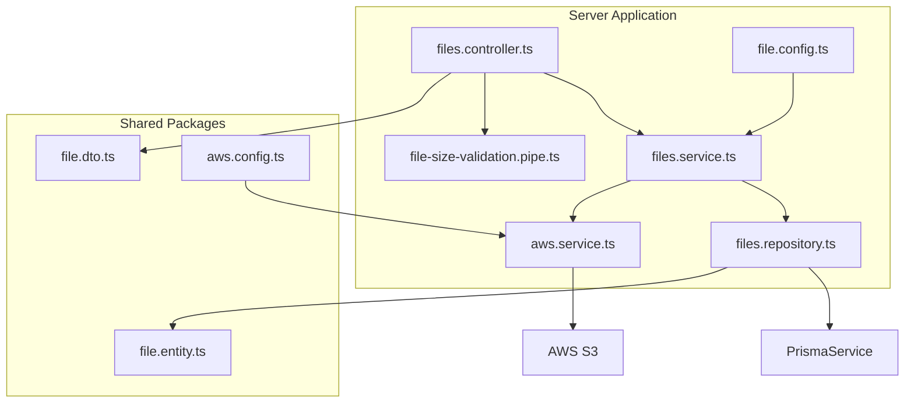
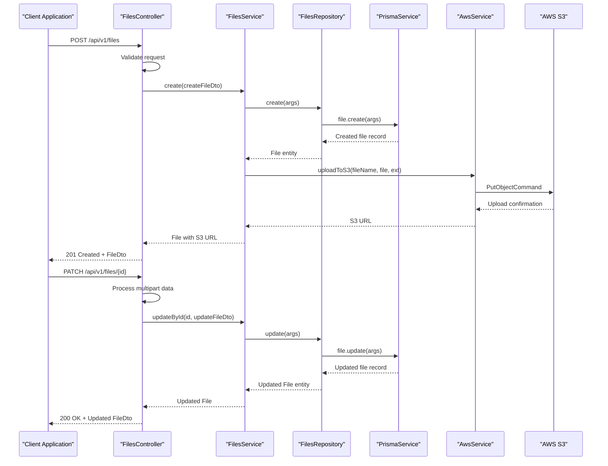
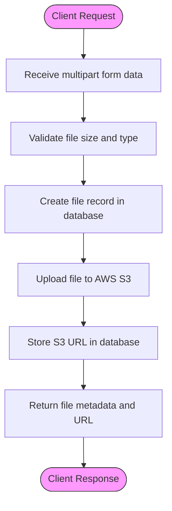
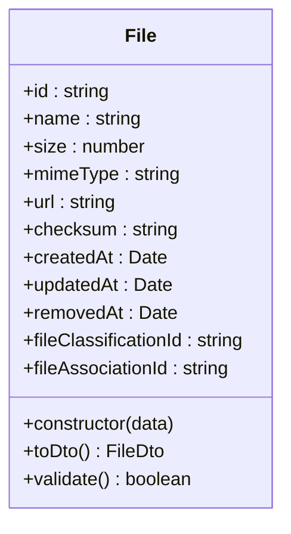
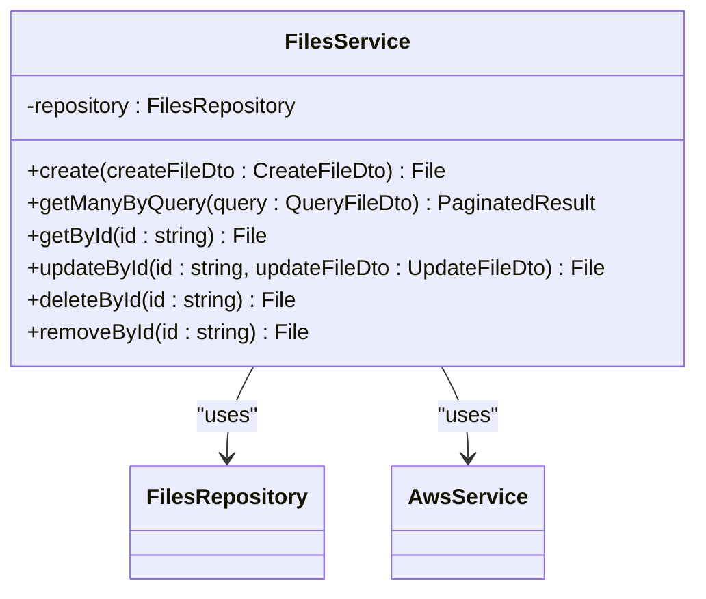
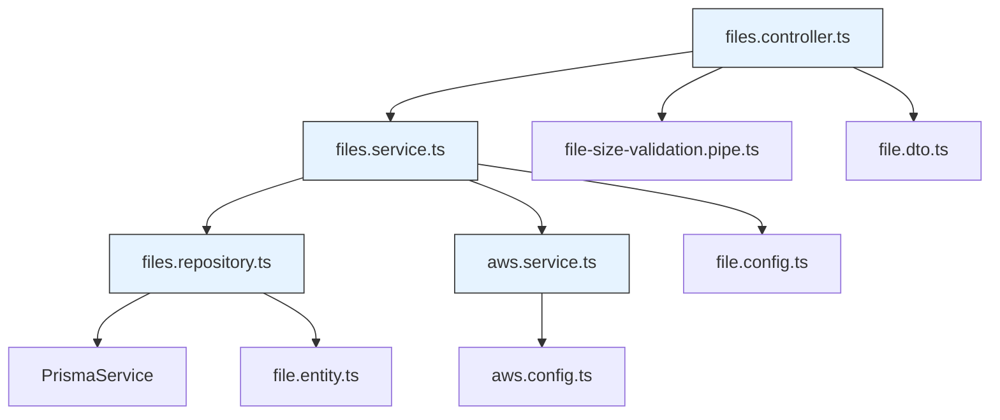

# File Upload and Storage

<cite>
**Referenced Files in This Document**   
- [files.controller.ts](file://apps/server/src/shared/controller/resources/files.controller.ts)
- [files.service.ts](file://apps/server/src/shared/service/resources/files.service.ts)
- [files.repository.ts](file://apps/server/src/shared/repository/files.repository.ts)
- [file.config.ts](file://apps/server/src/shared/config/file.config.ts)
- [aws.service.ts](file://apps/server/src/shared/service/utils/aws.service.ts)
- [aws.config.ts](file://apps/server/src/shared/config/aws.config.ts)
- [file-size-validation.pipe.ts](file://apps/server/src/shared/pipe/file-size-validation.pipe.ts)
- [file.entity.ts](file://packages/entity/src/file.entity.ts)
- [file.dto.ts](file://packages/dto/src/file.dto.ts)
</cite>

## Table of Contents
1. [Introduction](#introduction)
2. [Project Structure](#project-structure)
3. [Core Components](#core-components)
4. [Architecture Overview](#architecture-overview)
5. [Detailed Component Analysis](#detailed-component-analysis)
6. [Dependency Analysis](#dependency-analysis)
7. [Performance Considerations](#performance-considerations)
8. [Troubleshooting Guide](#troubleshooting-guide)
9. [Conclusion](#conclusion)

## Introduction
The File Upload and Storage functionality in prj-core provides a comprehensive system for handling file operations including upload, download, update, and deletion. The system is designed with extensibility in mind, supporting multiple storage drivers with a primary focus on AWS S3 integration. This document details the complete workflow from client request to persistent storage, covering the service-layer implementation, security considerations, and performance optimizations.

## Project Structure

**Diagram sources**
- [files.controller.ts](file://apps/server/src/shared/controller/resources/files.controller.ts)
- [files.service.ts](file://apps/server/src/shared/service/resources/files.service.ts)
- [files.repository.ts](file://apps/server/src/shared/repository/files.repository.ts)
- [file.config.ts](file://apps/server/src/shared/config/file.config.ts)
- [aws.service.ts](file://apps/server/src/shared/service/utils/aws.service.ts)
- [file-size-validation.pipe.ts](file://apps/server/src/shared/pipe/file-size-validation.pipe.ts)
- [file.entity.ts](file://packages/entity/src/file.entity.ts)
- [file.dto.ts](file://packages/dto/src/file.dto.ts)
- [aws.config.ts](file://apps/server/src/shared/config/aws.config.ts)

**Section sources**
- [files.controller.ts](file://apps/server/src/shared/controller/resources/files.controller.ts)
- [files.service.ts](file://apps/server/src/shared/service/resources/files.service.ts)
- [files.repository.ts](file://apps/server/src/shared/repository/files.repository.ts)

## Core Components

The file upload and storage system in prj-core consists of several key components that work together to provide a robust file management solution. The system follows a layered architecture with clear separation of concerns between the controller, service, and repository layers. The controller handles HTTP requests and responses, the service contains the business logic, and the repository manages data persistence. Configuration files define the storage backend and its parameters, while utility services handle integration with external systems like AWS S3.

**Section sources**
- [files.controller.ts](file://apps/server/src/shared/controller/resources/files.controller.ts)
- [files.service.ts](file://apps/server/src/shared/service/resources/files.service.ts)
- [files.repository.ts](file://apps/server/src/shared/repository/files.repository.ts)
- [file.config.ts](file://apps/server/src/shared/config/file.config.ts)

## Architecture Overview

**Diagram sources**
- [files.controller.ts](file://apps/server/src/shared/controller/resources/files.controller.ts)
- [files.service.ts](file://apps/server/src/shared/service/resources/files.service.ts)
- [files.repository.ts](file://apps/server/src/shared/repository/files.repository.ts)
- [aws.service.ts](file://apps/server/src/shared/service/utils/aws.service.ts)

## Detailed Component Analysis

### File Upload Workflow Analysis

The file upload process in prj-core follows a structured workflow from client request to persistent storage. When a client submits a file upload request, the FilesController receives the multipart form data containing the file and associated metadata. The controller then invokes the FilesService to create a new file record in the database through the FilesRepository. Once the database record is created, the service coordinates with the AwsService to upload the actual file content to AWS S3 storage. The system returns a response containing the file metadata and the S3 URL where the file is stored.

**Diagram sources**
- [files.controller.ts](file://apps/server/src/shared/controller/resources/files.controller.ts)
- [files.service.ts](file://apps/server/src/shared/service/resources/files.service.ts)
- [aws.service.ts](file://apps/server/src/shared/service/utils/aws.service.ts)

**Section sources**
- [files.controller.ts](file://apps/server/src/shared/controller/resources/files.controller.ts)
- [files.service.ts](file://apps/server/src/shared/service/resources/files.service.ts)
- [aws.service.ts](file://apps/server/src/shared/service/utils/aws.service.ts)

### File Entity Structure Analysis

The file entity in prj-core represents the core data structure for file storage and management. It contains essential metadata fields that capture information about each stored file, including content type, size, and checksum information. The entity is designed to support both local and cloud-based storage backends, with fields that can accommodate different storage strategies. The entity also includes timestamps for creation and modification, as well as soft deletion capability through the removedAt field.

**Diagram sources**
- [file.entity.ts](file://packages/entity/src/file.entity.ts)
- [file.dto.ts](file://packages/dto/src/file.dto.ts)

**Section sources**
- [file.entity.ts](file://packages/entity/src/file.entity.ts)
- [file.dto.ts](file://packages/dto/src/file.dto.ts)

### Service Layer Implementation Analysis

The service layer in prj-core's file upload system provides the business logic for file operations. The FilesService class orchestrates the interaction between the controller and repository layers, handling the creation, retrieval, update, and deletion of file records. For file creation, the service first creates a database record and then coordinates with the AwsService to upload the file to S3 storage. The service also handles file updates, including replacement of existing files and metadata updates. The removeById method implements soft deletion by setting the removedAt timestamp rather than permanently deleting the record.

**Diagram sources**
- [files.service.ts](file://apps/server/src/shared/service/resources/files.service.ts)
- [files.repository.ts](file://apps/server/src/shared/repository/files.repository.ts)
- [aws.service.ts](file://apps/server/src/shared/service/utils/aws.service.ts)

**Section sources**
- [files.service.ts](file://apps/server/src/shared/service/resources/files.service.ts)

## Dependency Analysis

**Diagram sources**
- [files.controller.ts](file://apps/server/src/shared/controller/resources/files.controller.ts)
- [files.service.ts](file://apps/server/src/shared/service/resources/files.service.ts)
- [files.repository.ts](file://apps/server/src/shared/repository/files.repository.ts)
- [aws.service.ts](file://apps/server/src/shared/service/utils/aws.service.ts)
- [file-size-validation.pipe.ts](file://apps/server/src/shared/pipe/file-size-validation.pipe.ts)
- [file.dto.ts](file://packages/dto/src/file.dto.ts)
- [file.entity.ts](file://packages/entity/src/file.entity.ts)
- [file.config.ts](file://apps/server/src/shared/config/file.config.ts)
- [aws.config.ts](file://apps/server/src/shared/config/aws.config.ts)

**Section sources**
- [files.controller.ts](file://apps/server/src/shared/controller/resources/files.controller.ts)
- [files.service.ts](file://apps/server/src/shared/service/resources/files.service.ts)
- [files.repository.ts](file://apps/server/src/shared/repository/files.repository.ts)
- [aws.service.ts](file://apps/server/src/shared/service/utils/aws.service.ts)

## Performance Considerations

The file upload and storage system in prj-core incorporates several performance optimizations to ensure efficient handling of file operations. The system uses streaming uploads to AWS S3, which allows large files to be uploaded without consuming excessive memory. The architecture separates metadata storage in the database from file content storage in S3, enabling independent scaling of each component. The use of Prisma for database operations provides efficient query execution and connection pooling. For high-traffic scenarios, the system can be extended with CDN integration to serve files from edge locations, reducing latency for end users. The file-size-validation.pipe ensures that excessively large files are rejected early in the process, preventing resource exhaustion.

**Section sources**
- [aws.service.ts](file://apps/server/src/shared/service/utils/aws.service.ts)
- [file-size-validation.pipe.ts](file://apps/server/src/shared/pipe/file-size-validation.pipe.ts)
- [files.repository.ts](file://apps/server/src/shared/repository/files.repository.ts)

## Troubleshooting Guide

Common issues with the file upload and storage system typically fall into several categories: configuration errors, permission issues, network problems, and file validation failures. For upload timeouts, verify that the AWS S3 bucket region matches the configured region and that network connectivity is stable. Incomplete transfers may indicate insufficient server resources or network interruptions; check server memory and bandwidth usage during uploads. Storage quota issues can be addressed by monitoring S3 bucket usage and implementing file cleanup policies. For access control problems, verify that IAM roles have the necessary permissions for S3 operations. When debugging file validation issues, check the file-size-validation.pipe configuration and ensure that the maximum file size limit is appropriate for your use case.

**Section sources**
- [aws.service.ts](file://apps/server/src/shared/service/utils/aws.service.ts)
- [file-size-validation.pipe.ts](file://apps/server/src/shared/pipe/file-size-validation.pipe.ts)
- [aws.config.ts](file://apps/server/src/shared/config/aws.config.ts)

## Conclusion

The File Upload and Storage functionality in prj-core provides a robust, scalable solution for managing file operations in a distributed application environment. By leveraging AWS S3 for file storage and a structured NestJS architecture for business logic, the system offers reliable performance and extensibility. The clear separation of concerns between components enhances maintainability and testability. The implementation supports both immediate and background processing of file uploads, with comprehensive error handling and security controls. Future enhancements could include support for additional storage backends, advanced file processing pipelines, and enhanced monitoring capabilities.