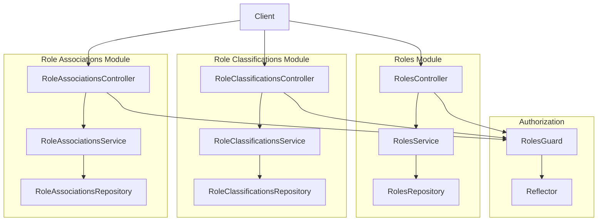
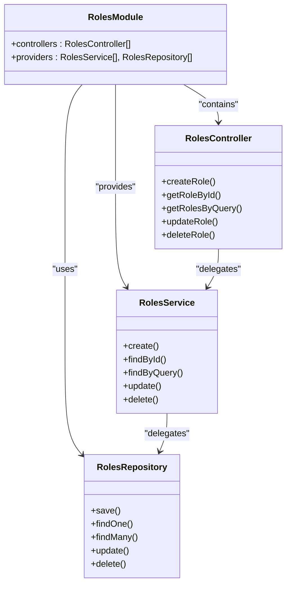
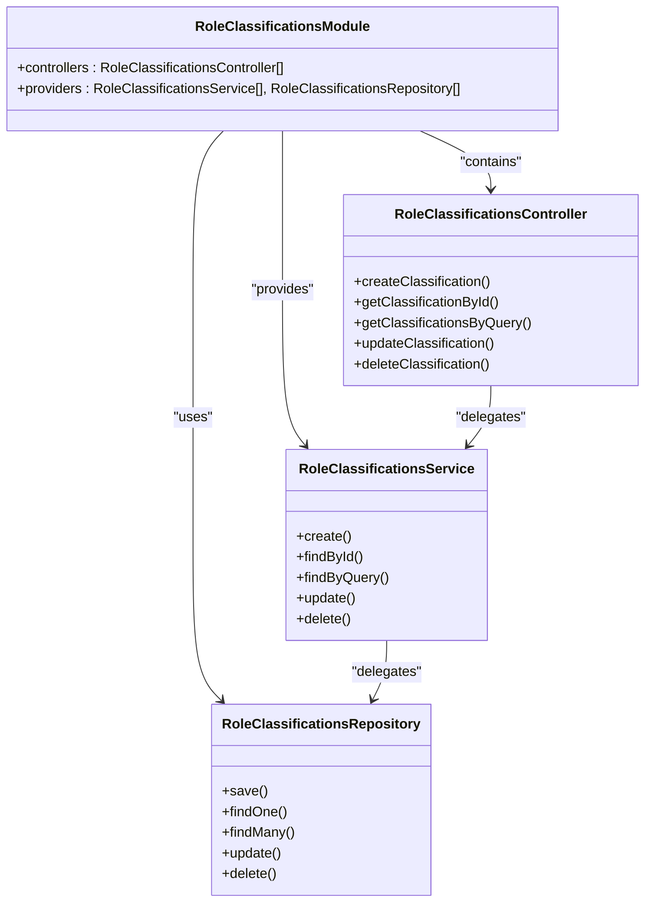
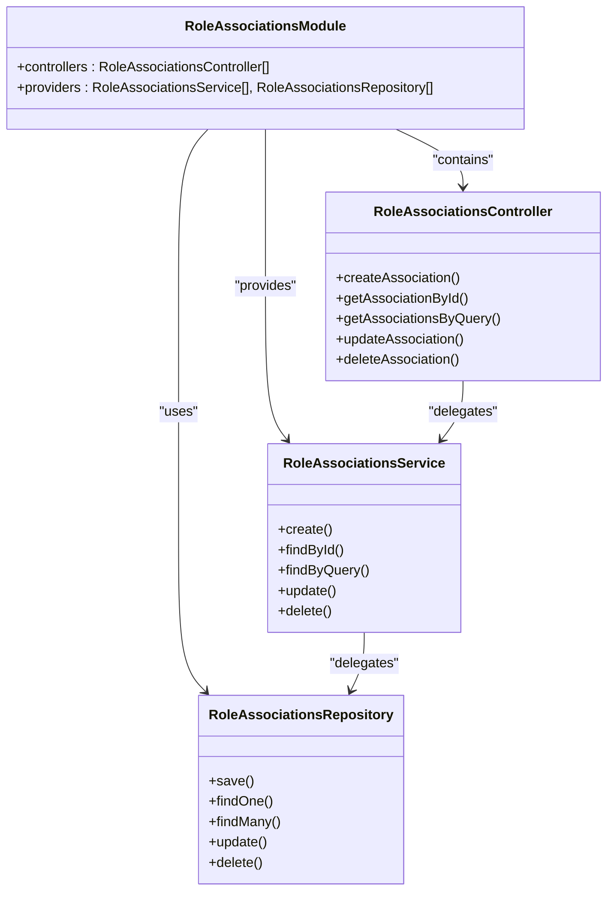
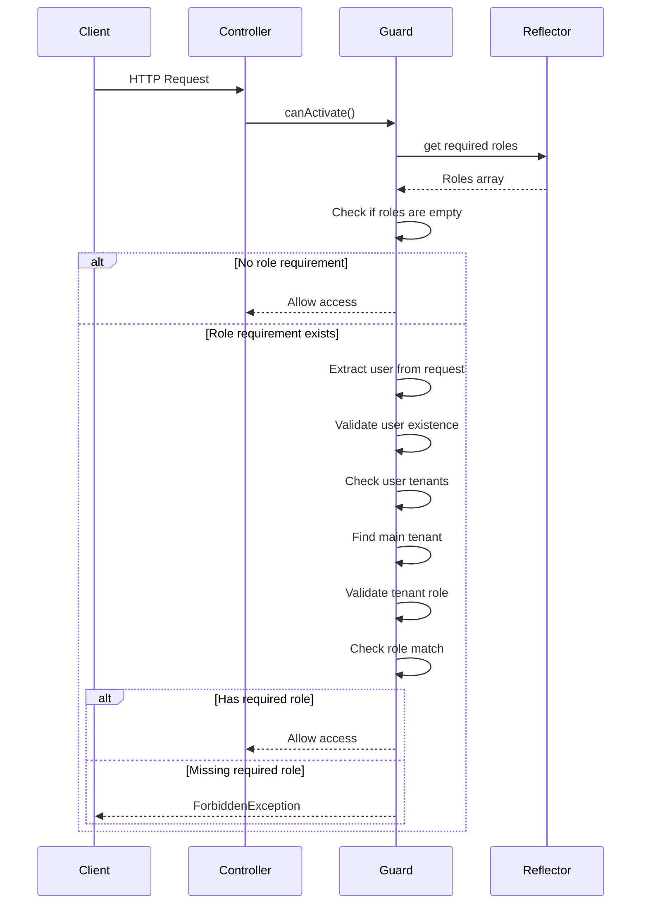
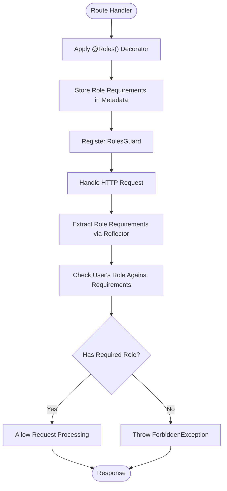
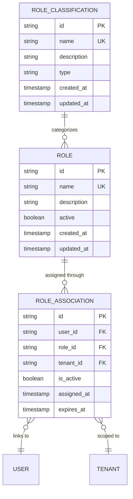

# Roles & Permissions Module

<cite>
**Referenced Files in This Document**   
- [roles.module.ts](file://apps/server/src/module/roles.module.ts)
- [role-classifications.module.ts](file://apps/server/src/module/role-classifications.module.ts)
- [role-associations.module.ts](file://apps/server/src/module/role-associations.module.ts)
- [roles.guard.ts](file://apps/server/src/shared/guard/roles.guard.ts)
- [roles.decorator.ts](file://packages/decorator/src/roles.decorator.ts)
- [role.entity.ts](file://packages/entity/src/role.entity.ts)
- [role-classification.entity.ts](file://packages/entity/src/role-classification.entity.ts)
- [role-association.entity.ts](file://packages/entity/src/role-association.entity.ts)
</cite>

## Table of Contents
1. [Introduction](#introduction)
2. [Core Components](#core-components)
3. [Architecture Overview](#architecture-overview)
4. [Detailed Component Analysis](#detailed-component-analysis)
5. [Role-Based Access Control Implementation](#role-based-access-control-implementation)
6. [Entity Relationships](#entity-relationships)
7. [Common Issues and Solutions](#common-issues-and-solutions)
8. [Conclusion](#conclusion)

## Introduction
The Roles & Permissions Module in prj-core implements a comprehensive role-based access control (RBAC) system that enables fine-grained authorization management across the application. This module provides the infrastructure for defining roles, assigning them to users, and enforcing access policies through decorators and guards. The system is designed to be flexible and scalable, supporting hierarchical roles, permission inheritance, and dynamic role assignment. This documentation provides a detailed analysis of the implementation, focusing on the core components, their relationships, and practical usage patterns.

## Core Components
The Roles & Permissions Module consists of three main module components and a guard mechanism that work together to provide a complete RBAC solution. The module structure follows NestJS conventions with clear separation of concerns between controllers, services, and repositories. The implementation leverages decorators for declarative role specification and guards for runtime permission enforcement.

**Section sources**
- [roles.module.ts](file://apps/server/src/module/roles.module.ts#L1-L9)
- [role-classifications.module.ts](file://apps/server/src/module/role-classifications.module.ts#L1-L13)
- [role-associations.module.ts](file://apps/server/src/module/role-associations.module.ts#L1-L13)

## Architecture Overview
The RBAC architecture in prj-core follows a modular design pattern with distinct components responsible for different aspects of role management. The system is built on three interconnected modules that handle roles, role classifications, and role associations respectively. These modules expose RESTful endpoints through controllers, implement business logic in services, and manage data persistence through repositories. The authorization enforcement is handled by a dedicated RolesGuard that intercepts requests and validates user permissions against required roles.

**Diagram sources**
- [roles.module.ts](file://apps/server/src/module/roles.module.ts#L1-L9)
- [role-classifications.module.ts](file://apps/server/src/module/role-classifications.module.ts#L1-L13)
- [role-associations.module.ts](file://apps/server/src/module/role-associations.module.ts#L1-L13)

## Detailed Component Analysis

### Roles Module Analysis
The RolesModule is the primary component responsible for managing role entities within the system. It follows the NestJS module pattern by declaring controllers and providers (services and repositories) that handle role-related operations. The module imports necessary components from the shared package, promoting code reuse and consistency across the application.

**Diagram sources**
- [roles.module.ts](file://apps/server/src/module/roles.module.ts#L1-L9)

**Section sources**
- [roles.module.ts](file://apps/server/src/module/roles.module.ts#L1-L9)

### Role Classifications Module Analysis
The RoleClassificationsModule manages the classification of roles within the system, providing a way to categorize roles based on their purpose or scope. This module follows the same architectural pattern as the RolesModule, with a controller for handling HTTP requests, a service for business logic, and a repository for data access operations.

**Diagram sources**
- [role-classifications.module.ts](file://apps/server/src/module/role-classifications.module.ts#L1-L13)

**Section sources**
- [role-classifications.module.ts](file://apps/server/src/module/role-classifications.module.ts#L1-L13)

### Role Associations Module Analysis
The RoleAssociationsModule handles the association between roles and other entities in the system, enabling the assignment of roles to users or groups. This module provides the functionality needed to establish and manage these relationships, which are essential for implementing the RBAC system.

**Diagram sources**
- [role-associations.module.ts](file://apps/server/src/module/role-associations.module.ts#L1-L13)

**Section sources**
- [role-associations.module.ts](file://apps/server/src/module/role-associations.module.ts#L1-L13)

## Role-Based Access Control Implementation

### Roles Guard Implementation
The RolesGuard is the core component responsible for enforcing role-based access control in the application. It implements NestJS's CanActivate interface and uses the Reflector utility to extract role requirements from route handlers. The guard performs a series of validation checks to ensure that the requesting user has the necessary permissions to access the protected resource.

**Diagram sources**
- [roles.guard.ts](file://apps/server/src/shared/guard/roles.guard.ts#L1-L59)

**Section sources**
- [roles.guard.ts](file://apps/server/src/shared/guard/roles.guard.ts#L1-L59)

### Role Decorator Usage
The @Roles() decorator is used to specify the required roles for accessing specific routes or methods. When combined with the RolesGuard, it enables declarative role-based authorization. The decorator works by attaching metadata to the route handler, which is then read by the guard during request processing.

**Diagram sources**
- [roles.guard.ts](file://apps/server/src/shared/guard/roles.guard.ts#L1-L59)

## Entity Relationships
The RBAC system in prj-core is built on three core entities that work together to create a flexible permission system: RoleEntity, RoleClassifications, and RoleAssociations. These entities establish a hierarchical relationship that enables fine-grained control over user permissions.

**Diagram sources**
- [role.entity.ts](file://packages/entity/src/role.entity.ts)
- [role-classification.entity.ts](file://packages/entity/src/role-classification.entity.ts)
- [role-association.entity.ts](file://packages/entity/src/role-association.entity.ts)

**Section sources**
- [role.entity.ts](file://packages/entity/src/role.entity.ts)
- [role-classification.entity.ts](file://packages/entity/src/role-classification.entity.ts)
- [role-association.entity.ts](file://packages/entity/src/role-association.entity.ts)

## Common Issues and Solutions

### Hierarchical Roles and Permission Inheritance
The current implementation addresses hierarchical roles through the role classification system, which allows roles to be categorized and grouped. This enables permission inheritance where higher-level roles automatically have the permissions of lower-level roles within the same classification. The system uses the role classification to establish these hierarchies and determine permission inheritance patterns.

### Dynamic Role Assignment
Dynamic role assignment is supported through the RoleAssociations module, which manages the relationship between users and roles. The system allows for runtime assignment and revocation of roles through API endpoints, enabling flexible permission management. The role associations include timestamps for assignment and expiration, supporting time-limited role assignments.

### Scalability Considerations
The RBAC implementation is designed with scalability in mind. The separation of roles, classifications, and associations into distinct modules allows for independent scaling of each component. The use of efficient database queries in the repositories and caching mechanisms in the services ensures that permission checks remain performant even with large numbers of users and roles.

## Conclusion
The Roles & Permissions Module in prj-core provides a robust and flexible RBAC system that effectively manages user access control. The modular architecture separates concerns between role definition, classification, and assignment, while the guard-based enforcement mechanism ensures consistent authorization across the application. The system supports hierarchical roles, dynamic assignment, and scalable permission management, making it suitable for complex applications with diverse access control requirements. By leveraging NestJS decorators and guards, the implementation provides a clean and intuitive API for protecting routes and enforcing role-based access policies.