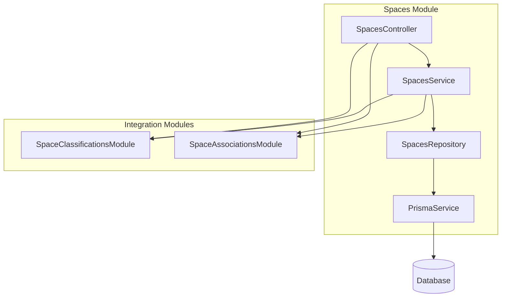
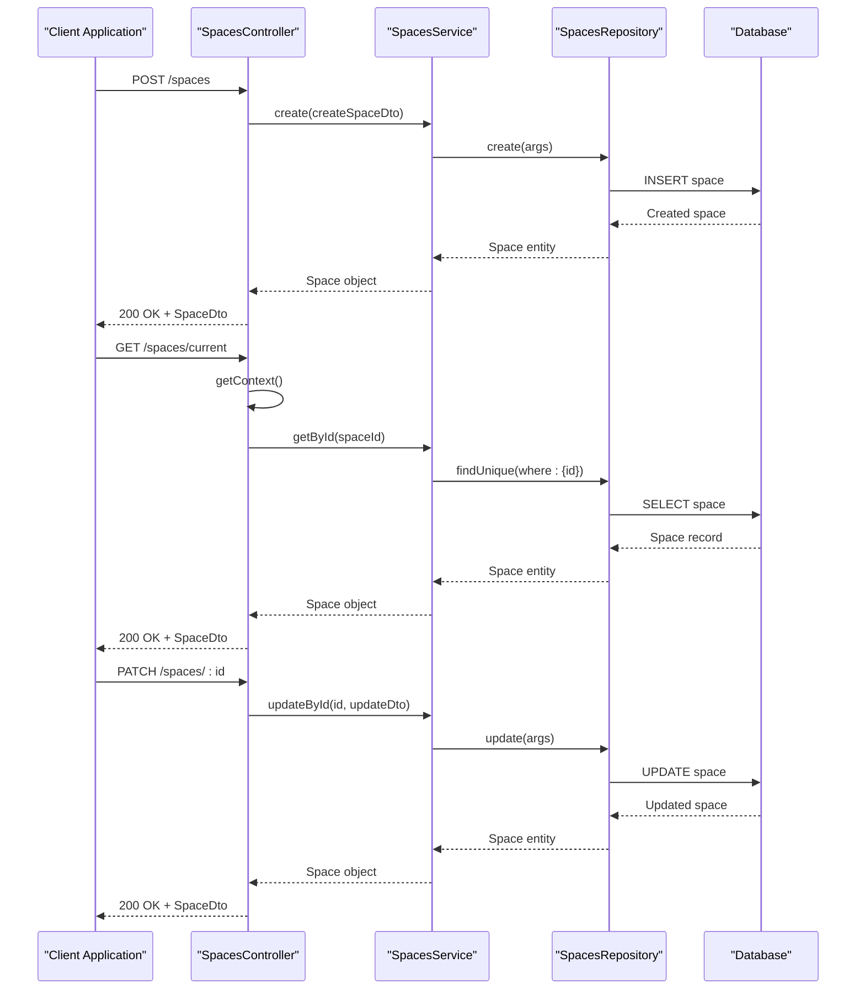
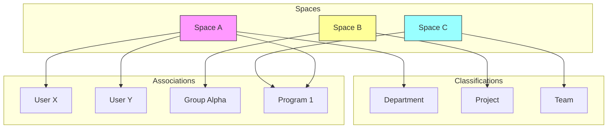

# Spaces Module

<cite>
**Referenced Files in This Document**   
- [spaces.module.ts](file://apps/server/src/module/spaces.module.ts)
- [space-associations.module.ts](file://apps/server/src/module/space-associations.module.ts)
- [space-classifications.module.ts](file://apps/server/src/module/space-classifications.module.ts)
- [spaces.controller.ts](file://apps/server/src/shared/controller/resources/spaces.controller.ts)
- [space-associations.controller.ts](file://apps/server/src/shared/controller/resources/space-associations.controller.ts)
- [space-classifications.controller.ts](file://apps/server/src/shared/controller/resources/space-classifications.controller.ts)
- [spaces.service.ts](file://apps/server/src/shared/service/resources/spaces.service.ts)
- [space-associations.service.ts](file://apps/server/src/shared/service/resources/space-associations.service.ts)
- [space-classifications.service.ts](file://apps/server/src/shared/service/resources/space-classifications.service.ts)
- [spaces.repository.ts](file://apps/server/src/shared/repository/spaces.repository.ts)
- [space-associations.repository.ts](file://apps/server/src/shared/repository/space-associations.repository.ts)
- [space-classifications.repository.ts](file://apps/server/src/shared/repository/space-classifications.repository.ts)
</cite>

## Table of Contents
1. [Introduction](#introduction)
2. [Module Architecture](#module-architecture)
3. [Core Components](#core-components)
4. [CRUD Operations](#crud-operations)
5. [Classification and Association Integration](#classification-and-association-integration)
6. [Access Control and Multi-Tenancy](#access-control-and-multi-tenancy)
7. [Space Hierarchy and Relationships](#space-hierarchy-and-relationships)
8. [Performance Considerations](#performance-considerations)
9. [Common Issues and Solutions](#common-issues-and-solutions)
10. [Conclusion](#conclusion)

## Introduction

The Spaces Module in prj-core serves as the central component for managing spatial entities within the application. It provides a comprehensive system for creating, retrieving, updating, and deleting spaces while maintaining relationships with users, tenants, and other entities. The module implements a robust multi-tenancy architecture that ensures proper resource isolation and access scoping across different organizational units.

Spaces function as primary organizational containers within the application, enabling structured data management and access control. The module integrates with classification and association patterns to provide flexible categorization and linking capabilities, allowing spaces to be organized according to business needs and user requirements.

This documentation provides detailed insights into the implementation of the Spaces Module, covering its architecture, core functionality, integration points, and best practices for usage. The content is designed to be accessible to developers new to the system while providing technical depth for experienced developers working on complex implementations.

## Module Architecture

The Spaces Module follows a clean architectural pattern with clear separation of concerns between controllers, services, and repositories. This layered approach enables maintainability, testability, and scalability of the spatial entity management system.



**Diagram sources**
- [spaces.module.ts](file://apps/server/src/module/spaces.module.ts)
- [spaces.controller.ts](file://apps/server/src/shared/controller/resources/spaces.controller.ts)
- [spaces.service.ts](file://apps/server/src/shared/service/resources/spaces.service.ts)
- [spaces.repository.ts](file://apps/server/src/shared/repository/spaces.repository.ts)

**Section sources**
- [spaces.module.ts](file://apps/server/src/module/spaces.module.ts)
- [space-associations.module.ts](file://apps/server/src/module/space-associations.module.ts)
- [space-classifications.module.ts](file://apps/server/src/module/space-classifications.module.ts)

## Core Components

The Spaces Module consists of three primary components that follow the NestJS architectural pattern: Controller, Service, and Repository. Each component has a specific responsibility in the request processing pipeline.

The **SpacesController** handles HTTP requests and responses, serving as the entry point for all space-related operations. It validates incoming requests, coordinates with the service layer, and formats responses according to API specifications. The controller implements comprehensive logging for debugging and monitoring purposes, capturing detailed information about request processing and error conditions.

The **SpacesService** contains the business logic for space management operations. It orchestrates data retrieval and manipulation, enforces business rules, and coordinates with other services as needed. The service layer abstracts the complexity of data operations from the controller, providing a clean interface for space management functionality.

The **SpacesRepository** provides an abstraction over the database operations, encapsulating all data access logic. It uses Prisma as the underlying ORM and implements a comprehensive set of CRUD operations with proper error handling and logging. The repository pattern ensures that database interactions are centralized and consistent across the application.

```mermaid
classDiagram
class SpacesController {
+getCurrentSpace() Promise~SpaceDto~
+createSpace(createSpaceDto) Promise~SpaceDto~
+getSpace(spaceId) Promise~SpaceDto~
+updateSpace(spaceId, updateSpaceDto) Promise~SpaceDto~
+removeSpace(spaceId) Promise~SpaceDto~
+deleteSpace(spaceId) Promise~SpaceDto~
+getSpacesByQuery(query) Promise~ResponseEntity~
}
class SpacesService {
+create(createSpaceDto) Promise~Space~
+getById(id) Promise~Space~
+updateById(id, updateSpaceDto) Promise~Space~
+deleteById(id) Promise~Space~
+removeById(id) Promise~Space~
+getManyByQuery(query) Promise~{count, spaces}~
}
class SpacesRepository {
+create(args) Promise~Space~
+upsert(args) Promise~Space~
+update(args) Promise~Space~
+updateMany(args) Promise~any~
+delete(args) Promise~Space~
+findMany(args) Promise~Space[]~
+findFirst(args) Promise~Space~
+findUnique(args) Promise~Space~
+createManyAndReturn(args) Promise~Space[]~
+deleteMany(args) Promise~any~
+aggregate(args) Promise~any~
+count(args) Promise~number~
}
SpacesController --> SpacesService : "uses"
SpacesService --> SpacesRepository : "uses"
SpacesRepository --> PrismaService : "uses"
```

**Diagram sources**
- [spaces.controller.ts](file://apps/server/src/shared/controller/resources/spaces.controller.ts#L29-L168)
- [spaces.service.ts](file://apps/server/src/shared/service/resources/spaces.service.ts#L6-L51)
- [spaces.repository.ts](file://apps/server/src/shared/repository/spaces.repository.ts#L9-L84)

**Section sources**
- [spaces.controller.ts](file://apps/server/src/shared/controller/resources/spaces.controller.ts)
- [spaces.service.ts](file://apps/server/src/shared/service/resources/spaces.service.ts)
- [spaces.repository.ts](file://apps/server/src/shared/repository/spaces.repository.ts)

## CRUD Operations

The Spaces Module provides a complete set of CRUD (Create, Read, Update, Delete) operations for managing spatial entities. These operations are exposed through RESTful endpoints that follow consistent patterns for request and response handling.

The **creation workflow** begins with a POST request to the spaces endpoint, where the SpacesController receives a CreateSpaceDto object containing the space configuration. The controller delegates to the SpacesService, which in turn uses the SpacesRepository to persist the space entity to the database. The repository leverages Prisma's create operation to insert the new space record with all specified properties.

**Retrieval operations** include both single and multiple space queries. The GET /spaces/:spaceId endpoint retrieves a specific space by its identifier, while the GET /spaces endpoint supports query parameters for filtering, sorting, and pagination. The getCurrentSpace endpoint provides a specialized retrieval method that returns the space associated with the current tenant context, ensuring that users can easily access their active workspace.

**Update operations** support partial modifications through the PATCH method. The SpacesService implements updateById to modify specific space properties without affecting other fields. The module distinguishes between soft and hard deletion: removeById sets a removedAt timestamp (soft delete) while deleteById permanently removes the space record from the database.



**Diagram sources**
- [spaces.controller.ts](file://apps/server/src/shared/controller/resources/spaces.controller.ts#L110-L158)
- [spaces.service.ts](file://apps/server/src/shared/service/resources/spaces.service.ts#L9-L49)
- [spaces.repository.ts](file://apps/server/src/shared/repository/spaces.repository.ts#L16-L84)

**Section sources**
- [spaces.controller.ts](file://apps/server/src/shared/controller/resources/spaces.controller.ts)
- [spaces.service.ts](file://apps/server/src/shared/service/resources/spaces.service.ts)

## Classification and Association Integration

The Spaces Module integrates with specialized modules for classification and association to provide enhanced organizational capabilities. These integrations enable spaces to be categorized, tagged, and linked to other entities within the system.

The **SpaceClassificationsModule** provides functionality for categorizing spaces according to predefined types or custom categories. This allows for logical grouping of spaces based on purpose, department, project, or other business criteria. The classification system supports hierarchical categorization, enabling complex organizational structures to be represented accurately.

The **SpaceAssociationsModule** enables spaces to be linked with other entities such as users, groups, programs, and timelines. These associations establish relationships that define access rights, ownership, and contextual connections between spaces and other system components. The association pattern supports both one-to-one and one-to-many relationships, providing flexibility in how spaces are connected to other entities.



**Diagram sources**
- [space-classifications.module.ts](file://apps/server/src/module/space-classifications.module.ts)
- [space-associations.module.ts](file://apps/server/src/module/space-associations.module.ts)
- [space-classifications.controller.ts](file://apps/server/src/shared/controller/resources/space-classifications.controller.ts)
- [space-associations.controller.ts](file://apps/server/src/shared/controller/resources/space-associations.controller.ts)

**Section sources**
- [space-classifications.module.ts](file://apps/server/src/module/space-classifications.module.ts)
- [space-associations.module.ts](file://apps/server/src/module/space-associations.module.ts)

## Access Control and Multi-Tenancy

The Spaces Module implements a robust multi-tenancy model that ensures proper isolation of resources between different tenants while enabling shared access within authorized contexts. This architecture is critical for maintaining data security and privacy in a multi-organizational environment.

Access control is enforced through the ContextService, which provides tenant and user context information to the SpacesController. The getCurrentSpace endpoint demonstrates this pattern by retrieving tenant information from the context and validating that a valid space association exists. If the tenant context is missing or incomplete, the system returns appropriate error responses to prevent unauthorized access.

The module supports both tenant-scoped and cross-tenant operations, with appropriate permission checks applied based on the operation type and user privileges. Space creation is typically restricted to users with administrative privileges within a tenant, while space access is governed by role-based access control (RBAC) policies that define what actions users can perform on specific spaces.

Resource isolation is achieved through database-level filtering, where all space queries are automatically scoped to the current tenant context. This prevents accidental or malicious access to spaces belonging to other tenants, even if direct space identifiers are known. The repository layer enforces these scoping rules consistently across all data access operations.

**Section sources**
- [spaces.controller.ts](file://apps/server/src/shared/controller/resources/spaces.controller.ts#L37-L108)
- [context.service.ts](file://apps/server/src/shared/service/context.service.ts)

## Space Hierarchy and Relationships

The Spaces Module supports hierarchical organization of spaces through parent-child relationships and network-like associations. This flexible structure enables the representation of complex organizational topologies while maintaining data integrity and access control.

Space hierarchies allow for the creation of nested organizational structures where child spaces inherit certain properties and permissions from their parent spaces. This inheritance model simplifies administration and ensures consistency across related spaces. The hierarchy can be traversed in both directions, enabling operations that affect entire branches of the space tree.

Relationships between spaces are managed through the SpaceAssociations module, which provides APIs for creating, querying, and modifying connections between spaces. These associations can represent various types of relationships such as dependencies, collaborations, or workflow sequences. The association system supports metadata on relationships, allowing additional context to be stored about the nature and purpose of each connection.

The module also implements referential integrity constraints to maintain the consistency of space relationships. When a space is deleted, associated relationships are automatically cleaned up to prevent orphaned records. For soft-deleted spaces, relationships are preserved to maintain historical context while preventing active usage.

**Section sources**
- [spaces.repository.ts](file://apps/server/src/shared/repository/spaces.repository.ts)
- [space-associations.service.ts](file://apps/server/src/shared/service/resources/space-associations.service.ts)
- [space-associations.repository.ts](file://apps/server/src/shared/repository/space-associations.repository.ts)

## Performance Considerations

The Spaces Module incorporates several performance optimization strategies to ensure responsive operations even with large datasets and high concurrency. These optimizations are implemented at multiple levels of the architecture to address different performance challenges.

The repository layer implements comprehensive logging for all database operations, enabling monitoring of query performance and identification of potential bottlenecks. Each operation includes debug-level logging that captures the nature of the database interaction, allowing for detailed performance analysis and optimization.

Query optimization is achieved through the use of Prisma's efficient query builder and proper indexing strategies. The getManyByQuery method in the SpacesService converts QuerySpaceDto parameters into optimized database queries that leverage indexes for fast retrieval. The count operation is separated from data retrieval to minimize database load when pagination information is needed without fetching all records.

Caching strategies are implicitly supported through the service layer architecture, which could be extended to include response caching for frequently accessed spaces. The current implementation focuses on database-level optimizations, but the modular design allows for the addition of caching layers without significant refactoring.

**Section sources**
- [spaces.repository.ts](file://apps/server/src/shared/repository/spaces.repository.ts)
- [spaces.service.ts](file://apps/server/src/shared/service/resources/spaces.service.ts)

## Common Issues and Solutions

The Spaces Module addresses several common challenges in spatial entity management through its design and implementation patterns. Understanding these issues and their solutions helps developers effectively utilize the module and troubleshoot problems.

**Space hierarchy management** can become complex in large organizations with many nested spaces. The module addresses this by providing clear APIs for traversing hierarchies and managing parent-child relationships. The use of consistent error handling and validation prevents the creation of invalid hierarchy structures.

**Access scoping** issues are mitigated through the context-based security model that automatically enforces tenant boundaries. The getCurrentSpace implementation demonstrates proper validation of context information, preventing access to spaces outside the current tenant scope.

**Resource isolation** is ensured through database-level filtering and proper multi-tenancy implementation. The repository pattern centralizes data access logic, making it easier to maintain consistent isolation rules across all operations.

For **performance optimization**, the module implements efficient querying patterns and separates count operations from data retrieval. The use of proper indexing and query optimization techniques ensures that space operations remain responsive even with large datasets.

When implementing custom space management logic, developers should follow the existing patterns for error handling, logging, and data validation to maintain consistency with the rest of the system. The service layer should contain business logic, while the repository handles data access concerns.

**Section sources**
- [spaces.controller.ts](file://apps/server/src/shared/controller/resources/spaces.controller.ts)
- [spaces.service.ts](file://apps/server/src/shared/service/resources/spaces.service.ts)
- [spaces.repository.ts](file://apps/server/src/shared/repository/spaces.repository.ts)

## Conclusion

The Spaces Module in prj-core provides a comprehensive solution for managing spatial entities within a multi-tenant application environment. Its well-structured architecture, with clear separation of concerns between controller, service, and repository layers, enables maintainable and scalable space management functionality.

The module's implementation of CRUD operations, integration with classification and association patterns, and robust multi-tenancy support make it a powerful tool for organizing and managing application resources. The attention to performance optimization, error handling, and security considerations demonstrates a mature approach to enterprise-grade software development.

By following the patterns established in this module, developers can effectively manage spatial entities while ensuring data integrity, security, and performance. The modular design allows for extension and customization to meet specific business requirements while maintaining compatibility with the overall system architecture.