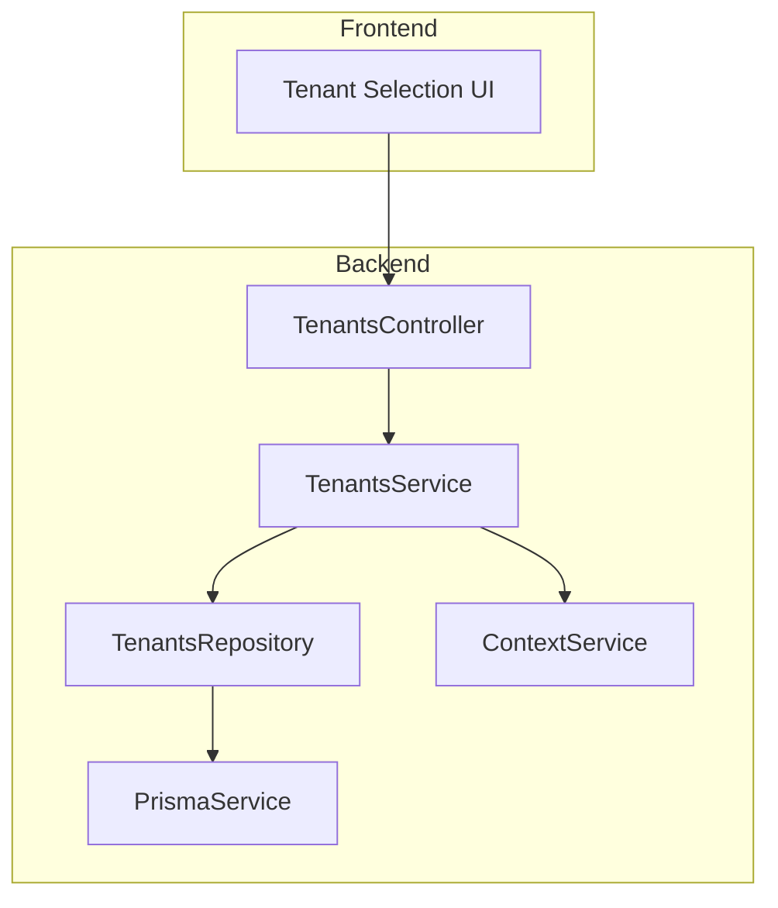
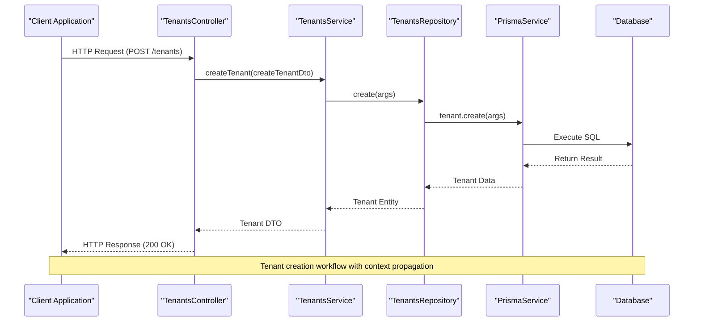
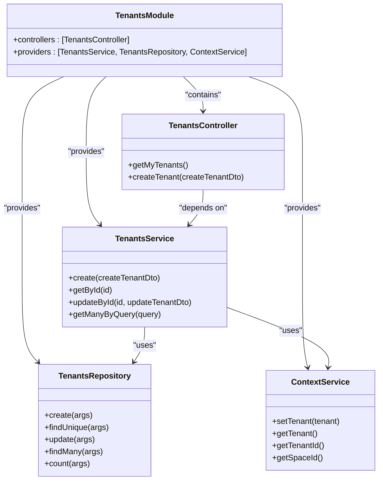
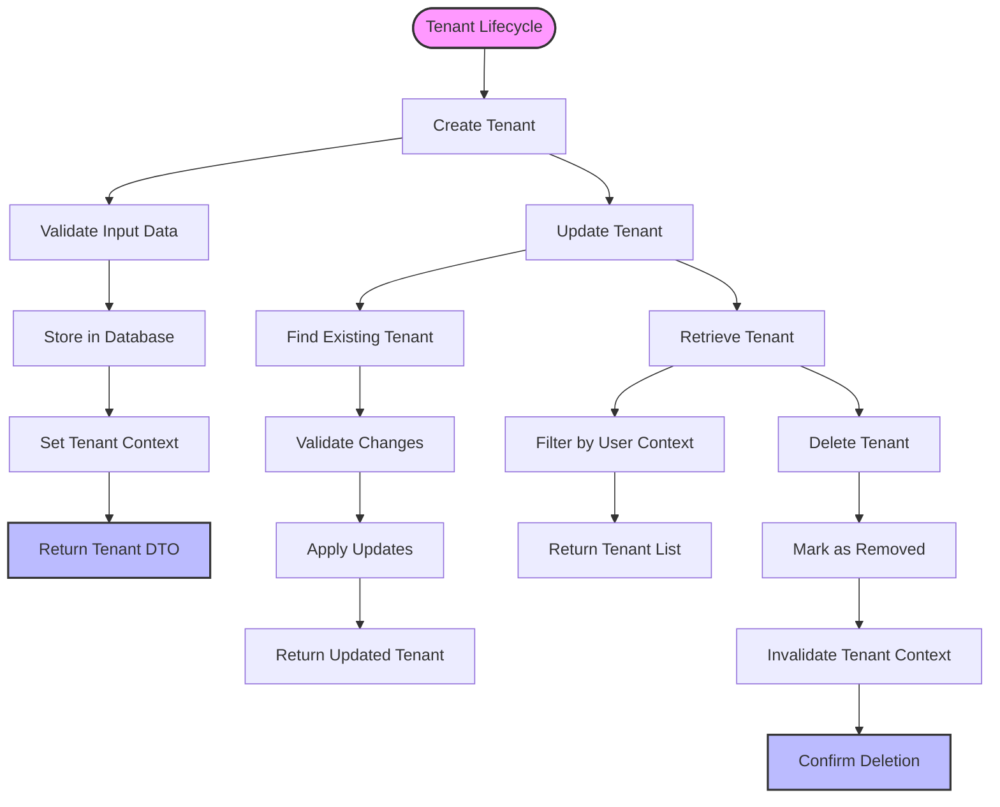
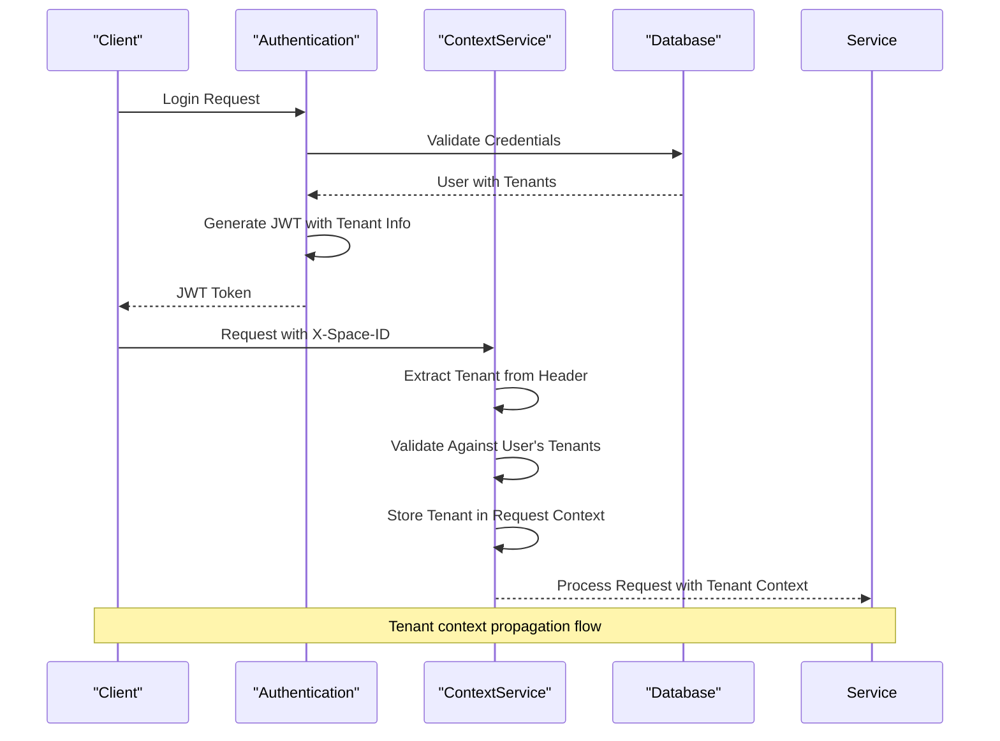
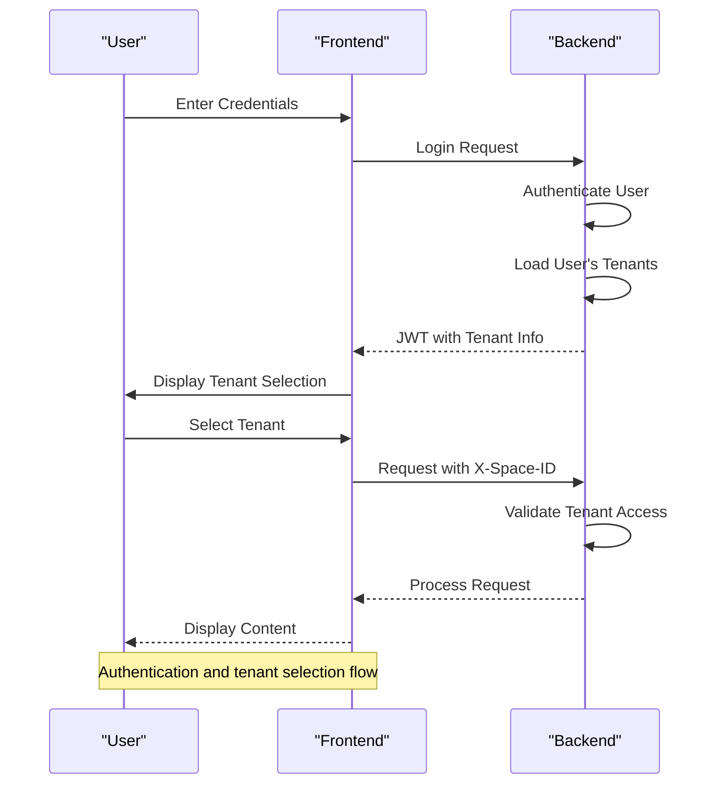
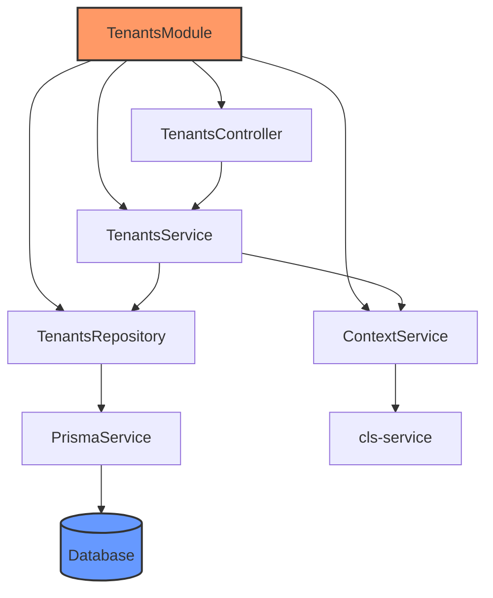
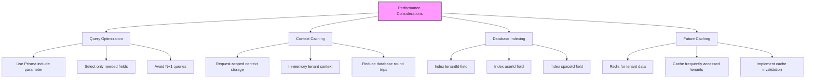

# Tenants Module

<cite>
**Referenced Files in This Document**   
- [tenants.module.ts](file://apps/server/src/module/tenants.module.ts)
- [tenants.controller.ts](file://apps/server/src/shared/controller/resources/tenants.controller.ts)
- [tenants.service.ts](file://apps/server/src/shared/service/resources/tenants.service.ts)
- [tenants.repository.ts](file://apps/server/src/shared/repository/tenants.repository.ts)
- [context.service.ts](file://apps/server/src/shared/service/utils/context.service.ts)
- [request-context.interceptor.ts](file://apps/server/src/shared/interceptor/request-context.interceptor.ts)
- [jwt.strategy.ts](file://apps/server/src/shared/strategy/jwt.strategy.ts)
- [tenant.entity.ts](file://packages/entity/src/tenant.entity.ts)
- [select-tenant.dto.ts](file://packages/dto/src/select-tenant.dto.ts)
- [TenantSelectRouteComponent](file://apps/admin/src/routes/admin/auth/login/tenant-select.tsx)
</cite>

## Table of Contents
1. [Introduction](#introduction)
2. [Project Structure](#project-structure)
3. [Core Components](#core-components)
4. [Architecture Overview](#architecture-overview)
5. [Detailed Component Analysis](#detailed-component-analysis)
6. [Dependency Analysis](#dependency-analysis)
7. [Performance Considerations](#performance-considerations)
8. [Troubleshooting Guide](#troubleshooting-guide)
9. [Conclusion](#conclusion)

## Introduction

The Tenants Module in prj-core forms the foundation of the multi-tenancy architecture, enabling the system to support multiple isolated tenant environments within a single application instance. This document provides a comprehensive analysis of the implementation details, covering tenant lifecycle management, isolation mechanisms, and selection workflows. The module is designed to ensure secure data separation between tenants while providing efficient context propagation across requests.

The multi-tenancy architecture implemented in prj-core follows a shared database, shared schema approach with row-level isolation based on tenant identifiers. This approach balances resource efficiency with strong data isolation guarantees. The module integrates seamlessly with authentication flows, maintaining tenant context throughout the request lifecycle and preventing cross-tenant data leakage.

This documentation will explore the technical implementation of the Tenants Module, including concrete examples from the codebase that demonstrate tenant creation, context propagation, and scoped data access patterns. It will also address common issues such as cross-tenant data leakage prevention, tenant-specific configuration, and performance implications of tenant scoping, highlighting the solutions implemented in the code.

**Section sources**
- [tenants.module.ts](file://apps/server/src/module/tenants.module.ts#L1-L13)

## Project Structure

The Tenants Module is organized following a clean architecture pattern with clear separation of concerns. The module components are distributed across different directories based on their responsibilities:

- **Module Definition**: Located in `apps/server/src/module/tenants.module.ts`, this file defines the NestJS module that encapsulates the tenants functionality.
- **Controllers**: Implemented in `apps/server/src/shared/controller/resources/tenants.controller.ts`, handling HTTP requests and responses for tenant operations.
- **Services**: Found in `apps/server/src/shared/service/resources/tenants.service.ts`, containing the business logic for tenant management.
- **Repositories**: Located in `apps/server/src/shared/repository/tenants.repository.ts`, responsible for data access operations.
- **Entity Definitions**: Defined in `packages/entity/src/tenant.entity.ts`, representing the tenant data model.
- **Context Management**: Implemented in `apps/server/src/shared/service/utils/context.service.ts` and `apps/server/src/shared/interceptor/request-context.interceptor.ts`, handling tenant context propagation.

The module follows the NestJS framework conventions, with dependency injection used extensively to wire components together. The architecture promotes testability and maintainability by separating concerns and minimizing coupling between components.

**Diagram sources **
- [tenants.module.ts](file://apps/server/src/module/tenants.module.ts#L1-L13)
- [tenants.controller.ts](file://apps/server/src/shared/controller/resources/tenants.controller.ts#L1-L52)
- [tenants.service.ts](file://apps/server/src/shared/service/resources/tenants.service.ts#L1-L64)

**Section sources**
- [tenants.module.ts](file://apps/server/src/module/tenants.module.ts#L1-L13)

## Core Components

The Tenants Module consists of several core components that work together to manage tenant lifecycle and isolation. The primary components include the TenantsModule, TenantsController, TenantsService, TenantsRepository, and ContextService.

The TenantsModule serves as the entry point, defining the module's dependencies and configuring the dependency injection container. It imports and provides the necessary controllers, services, and repositories. The module configuration ensures that all components are properly instantiated and wired together by the NestJS framework.

The TenantsController handles HTTP requests related to tenant operations, exposing endpoints for creating, retrieving, updating, and deleting tenants. It acts as a thin layer that delegates business logic to the TenantsService while handling request validation and response formatting.

The TenantsService contains the core business logic for tenant management, including validation rules, data processing, and coordination between different components. It interacts with the TenantsRepository for data persistence and the ContextService for tenant context management.

The TenantsRepository provides an abstraction over the database operations, encapsulating the data access logic and ensuring consistent interaction with the underlying Prisma ORM. It handles CRUD operations for tenant entities while applying necessary transformations and logging.

The ContextService plays a crucial role in maintaining tenant context across requests, storing and retrieving tenant information in a request-scoped context. This enables tenant-aware operations throughout the request lifecycle without requiring explicit tenant parameters in every method call.

**Section sources**
- [tenants.module.ts](file://apps/server/src/module/tenants.module.ts#L1-L13)
- [tenants.controller.ts](file://apps/server/src/shared/controller/resources/tenants.controller.ts#L1-L52)
- [tenants.service.ts](file://apps/server/src/shared/service/resources/tenants.service.ts#L1-L64)
- [tenants.repository.ts](file://apps/server/src/shared/repository/tenants.repository.ts#L1-L83)
- [context.service.ts](file://apps/server/src/shared/service/utils/context.service.ts#L1-L85)

## Architecture Overview

The Tenants Module implements a multi-layered architecture that follows the principles of clean architecture and domain-driven design. The architecture is designed to ensure separation of concerns, maintainability, and scalability.

At the highest level, the module follows a request-response flow where HTTP requests are processed through a series of layers: Controller → Service → Repository → Database. Each layer has a specific responsibility and communicates with adjacent layers through well-defined interfaces.

The architecture incorporates several key patterns and principles:

1. **Dependency Injection**: All components are registered with the NestJS dependency injection container, allowing for loose coupling and easy testing.
2. **Request Context Propagation**: The ContextService and RequestContextInterceptor work together to maintain tenant context throughout the request lifecycle.
3. **Data Isolation**: Row-level security is implemented through tenant identifiers in database queries, ensuring data isolation between tenants.
4. **Error Handling**: Comprehensive error handling is implemented at multiple levels to provide meaningful feedback and maintain system stability.
5. **Logging**: Strategic logging is implemented to aid debugging and monitoring without compromising performance.

The module integrates with the authentication system through the JWT strategy, which retrieves user information including their associated tenants during token validation. This integration enables seamless tenant context establishment upon successful authentication.

**Diagram sources **
- [tenants.controller.ts](file://apps/server/src/shared/controller/resources/tenants.controller.ts#L1-L52)
- [tenants.service.ts](file://apps/server/src/shared/service/resources/tenants.service.ts#L1-L64)
- [tenants.repository.ts](file://apps/server/src/shared/repository/tenants.repository.ts#L1-L83)

## Detailed Component Analysis

### Tenants Module Analysis

The TenantsModule is implemented as a NestJS module that encapsulates all tenant-related functionality. It uses the @Module decorator to define its components and dependencies. The module imports the ContextService, TenantsController, TenantsRepository, and TenantsService, making them available for dependency injection.

The module configuration specifies the controllers that handle HTTP requests and the providers that offer services and repositories. This declarative approach allows NestJS to automatically resolve dependencies and instantiate the components in the correct order.

The module follows the principle of explicit dependencies, clearly declaring all required components in its configuration. This improves code readability and makes it easier to understand the module's responsibilities and relationships with other parts of the system.

**Diagram sources **
- [tenants.module.ts](file://apps/server/src/module/tenants.module.ts#L1-L13)
- [tenants.controller.ts](file://apps/server/src/shared/controller/resources/tenants.controller.ts#L1-L52)
- [tenants.service.ts](file://apps/server/src/shared/service/resources/tenants.service.ts#L1-L64)
- [tenants.repository.ts](file://apps/server/src/shared/repository/tenants.repository.ts#L1-L83)
- [context.service.ts](file://apps/server/src/shared/service/utils/context.service.ts#L1-L85)

**Section sources**
- [tenants.module.ts](file://apps/server/src/module/tenants.module.ts#L1-L13)

### Tenant Lifecycle Management

The Tenants Module provides comprehensive functionality for managing the complete lifecycle of tenants, from creation to deletion. The lifecycle operations are exposed through well-defined endpoints and implemented with proper validation and error handling.

Tenant creation is handled by the createTenant method in the TenantsController, which accepts a CreateTenantDto containing the necessary information for creating a new tenant. The request is validated using DTO validation decorators, ensuring data integrity before processing. The TenantsService then orchestrates the creation process, delegating to the TenantsRepository for data persistence.

Tenant retrieval operations include getting a specific tenant by ID and retrieving multiple tenants based on query parameters. The getMyTenants endpoint returns all tenants associated with the authenticated user, implementing row-level security by filtering based on the user ID stored in the authentication context.

Tenant updates are performed through the updateById method, which accepts the tenant ID and an UpdateTenantDto containing the fields to be modified. The operation includes proper validation and maintains data consistency by using database transactions when necessary.

Tenant deletion is implemented as a soft delete operation, marking the tenant as removed rather than permanently deleting it from the database. This approach preserves data integrity and allows for potential recovery if needed.

**Diagram sources **
- [tenants.controller.ts](file://apps/server/src/shared/controller/resources/tenants.controller.ts#L1-L52)
- [tenants.service.ts](file://apps/server/src/shared/service/resources/tenants.service.ts#L1-L64)
- [tenants.repository.ts](file://apps/server/src/shared/repository/tenants.repository.ts#L1-L83)

**Section sources**
- [tenants.controller.ts](file://apps/server/src/shared/controller/resources/tenants.controller.ts#L1-L52)
- [tenants.service.ts](file://apps/server/src/shared/service/resources/tenants.service.ts#L1-L64)
- [tenants.repository.ts](file://apps/server/src/shared/repository/tenants.repository.ts#L1-L83)

### Tenant Isolation and Context Propagation

The Tenants Module implements a robust tenant isolation mechanism that ensures data separation between different tenants while maintaining efficient context propagation across requests. The isolation is achieved through a combination of database-level constraints and application-level context management.

At the database level, tenant isolation is enforced through foreign key relationships and query filtering. Each tenant is associated with a specific space and user, creating a hierarchical structure that prevents cross-tenant data access. The Prisma ORM is used to generate type-safe database queries that automatically include tenant context in WHERE clauses.

The context propagation mechanism is implemented using the ContextService and RequestContextInterceptor. When a request is received, the RequestContextInterceptor extracts the tenant context from the X-Space-ID header and stores it in a request-scoped context using the cls-service library. This context is then accessible throughout the request lifecycle via the ContextService.

The JWT authentication strategy plays a crucial role in tenant context establishment. During token validation, the user's associated tenants are loaded from the database and included in the authentication payload. This allows the system to present the user with their available tenants upon login and establish the appropriate context for subsequent requests.

**Diagram sources **
- [context.service.ts](file://apps/server/src/shared/service/utils/context.service.ts#L1-L85)
- [request-context.interceptor.ts](file://apps/server/src/shared/interceptor/request-context.interceptor.ts#L1-L88)
- [jwt.strategy.ts](file://apps/server/src/shared/strategy/jwt.strategy.ts#L1-L118)

**Section sources**
- [context.service.ts](file://apps/server/src/shared/service/utils/context.service.ts#L1-L85)
- [request-context.interceptor.ts](file://apps/server/src/shared/interceptor/request-context.interceptor.ts#L1-L88)
- [jwt.strategy.ts](file://apps/server/src/shared/strategy/jwt.strategy.ts#L1-L118)

### Integration with Authentication Flows

The Tenants Module is tightly integrated with the authentication system to provide a seamless user experience while maintaining security and data isolation. The integration occurs at multiple levels, from initial login to ongoing request processing.

During the authentication process, the JWT strategy retrieves the user's associated tenants when validating the token. This information is included in the authentication payload, allowing the frontend to present the user with their available tenants after successful login. The main tenant is also identified and stored in the response for automatic context establishment.

The authentication flow includes a tenant selection step where users choose which tenant to access. This is implemented through the TenantSelectPage component in the admin application, which displays the user's available tenants and allows them to select one. Upon selection, the chosen tenant's context is established for subsequent requests.

The integration also handles edge cases such as users with no tenants or invalid tenant selections. In these cases, appropriate error messages are returned, and the system maintains a secure state by not allowing access to unauthorized resources.

**Diagram sources **
- [jwt.strategy.ts](file://apps/server/src/shared/strategy/jwt.strategy.ts#L1-L118)
- [auth.controller.ts](file://apps/server/src/shared/controller/domains/auth.controller.ts#L135-L177)
- [TenantSelectRouteComponent](file://apps/admin/src/routes/admin/auth/login/tenant-select.tsx#L1-L50)

**Section sources**
- [jwt.strategy.ts](file://apps/server/src/shared/strategy/jwt.strategy.ts#L1-L118)
- [auth.controller.ts](file://apps/server/src/shared/controller/domains/auth.controller.ts#L135-L177)
- [TenantSelectRouteComponent](file://apps/admin/src/routes/admin/auth/login/tenant-select.tsx#L1-L50)

## Dependency Analysis

The Tenants Module has a well-defined dependency structure that follows the principles of dependency inversion and loose coupling. The module depends on several core services and libraries that provide essential functionality.

The primary dependencies include:

1. **NestJS Framework**: The module leverages NestJS for dependency injection, routing, and middleware functionality.
2. **Prisma ORM**: Used for database operations and type-safe queries.
3. **cls-service**: Provides request-scoped context storage for tenant context propagation.
4. **class-transformer**: Used for DTO transformation and serialization.
5. **passport-jwt**: Implements JWT-based authentication strategy.

The module's dependency graph shows a clear hierarchy with the TenantsModule at the top, depending on controllers, services, repositories, and utility classes. The services depend on repositories for data access and context services for tenant context management. The repositories depend on the Prisma service for database operations.

This dependency structure enables testability by allowing components to be mocked or stubbed during testing. It also promotes maintainability by isolating changes to specific components and minimizing ripple effects across the system.

**Diagram sources **
- [tenants.module.ts](file://apps/server/src/module/tenants.module.ts#L1-L13)
- [tenants.controller.ts](file://apps/server/src/shared/controller/resources/tenants.controller.ts#L1-L52)
- [tenants.service.ts](file://apps/server/src/shared/service/resources/tenants.service.ts#L1-L64)
- [tenants.repository.ts](file://apps/server/src/shared/repository/tenants.repository.ts#L1-L83)
- [context.service.ts](file://apps/server/src/shared/service/utils/context.service.ts#L1-L85)

**Section sources**
- [tenants.module.ts](file://apps/server/src/module/tenants.module.ts#L1-L13)
- [tenants.controller.ts](file://apps/server/src/shared/controller/resources/tenants.controller.ts#L1-L52)
- [tenants.service.ts](file://apps/server/src/shared/service/resources/tenants.service.ts#L1-L64)
- [tenants.repository.ts](file://apps/server/src/shared/repository/tenants.repository.ts#L1-L83)
- [context.service.ts](file://apps/server/src/shared/service/utils/context.service.ts#L1-L85)

## Performance Considerations

The Tenants Module has been designed with performance in mind, implementing several optimizations to ensure efficient operation even with large numbers of tenants and concurrent requests.

One key performance consideration is database query optimization. The module uses Prisma's query building capabilities to generate efficient SQL queries that include only the necessary fields and apply appropriate filters. The include parameter in repository methods specifies exactly which related entities should be loaded, preventing N+1 query problems and reducing database load.

Another performance optimization is the use of request-scoped context storage. By storing tenant context in memory for the duration of each request, the system avoids repeated database queries to retrieve tenant information. This approach significantly reduces latency and database load, especially for operations that require frequent access to tenant context.

The module also implements proper indexing on database fields that are frequently queried, such as tenant IDs, user IDs, and space IDs. These indexes ensure that lookups and joins are performed efficiently, even with large datasets.

Caching strategies could be further enhanced by implementing Redis or similar in-memory data stores for frequently accessed tenant data, particularly for read-heavy operations. This would reduce database load and improve response times for common queries.

**Diagram sources **
- [tenants.service.ts](file://apps/server/src/shared/service/resources/tenants.service.ts#L1-L64)
- [tenants.repository.ts](file://apps/server/src/shared/repository/tenants.repository.ts#L1-L83)
- [context.service.ts](file://apps/server/src/shared/service/utils/context.service.ts#L1-L85)

**Section sources**
- [tenants.service.ts](file://apps/server/src/shared/service/resources/tenants.service.ts#L1-L64)
- [tenants.repository.ts](file://apps/server/src/shared/repository/tenants.repository.ts#L1-L83)
- [context.service.ts](file://apps/server/src/shared/service/utils/context.service.ts#L1-L85)

## Troubleshooting Guide

When working with the Tenants Module, several common issues may arise. This section provides guidance on identifying and resolving these issues.

**Tenant Context Not Propagating**: If tenant context is not being properly propagated across requests, verify that the X-Space-ID header is being sent with the correct value. Check that the RequestContextInterceptor is properly registered and that the ContextService is correctly storing and retrieving the tenant context.

**Cross-Tenant Data Access**: If users are able to access data from tenants they don't belong to, verify that all database queries include proper tenant filtering. Ensure that the ContextService is correctly validating tenant access by checking that the requested space ID matches one of the user's associated tenants.

**Authentication Issues**: If users are unable to authenticate or select tenants, check the JWT token payload to ensure it contains the expected tenant information. Verify that the JWT strategy is correctly loading user tenants during token validation.

**Performance Problems**: If tenant-related operations are slow, check database query performance and ensure appropriate indexes are in place. Monitor the number of database queries being executed and look for opportunities to optimize with eager loading or caching.

**Testing Considerations**: When writing tests for tenant-related functionality, ensure that test data includes proper tenant associations and that tests validate both successful and failure scenarios for tenant access control.

**Section sources**
- [request-context.interceptor.ts](file://apps/server/src/shared/interceptor/request-context.interceptor.ts#L1-L88)
- [context.service.ts](file://apps/server/src/shared/service/utils/context.service.ts#L1-L85)
- [jwt.strategy.ts](file://apps/server/src/shared/strategy/jwt.strategy.ts#L1-L118)

## Conclusion

The Tenants Module in prj-core provides a robust foundation for multi-tenancy, implementing comprehensive tenant lifecycle management, isolation, and context propagation. The module follows clean architecture principles with clear separation of concerns, making it maintainable and extensible.

Key strengths of the implementation include:

1. **Strong Data Isolation**: Row-level security ensures tenants cannot access each other's data.
2. **Efficient Context Propagation**: Request-scoped context storage minimizes database queries.
3. **Seamless Authentication Integration**: JWT-based authentication with tenant context.
4. **Comprehensive Lifecycle Management**: Full CRUD operations for tenants.
5. **Scalable Architecture**: Designed to handle large numbers of tenants and concurrent requests.

The module could be further enhanced by implementing additional features such as tenant-specific configuration, advanced caching strategies, and improved monitoring and logging. However, the current implementation provides a solid foundation for multi-tenancy that balances security, performance, and usability.