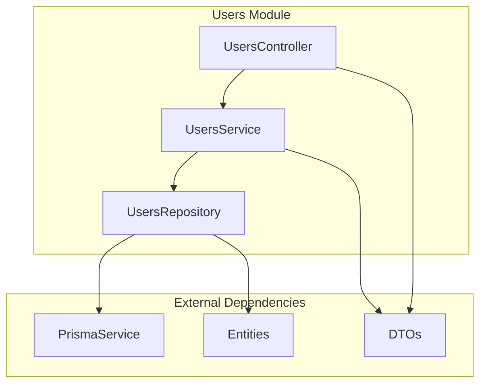
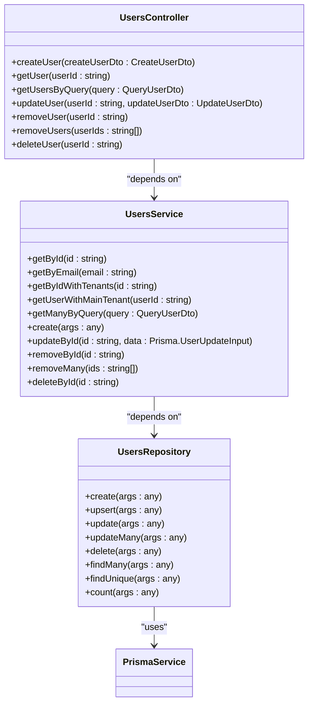
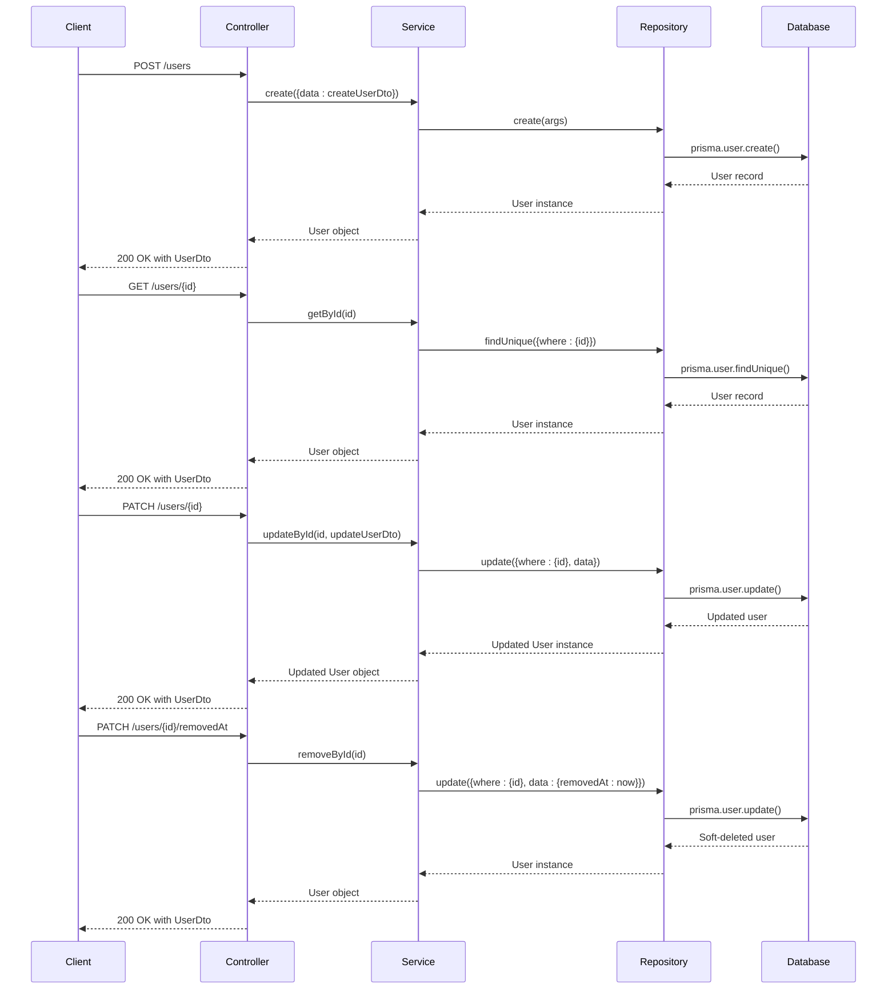
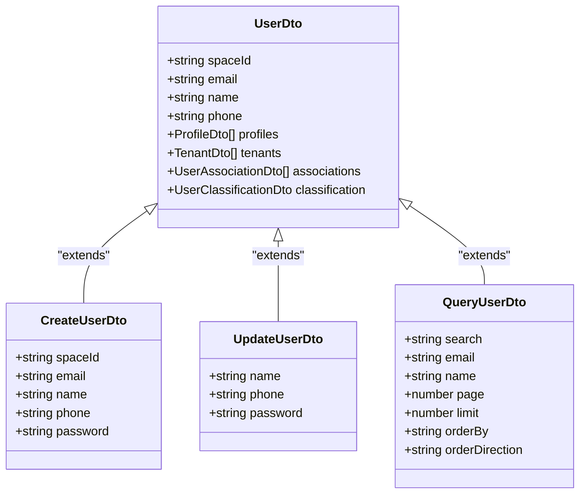
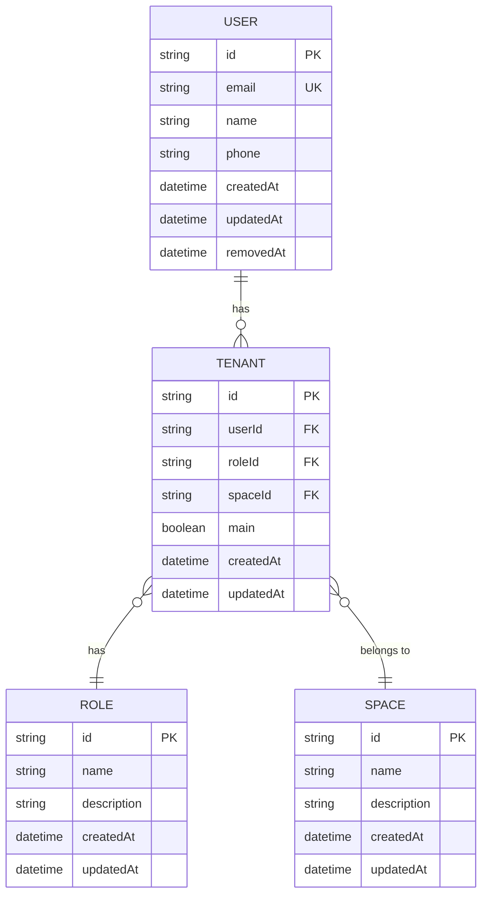
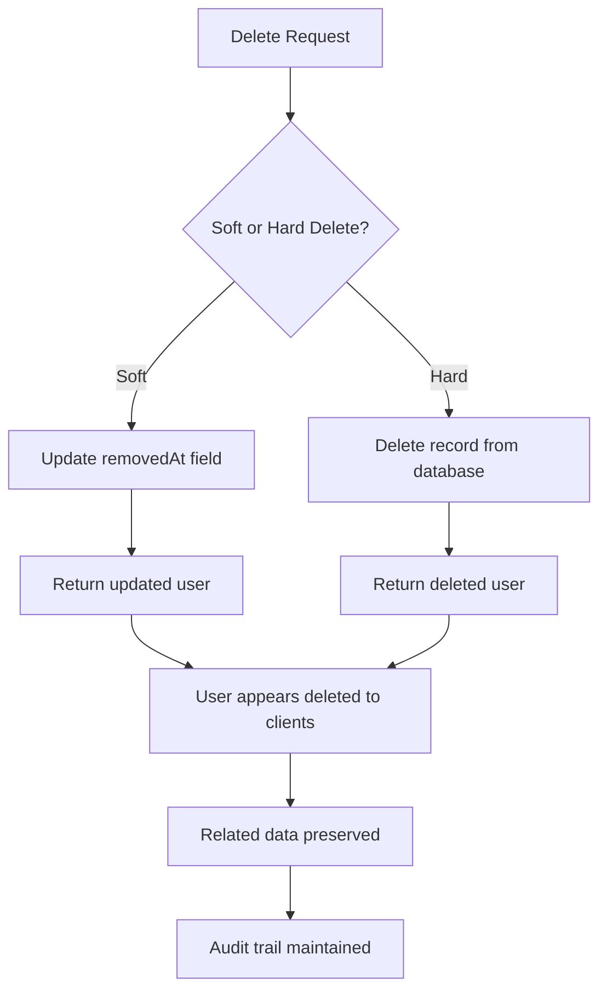
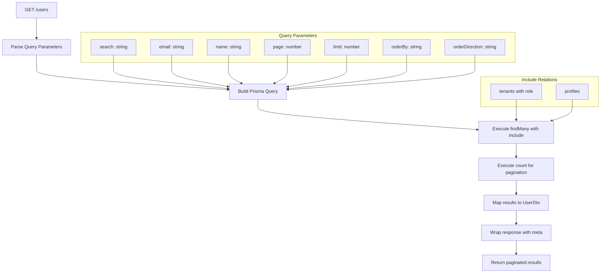
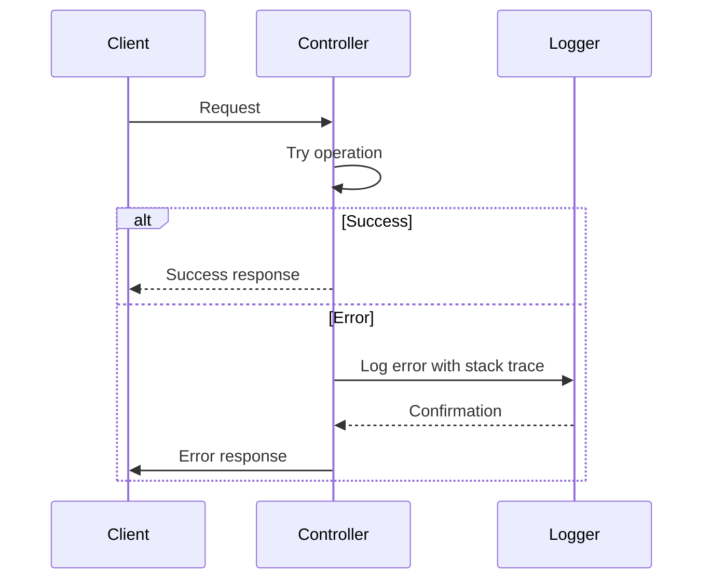
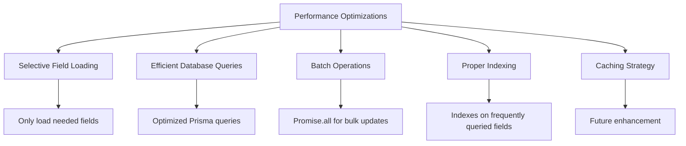

# Users Module

<cite>
**Referenced Files in This Document**   
- [users.module.ts](file://apps/server/src/module/users.module.ts)
- [users.controller.ts](file://apps/server/src/shared/controller/resources/users.controller.ts)
- [users.service.ts](file://apps/server/src/shared/service/resources/users.service.ts)
- [users.repository.ts](file://apps/server/src/shared/repository/users.repository.ts)
- [user.dto.ts](file://packages/dto/src/user.dto.ts)
- [create-user.dto.ts](file://packages/dto/src/create/create-user.dto.ts)
- [update-user.dto.ts](file://packages/dto/src/update/update-user.dto.ts)
- [query-user.dto.ts](file://packages/dto/src/query/query-user.dto.ts)
- [user.entity.ts](file://packages/entity/src/user.entity.ts)
</cite>

## Table of Contents
1. [Introduction](#introduction)
2. [Module Architecture](#module-architecture)
3. [Core Components](#core-components)
4. [User Lifecycle Management](#user-lifecycle-management)
5. [Data Transfer Objects and Validation](#data-transfer-objects-and-validation)
6. [Integration with Classification and Association Modules](#integration-with-classification-and-association-modules)
7. [Data Consistency and Soft Deletion](#data-consistency-and-soft-deletion)
8. [User Search and Query Capabilities](#user-search-and-query-capabilities)
9. [Error Handling and Logging](#error-handling-and-logging)
10. [Performance Considerations](#performance-considerations)

## Introduction
The Users Module in prj-core provides a comprehensive system for managing user lifecycle operations including creation, retrieval, update, and deletion. Built on NestJS architecture, this module follows a clean separation of concerns with distinct layers for controllers, services, and repositories. The module integrates with tenant, role, and classification systems to provide a complete user management solution for multi-tenancy applications. This documentation details the implementation patterns, data flow, and integration points that make up the robust user management system.

## Module Architecture

**Diagram sources**
- [users.module.ts](file://apps/server/src/module/users.module.ts#L4-L8)
- [users.controller.ts](file://apps/server/src/shared/controller/resources/users.controller.ts#L30-L125)
- [users.service.ts](file://apps/server/src/shared/service/resources/users.service.ts#L7-L151)
- [users.repository.ts](file://apps/server/src/shared/repository/users.repository.ts#L9-L84)

**Section sources**
- [users.module.ts](file://apps/server/src/module/users.module.ts#L1-L9)

## Core Components

The Users Module consists of three primary components that follow the NestJS architectural pattern: UsersController, UsersService, and UsersRepository. The controller handles HTTP requests and responses, the service contains business logic, and the repository manages data persistence operations.

**Diagram sources**
- [users.controller.ts](file://apps/server/src/shared/controller/resources/users.controller.ts#L30-L125)
- [users.service.ts](file://apps/server/src/shared/service/resources/users.service.ts#L7-L151)
- [users.repository.ts](file://apps/server/src/shared/repository/users.repository.ts#L9-L84)

**Section sources**
- [users.controller.ts](file://apps/server/src/shared/controller/resources/users.controller.ts#L30-L125)
- [users.service.ts](file://apps/server/src/shared/service/resources/users.service.ts#L7-L151)
- [users.repository.ts](file://apps/server/src/shared/repository/users.repository.ts#L9-L84)

## User Lifecycle Management

The Users Module implements a complete CRUD (Create, Read, Update, Delete) interface for user management with specialized endpoints for different operations. The module supports both hard deletion (permanent removal) and soft deletion (marking as removed) to accommodate different business requirements.

**Diagram sources**
- [users.controller.ts](file://apps/server/src/shared/controller/resources/users.controller.ts#L35-L89)
- [users.service.ts](file://apps/server/src/shared/service/resources/users.service.ts#L10-L58)
- [users.repository.ts](file://apps/server/src/shared/repository/users.repository.ts#L16-L32)

**Section sources**
- [users.controller.ts](file://apps/server/src/shared/controller/resources/users.controller.ts#L35-L89)
- [users.service.ts](file://apps/server/src/shared/service/resources/users.service.ts#L10-L58)

## Data Transfer Objects and Validation

The Users Module employs Data Transfer Objects (DTOs) to define the structure and validation rules for user-related operations. These DTOs ensure type safety, provide documentation for API endpoints, and validate incoming data before processing.

**Diagram sources**
- [user.dto.ts](file://packages/dto/src/user.dto.ts#L16-L60)
- [create-user.dto.ts](file://packages/dto/src/create/create-user.dto.ts)
- [update-user.dto.ts](file://packages/dto/src/update/update-user.dto.ts)
- [query-user.dto.ts](file://packages/dto/src/query/query-user.dto.ts)

**Section sources**
- [user.dto.ts](file://packages/dto/src/user.dto.ts#L16-L60)
- [create-user.dto.ts](file://packages/dto/src/create/create-user.dto.ts)
- [update-user.dto.ts](file://packages/dto/src/update/update-user.dto.ts)
- [query-user.dto.ts](file://packages/dto/src/query/query-user.dto.ts)

## Integration with Classification and Association Modules

The Users Module integrates with classification and association systems to provide role-based access control and tenant management capabilities. This integration enables complex user management scenarios in multi-tenant applications.

**Diagram sources**
- [users.service.ts](file://apps/server/src/shared/service/resources/users.service.ts#L60-L94)
- [users.service.ts](file://apps/server/src/shared/service/resources/users.service.ts#L96-L130)
- [users.service.ts](file://apps/server/src/shared/service/resources/users.service.ts#L131-L149)

**Section sources**
- [users.service.ts](file://apps/server/src/shared/service/resources/users.service.ts#L60-L149)

## Data Consistency and Soft Deletion

The Users Module implements a soft deletion pattern to maintain data integrity and support audit requirements. Instead of permanently removing records, the system marks them as deleted by setting a removedAt timestamp, allowing for potential restoration and maintaining referential integrity.

**Diagram sources**
- [users.controller.ts](file://apps/server/src/shared/controller/resources/users.controller.ts#L75-L81)
- [users.controller.ts](file://apps/server/src/shared/controller/resources/users.controller.ts#L83-L89)
- [users.service.ts](file://apps/server/src/shared/service/resources/users.service.ts#L53-L58)
- [users.service.ts](file://apps/server/src/shared/service/resources/users.service.ts#L21-L23)

**Section sources**
- [users.controller.ts](file://apps/server/src/shared/controller/resources/users.controller.ts#L75-L89)
- [users.service.ts](file://apps/server/src/shared/service/resources/users.service.ts#L53-L58)

## User Search and Query Capabilities

The Users Module provides robust search and filtering capabilities through the getUsersByQuery endpoint. This feature supports pagination, sorting, and various filtering options to efficiently retrieve user data from potentially large datasets.

**Diagram sources**
- [users.controller.ts](file://apps/server/src/shared/controller/resources/users.controller.ts#L91-L115)
- [users.service.ts](file://apps/server/src/shared/service/resources/users.service.ts#L29-L47)

**Section sources**
- [users.controller.ts](file://apps/server/src/shared/controller/resources/users.controller.ts#L91-L115)
- [users.service.ts](file://apps/server/src/shared/service/resources/users.service.ts#L29-L47)

## Error Handling and Logging

The Users Module implements comprehensive error handling and logging to ensure system reliability and aid in troubleshooting. The controller includes try-catch blocks with detailed error logging, while the repository provides debug-level logging for all database operations.

**Diagram sources**
- [users.controller.ts](file://apps/server/src/shared/controller/resources/users.controller.ts#L96-L122)
- [users.repository.ts](file://apps/server/src/shared/repository/users.repository.ts#L13-L14)

**Section sources**
- [users.controller.ts](file://apps/server/src/shared/controller/resources/users.controller.ts#L96-L122)
- [users.repository.ts](file://apps/server/src/shared/repository/users.repository.ts#L13-L14)

## Performance Considerations

The Users Module incorporates several performance optimizations, including efficient database queries with proper indexing, selective field loading, and batch operations for bulk updates. The use of Prisma's include feature allows for efficient retrieval of related data in a single query, reducing database round trips.

**Diagram sources**
- [users.service.ts](file://apps/server/src/shared/service/resources/users.service.ts#L30-L40)
- [users.controller.ts](file://apps/server/src/shared/controller/resources/users.controller.ts#L58-L60)

**Section sources**
- [users.service.ts](file://apps/server/src/shared/service/resources/users.service.ts#L30-L40)
- [users.controller.ts](file://apps/server/src/shared/controller/resources/users.controller.ts#L58-L60)