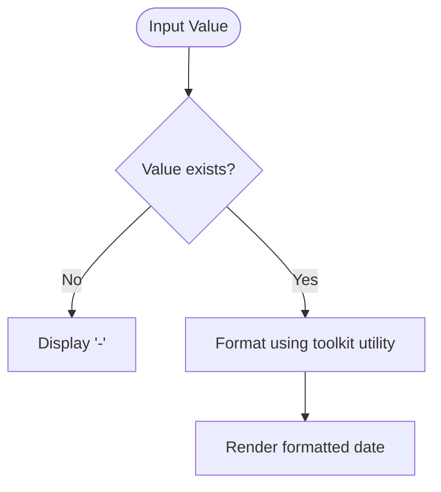
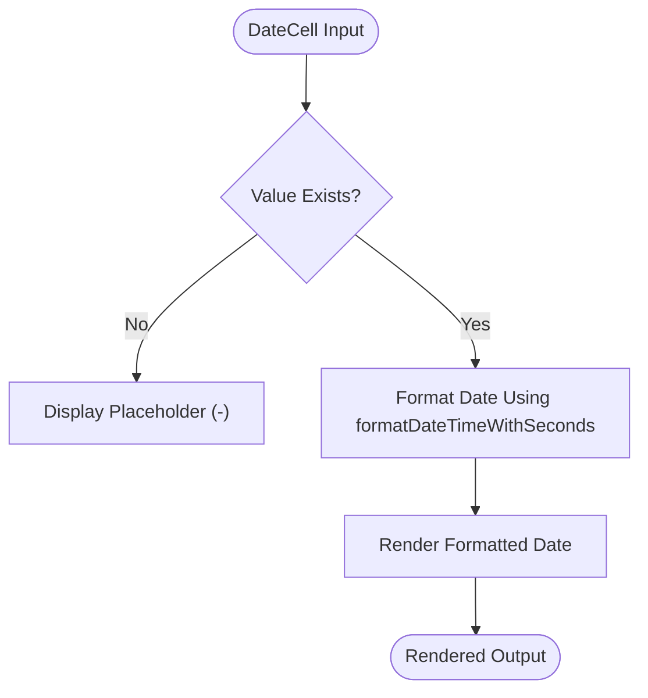
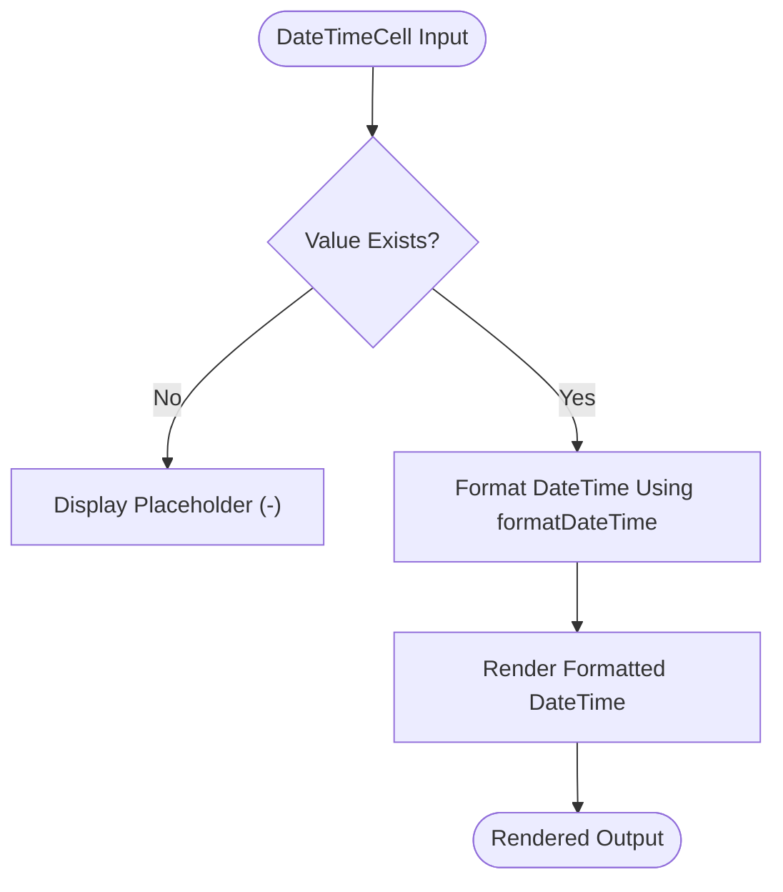

# Date and DateTime Cells

<cite>
**Referenced Files in This Document**   
- [DateCell.tsx](file://packages/ui/src/components/ui/data-display/cells/DateCell/DateCell.tsx)
- [DateTimeCell.tsx](file://packages/ui/src/components/ui/data-display/cells/DateTimeCell/DateTimeCell.tsx)
- [DateTime.ts](file://packages/toolkit/src/DateTime.ts)
- [DateCell.stories.tsx](file://packages/ui/src/components/ui/data-display/cells/DateCell/DateCell.stories.tsx)
- [DateTimeCell.stories.tsx](file://packages/ui/src/components/ui/data-display/cells/DateTimeCell/DateTimeCell.stories.tsx)
</cite>

## Table of Contents
1. [Introduction](#introduction)
2. [Core Components](#core-components)
3. [Architecture Overview](#architecture-overview)
4. [Detailed Component Analysis](#detailed-component-analysis)
5. [Integration with DataGrid and Table Components](#integration-with-datagrid-and-table-components)
6. [Date Formatting and Localization](#date-formatting-and-localization)
7. [Common Issues and Solutions](#common-issues-and-solutions)
8. [Performance Considerations](#performance-considerations)
9. [Conclusion](#conclusion)

## Introduction
The DateCell and DateTimeCell components in the prj-core's shared-frontend package provide standardized rendering of temporal data across the application. These components ensure consistent date and time formatting while handling various edge cases such as null values, invalid dates, and timezone considerations. Built as part of the shared UI library, they are designed for seamless integration with data display components like tables and data grids, providing reliable date rendering in various contexts including creation timestamps, scheduling information, and audit logs.

## Core Components

The DateCell and DateTimeCell components serve as specialized cell renderers for temporal data in tabular interfaces. Both components accept date values in multiple formats (string, Date object, null, or undefined) and render them using standardized formatting functions from the @cocrepo/toolkit library. The components handle empty or invalid values by displaying a consistent placeholder, ensuring visual consistency across the application.

**Section sources**
- [DateCell.tsx](file://packages/ui/src/components/ui/data-display/cells/DateCell/DateCell.tsx)
- [DateTimeCell.tsx](file://packages/ui/src/components/ui/data-display/cells/DateTimeCell/DateTimeCell.tsx)

## Architecture Overview

The date cell components follow a simple yet effective architecture that separates concerns between presentation and formatting logic. The components themselves handle the UI rendering and null value management, while delegating the actual date formatting to utility functions in the @cocrepo/toolkit package. This separation allows for consistent formatting across the entire application while keeping the cell components lightweight and focused on their primary responsibility.

**Diagram sources**
- [DateCell.tsx](file://packages/ui/src/components/ui/data-display/cells/DateCell/DateCell.tsx)
- [DateTimeCell.tsx](file://packages/ui/src/components/ui/data-display/cells/DateTimeCell/DateTimeCell.tsx)
- [DateTime.ts](file://packages/toolkit/src/DateTime.ts)

## Detailed Component Analysis

### DateCell Analysis
The DateCell component is designed to display date values with seconds included in the formatting. It accepts a value prop that can be a date string, Date object, null, or undefined. When the value is falsy, the component renders a dash placeholder. For valid date values, it uses the formatDateTimeWithSeconds function from @cocrepo/toolkit to produce a consistently formatted date string.

#### Component Implementation

**Diagram sources**
- [DateCell.tsx](file://packages/ui/src/components/ui/data-display/cells/DateCell/DateCell.tsx)
- [DateTime.ts](file://packages/toolkit/src/DateTime.ts)

**Section sources**
- [DateCell.tsx](file://packages/ui/src/components/ui/data-display/cells/DateCell/DateCell.tsx)
- [DateCell.stories.tsx](file://packages/ui/src/components/ui/data-display/cells/DateCell/DateCell.stories.tsx)

### DateTimeCell Analysis
The DateTimeCell component displays datetime values without seconds, providing a more concise format suitable for contexts where precise seconds are not required. Similar to DateCell, it accepts various date input types and uses the formatDateTime function from @cocrepo/toolkit for formatting. This component is ideal for displaying timestamps and other datetime values where both date and time are relevant but second-level precision is not necessary.

#### Component Implementation

**Diagram sources**
- [DateTimeCell.tsx](file://packages/ui/src/components/ui/data-display/cells/DateTimeCell/DateTimeCell.tsx)
- [DateTime.ts](file://packages/toolkit/src/DateTime.ts)

**Section sources**
- [DateTimeCell.tsx](file://packages/ui/src/components/ui/data-display/cells/DateTimeCell/DateTimeCell.tsx)
- [DateTimeCell.stories.tsx](file://packages/ui/src/components/ui/data-display/cells/DateTimeCell/DateTimeCell.stories.tsx)

## Integration with DataGrid and Table Components

The DateCell and DateTimeCell components are designed to integrate seamlessly with data display components such as DataGrid and Table. They can be used as column renderers to display temporal data in tabular formats. When used in sorting operations, these components work with the underlying data model's raw date values rather than the formatted display values, ensuring accurate sorting behavior.

For filtering operations, the components support date range filtering by working with the table's filtering mechanism to compare date values within specified ranges. The integration is facilitated through the shared UI library's consistent API design, allowing these cell components to be easily configured as column renderers with minimal setup.

**Section sources**
- [DateCell.tsx](file://packages/ui/src/components/ui/data-display/cells/DateCell/DateCell.tsx)
- [DateTimeCell.tsx](file://packages/ui/src/components/ui/data-display/cells/DateTimeCell/DateTimeCell.tsx)

## Date Formatting and Localization

The date formatting capabilities of these components are powered by the @cocrepo/toolkit library, which uses dayjs for date manipulation and formatting. The DateCell uses the formatDateTimeWithSeconds function with a default format of "YY.MM.DD HH:mm:ss", while the DateTimeCell uses the formatDateTime function with a default format of "YYYY.MM.DD HH:mm".

For localization support, the underlying dayjs library provides internationalization capabilities that can be configured to display dates in various languages and regional formats. The components themselves are designed to work with the application's current locale setting, ensuring that date formats conform to user expectations based on their regional preferences.

**Section sources**
- [DateTime.ts](file://packages/toolkit/src/DateTime.ts)
- [DateCell.tsx](file://packages/ui/src/components/ui/data-display/cells/DateCell/DateCell.tsx)
- [DateTimeCell.tsx](file://packages/ui/src/components/ui/data-display/cells/DateTimeCell/DateTimeCell.tsx)

## Common Issues and Solutions

### Timezone Conversion
The components handle timezone conversion by relying on the browser's local timezone settings when formatting dates. For applications requiring specific timezone handling, the date values should be converted to the desired timezone before being passed to these components.

### Date Formatting Inconsistencies
To address browser-specific date parsing inconsistencies, the components rely on the dayjs library which provides consistent date parsing across all supported browsers. This eliminates issues that might arise from different browsers' native Date object implementations.

### Handling Invalid Dates
Both components include validation to handle invalid date inputs gracefully. When an invalid date is provided, the components will display the placeholder dash rather than attempting to format the invalid value, preventing display errors in the UI.

**Section sources**
- [DateTime.ts](file://packages/toolkit/src/DateTime.ts)
- [DateCell.tsx](file://packages/ui/src/components/ui/data-display/cells/DateCell/DateCell.tsx)
- [DateTimeCell.tsx](file://packages/ui/src/components/ui/data-display/cells/DateTimeCell/DateTimeCell.tsx)

## Performance Considerations

For large datasets with date columns, the components are optimized for performance through several mechanisms. The formatting operations are delegated to the highly optimized dayjs library, which is known for its small bundle size and fast execution. Additionally, the components use simple conditional rendering without complex state management, making them lightweight and efficient.

When rendering large numbers of date cells, React's virtualization techniques in conjunction with DataGrid components ensure that only visible cells are rendered, minimizing the performance impact of date formatting operations. The pure functional component design also enables React's optimization strategies to work effectively.

**Section sources**
- [DateCell.tsx](file://packages/ui/src/components/ui/data-display/cells/DateCell/DateCell.tsx)
- [DateTimeCell.tsx](file://packages/ui/src/components/ui/data-display/cells/DateTimeCell/DateTimeCell.tsx)

## Conclusion

The DateCell and DateTimeCell components provide a robust solution for rendering temporal data in the prj-core application. By leveraging the @cocrepo/toolkit library for date formatting, they ensure consistent presentation across the application while handling edge cases gracefully. Their simple API and seamless integration with data display components make them valuable tools for developers working with date and time data in tabular interfaces. The components strike a balance between simplicity for basic use cases and flexibility for more complex requirements, making them suitable for both beginner and experienced developers.