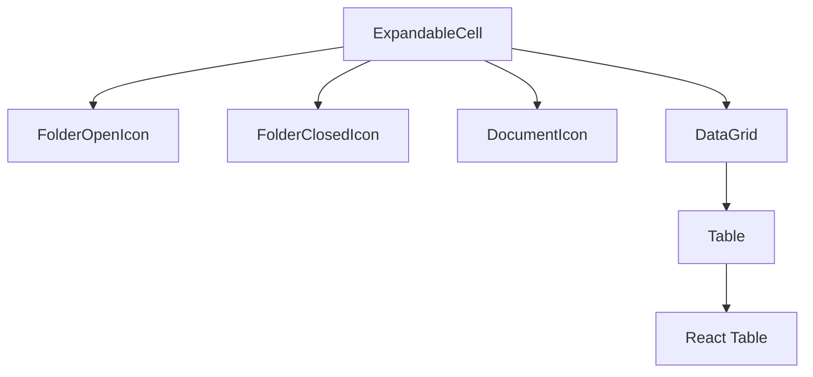
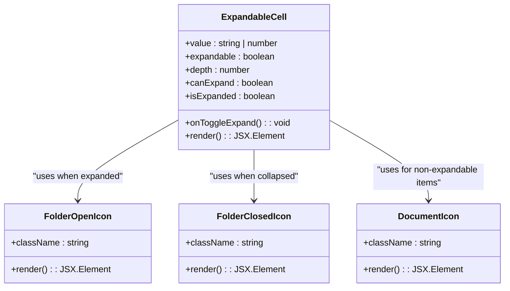
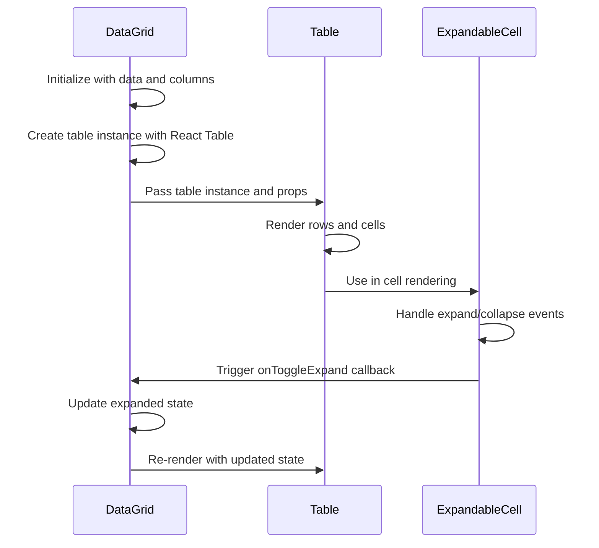

# ExpandableCell Component

<cite>
**Referenced Files in This Document**   
- [ExpandableCell.tsx](file://packages/ui/src/components/ui/data-display/cells/ExpandableCell/ExpandableCell.tsx)
- [ExpandableCell.stories.tsx](file://packages/ui/src/components/ui/data-display/cells/ExpandableCell/ExpandableCell.stories.tsx)
- [DataGrid.tsx](file://packages/ui/src/components/ui/data-display/DataGrid/DataGrid.tsx)
- [Table.tsx](file://packages/ui/src/components/ui/data-display/Table/Table.tsx)
</cite>

## Table of Contents
1. [Introduction](#introduction)
2. [Core Components](#core-components)
3. [Architecture Overview](#architecture-overview)
4. [Detailed Component Analysis](#detailed-component-analysis)
5. [Integration with DataGrid and Table](#integration-with-datagrid-and-table)
6. [Performance Considerations](#performance-considerations)
7. [Accessibility and Event Handling](#accessibility-and-event-handling)
8. [Conclusion](#conclusion)

## Introduction
The ExpandableCell component is a UI element designed to handle long text content within table cells by providing expand/collapse functionality. It is part of the prj-core's shared-frontend package and is used to maintain table readability while allowing users to view truncated content when needed. This documentation provides a comprehensive overview of the component's implementation, props, usage patterns, and integration with other components.

## Core Components

The ExpandableCell component is implemented as a React functional component that supports hierarchical data display with visual indicators for expandable content. It uses SVG icons to represent folder and document states and supports nesting through depth-based indentation.

**Section sources**
- [ExpandableCell.tsx](file://packages/ui/src/components/ui/data-display/cells/ExpandableCell/ExpandableCell.tsx#L45-L121)

## Architecture Overview

The ExpandableCell component is designed to work within a larger data display system that includes DataGrid and Table components. It follows a pattern of visual hierarchy representation using indentation and connecting lines to indicate parent-child relationships between rows.

**Diagram sources**
- [ExpandableCell.tsx](file://packages/ui/src/components/ui/data-display/cells/ExpandableCell/ExpandableCell.tsx#L2-L43)
- [DataGrid.tsx](file://packages/ui/src/components/ui/data-display/DataGrid/DataGrid.tsx#L1-L58)

## Detailed Component Analysis

### ExpandableCell Implementation
The ExpandableCell component provides a way to display hierarchical data with expandable/collapsible functionality. It supports different visual states based on whether the cell can be expanded and its current expansion state.

#### Props Analysis
The component accepts the following props:

- `value`: The text or number value to display in the cell
- `expandable`: Boolean indicating whether the cell supports expansion (default: true)
- `depth`: Number representing the nesting depth level (default: 0)
- `canExpand`: Boolean indicating whether the cell can be expanded (default: false)
- `isExpanded`: Boolean indicating whether the cell is currently expanded (default: false)
- `onToggleExpand`: Callback function triggered when the expand/collapse state changes

The component uses these props to determine its visual representation:
- Expandable cells with `canExpand=true` display folder icons that can be toggled
- Expandable cells with `canExpand=false` display document icons (non-expandable)
- Non-expandable cells display document icons without expansion capability

#### Visual Hierarchy
The component implements visual hierarchy through:
- Left padding based on depth (2rem per level)
- Vertical connecting lines between parent and child items
- Horizontal connecting lines at the appropriate depth level
- Different icons for open/closed folders and documents

**Diagram sources**
- [ExpandableCell.tsx](file://packages/ui/src/components/ui/data-display/cells/ExpandableCell/ExpandableCell.tsx#L45-L121)

**Section sources**
- [ExpandableCell.tsx](file://packages/ui/src/components/ui/data-display/cells/ExpandableCell/ExpandableCell.tsx#L1-L121)
- [ExpandableCell.stories.tsx](file://packages/ui/src/components/ui/data-display/cells/ExpandableCell/ExpandableCell.stories.tsx#L1-L170)

## Integration with DataGrid and Table

The ExpandableCell component is designed to integrate with the DataGrid and Table components to provide hierarchical data display capabilities. The DataGrid component uses React Table for state management and passes data to the Table component for rendering.

### Data Flow
The data flow between components follows this pattern:
1. DataGrid receives hierarchical data with children properties
2. DataGrid uses React Table's getSubRows to identify child rows
3. DataGrid manages expanded state through useState
4. Table component renders rows using the provided table instance
5. ExpandableCell is used within cells to display hierarchical content

### Usage Examples
The ExpandableCell is used in various scenarios:
- Displaying folder structures with nested files
- Showing hierarchical categories in a tree view
- Presenting organizational structures with departments and sub-teams
- Rendering file systems with directories and documents

**Diagram sources**
- [DataGrid.tsx](file://packages/ui/src/components/ui/data-display/DataGrid/DataGrid.tsx#L1-L58)
- [Table.tsx](file://packages/ui/src/components/ui/data-display/Table/Table.tsx)
- [ExpandableCell.tsx](file://packages/ui/src/components/ui/data-display/cells/ExpandableCell/ExpandableCell.tsx)

## Performance Considerations

When using ExpandableCell with large datasets, several performance considerations should be addressed:

### Virtualization
For tables with many rows, virtualization should be implemented to only render visible rows. The current implementation does not include virtualization, which could impact performance with large datasets.

### State Management
The expanded state is managed at the DataGrid level using useState, which triggers re-renders when the state changes. For large hierarchies, this could lead to performance issues.

### Icon Rendering
The SVG icons are defined inline within the component, which means they are re-created on each render. For better performance, these could be extracted to separate components or use a sprite sheet.

### Memory Usage
Each ExpandableCell maintains its own state and event handlers, which could lead to increased memory usage with many instances. Consider using event delegation for better memory efficiency.

## Accessibility and Event Handling

### Keyboard Navigation
The current implementation does not explicitly support keyboard navigation for expandable cells. For accessibility compliance, the following enhancements should be considered:
- Support keyboard navigation with arrow keys
- Implement Enter/Space to toggle expansion state
- Add appropriate ARIA attributes (aria-expanded, aria-level, etc.)
- Ensure focus management when expanding/collapsing

### Screen Reader Support
To improve screen reader support:
- Add descriptive labels for expandable states
- Use appropriate ARIA roles (tree, treeitem, etc.)
- Provide context about nesting level and position in hierarchy
- Announce state changes when expanding/collapsing

### Event Handling
The component handles click events on the expandable icon to toggle the expansion state. The onToggleExpand callback is passed from the parent component (typically DataGrid) to manage the state at the appropriate level.

## Conclusion

The ExpandableCell component provides a robust solution for displaying hierarchical data within table cells. Its implementation supports visual hierarchy through indentation, connecting lines, and appropriate icons. The component integrates well with the DataGrid and Table components to provide a complete solution for hierarchical data display.

Key strengths include:
- Clear visual representation of hierarchy
- Support for nested levels with proper connecting lines
- Different visual states for expandable vs. non-expandable items
- Simple API with well-defined props

Areas for improvement:
- Enhanced accessibility support
- Better performance optimization for large datasets
- Virtualization support for large tables
- More comprehensive styling options

The component effectively addresses the need to display long content within table cells while maintaining readability and providing intuitive expand/collapse functionality.