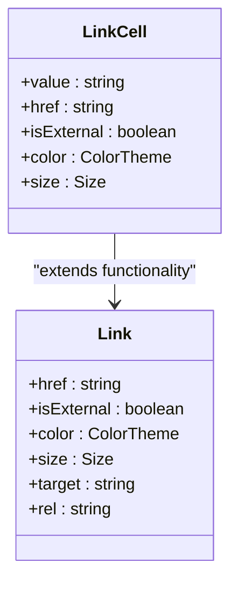
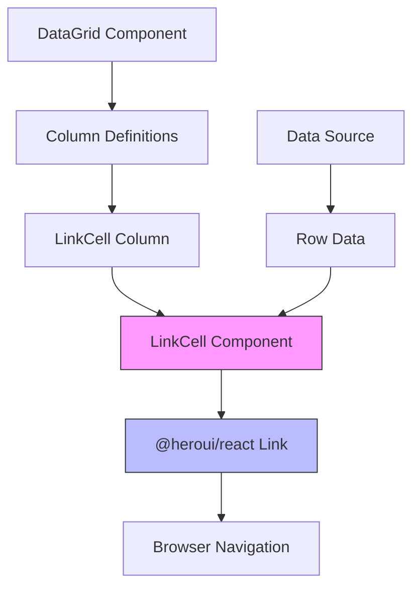

# LinkCell Component

<cite>
**Referenced Files in This Document**   
- [LinkCell.tsx](file://packages/ui/src/components/ui/data-display/cells/LinkCell/LinkCell.tsx)
- [LinkCell.stories.tsx](file://packages/ui/src/components/ui/data-display/cells/LinkCell/LinkCell.stories.tsx)
- [index.ts](file://packages/ui/src/components/ui/data-display/cells/index.ts)
- [DataGrid/DataGrid](file://packages/ui/src/components/ui/data-display/DataGrid/DataGrid)
- [Table/Table](file://packages/ui/src/components/ui/data-display/Table/Table)
</cite>

## Table of Contents
1. [Introduction](#introduction)
2. [Core Implementation](#core-implementation)
3. [Props and Configuration](#props-and-configuration)
4. [Integration with DataGrid and Table Components](#integration-with-datagrid-and-table-components)
5. [Security Measures](#security-measures)
6. [Accessibility Features](#accessibility-features)
7. [Usage Examples](#usage-examples)
8. [Advanced Patterns](#advanced-patterns)
9. [Troubleshooting Guide](#troubleshooting-guide)
10. [Conclusion](#conclusion)

## Introduction
The LinkCell component is a specialized UI element designed for rendering hyperlinks within data tables and grids in the prj-core application ecosystem. As part of the shared-frontend package, this component provides a consistent, secure, and accessible way to display clickable links in tabular data contexts. The component wraps the core Link functionality from @heroui/react with additional features tailored for data display scenarios, ensuring proper styling, security measures, and integration with table components.

**Section sources**
- [LinkCell.tsx](file://packages/ui/src/components/ui/data-display/cells/LinkCell/LinkCell.tsx#L1-L10)

## Core Implementation
The LinkCell component is implemented as a thin wrapper around the @heroui/react Link component, extending its functionality for use in data cells. The implementation follows a simple but effective pattern: it accepts a value prop for the link text and spreads all other LinkProps to the underlying Link component. This design allows for maximum flexibility while maintaining a clean API surface.

The component's architecture follows the cell pattern established in the shared-frontend package, where specialized cell components handle specific data types in tables and grids. By extending LinkProps, LinkCell inherits all the functionality of the base Link component while adding the value prop specifically for cell contexts.



**Diagram sources**
- [LinkCell.tsx](file://packages/ui/src/components/ui/data-display/cells/LinkCell/LinkCell.tsx#L3-L10)

**Section sources**
- [LinkCell.tsx](file://packages/ui/src/components/ui/data-display/cells/LinkCell/LinkCell.tsx#L1-L10)

## Props and Configuration
The LinkCell component accepts all standard LinkProps from @heroui/react along with a dedicated value prop for the link text. Key configuration options include:

- **href**: The URL the link points to, supporting both internal routes and external URLs
- **value**: The text content displayed for the link
- **isExternal**: Boolean flag that determines if the link opens in a new tab and applies appropriate security attributes
- **color**: Theme-based color options including "foreground", "primary", "secondary", "success", "warning", and "danger"
- **size**: Size variants with options for "sm", "md", and "lg"

The component leverages the underlying Link implementation to handle target and rel attributes automatically based on the isExternal prop, ensuring secure handling of external links without requiring manual configuration.

**Section sources**
- [LinkCell.stories.tsx](file://packages/ui/src/components/ui/data-display/cells/LinkCell/LinkCell.stories.tsx#L11-L41)

## Integration with DataGrid and Table Components
LinkCell is designed to work seamlessly with the DataGrid and Table components in the shared-frontend package. It is exported as part of the cells module and can be imported directly for use in column definitions. The component follows the same pattern as other cell components like BooleanCell, DateCell, and NumberCell, ensuring consistency across different data types.

When used within DataGrid or Table components, LinkCell receives its props from the column configuration and row data. The value prop is typically populated from the corresponding field in the data record, while href and other link attributes can be static or derived from the data context.



**Diagram sources**
- [LinkCell.tsx](file://packages/ui/src/components/ui/data-display/cells/LinkCell/LinkCell.tsx#L7-L9)
- [index.ts](file://packages/ui/src/components/ui/data-display/cells/index.ts#L6)

**Section sources**
- [LinkCell.tsx](file://packages/ui/src/components/ui/data-display/cells/LinkCell/LinkCell.tsx#L1-L10)
- [index.ts](file://packages/ui/src/components/ui/data-display/cells/index.ts#L6)

## Security Measures
The LinkCell component inherits robust security measures from the @heroui/react Link component. When isExternal is set to true, the component automatically applies appropriate target and rel attributes to prevent security vulnerabilities:

- External links open in new tabs with target="_blank"
- The rel="noreferrer" attribute is applied to external links to prevent the opener from accessing the window object of the target page
- This automatic security handling eliminates the risk of reverse tabnabbing attacks
- All URL validation is handled by the underlying Link component

The component's design ensures that developers cannot accidentally create insecure external links, as the security attributes are applied automatically based on the isExternal flag rather than requiring manual configuration of target and rel attributes.

**Section sources**
- [LinkCell.stories.tsx](file://packages/ui/src/components/ui/data-display/cells/LinkCell/LinkCell.stories.tsx#L63-L69)

## Accessibility Features
LinkCell maintains full accessibility compliance through its inheritance from the @heroui/react Link component. Key accessibility features include:

- Proper semantic HTML with anchor elements
- Keyboard navigation support with focus states
- Screen reader compatibility with appropriate ARIA attributes
- Visible focus indicators for keyboard users
- Sufficient color contrast for all color themes

The component automatically handles accessibility concerns that are critical in data table contexts, where users may navigate through multiple links using keyboard shortcuts. The consistent styling across different states (hover, focus, active) ensures a predictable user experience.

**Section sources**
- [LinkCell.stories.tsx](file://packages/ui/src/components/ui/data-display/cells/LinkCell/LinkCell.stories.tsx#L71-L85)

## Usage Examples
The LinkCell component is used in various contexts throughout the application for displaying different types of links:

### External Resource Links
For external websites and resources, the component is configured with isExternal=true:
```typescript
{
  header: "Website",
  accessorKey: "url",
  cell: (info) => <LinkCell value={info.getValue()} href={info.getValue()} isExternal={true} />
}
```

### Internal Navigation
For internal routes within the application:
```typescript
{
  header: "Details",
  accessorKey: "id",
  cell: (info) => <LinkCell value="View Details" href={`/items/${info.getValue()}`} isExternal={false} />
}
```

### Styled Links
For links with specific visual treatments:
```typescript
{
  header: "Status",
  accessorKey: "status",
  cell: (info) => <LinkCell value={info.getValue()} href={`/status/${info.getValue()}`} color="success" size="sm" />
}
```

**Section sources**
- [LinkCell.stories.tsx](file://packages/ui/src/components/ui/data-display/cells/LinkCell/LinkCell.stories.tsx#L48-L109)

## Advanced Patterns
The LinkCell component supports several advanced usage patterns for complex scenarios:

### Conditional Linking
Links can be conditionally rendered based on user permissions or data state:
```typescript
cell: (info) => {
  const canAccess = checkPermission(info.row.original.resourceId);
  return canAccess ? (
    <LinkCell value="Access Resource" href={`/resources/${info.getValue()}`} />
  ) : (
    <Text>Access Denied</Text>
  );
}
```

### Dynamic URL Construction
URLs can be constructed from multiple data fields:
```typescript
cell: (info) => {
  const baseUrl = info.row.original.baseUrl;
  const id = info.getValue();
  return <LinkCell value="Open" href={`${baseUrl}/${id}`} isExternal={true} />;
}
```

### Event Tracking
The component can be extended to support analytics tracking:
```typescript
cell: (info) => (
  <LinkCell 
    value="Download" 
    href={info.getValue()} 
    onClick={() => trackDownload(info.row.original.id)}
  />
)
```

These patterns leverage the component's flexibility while maintaining consistent styling and security practices across the application.

**Section sources**
- [LinkCell.tsx](file://packages/ui/src/components/ui/data-display/cells/LinkCell/LinkCell.tsx#L7-L9)

## Troubleshooting Guide
Common issues with LinkCell and their solutions:

### Link Not Working
- Ensure the href prop is properly set and not undefined
- Verify that the value prop contains the link text
- Check for JavaScript errors that might prevent rendering

### Security Warnings
- For external links, always set isExternal=true to ensure proper security attributes
- Never manually set target="_blank" without rel="noreferrer" - use isExternal instead

### Styling Issues
- Use the color and size props instead of custom CSS for consistent theming
- Ensure the parent container has sufficient space for the link content
- Check for CSS conflicts from other stylesheets

### Accessibility Problems
- Verify that links have visible focus states
- Ensure link text is descriptive and not just "click here"
- Test keyboard navigation through tab order

**Section sources**
- [LinkCell.tsx](file://packages/ui/src/components/ui/data-display/cells/LinkCell/LinkCell.tsx#L1-L10)
- [LinkCell.stories.tsx](file://packages/ui/src/components/ui/data-display/cells/LinkCell/LinkCell.stories.tsx#L1-L110)

## Conclusion
The LinkCell component provides a robust, secure, and consistent solution for rendering hyperlinks in data tables and grids within the prj-core application. By wrapping the @heroui/react Link component with a specialized API for cell contexts, it offers developers a simple yet powerful tool for displaying clickable links with proper security measures and consistent styling. The component's integration with DataGrid and Table components ensures seamless usage across the application, while its support for various props and configuration options enables flexible implementation for different use cases. With built-in security features, accessibility compliance, and support for advanced patterns like conditional linking and event tracking, LinkCell represents a best-practice approach to link rendering in data-intensive interfaces.