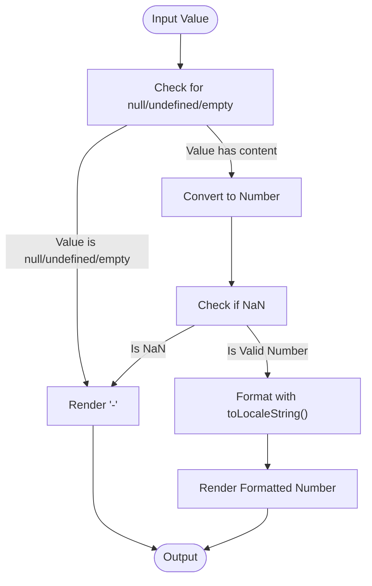
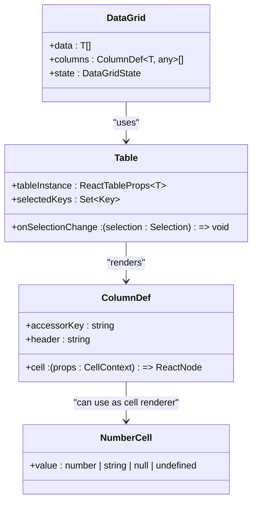
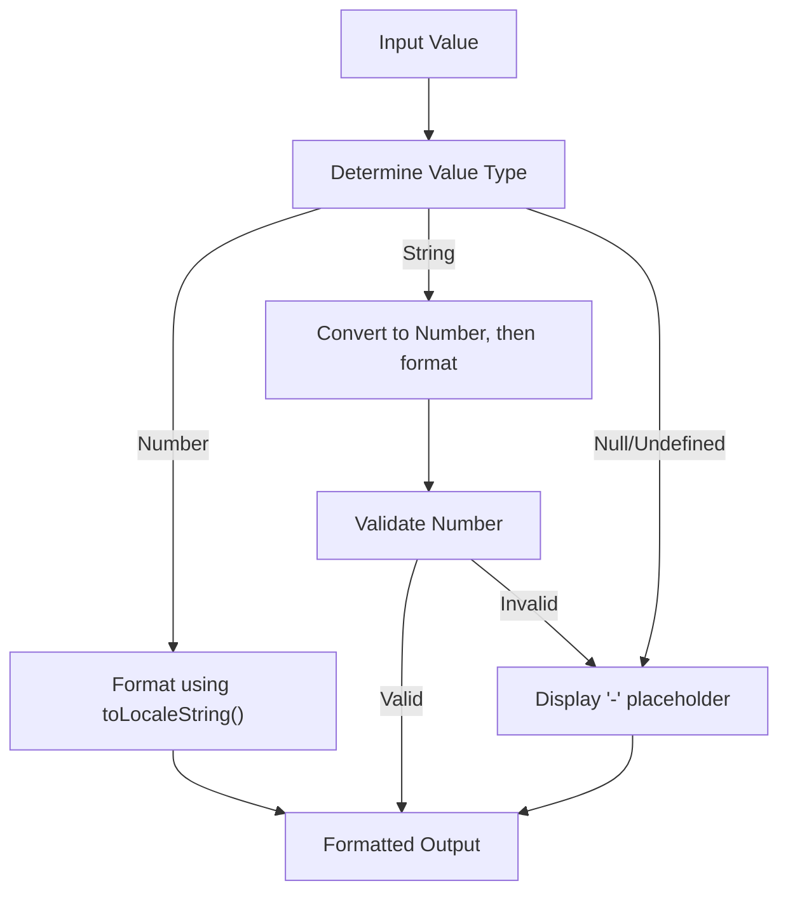
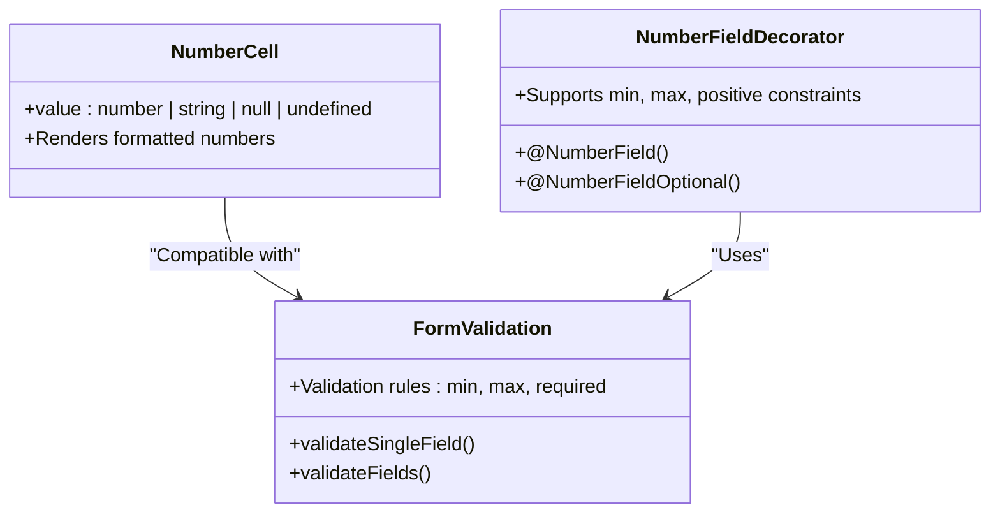

# NumberCell Component

<cite>
**Referenced Files in This Document**   
- [NumberCell.tsx](file://packages/ui/src/components/ui/data-display/cells/NumberCell/NumberCell.tsx)
- [NumberCell.stories.tsx](file://packages/ui/src/components/ui/data-display/cells/NumberCell/NumberCell.stories.tsx)
- [Table.tsx](file://packages/ui/src/components/ui/data-display/Table/Table.tsx)
- [DataGrid.tsx](file://packages/ui/src/components/ui/data-display/DataGrid/DataGrid.tsx)
- [Form.ts](file://packages/toolkit/src/Form.ts)
- [number.field.ts](file://packages/decorator/src/field/primitives/number.field.ts)
</cite>

## Table of Contents
1. [Introduction](#introduction)
2. [Core Implementation](#core-implementation)
3. [Props and Configuration](#props-and-configuration)
4. [Integration with DataGrid and Table Components](#integration-with-datagrid-and-table-components)
5. [Number Formatting and Localization](#number-formatting-and-localization)
6. [Handling Edge Cases](#handling-edge-cases)
7. [Validation and Form Integration](#validation-and-form-integration)
8. [Usage Examples](#usage-examples)
9. [Conclusion](#conclusion)

## Introduction
The NumberCell component is a specialized UI element designed for rendering numeric values with proper formatting, localization, and precision control. It serves as a fundamental building block for displaying counts, percentages, prices, and statistical data within tables and data grids across the prj-core application. The component handles various numeric formats and edge cases, providing a consistent user experience for numeric data presentation.

## Core Implementation

The NumberCell component is implemented as a simple yet robust React component that accepts numeric values in multiple formats and renders them with proper formatting. The implementation focuses on handling various input types and edge cases while maintaining performance and accessibility.



**Diagram sources**
- [NumberCell.tsx](file://packages/ui/src/components/ui/data-display/cells/NumberCell/NumberCell.tsx#L6-L15)

**Section sources**
- [NumberCell.tsx](file://packages/ui/src/components/ui/data-display/cells/NumberCell/NumberCell.tsx#L1-L16)

## Props and Configuration

The NumberCell component accepts a single prop that supports multiple data types, making it flexible for various use cases:

```typescript
interface NumberCellProps {
    value: number | string | null | undefined;
}
```

The component is designed to handle different input types:
- **Number**: Direct numeric values (integers, floats, positive, negative)
- **String**: Numeric values passed as strings, which are converted to numbers
- **Null/Undefined**: Values that represent missing or undefined data
- **Empty String**: Represents empty input fields

The component automatically handles the conversion and validation of these input types, ensuring consistent rendering regardless of the input format.

**Section sources**
- [NumberCell.tsx](file://packages/ui/src/components/ui/data-display/cells/NumberCell/NumberCell.tsx#L1-L3)

## Integration with DataGrid and Table Components

The NumberCell component is designed to work seamlessly with the DataGrid and Table components, which are built on top of @tanstack/react-table. These components use a column definition system that allows specifying the cell renderer for each column.



**Diagram sources**
- [DataGrid.tsx](file://packages/ui/src/components/ui/data-display/DataGrid/DataGrid.tsx#L18-L22)
- [Table.tsx](file://packages/ui/src/components/ui/data-display/Table/Table.tsx#L13-L16)
- [NumberCell.tsx](file://packages/ui/src/components/ui/data-display/cells/NumberCell/NumberCell.tsx#L1-L3)

When integrating NumberCell with DataGrid or Table components, developers can specify it as the cell renderer in the column definition:

```typescript
const columns: ColumnDef<Data>[] = [
  {
    accessorKey: "price",
    header: "Price",
    cell: ({ row }) => <NumberCell value={row.original.price} />
  },
  {
    accessorKey: "quantity",
    header: "Quantity",
    cell: ({ row }) => <NumberCell value={row.original.quantity} />
  }
];
```

This integration pattern allows for consistent numeric formatting across all tables and data grids in the application.

**Section sources**
- [DataGrid.tsx](file://packages/ui/src/components/ui/data-display/DataGrid/DataGrid.tsx#L24-L57)
- [Table.tsx](file://packages/ui/src/components/ui/data-display/Table/Table.tsx#L18-L57)

## Number Formatting and Localization

The NumberCell component leverages the browser's built-in `toLocaleString()` method to provide proper number formatting with thousand separators and appropriate decimal points based on the user's locale. This ensures that numbers are displayed in a culturally appropriate format.

For example:
- In the United States (en-US): 1,234.56
- In Germany (de-DE): 1.234,56
- In France (fr-FR): 1 234,56

The component automatically handles large numbers, negative values, and decimal precision:



While the current implementation uses the default locale settings, the component could be extended to support specific locale configurations and custom formatting options such as:
- Fixed decimal places
- Currency symbols
- Percentage formatting
- Scientific notation for very large or small numbers

**Section sources**
- [NumberCell.tsx](file://packages/ui/src/components/ui/data-display/cells/NumberCell/NumberCell.tsx#L15)

## Handling Edge Cases

The NumberCell component is designed to handle various edge cases gracefully, ensuring a consistent user experience even with unexpected input data.

### Null, Undefined, and Empty Values
The component explicitly checks for null, undefined, and empty string values, rendering a consistent placeholder ('-') in these cases:

```typescript
if (value === null || value === undefined || value === "") {
    return <p>-</p>;
}
```

This prevents the display of "NaN" or other confusing representations when data is missing.

### Invalid String Values
When a string value is provided that cannot be converted to a valid number (e.g., "not a number"), the component detects this using `Number.isNaN()` and renders the placeholder:

```typescript
const numValue = Number(value);
if (Number.isNaN(numValue)) {
    return <p>-</p>;
}
```

### Special Numeric Values
The component handles special numeric values such as:
- Zero (0): Displayed as "0" with proper formatting
- Negative numbers: Displayed with the minus sign and proper formatting
- Very large numbers: Formatted with appropriate thousand separators
- Decimal numbers: Displayed with locale-appropriate decimal points

The component's storybook examples demonstrate these edge cases:
- WithNull: Demonstrates rendering when value is null
- WithUndefined: Demonstrates rendering when value is undefined
- WithInvalidString: Demonstrates rendering when value is a non-numeric string
- WithZero: Demonstrates rendering of zero value
- WithNegative: Demonstrates rendering of negative numbers

**Section sources**
- [NumberCell.tsx](file://packages/ui/src/components/ui/data-display/cells/NumberCell/NumberCell.tsx#L6-L13)
- [NumberCell.stories.tsx](file://packages/ui/src/components/ui/data-display/cells/NumberCell/NumberCell.stories.tsx#L71-L81)

## Validation and Form Integration

While the NumberCell component itself focuses on presentation, it integrates with the broader validation system provided by the shared-utils package. The Form module in shared-utils provides comprehensive validation capabilities for numeric inputs.

The validation system includes:
- Range validation (min/max values)
- Required field validation
- Pattern matching for specific numeric formats



**Diagram sources**
- [Form.ts](file://packages/toolkit/src/Form.ts#L1-L96)
- [number.field.ts](file://packages/decorator/src/field/primitives/number.field.ts#L63-L92)

When users input numeric data through forms, the validation system ensures data integrity before it reaches components like NumberCell for display. This separation of concerns allows NumberCell to focus on presentation while relying on the validation system to ensure data quality.

The NumberField decorator provides a convenient way to define numeric field constraints in DTOs:

```typescript
class ProductDto {
    @NumberField({ min: 0, max: 10000 })
    price: number;
    
    @NumberFieldOptional({ min: 0 })
    discount?: number;
}
```

This ensures that numeric data is validated at the API and business logic layers before being displayed by NumberCell components.

**Section sources**
- [Form.ts](file://packages/toolkit/src/Form.ts#L44-L52)
- [number.field.ts](file://packages/decorator/src/field/primitives/number.field.ts#L63-L77)

## Usage Examples

The NumberCell component is used throughout the application to display various types of numeric data:

### Basic Number Display
```typescript
<NumberCell value={1234} />
// Renders: 1,234
```

### Decimal Values
```typescript
<NumberCell value={123.45} />
// Renders: 123.45 (locale-dependent)
```

### Large Numbers
```typescript
<NumberCell value={1234567890} />
// Renders: 1,234,567,890
```

### Negative Numbers
```typescript
<NumberCell value={-123456} />
// Renders: -123,456
```

### String Numbers
```typescript
<NumberCell value="9876543" />
// Renders: 9,876,543
```

### Integration with Data Grid
```typescript
<DataGrid
    data={products}
    columns={[
        {
            accessorKey: "name",
            header: "Product Name"
        },
        {
            accessorKey: "price",
            header: "Price",
            cell: ({ row }) => <NumberCell value={row.original.price} />
        },
        {
            accessorKey: "quantity",
            header: "Quantity",
            cell: ({ row }) => <NumberCell value={row.original.quantity} />
        },
        {
            accessorKey: "total",
            header: "Total",
            cell: ({ row }) => <NumberCell value={row.original.price * row.original.quantity} />
        }
    ]}
    state={{ selectedKeys: null }}
/>
```

### Handling Missing Data
```typescript
<NumberCell value={null} />
// Renders: -
<NumberCell value={undefined} />
// Renders: -
<NumberCell value="" />
// Renders: -
<NumberCell value="invalid" />
// Renders: -
```

These examples demonstrate the component's versatility in handling different numeric data types and its seamless integration with data display components.

**Section sources**
- [NumberCell.stories.tsx](file://packages/ui/src/components/ui/data-display/cells/NumberCell/NumberCell.stories.tsx#L23-L81)

## Conclusion
The NumberCell component provides a robust solution for displaying numeric values in the prj-core application. Its simple API and comprehensive handling of edge cases make it easy to use while ensuring consistent presentation of numeric data across the application.

Key features of the NumberCell component include:
- Support for multiple input types (number, string, null, undefined)
- Automatic handling of invalid or missing data
- Proper formatting with locale-appropriate thousand separators and decimal points
- Seamless integration with DataGrid and Table components
- Consistent placeholder rendering for null or invalid values

The component works in conjunction with the broader validation system to ensure data integrity from input to display. By leveraging the browser's built-in `toLocaleString()` method, it provides proper localization without requiring additional dependencies.

For future enhancements, the component could be extended to support:
- Custom formatting options (fixed decimal places, currency symbols)
- Percentage formatting
- Scientific notation
- Conditional formatting based on value ranges
- Animation for value changes

These enhancements would make the component even more versatile while maintaining its core simplicity and reliability.