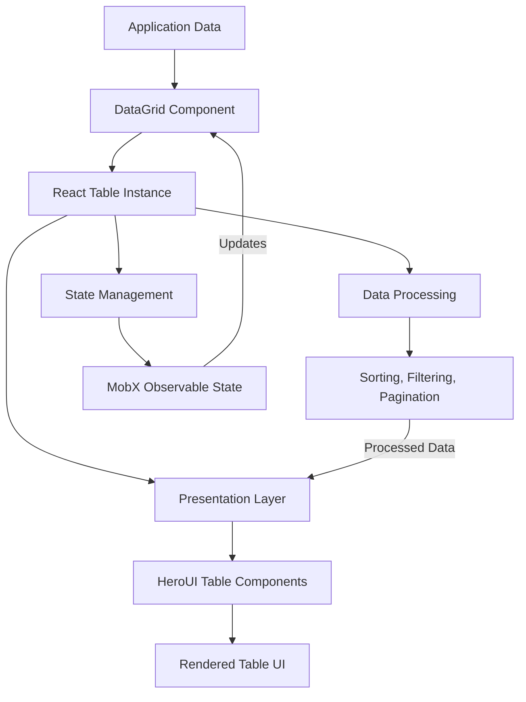
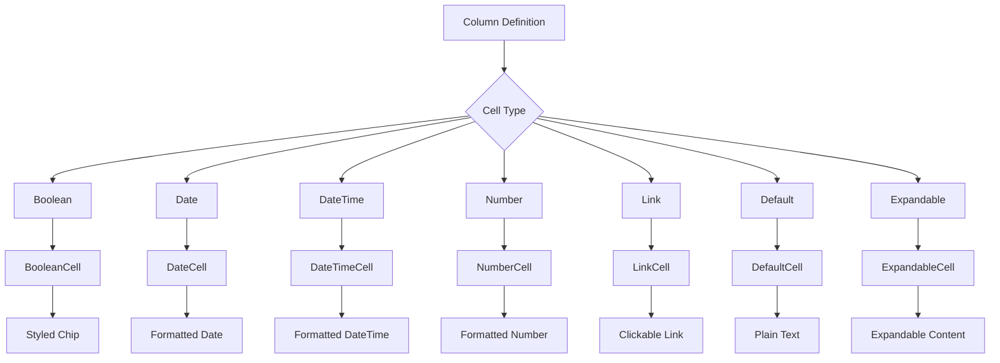
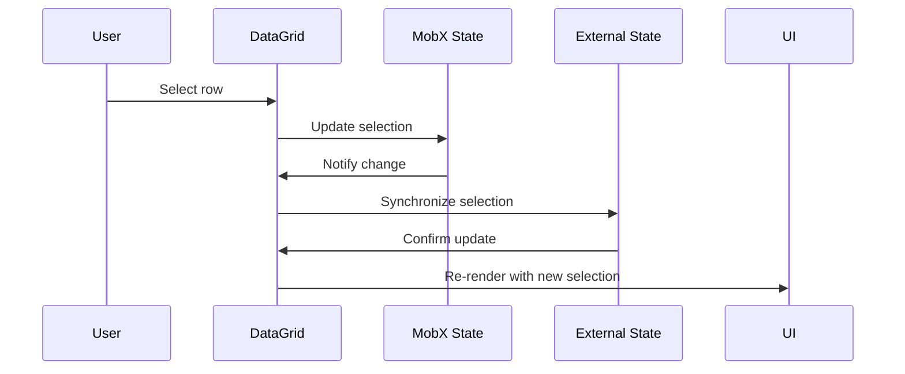

# Table and DataGrid Components

<cite>
**Referenced Files in This Document**   
- [Table.tsx](file://packages/ui/src/components/ui/data-display/Table/Table.tsx)
- [DataGrid.tsx](file://packages/ui/src/components/ui/data-display/DataGrid/DataGrid.tsx)
- [DataGrid.stories.tsx](file://packages/ui/src/components/ui/data-display/DataGrid/DataGrid.stories.tsx)
- [BooleanCell.tsx](file://packages/ui/src/components/ui/data-display/cells/BooleanCell/BooleanCell.tsx)
- [DateCell.tsx](file://packages/ui/src/components/ui/data-display/cells/DateCell/DateCell.tsx)
- [DateTimeCell.tsx](file://packages/ui/src/components/ui/data-display/cells/DateTimeCell/DateTimeCell.tsx)
- [NumberCell.tsx](file://packages/ui/src/components/ui/data-display/cells/NumberCell/NumberCell.tsx)
- [LinkCell.tsx](file://packages/ui/src/components/ui/data-display/cells/LinkCell/LinkCell.tsx)
- [DefaultCell.tsx](file://packages/ui/src/components/ui/data-display/cells/DefaultCell/DefaultCell.tsx)
- [index.ts](file://packages/ui/src/components/ui/data-display/cells/index.ts)
- [components.json](file://packages/ui/components.json)
</cite>

## Table of Contents
1. [Introduction](#introduction)
2. [Core Architecture](#core-architecture)
3. [Table Component](#table-component)
4. [DataGrid Component](#datagrid-component)
5. [Cell Components](#cell-components)
6. [Column Configuration](#column-configuration)
7. [State Management](#state-management)
8. [Selection Patterns](#selection-patterns)
9. [Accessibility and Responsive Design](#accessibility-and-responsive-design)
10. [Integration Examples](#integration-examples)
11. [Performance Considerations](#performance-considerations)
12. [Troubleshooting Guide](#troubleshooting-guide)

## Introduction

The Table and DataGrid components in the prj-core shared-frontend package provide a comprehensive solution for displaying and interacting with tabular data across both admin and mobile applications. Built on top of @tanstack/react-table and integrated with the HeroUI component library, these components offer a robust foundation for data presentation with support for sorting, filtering, pagination, and responsive design patterns.

The architecture follows a layered approach where the base Table component provides the fundamental rendering mechanism, while the DataGrid component adds enhanced functionality including state management, selection capabilities, and expanded interaction patterns. This separation of concerns allows for flexibility in implementation while maintaining consistency in user experience.

These components are designed to handle various data display requirements, from simple read-only tables to complex interactive data grids with server-side operations. The integration with MobX for state management enables reactive updates and seamless synchronization across components, while the cell component system allows for consistent data formatting and presentation across the application.

**Section sources**
- [Table.tsx](file://packages/ui/src/components/ui/data-display/Table/Table.tsx)
- [DataGrid.tsx](file://packages/ui/src/components/ui/data-display/DataGrid/DataGrid.tsx)
- [components.json](file://packages/ui/components.json)

## Core Architecture

The table components follow a compositional architecture that leverages the power of @tanstack/react-table for data processing and state management, while providing a clean React interface for rendering through the HeroUI component library. This architecture enables separation of data logic from presentation concerns, allowing for greater flexibility and reusability.

The core architecture consists of three main layers:
1. **Data Processing Layer**: Handled by @tanstack/react-table, which manages sorting, filtering, pagination, and row grouping operations
2. **State Management Layer**: Implemented with MobX, providing reactive state updates and synchronization across components
3. **Presentation Layer**: Built with HeroUI components, ensuring consistent styling and accessibility across the application

This layered approach allows developers to focus on data configuration and business logic while the framework handles the complex interactions and rendering optimizations. The architecture supports both client-side and server-side data operations, with clear patterns for implementing server-side pagination and filtering.



**Diagram sources**
- [DataGrid.tsx](file://packages/ui/src/components/ui/data-display/DataGrid/DataGrid.tsx)
- [Table.tsx](file://packages/ui/src/components/ui/data-display/Table/Table.tsx)

**Section sources**
- [DataGrid.tsx](file://packages/ui/src/components/ui/data-display/DataGrid/DataGrid.tsx)
- [Table.tsx](file://packages/ui/src/components/ui/data-display/Table/Table.tsx)

## Table Component

The Table component serves as the foundational building block for all tabular data displays in the application. It acts as a thin wrapper around the HeroUI Table component, integrating it with the @tanstack/react-table instance to provide a seamless interface between data processing and presentation.

The component accepts a tableInstance prop containing the fully configured react-table instance, which includes the data, columns, and all processing logic. This design pattern allows for complete separation between data manipulation and visual representation, enabling complex data operations without affecting the presentation layer.

Key features of the Table component include:
- Integration with HeroUI's accessible table components
- Support for custom empty content display
- Flexible rendering of headers and cells through react-table's flexRender function
- Compatibility with all HeroUI table props for styling and behavior customization

The component handles the mapping of react-table's header and row data to the corresponding HeroUI components, ensuring proper rendering of table structure while maintaining accessibility standards. It also supports selection functionality through the selectedKeys and onSelectionChange props, enabling interactive table behaviors.

**Section sources**
- [Table.tsx](file://packages/ui/src/components/ui/data-display/Table/Table.tsx)

## DataGrid Component

The DataGrid component extends the base Table component with enhanced functionality for interactive data displays. It serves as a higher-level abstraction that combines data processing, state management, and presentation into a cohesive component designed for complex data grid scenarios.

Unlike the basic Table component, DataGrid manages its own react-table instance internally, accepting raw data and column definitions as input and handling the table configuration automatically. This simplifies implementation for common use cases while still providing access to advanced features through configuration options.

The component implements several key features:
- Integrated state management using MobX observables
- Support for row expansion and nested data display
- Configurable selection modes (none, single, multiple)
- Built-in handling of empty states with customizable messages
- Automatic generation of table instance from data and columns

The DataGrid component also provides a more developer-friendly API by abstracting away the complexity of react-table configuration while still exposing essential customization points. This makes it particularly suitable for scenarios requiring interactive data manipulation, such as admin interfaces with bulk operations.

```mermaid
classDiagram
class Table {
+tableInstance : ReactTableProps
+selectedKeys : Selection
+onSelectionChange : (selection : Selection) => void
+tableBody : TableBodyProps
+render() : JSX.Element
}
class DataGrid {
+data : T[]
+columns : ColumnDef[]
+state : DataGridState
+selectionMode : "none" | "single" | "multiple"
+render() : JSX.Element
}
DataGrid --> Table : "uses"
DataGrid --> "react-table" : "configures"
DataGrid --> "MobX" : "state management"
```

**Diagram sources**
- [DataGrid.tsx](file://packages/ui/src/components/ui/data-display/DataGrid/DataGrid.tsx)
- [Table.tsx](file://packages/ui/src/components/ui/data-display/Table/Table.tsx)

**Section sources**
- [DataGrid.tsx](file://packages/ui/src/components/ui/data-display/DataGrid/DataGrid.tsx)
- [DataGrid.stories.tsx](file://packages/ui/src/components/ui/data-display/DataGrid/DataGrid.stories.tsx)

## Cell Components

The cell components system provides a standardized approach to data formatting and presentation within table cells. Located in the cells directory, these components ensure consistent rendering of specific data types across all tables and data grids in the application.

The available cell components include:
- **BooleanCell**: Renders boolean values as styled chips with "Yes" or "No" labels
- **DateCell**: Formats date strings using the application's standard date formatting utility
- **DateTimeCell**: Extends DateCell with time information display
- **NumberCell**: Handles numeric formatting and display
- **LinkCell**: Renders clickable links within table cells
- **DefaultCell**: Provides fallback rendering for basic string values
- **ExpandableCell**: Supports expandable content within cells

Each cell component follows a consistent API pattern, accepting a value prop and handling null or undefined values gracefully by displaying a placeholder. This ensures that tables maintain a clean appearance even when dealing with incomplete data.

The cell components are designed to be used within column definitions, where they can be specified as the cell renderer function. This allows developers to maintain type safety while ensuring consistent presentation of specific data types throughout the application.



**Diagram sources**
- [BooleanCell.tsx](file://packages/ui/src/components/ui/data-display/cells/BooleanCell/BooleanCell.tsx)
- [DateCell.tsx](file://packages/ui/src/components/ui/data-display/cells/DateCell/DateCell.tsx)
- [index.ts](file://packages/ui/src/components/ui/data-display/cells/index.ts)

**Section sources**
- [BooleanCell.tsx](file://packages/ui/src/components/ui/data-display/cells/BooleanCell/BooleanCell.tsx)
- [DateCell.tsx](file://packages/ui/src/components/ui/data-display/cells/DateCell/DateCell.tsx)
- [DateTimeCell.tsx](file://packages/ui/src/components/ui/data-display/cells/DateTimeCell/DateTimeCell.tsx)
- [NumberCell.tsx](file://packages/ui/src/components/ui/data-display/cells/NumberCell/NumberCell.tsx)
- [LinkCell.tsx](file://packages/ui/src/components/ui/data-display/cells/LinkCell/LinkCell.tsx)
- [DefaultCell.tsx](file://packages/ui/src/components/ui/data-display/cells/DefaultCell/DefaultCell.tsx)
- [index.ts](file://packages/ui/src/components/ui/data-display/cells/index.ts)

## Column Configuration

Column configuration in the table components follows the @tanstack/react-table pattern, using the createColumnHelper utility to define column structures with type safety. This approach enables developers to create reusable column definitions that can be shared across multiple tables and data grids.

A column definition typically includes:
- **accessor**: Specifies which field from the data object to display
- **header**: Defines the column header text or component
- **cell**: Specifies the rendering function or component for cell content
- **size**: Optional width specification for the column
- **enableSorting**: Controls whether the column can be sorted
- **meta**: Additional metadata for custom processing

The column system supports both simple accessor columns and complex render columns, allowing for complete control over cell content. For example, a boolean field can be configured to use the BooleanCell component, while a date field can use the DateCell component, ensuring consistent formatting across the application.

The createColumnHelper pattern provides type safety by inferring the data type from the generic parameter, reducing the risk of runtime errors due to incorrect field access. This is particularly valuable in large applications with complex data structures and multiple table implementations.

**Section sources**
- [DataGrid.stories.tsx](file://packages/ui/src/components/ui/data-display/DataGrid/DataGrid.stories.tsx)

## State Management

The table components implement a sophisticated state management system using MobX to handle reactive updates and synchronization across components. The DataGrid component, in particular, uses MobX observables to manage selection state and ensure that changes are propagated correctly throughout the application.

The state management pattern follows these principles:
- **Observable State**: Selection state is stored in MobX observables, enabling automatic reactivity
- **Action Methods**: State changes are performed through action methods, ensuring proper tracking
- **Local State**: Each DataGrid instance maintains its own local observable state
- **External State Synchronization**: Changes are synchronized with external state objects passed as props

This approach provides several benefits:
- Automatic re-rendering when state changes
- Centralized state management for complex interactions
- Seamless integration with the rest of the application's MobX stores
- Predictable state transitions through action methods

The state management system also handles edge cases such as clearing selections, handling "select all" operations, and maintaining state consistency when data is updated. This ensures a reliable user experience even in complex scenarios with large datasets and frequent updates.



**Diagram sources**
- [DataGrid.tsx](file://packages/ui/src/components/ui/data-display/DataGrid/DataGrid.tsx)
- [DataGrid.stories.tsx](file://packages/ui/src/components/ui/data-display/DataGrid/DataGrid.stories.tsx)

**Section sources**
- [DataGrid.tsx](file://packages/ui/src/components/ui/data-display/DataGrid/DataGrid.tsx)

## Selection Patterns

The table components support multiple selection patterns to accommodate different use cases and interaction requirements. These patterns are configurable through the selectionMode prop, which accepts values of "none", "single", or "multiple".

**None Mode**: Disables selection entirely, suitable for read-only data displays where no user interaction is required.

**Single Selection**: Allows the user to select one row at a time, commonly used for detail views or when only one item can be processed at a time.

**Multiple Selection**: Enables selection of multiple rows, essential for bulk operations such as deleting multiple records or applying actions to a group of items.

The selection system integrates with the application's state management to ensure that selection state is preserved and can be accessed by other components. This enables patterns such as:
- Displaying the number of selected items in a toolbar
- Enabling/disabling action buttons based on selection state
- Performing operations on selected items
- Clearing selections after operations are completed

The selection implementation also handles keyboard navigation and accessibility requirements, ensuring that users can interact with the table using both mouse and keyboard inputs.

**Section sources**
- [DataGrid.tsx](file://packages/ui/src/components/ui/data-display/DataGrid/DataGrid.tsx)
- [DataGrid.stories.tsx](file://packages/ui/src/components/ui/data-display/DataGrid/DataGrid.stories.tsx)

## Accessibility and Responsive Design

The table components are designed with accessibility and responsive behavior as core requirements, ensuring a consistent experience across different devices and for users with various needs.

Accessibility features include:
- Proper ARIA roles and attributes for table elements
- Keyboard navigation support for all interactive elements
- Screen reader compatibility for table content and controls
- High contrast styling options
- Focus management for interactive components

Responsive design patterns implemented in the components include:
- Fluid layout that adapts to container width
- Horizontal scrolling for tables with many columns
- Mobile-optimized touch targets
- Conditional rendering of less important columns on small screens
- Stackable layouts for extreme mobile scenarios

The components also integrate with the application's responsive design system, respecting breakpoints and layout rules defined in the design system. This ensures that tables maintain usability and readability across the full range of device sizes, from large desktop monitors to small mobile screens.

**Section sources**
- [Table.tsx](file://packages/ui/src/components/ui/data-display/Table/Table.tsx)
- [DataGrid.tsx](file://packages/ui/src/components/ui/data-display/DataGrid/DataGrid.tsx)

## Integration Examples

The table components are used extensively throughout the admin and mobile applications, demonstrating various implementation patterns and use cases.

In the admin application, DataGrid components are used for:
- User management interfaces with bulk selection and actions
- Data monitoring dashboards with real-time updates
- Configuration management with editable cells
- Reporting interfaces with complex filtering and sorting

In the mobile application, Table components are used for:
- List views with minimal interaction requirements
- Detail screens with related data displays
- Form-associated data lists
- Offline-capable data displays

Common integration patterns include:
- Connecting to API endpoints for server-side data retrieval
- Implementing custom filtering and search functionality
- Adding action buttons for row-level operations
- Integrating with form components for inline editing
- Combining with modal dialogs for detailed operations

These examples demonstrate the flexibility of the table components in handling various data display requirements while maintaining a consistent user experience across the application.

**Section sources**
- [DataGrid.stories.tsx](file://packages/ui/src/components/ui/data-display/DataGrid/DataGrid.stories.tsx)

## Performance Considerations

The table components are optimized for performance, particularly when handling large datasets. Several strategies are employed to ensure smooth rendering and interaction:

**Virtualization**: While not explicitly implemented in the current components, the architecture supports integration with virtualization libraries to render only visible rows, significantly improving performance with large datasets.

**Memoization**: The components use React's memoization techniques to prevent unnecessary re-renders when props haven't changed.

**Efficient State Updates**: The MobX-based state management ensures that only components affected by state changes are re-rendered.

**Batched Operations**: For operations affecting multiple rows, changes are batched to minimize re-renders.

**Lazy Loading**: Support for server-side pagination enables loading data in chunks rather than retrieving entire datasets at once.

For optimal performance with large datasets, recommended practices include:
- Implementing server-side pagination and filtering
- Using memoized cell renderers
- Limiting the number of columns displayed
- Debouncing search and filter operations
- Implementing virtual scrolling for very large datasets

**Section sources**
- [DataGrid.tsx](file://packages/ui/src/components/ui/data-display/DataGrid/DataGrid.tsx)
- [Table.tsx](file://packages/ui/src/components/ui/data-display/Table/Table.tsx)

## Troubleshooting Guide

Common issues and their solutions when working with the table components:

**Issue: Table not rendering data**
- Check that the data prop contains valid data with an 'id' field
- Verify that column definitions match the data structure
- Ensure the DataGrid state object is properly initialized

**Issue: Selection not working**
- Confirm that selectionMode is set to "single" or "multiple"
- Check that the state object is passed correctly and is mutable
- Verify that the onSelectionChange handler is properly connected

**Issue: Cell formatting not applying**
- Ensure the correct cell component is specified in the column definition
- Check that the data type matches the expected input for the cell component
- Verify that the cell component is properly imported and exported

**Issue: Performance problems with large datasets**
- Implement server-side pagination instead of client-side
- Consider adding virtual scrolling for very large datasets
- Optimize cell renderers to avoid unnecessary computations
- Use memoization for complex cell content

**Issue: Responsive behavior not working**
- Check that the container has proper CSS constraints
- Verify that responsive breakpoints are correctly configured
- Ensure that the application's responsive design system is properly integrated

**Issue: Accessibility problems**
- Verify that all interactive elements have proper ARIA attributes
- Test keyboard navigation through the table
- Check screen reader compatibility
- Ensure sufficient color contrast for text and backgrounds

**Section sources**
- [Table.tsx](file://packages/ui/src/components/ui/data-display/Table/Table.tsx)
- [DataGrid.tsx](file://packages/ui/src/components/ui/data-display/DataGrid/DataGrid.tsx)
- [BooleanCell.tsx](file://packages/ui/src/components/ui/data-display/cells/BooleanCell/BooleanCell.tsx)
- [DateCell.tsx](file://packages/ui/src/components/ui/data-display/cells/DateCell/DateCell.tsx)